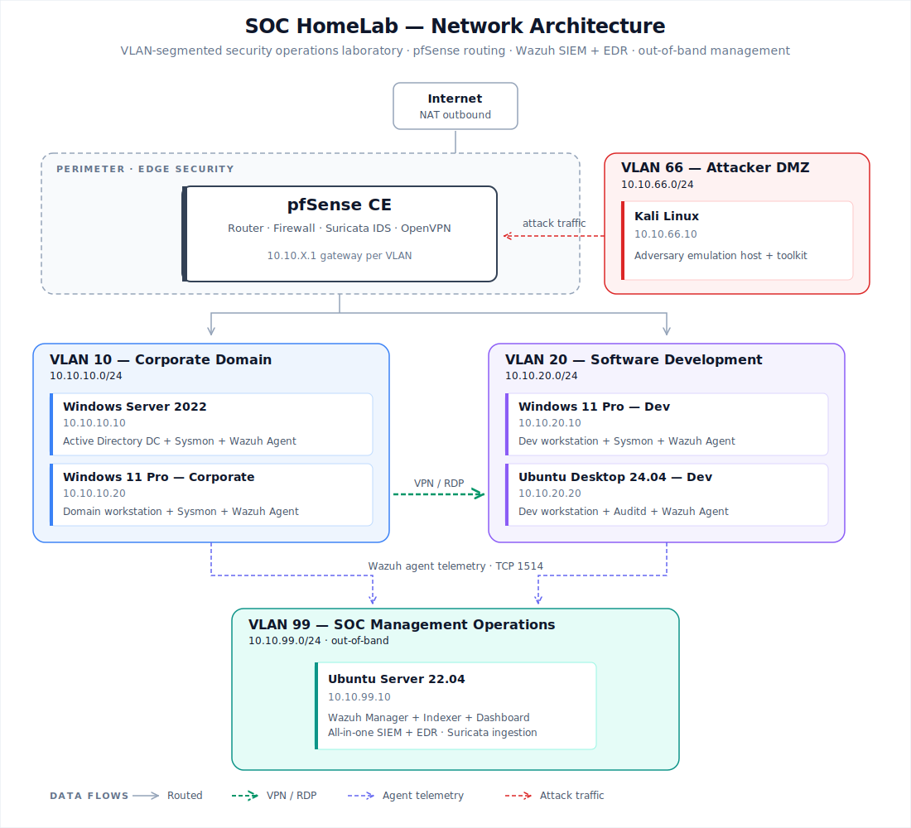

# SOC HomeLab — From Infrastructure to Incident Analysis

> A personal Security Operations Center built from scratch in a fully segmented virtualized environment to build SOC L1 skill. The lab replicates a small enterprise architecture with corporate, development, attacker and SOC management VLANs, and is operated as a real SOC — including detection engineering, attack simulation, and incident response. 

### Architectural Evolution

This lab represents a major iteration over my previous HomeLab environment. Through ongoing research into enterprise network security, I identified that a flat network architecture (where all assets sit in a single subnet) constitutes a critical vulnerability and fails to reflect real-world corporate environments. 

To address this gap and implement a true "Defense in Depth" strategy, this project leverages strict VLAN segmentation. By isolating corporate users, software development assets, and SOC management tools into distinct trust zones, the infrastructure restricts lateral movement. If an attacker compromises a single host or VLAN, network access policies prevent them from easily escalating privileges or gaining control over the entire organization.

## Why this project?

I want to demonstrate that I understand the full security operations cycle: how a realistic environment is built, how an attacker reasons, how an intrusion is detected with real telemetry, and how an incident is documented professionally.

A course teaches you to use tools. This lab forces me to use them in a system I built myself.

## What I'm going to do

1. **Build** a segmented corporate network with an Active Directory domain, Windows and Linux endpoints, and a pfSense + Suricata perimeter.
2. **Deploy** a full SIEM/EDR stack (Wazuh all-in-one) with telemetry from every host.
3. **Attack** from a DMZ with Kali, executing techniques mapped to MITRE ATT&CK.
4. **Detect** those techniques in Wazuh, and write custom rules where the baseline detection falls short.
5. **Report** every incident using the format a real L1 analyst would use.

## Architecture



| Segment  | CIDR           | Purpose                                    |
| -------- | -------------- | ------------------------------------------ |
| VLAN 10  | 10.10.10.0/24  | Corporate domain (AD DC + workstation)     |
| VLAN 20  | 10.10.20.0/24  | Software Development (Windows + Ubuntu)    |
| VLAN 66  | 10.10.66.0/24  | Attacker DMZ (Kali Linux)                  |
| VLAN 99  | 10.10.99.0/24  | SOC Management (Wazuh all-in-one)          |

Full reasoning behind each choice in [`docs/00-architecture/design-decisions.md`](docs/00-architecture/design-decisions.md).

## Planned attack scenarios

Each scenario includes: attack execution, observed detection, custom detection rule (where the native one isn't enough), and an L1-format incident report.

| #  | Scenario                                     | 
| -- | -------------------------------------------- | 
| 01 | Full kill chain against Dev workstation      | 
| 02 | Phishing with macro payload and C2 callback  | 
| 03 | Active Directory attack chain                | 
| 04 | Lateral movement via SMB and RDP             | 
| 05 | Ransomware simulation with impact detection  | 
| 06 | Data exfiltration over alternative channel   | 

As I continue my cybersecurity journey, new attack methods and techniques will be added to this homelab.

## Tech stack

- **Perimeter:** pfSense CE · Suricata IDS · OpenVPN
- **Identity:** Active Directory (Windows Server 2022)
- **Endpoints:** Windows 11 Pro · Ubuntu Desktop 24.04
- **SIEM / EDR:** Wazuh Manager + Indexer + Dashboard (all-in-one)
- **Endpoint telemetry:** Sysmon (Windows) · Auditd (Linux)
- **Adversary:** Kali Linux + toolkit 
- **Virtualization:** Oracle VirtualBox

## Capabilities Demonstrated
 
- **Network architecture** — VLAN design, firewall policy, inter-segment routing, perimeter detection
- **SOC operations** — out-of-band management, telemetry pipelines, log forwarding, HEC integration
- **Detection engineering** — custom rule development, MITRE ATT&CK mapping, atomic testing, threshold calibration
- **Blue Team operations** — alert triage, incident investigation, forensic timeline reconstruction
- **Purple Team workflow** — offensive simulation feeding detection improvement
- **Documentation** — professional technical writing, decision rationale, reproducible deployment procedures

##  Project Phases

The lab is structured in six sequential phases, each building on the previous one and documented in its own directory under `docs/`.

### Phase 1 — Infrastructure 
Network foundation: pfSense firewall, VLAN segmentation (Corp, Dev, SOC, MGMT, Adversary DMZ), inter-VLAN routing policies with default-deny between trust zones, and OpenVPN remote access for the Corp environment.
 `docs/01-infrastructure/`

### Phase 2 — SOC Stack 
Wazuh manager deployed on isolated SOC VLAN, four agents (Windows AD Domain Controller, two Windows 11 workstations, Ubuntu 24.04 dev host with auditd), pfSense syslog integration with custom decoder, and an operational SOC L1 dashboard with MITRE ATT&CK coverage view.
 `docs/02-soc-stack/`

### Phase 3 — Adversary Environment 
Kali Linux deployed in an isolated Adversary DMZ (VLAN 66) under the **Assume Breach** threat model. Sliver C2, Mimikatz, hydra, and a curated post-exploitation toolkit mapped to MITRE tactics. Firewall rules act as capability shapers, enabling specific attack vectors (phishing → C2, brute force SSH/RDP, VPN credential compromise) while enforcing immutable boundaries.
 `docs/03-adversary/`

### Phase 4 — Attack Scenarios 
End-to-end execution of realistic attack chains covering reconnaissance, credential access, lateral movement, and command-and-control. Each scenario is documented with commands executed, telemetry captured, and detection outcomes.
 `docs/04-attack-scenarios/`

### Phase 5 — Detection Rules 
Custom Wazuh detection rules developed to close coverage gaps identified during scenarios. Each rule includes threat model rationale, MITRE mapping, false positive analysis, and tuning notes.
 `docs/05-detection-rules/`

### Phase 6 — Incident Reports 
Post-incident analytical reports written from the SOC L1 analyst perspective. Each report documents timeline, telemetry sources correlated, root cause analysis, and lessons learned for a specific scenario.
 `docs/06-incident-reports/`

## Repository structure

```text
SOC-HomeLab/
├── README.md
├── screenshots/
└── docs/
    ├── 00-architecture/
    │   ├── architecture.svg
    │   ├── design-decisions.md
    │   └── prerequisites.md
    ├── 01-infrastructure/
    │   ├── 01-pfsense.md
    │   └── 02-vlan10.md
    │   └── 03-vlan20.md
    ├── 02-soc-stack/
    │   ├── 01-wazuh-manager.md
    │   ├── 02-windows-agent.md
    │   ├── 03-linux-agent.md
    │   ├── 04-pfsense-syslog.md
    │   └── 05-soc-dashboard.md
    ├── 03-adversary/
    │   └── 01-adversary-environment.md
    ├── 04-attack-scenarios/                                                       <---------------  Working on
    │   ├── 01-full-kill-chain.md
    │   └── 02-phishing-c2-persistence.md
    ├── 05-detection-rules/
    │   ├── Rule-100010-pfSense-Firewall-Block-Base.md
    │   ├── Rule-100011-VLAN20-to-VLAN10-Segmentation.md
    │   ├── Rule-100012-VLAN10-to-VLAN20-Segmentation.md
    │   ├── Rule-100013-Port-Scan-Detection.md
    │   ├── Rule-100014-Multi-Target-Port-Scan.md
    │   ├── Rule-100015-SSH-Brute-Force.md 
    │   ├── Rule-100016-Brute-Force-Successful-Login.md
    │   ├── Rule-100016-Brute-Force-Successful-Login.md
    │   ├── Rule-100017-Credential-Files-Access.md
    │   ├── Rule-100018-Cron-Configuration-Modification.md
    │   ├── Rule-100019-SSH-Authorized-Keys-Modification.md
    │   └── Rule-100020-Discover-Command-Sequence-Detection.md
    └── 06-incident-reports/
```

## About This Project
 
Built as a personal cyber range to develop and demonstrate the full skill set required for SOC Analyst and Detection Engineer roles. The lab is continuously evolving — new rules, attack scenarios, and automation playbooks are added as part of ongoing learning. Network segmentation, out-of-band SOC management, and a dedicated attacker DMZ make this lab a realistic environment for both detection engineering and incident response practice. All documentation is written in English to align with international industry standards.
