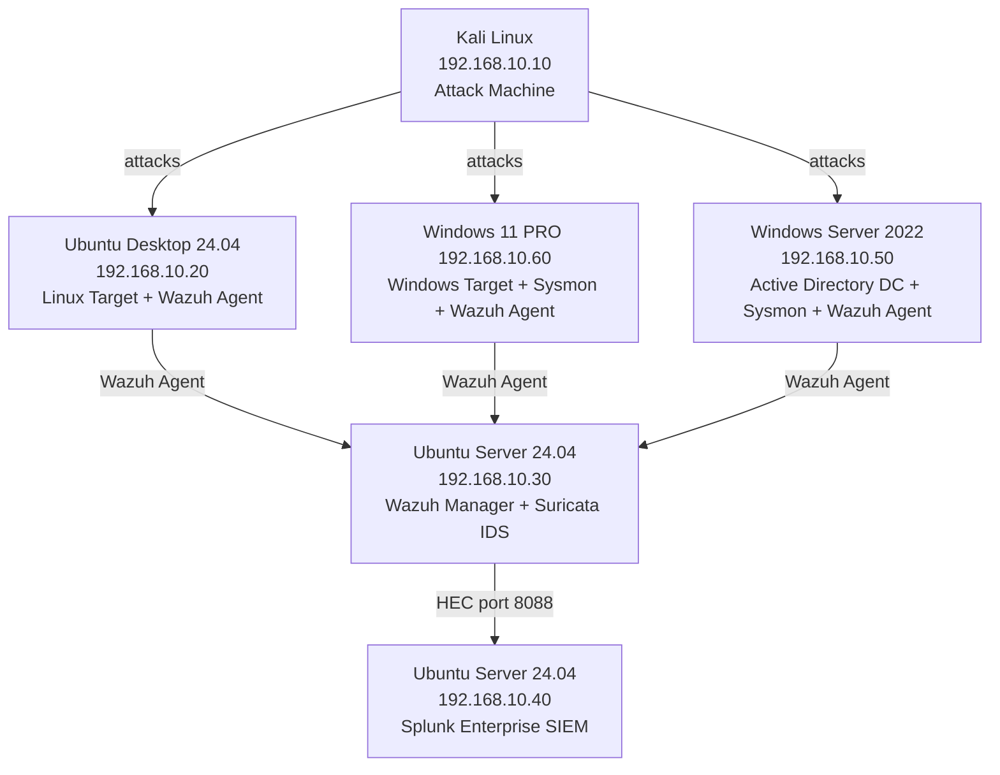
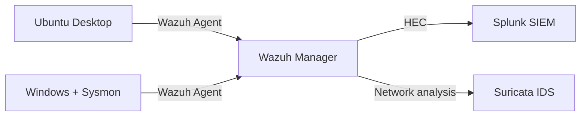

# SOC-HomeLab

> A fully functional Security Operations Center home lab built from scratch, designed to simulate real-world threat detection, log analysis, and incident response workflows. Combines Blue Team detection engineering with Red Team attack simulation, oriented toward SOC Analyst, Detection Engineer, and Threat Hunter roles.

---

## Overview

This lab deploys a complete detection pipeline using industry-standard open-source tools across isolated virtual machines. Wazuh serves as the EDR for endpoint monitoring and alert generation. Splunk ingests those alerts as the SIEM, enabling SPL-based correlation and dashboarding. Suricata provides network-level intrusion detection. Sysmon enhances Windows telemetry on both the workstation and the Active Directory domain controller. Kali Linux acts as the attacker, simulating real threat scenarios including privilege escalation, lateral movement via SSH, Active Directory attacks, and persistence via scheduled tasks.

---

## Architecture

---

## Data Flow

---

## Lab Components

| VM | IP | OS | Role |
|----|----|----|------|
| Kali Linux | 192.168.10.10 | Kali Linux (latest) | Attack machine |
| Ubuntu Desktop | 192.168.10.20 | Ubuntu Desktop 24.04 | Linux target + Wazuh Agent |
| Ubuntu Wazuh | 192.168.10.30 | Ubuntu Server 24.04 | Wazuh Manager + Suricata IDS |
| Ubuntu Splunk | 192.168.10.40 | Ubuntu Server 24.04 | Splunk SIEM |
| Windows Server 2022 | 192.168.10.50 | Windows Server 2022 (Eval) | Active Directory DC + Sysmon + Wazuh Agent |
| Windows 11 PRO | 192.168.10.60 | Windows 11 PRO | Windows workstation + Sysmon + Wazuh Agent |

---

## Phases

- [x] Phase 1 — Infrastructure setup
- [x] Phase 2 — Wazuh deployment
- [x] Phase 3 — Splunk deployment + Wazuh integration via HEC
- [x] Phase 4 — Suricata IDS
- [x] Phase 5 — Active Directory + Sysmon deployment
- [ ] Phase 6 — Detection rules (15+)
- [ ] Phase 7 — Attack simulations and remediation

---

## Repository Structure

- `docs/` — Phase-by-phase documentation of the lab build
- `detection-engineering/` — Detection rules documentation with threat modeling, MITRE mapping, and validation
- `rules/` — Ready-to-deploy rule code (Wazuh XML, Splunk SPL)
- `screenshots/` — Visual evidence of attacks detected and rules triggered

---

## Tools Used

| Tool | Category | Purpose |
|------|----------|---------|
| Wazuh | EDR | Endpoint monitoring, alert generation, FIM |
| Splunk Enterprise | SIEM | Log ingestion, SPL queries, dashboards |
| Suricata | IDS | Network traffic analysis, signature-based detection |
| Sysmon | Windows telemetry | Process, network, and registry event monitoring |
| Windows Server 2022 | Infrastructure | Active Directory domain controller |
| Kali Linux | Offensive | Attack simulation |
| Hydra | Credential attack | SSH brute force simulation |
| Nmap | Reconnaissance | Network scanning |
| Metasploit | Exploitation | Vulnerability exploitation |
| Burp Suite | Web | Web application attack simulation |
| John the Ripper | Password cracking | Offline credential attacks |
| Hashcat | Password cracking | GPU-accelerated hash cracking |

---

## Skills Demonstrated

- End-to-end SIEM pipeline design and implementation
- EDR deployment and endpoint agent management
- Network segmentation and isolated lab design
- IDS configuration and signature-based threat detection
- Active Directory deployment and domain configuration
- Windows telemetry enhancement with Sysmon
- Threat detection rule writing (Wazuh rules + Splunk SPL)
- Attack simulation and blue team response documentation
- Forensic attack reconstruction and reporting
- MITRE ATT&CK framework mapping
- Log analysis and correlation across multiple security tools
- Detection engineering methodology and rule lifecycle management
- Red Team attack simulation and TTPs execution
- Purple Team validation — measuring detection coverage against real attacks
- Forensic incident reporting and remediation recommendations
- Anti-forensics awareness (log tampering, evidence destruction)

---

## Documentation

| Phase | Description |
|-------|-------------|
| [Phase 1](docs/phase1-infrastructure.md) | Infrastructure setup |
| [Phase 2](docs/phase2-wazuh.md) | Wazuh EDR deployment |
| [Phase 3](docs/phase3-splunk.md) | Splunk SIEM + HEC integration |
| [Phase 4](docs/phase4-suricata.md) | Suricata IDS |
| [Phase 5](docs/phase5-sysmon.md) | Active Directory + Sysmon |
| [Phase 6](docs/phase6-detection-rules.md) | Custom detection rules (15+) |
| [Phase 7](docs/phase7-attack-simulations.md) | Attack simulations + remediation |
