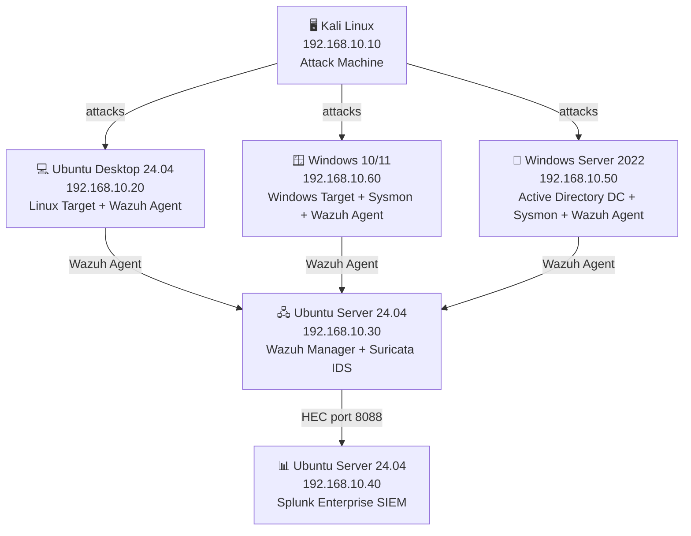

# SOC-HomeLab

> A fully integrated Security Operations Center home lab built from scratch, covering the complete threat detection and response lifecycle. Combines Blue Team detection engineering, Red Team attack simulation, threat hunting, incident response, SOAR automation, and threat intelligence. Oriented toward SOC Analyst, Detection Engineer, and Threat Hunter roles.

---

## Overview

This lab implements a production-grade SOC architecture across six isolated virtual machines. The full pipeline includes endpoint monitoring (Wazuh), centralized log ingestion (Splunk), network intrusion detection (Suricata), enhanced Windows telemetry (Sysmon), and an Active Directory environment for realistic attack simulation. Beyond infrastructure, the project covers all stages of the SOC analyst workflow — from rule writing and attack execution to forensic investigation, hunt operations, automated response, and threat intelligence enrichment.

---

## Architecture



---

## Capabilities

This lab covers all major pillars of modern SOC operations:

| Capability | Location | Description |
|------------|----------|-------------|
| 🏗️ **Infrastructure** | [`docs/`](docs/) | Multi-VM lab design, network segmentation, hypervisor configuration |
| 🛡️ **EDR & SIEM** | [`docs/phase2-wazuh.md`](docs/phase2-wazuh.md), [`docs/phase3-splunk.md`](docs/phase3-splunk.md) | Wazuh agent deployment, Splunk HEC integration |
| 🌐 **Network IDS** | [`docs/phase4-suricata.md`](docs/phase4-suricata.md) | Suricata configuration, signature-based detection |
| 🪟 **Windows Telemetry** | [`docs/phase5-sysmon.md`](docs/phase5-sysmon.md) | Sysmon deployment with Olaf Hartong's MITRE-mapped config |
| 🎯 **Detection Engineering** | [`detection-engineering/`](detection-engineering/) | 15+ custom rules with threat modeling and atomic testing |
| ⚔️ **Red Team Simulation** | [`attacks/`](attacks/) | Documented attack chains with full MITRE coverage |
| 🔍 **Threat Hunting** | [`threat-hunting/`](threat-hunting/) | Hypothesis-driven hunts and baseline analysis |
| 🚨 **Incident Response** | [`incident-response/`](incident-response/) | Forensic case studies with memory and PCAP analysis |
| 🤖 **SOAR Automation** | [`automation/`](automation/) | Shuffle playbooks integrated with Wazuh and TheHive |
| 🧠 **Threat Intelligence** | [`threat-intelligence/`](threat-intelligence/) | MISP integration with automated IOC enrichment |

---

## Lab Components

| VM | IP | OS | Role |
|----|----|----|------|
| Kali Linux | 192.168.10.10 | Kali Linux (latest) | Attack machine |
| Ubuntu Desktop | 192.168.10.20 | Ubuntu Desktop 24.04 | Linux target + Wazuh Agent |
| Ubuntu Wazuh | 192.168.10.30 | Ubuntu Server 24.04 | Wazuh Manager + Suricata IDS |
| Ubuntu Splunk | 192.168.10.40 | Ubuntu Server 24.04 | Splunk SIEM |
| Windows Server 2022 | 192.168.10.50 | Windows Server 2022 (Eval) | Active Directory DC + Sysmon + Wazuh Agent |
| Windows 10/11 | 192.168.10.60 | Windows 10/11 | Windows workstation + Sysmon + Wazuh Agent |

---

## Project Phases

| Phase | Description | Status |
|-------|-------------|--------|
| [Phase 1](docs/phase1-infrastructure.md) | Infrastructure setup | ✅ Complete |
| [Phase 2](docs/phase2-wazuh.md) | Wazuh EDR deployment | ✅ Complete |
| [Phase 3](docs/phase3-splunk.md) | Splunk SIEM + HEC integration | ✅ Complete |
| [Phase 4](docs/phase4-suricata.md) | Suricata IDS | ✅ Complete |
| [Phase 5](docs/phase5-sysmon.md) | Active Directory + Sysmon | ✅ Complete |
| [Phase 6](docs/phase6-detection-rules.md) | Custom detection rules (15+) | 🔄 In Progress |
| [Phase 7](docs/phase7-attack-simulations.md) | Attack simulations + writeups | ⏳ Pending |
| [Phase 8](docs/phase8-soar-automation.md) | SOAR automation with Shuffle | ⏳ Pending |
| [Phase 9](docs/phase9-threat-intelligence.md) | Threat Intelligence with MISP | ⏳ Pending |
| [Phase 10](docs/phase10-threat-hunting-ir.md) | Threat hunting + incident response | ⏳ Pending |

---

## Tools Used

| Category | Tools |
|----------|-------|
| **SIEM** | Splunk Enterprise |
| **EDR** | Wazuh |
| **IDS** | Suricata |
| **Windows Telemetry** | Sysmon (Olaf Hartong config) |
| **Identity** | Active Directory (Windows Server 2022) |
| **SOAR** | Shuffle, TheHive *(pending)* |
| **Threat Intelligence** | MISP, OpenCTI *(pending)* |
| **Offensive** | Kali Linux, Nmap, Hydra, Metasploit, Burp Suite, John the Ripper, Hashcat |
| **Forensics** | Volatility, Wireshark *(pending)* |

---

## Skills Demonstrated

### Infrastructure & Systems
- Multi-VM lab design with VirtualBox (NAT + Internal Network, promiscuous mode)
- Linux server administration (Ubuntu Server 24.04, Netplan, systemd)
- Windows Server administration (PowerShell, Active Directory, GPOs)

### SIEM & EDR Engineering
- Wazuh Manager, Indexer, and Dashboard deployment
- Splunk Enterprise installation and HEC integration
- Custom integration scripting between Wazuh and Splunk
- Cross-platform agent management (Linux + Windows)

### Detection Engineering
- Threat modeling and MITRE ATT&CK mapping
- Custom rule writing for Wazuh (XML) and Splunk (SPL)
- Atomic testing methodology
- False positive analysis and rule tuning

### Threat Detection & Analysis
- Network traffic analysis with Suricata
- Windows process telemetry analysis with Sysmon
- Log correlation across heterogeneous sources
- Active Directory attack detection

### Red Team & Attack Simulation
- Reconnaissance and enumeration with Nmap
- Credential attacks with Hydra
- Lateral movement and privilege escalation
- Documented attack writeups following industry standards

### Troubleshooting & Problem Solving
- JVM and OpenSearch debugging
- HEC integration troubleshooting
- Network adapter and DNS resolution issues
- Configuration file validation and recovery

---

## Repository Structure

```
SOC-HomeLab/
├── docs/                       Phase-by-phase build documentation
├── detection-engineering/      Detection rules with full methodology
├── rules/                      Ready-to-deploy rule code (Wazuh XML, Splunk SPL)
├── attacks/                    Red Team attack writeups
├── threat-hunting/             Hypothesis-driven hunt documentation
├── incident-response/          Forensic case studies
├── automation/                 SOAR playbooks
├── threat-intelligence/        MISP integration and enrichment
└── screenshots/                Visual evidence per phase
```

---

## About This Project

Built as a personal cyber range to develop and demonstrate the full skill set required for SOC Analyst and Detection Engineer roles. The lab is continuously evolving — new rules, attack scenarios, and automation playbooks are added as part of ongoing learning. All documentation is written in English to align with international industry standards.
