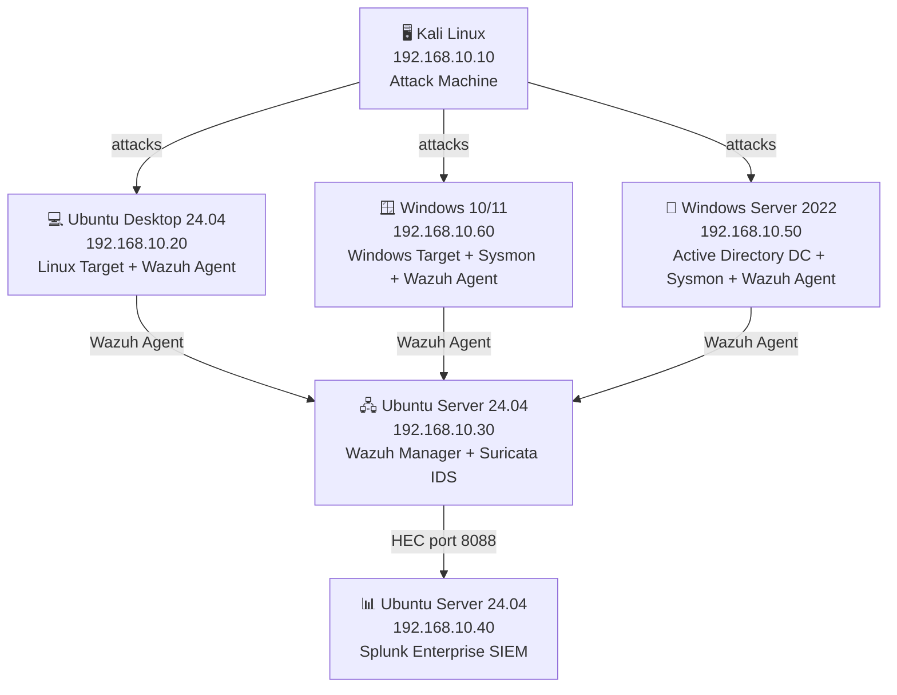
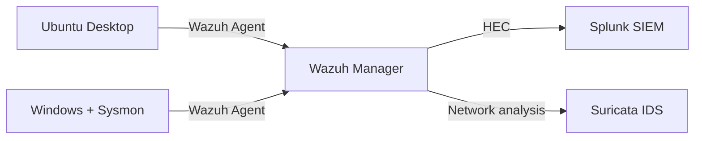

# SOC-HomeLab

> A fully functional Security Operations Center home lab built from scratch, designed to simulate real-world threat detection, log analysis, and incident response workflows. Oriented toward Blue Team and SOC analyst roles.

---

## Overview

This lab deploys a complete detection pipeline using industry-standard open-source tools across isolated virtual machines. Wazuh serves as the EDR for endpoint monitoring and alert generation. Splunk ingests those alerts as the SIEM, enabling SPL-based correlation and dashboarding. Suricata provides network-level intrusion detection. Sysmon enhances Windows telemetry on both the workstation and the Active Directory domain controller. Kali Linux acts as the attacker, simulating real threat scenarios including privilege escalation, lateral movement via SSH, Active Directory attacks, and persistence via scheduled tasks.

---

## Architecture

---

## Data Flow

---

## Lab Components

| VM | IP | OS | Role |
|----|----|----|------|
| Kali Linux | 192.168.10.10 | Kali Linux (latest) | Attack machine |
| Ubuntu Desktop | 192.168.10.20 | Ubuntu Desktop 24.04 | Linux target + Wazuh Agent |
| Ubuntu Wazuh | 192.168.10.30 | Ubuntu Server 24.04 | Wazuh Manager + Suricata IDS |
| Ubuntu Splunk | 192.168.10.40 | Ubuntu Server 24.04 | Splunk SIEM |
| Windows Server 2022 | 192.168.10.50 | Windows Server 2022 (Eval) | Active Directory DC + Sysmon + Wazuh Agent |
| Windows 10/11 | 192.168.10.60 | Windows 10/11 | Windows workstation + Sysmon + Wazuh Agent |

---

## Phases

- [x] Phase 1 — Infrastructure setup
- [x] Phase 2 — Wazuh deployment
- [x] Phase 3 — Splunk deployment + Wazuh integration via HEC
- [x] Phase 4 — Suricata IDS
- [x] Phase 5 — Active Directory + Sysmon deployment
- [ ] Phase 6 — Detection rules (15+)
- [ ] Phase 7 — Attack simulations and remediation

---

## Tools Used

| Tool | Category | Purpose |
|------|----------|---------|
| Wazuh | EDR | Endpoint monitoring, alert generation, FIM |
| Splunk Enterprise | SIEM | Log ingestion, SPL queries, dashboards |
| Suricata | IDS | Network traffic analysis, signature-based detection |
| Sysmon | Windows telemetry | Process, network, and registry event monitoring |
| Windows Server 2022 | Infrastructure | Active Directory domain controller |
| Kali Linux | Offensive | Attack simulation |
| Hydra | Credential attack | SSH brute force simulation |
| Nmap | Reconnaissance | Network scanning |
| Metasploit | Exploitation | Vulnerability exploitation |
| Burp Suite | Web | Web application attack simulation |
| John the Ripper | Password cracking | Offline credential attacks |
| Hashcat | Password cracking | GPU-accelerated hash cracking |

---

## Skills Demonstrated

### Infrastructure & Systems
- Virtualization design with VirtualBox (isolated multi-VM networks, NAT + Internal Networks, promiscuous mode configuration)
- Linux server administration (Ubuntu Server 24.04 — Netplan, systemd, package management)
- Windows Server administration (PowerShell-based configuration, service management)
- Bash and PowerShell scripting for automation

### Active Directory
- AD DS deployment and forest creation (`lab.local`)
- Domain Controller promotion and DNS integration
- Bulk user provisioning with PowerShell
- Domain join configuration on Windows endpoints

### SIEM & EDR
- End-to-end SIEM pipeline design and implementation
- Wazuh Manager, Indexer, and Dashboard deployment
- Wazuh Agent enrollment on Linux and Windows endpoints
- Splunk Enterprise installation and HEC token configuration
- Custom integration scripting between Wazuh and Splunk
- Shared agent configuration for centralized Windows telemetry collection

### IDS / Network Security
- Suricata installation and rule management
- Network traffic analysis with `eve.json` and `fast.log`
- Promiscuous mode configuration for multi-host network visibility
- Integration of Suricata alerts into Wazuh and Splunk

### Windows Telemetry
- Sysmon deployment with Olaf Hartong's `sysmon-modular` configuration
- MITRE ATT&CK technique mapping via Sysmon rules
- Event Log forwarding through Wazuh's `eventchannel` log format

### Threat Detection & Analysis
- Wazuh rule structure and alert tuning
- Splunk SPL query writing for cross-source correlation
- Forensic alert interpretation and attack reconstruction
- Log analysis across heterogeneous sources (Linux syslog, Windows Event Log, Suricata, Sysmon)

### Troubleshooting & Problem Solving
- Diagnosing JVM and OpenSearch startup failures
- Debugging custom integration scripts and HEC connectivity
- Resolving dual-adapter network conflicts during domain join operations
- XML configuration validation and recovery from broken `ossec.conf` files

---

## Documentation

| Phase | Description |
|-------|-------------|
| [Phase 1](docs/phase1-infrastructure.md) | Infrastructure setup |
| [Phase 2](docs/phase2-wazuh.md) | Wazuh EDR deployment |
| [Phase 3](docs/phase3-splunk.md) | Splunk SIEM + HEC integration |
| [Phase 4](docs/phase4-suricata.md) | Suricata IDS |
| [Phase 5](docs/phase5-sysmon.md) | Active Directory + Sysmon |
| [Phase 6](docs/phase6-detection-rules.md) | Custom detection rules (15+) |
| [Phase 7](docs/phase7-attack-simulations.md) | Attack simulations + remediation |
