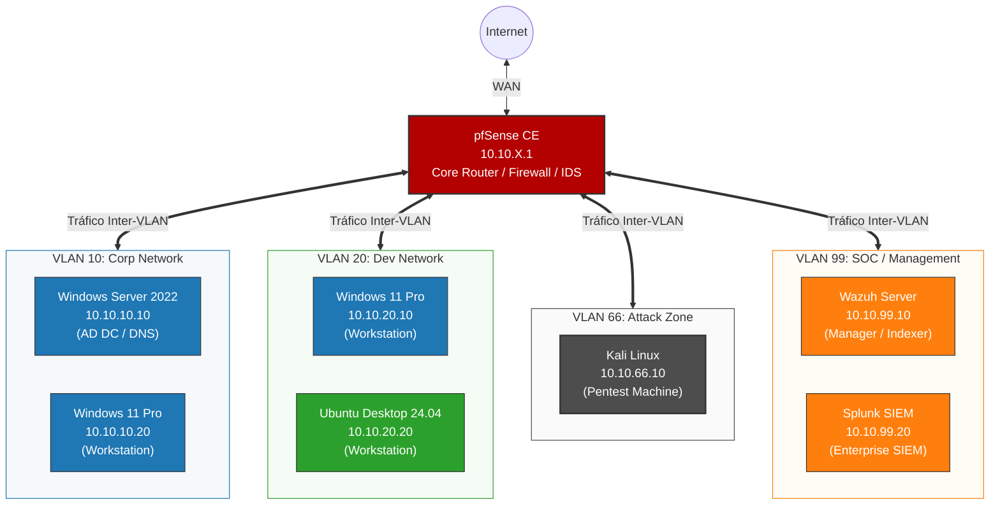

# SOC-HomeLab
 
> A fully integrated Security Operations Center home lab built from scratch with VLAN segmentation, covering the complete threat detection and response lifecycle. Combines Blue Team detection engineering, Red Team attack simulation, and incident response. Oriented toward SOC Analyst, Detection Engineer, Threat Hunter roles and Pentester.
 
---
 
## Overview
 
This lab implements a production-grade SOC architecture across eight virtual machines distributed in four isolated VLANs, routed and firewalled through pfSense. The full pipeline includes perimeter and inter-VLAN intrusion detection (Suricata on pfSense), endpoint monitoring (Wazuh), centralized log ingestion (Splunk via HEC), enhanced Windows telemetry (Sysmon), and an Active Directory environment for realistic attack simulation. Network segmentation enforces an out-of-band SOC management plane, a dedicated attacker DMZ, and controlled cross-VLAN access between corporate and development networks.
 
Beyond infrastructure, the project covers all stages of the SOC analyst workflow — from rule writing and attack execution to forensic investigation, hunt operations, automated response, and threat intelligence enrichment.
 
---
 
## Architecture


---
 
## Lab Components
 
| VM | IP | OS | Role |
|----|----|----|------|
| pfSense | 10.10.X.1 (per VLAN) | pfSense CE (latest) | Router + Firewall + Suricata IDS + OpenVPN |
| Windows Server 2022 | 10.10.10.10 | Windows Server 2022 (Eval) | Active Directory DC + DNS + Sysmon + Wazuh Agent |
| Windows 11 Pro (Corp) | 10.10.10.20 | Windows 11 Pro | Corporate workstation + Sysmon + Wazuh Agent |
| Windows 11 Pro (Dev) | 10.10.20.10 | Windows 11 Pro | Development workstation + Sysmon + Wazuh Agent |
| Ubuntu Desktop | 10.10.20.20 | Ubuntu Desktop 24.04 | Development workstation + Auditd + Wazuh Agent |
| Ubuntu Wazuh | 10.10.99.10 | Ubuntu Server 24.04 | Wazuh Manager + Indexer + Dashboard |
| Ubuntu Splunk | 10.10.99.20 | Ubuntu Server 24.04 | Splunk Enterprise SIEM |
| Kali Linux | 10.10.66.10 | Kali Linux (latest) | Attack machine |
 
---
 
## Project Phases
 
| # | Phase | Description |
|---|-------|-------------|
| 0 | [Planning & Design](docs/phase0-planning-design.md) | Architecture decisions, threat model, IP plan, scope |
| 1 | [VirtualBox Foundation](docs/phase1-virtualbox-foundation.md) | Hypervisor setup, internal networks, base VM provisioning |
| 2 | [Network Backbone](docs/phase2-network-backbone.md) | pfSense install + VLAN segmentation + firewall policy |
| 3 | [SOC Stack Deployment](docs/phase3-soc-stack.md) | Wazuh Manager + Splunk SIEM + HEC integration |
| 4 | [Corporate Environment](docs/phase4-corporate-environment.md) | Active Directory + Windows endpoints + Sysmon |
| 5 | [Software Development Environment](docs/phase5-development-environment.md) | Windows + Linux dev workstations in isolated VLAN |
| 6 | [Attack Infrastructure](docs/phase6-attack-infrastructure.md) | Kali Linux setup + offensive toolkit baseline |
| 7 | [Remote Access (OpenVPN)](docs/phase7-remote-access.md) | OpenVPN server on pfSense + cross-VLAN access policy |
| 8 | [Detection Engineering Baseline](docs/phase8-detection-engineering.md) | 15+ custom detection rules mapped to MITRE ATT&CK |
| 9 | [SOC Operations & Incident Reporting](docs/phase9-soc-operations.md) | End-to-end attack scenarios + incident response reports |
| 10 | [Portfolio Capstone](docs/phase10-portfolio-capstone.md) | Final writeup, demo materials, and portfolio polish |
 
---
 
## Tools Used
 
| Category | Tools |
|----------|-------|
| **Network** | pfSense (router + firewall + VPN) |
| **SIEM** | Splunk Enterprise |
| **EDR** | Wazuh |
| **IDS** | Suricata |
| **Windows Telemetry** | Sysmon (Olaf Hartong config) |
| **Identity** | Active Directory (Windows Server 2022) |
| **Offensive** | Kali Linux, Nmap, Hydra, Metasploit, Burp Suite, John the Ripper, Hashcat |
| **Forensics** | Volatility, Wireshark |

---
 
## Repository Structure
 
```
SOC-HomeLab/
├── docs/                       Phase-by-phase build documentation
├── detection-engineering/      Detection rules with full methodology
├── rules/                      Ready-to-deploy rule code (Wazuh XML, Splunk SPL)
└── screenshots/                Visual evidence per phase
```
 
---
 
## About This Project
 
Built as a personal cyber range to develop and demonstrate the full skill set required for SOC Analyst and Detection Engineer roles. The lab is continuously evolving — new rules, attack scenarios, and automation playbooks are added as part of ongoing learning. Network segmentation, out-of-band SOC management, and a dedicated attacker DMZ make this lab a realistic environment for both detection engineering and incident response practice. All documentation is written in English to align with international industry standards.
