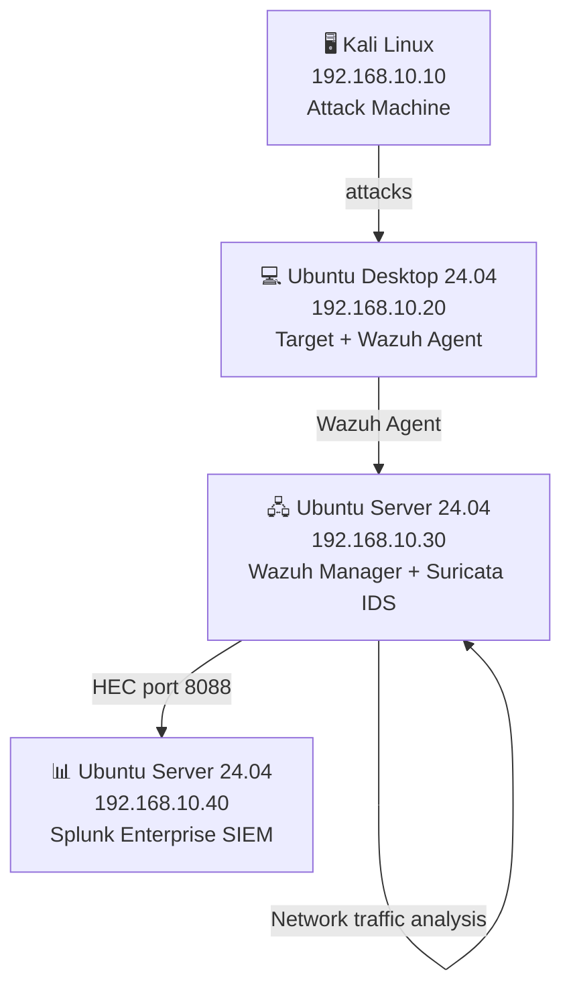

# SOC-HomeLab

> A fully functional Security Operations Center home lab built from scratch, designed to simulate real-world threat detection, log analysis, and incident response workflows. Oriented toward Blue Team and SOC analyst roles.

---

## Overview

This lab deploys a complete detection pipeline using industry-standard open-source tools across isolated virtual machines. Wazuh serves as the EDR for endpoint monitoring and alert generation. Splunk ingests those alerts as the SIEM, enabling SPL-based correlation and dashboarding. Suricata provides network-level intrusion detection. Kali Linux acts as the attacker, simulating real threat scenarios against an Ubuntu Desktop target.

---
## Architecture



---

**Data flow:**
```
Ubuntu Desktop → Wazuh Agent → Wazuh Manager → Splunk HEC → Splunk SIEM
                                     │
                               Suricata IDS
                          (network traffic analysis)
```

---

## Lab Components

| VM | IP | OS | Role |
|----|----|----|------|
| Kali Linux | 192.168.10.10 | Kali Linux (latest) | Attack machine |
| Ubuntu Desktop | 192.168.10.20 | Ubuntu Desktop 24.04 | Target + Wazuh Agent |
| Ubuntu Wazuh | 192.168.10.30 | Ubuntu Server 24.04 | Wazuh Manager + Suricata IDS |
| Ubuntu Splunk | 192.168.10.40 | Ubuntu Server 24.04 | Splunk SIEM |

---

## Phases

- [x] Phase 1 — Infrastructure setup
- [x] Phase 2 — Wazuh deployment
- [x] Phase 3 — Splunk deployment + Wazuh integration via HEC
- [ ] Phase 4 — Suricata IDS
- [ ] Phase 5 — Detection rules (15+)
- [ ] Phase 6 — Attack simulations and remediation

---

## Tools Used

| Tool | Category | Purpose |
|------|----------|---------|
| Wazuh | EDR | Endpoint monitoring, alert generation, FIM |
| Splunk Enterprise | SIEM | Log ingestion, SPL queries, dashboards |
| Suricata | IDS | Network traffic analysis, signature-based detection |
| Kali Linux | Offensive | Attack simulation |
| Hydra | Credential attack | SSH brute force simulation |
| Nmap | Reconnaissance | Network scanning |
| Metasploit | Exploitation | Vulnerability exploitation |
| Burp Suite | Web | Web application attack simulation |
| John the Ripper | Password cracking | Offline credential attacks |
| Hashcat | Password cracking | GPU-accelerated hash cracking |

---

## Skills Demonstrated

- End-to-end SIEM pipeline design and implementation
- EDR deployment and endpoint agent management
- Network segmentation and isolated lab design
- IDS configuration and signature-based threat detection
- Threat detection rule writing (Wazuh rules + Splunk SPL)
- Attack simulation and blue team response documentation
- MITRE ATT&CK framework mapping
- Log analysis and correlation across multiple security tools

---

## Documentation

| Phase | Description |
|-------|-------------|
| [Phase 1](docs/phase1-infrastructure.md) | Infrastructure setup |
| [Phase 2](docs/phase2-wazuh.md) | Wazuh EDR deployment |
| [Phase 3](docs/phase3-splunk.md) | Splunk SIEM + HEC integration |
| [Phase 4](docs/phase4-suricata.md) | Suricata IDS |
| [Phase 5](docs/phase5-detection-rules.md) | Custom detection rules (15+) |
| [Phase 6](docs/phase6-attack-simulations.md) | Attack simulations + remediation |
