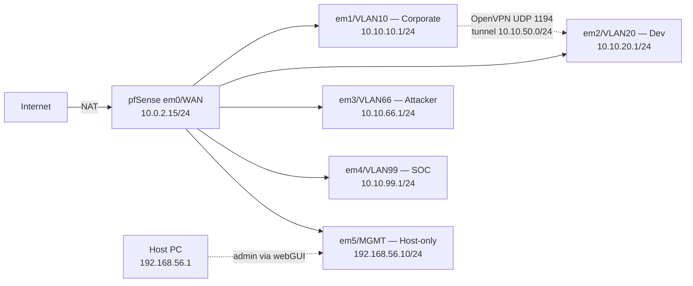

# Network Backbone (pfSense + OpenVPN)
 
## Overview
 
pfSense was deployed as the lab's edge router, providing inter-VLAN routing and NAT for internet egress, and as the lab's VPN concentrator for the controlled crossing between the Corporate and Development segments. The deployment consists of the pfSense VM with six interfaces (1 WAN + 4 LAN/OPT + 1 host-only MGMT), a temporary host-only network used to bootstrap webGUI access before any endpoint VM exists, an internal PKI (Certificate Authority + server certificate), and an OpenVPN remote-access server bound to the Corporate VLAN.
 
---
 
## Architecture
 

 
Inter-VLAN traffic is denied by default at the firewall. The only sanctioned crossing between VLAN 10 and VLAN 20 is the OpenVPN tunnel, which adds certificate + user authentication and per-session logging on top of the network controls.
 
---
 
## Deployment
 
### pfSense VM provisioning
 
The pfSense VM was created with six virtual NICs (1 NAT + 4 Internal Network + 1 Host-only) to provide one interface per VLAN plus the WAN uplink and a bootstrap management path. All adapters use **Intel PRO/1000 MT Desktop (82540EM)** because FreeBSD has native drivers for this NIC.
 
| Adapter | Attached to                       | Promiscuous Mode |
| ------- | --------------------------------- | ---------------- |
| 1 (em0) | NAT                               | Deny             |
| 2 (em1) | Internal Network `vbox-vlan10-corp` | Allow All      |
| 3 (em2) | Internal Network `vbox-vlan20-dev`  | Allow All      |
| 4 (em3) | Internal Network `vbox-vlan66-dmz`  | Allow All      |
| 5 (em4) | Internal Network `vbox-vlan99-soc`  | Allow All      |
| 6 (em5) | Host-only Adapter                   | Allow All      |


 
`Promiscuous Mode: Allow All` was selected on all internal adapters because Suricata needs to inspect every frame traversing the firewall, including broadcast/multicast traffic central to attack techniques such as ARP poisoning.
 
### pfSense installation
 
pfSense 2.8.1-RELEASE was installed from the Netgate Installer ISO. Installation parameters: UFS file system and GPT partition scheme.
 
### Interface assignment and IP configuration
 
From the pfSense console, interfaces were assigned (em0=WAN, em1=LAN, em2=OPT1, em3=OPT2, em4=OPT3) via console option `1) Assign Interfaces`. 
 
IPs were configured via option `2) Set interface(s) IP address`. LAN was already provisioned from the pre-install wizard; OPT1, OPT2, OPT3 were configured manually.
 
| Interface | IPv4 / mask     | DHCP server          |
| --------- | --------------- | -------------------- |
| WAN       | DHCP — 10.0.2.15 | n/a                 |
| LAN       | 10.10.10.1/24   | Enabled (.100–.200) |
| OPT1      | 10.10.20.1/24   | Enabled (.100–.200) |
| OPT2      | 10.10.66.1/24   | Enabled (.100–.200) |
| OPT3      | 10.10.99.1/24   | Enabled (.100–.200) |
 
The DHCP range `.100–.200` reserves `.10–.99` for static assets (AD DC, workstations, Wazuh, Kali). 


 
### Management interface bootstrap (host-only adapter)
 
The pfSense webGUI is only reachable from a host inside one of the configured networks, and at this point no endpoint VM exists in any VLAN. The host-only network was configured in `File → Host Network Manager` with the host's adapter at `192.168.56.1/24`. pfSense's em5 was assigned the static IP `192.168.56.10/24`
 
This interface is documented as temporary and is intended to be either removed or restricted by firewall rule once Phase 4 brings a Corporate workstation online.
 
### Interface renaming
 
The default pfSense interface names (`LAN`, `OPT1`, `OPT2`, `OPT3`, `OPT4`) were renamed under `Interfaces → [name] → Description` to match the lab vocabulary, so firewall rule tabs and logs are immediately readable.
 
| Default | Renamed to | Description                  |
| ------- | ---------- | ---------------------------- |
| LAN     | VLAN10     | Corporate domain segment     |
| OPT1    | VLAN20     | Software Development         |
| OPT2    | VLAN66     | Attacker DMZ                 |
| OPT3    | VLAN99     | SOC Management (out-of-band) |
| OPT4    | MGMT       | Temporary host-only admin    |


 
### Firewall rules
 
pfSense applies default-deny on every interface except LAN, which has an automatic anti-lockout rule. The newly created MGMT interface initially blocked all traffic, including the webGUI HTTPS port (see Troubleshooting #5). A permanent rule was added to allow administrative access from the host PC:
 
| Interface | Action | Source         | Destination          | Protocol | Description                       |
| --------- | ------ | -------------- | -------------------- | -------- | --------------------------------- |
| MGMT      | Pass   | `192.168.56.1` | This Firewall (self) | any      | Allow host PC full admin access   |
 

 
VLAN10, VLAN20, VLAN66, and VLAN99 were left with no allow rules at this stage (default-deny posture).
 
### OpenVPN — PKI setup
 
A two-tier internal PKI was created under `System → Cert Manager`:
 
| Object             | Type        | Common Name           | Algorithm    | Lifetime |
| ------------------ | ----------- | --------------------- | ------------ | -------- |
| SOC-Lab-CA         | CA          | `SOC-Lab-CA`          | RSA 2048 + SHA256 | 3650 d |
| SOC-Lab-VPN-Server | Server cert | `vpn.soclab.internal` | RSA 2048 + SHA256 | 3650 d |
 
The server certificate was created with `Certificate Type: Server Certificate` rather than the default `User Certificate`. The two types differ in the X.509 `extendedKeyUsage` extension — using a user certificate on the server side functionally works but emits client-side warnings on every connection.
 
2048-bit RSA was selected over 4096 because the security gain at lab scale is marginal while the TLS handshake cost roughly doubles. SHA256 was selected because SHA1 is cryptographically broken and not negotiable for new deployments.
 
### OpenVPN — server configuration
 
Under `VPN → OpenVPN → Servers → Add`:
 
| Setting                       | Value                                |
| ----------------------------- | ------------------------------------ |
| Server Mode                   | Remote Access (SSL/TLS + User Auth)  |
| Backend for authentication    | Local Database                       |
| Device Mode                   | tun (Layer 3)                        |
| Protocol                      | UDP on IPv4 only                     |
| Interface                     | VLAN10                               |
| Local port                    | 1194                                 |
| Peer Certificate Authority    | SOC-Lab-CA                           |
| Server Certificate            | SOC-Lab-VPN-Server                   |
| Data Encryption Algorithms    | AES-256-GCM, AES-128-GCM, CHACHA20-POLY1305 |
| Auth Digest Algorithm         | SHA256                               |
| IPv4 Tunnel Network           | `10.10.50.0/24`                      |
| Redirect IPv4 Gateway         | Unchecked                            |
| IPv4 Local Network(s)         | `10.10.20.0/24`                      |
| Allow Compression             | Refuse any non-stub compression (Most secure) |
| Topology                      | Subnet                               |
| DNS Default Domain            | `soclab.internal`                    |
 
`Remote Access (SSL/TLS + User Auth)` was selected to require both certificate and password authentication. Single-factor at a VPN edge (cert-only or password-only) is below the entry-level expectation for any production deployment; the lab matches that posture.
 
`Redirect IPv4 Gateway` was left unchecked because forcing all client traffic through the tunnel would break the client's internet access (pfSense does not route arbitrary OpenVPN client traffic out the WAN). Only the VLAN 20 route is pushed to clients.
 
Compression was disabled because of VORACLE-class attacks against compressed VPN data planes. The minor bandwidth reduction is not worth the side-channel risk.
 
### OpenVPN — user and client certificate
 
Under `System → User Manager → Add`:
 
| Setting          | Value                |
| ---------------- | -------------------- |
| Username         | `vpn-corp-user`      |
| Password         | (recorded externally) |
| Full name        | Corporate VPN User   |
| Client certificate | Created inline, signed by SOC-Lab-CA, RSA 2048 + SHA256, 3650 d, type `User Certificate` |
 
### OpenVPN — firewall rule on the OpenVPN tab
 
Creating the OpenVPN server caused a new `OpenVPN` tab to appear under `Firewall → Rules`. The tab is empty by default, meaning tunnel clients can establish the connection but cannot route to any subnet behind the firewall.
 
| Interface | Action | Source              | Destination         | Protocol | Description                                |
| --------- | ------ | ------------------- | ------------------- | -------- | ------------------------------------------ |
| OpenVPN   | Pass   | Net `10.10.50.0/24` | Net `10.10.20.0/24` | any      | Allow OpenVPN clients to reach VLAN20 (dev) |
 
The rule allows any protocol from the tunnel subnet to VLAN 20. A tighter rule restricted to RDP (3389) and SSH (22) would match production practice, but the broader rule was preferred at this stage to allow iteration in subsequent phases. Tightening becomes a documented decision during Phase 5 scenario design.
 
### OpenVPN — client export
 
The `OpenVPN Client Export Utility` package was installed via `System → Package Manager` to enable single-file client configuration export. Under `VPN → OpenVPN → Client Export`, the `vpn-corp-user` entry was exported using **Inline Configurations → Most Clients**, producing a single `.ovpn` file with the CA, client certificate, client key, TLS auth key, and connection parameters all embedded. This file is retained for import by the Corporate workstation in Phase 4.
 
---
 
## Validation — Connectivity Tests
 
### NAT outbound from pfSense
 
From the pfSense console, option `7) Ping host`:
 
```
ping 8.8.8.8
```
 
Result: four replies under 50 ms — WAN NAT functional, pfSense reaches the internet through the VirtualBox NAT engine.
 
### Host PC ↔ pfSense webGUI
 
From the host PC's PowerShell:
 
```powershell
ping 192.168.56.10
```
 
Result: four replies under 1 ms — host-only network operational, MGMT firewall rule permits ICMP.
 
Browser access to `https://192.168.56.10` loaded the pfSense webGUI after accepting the self-signed certificate warning. Login succeeded with the password set during the Setup Wizard.
 
### OpenVPN service status
 
Under `VPN → OpenVPN → Servers`, the server listed status **Up** (green). Under `Status → OpenVPN`, the daemon listed as **running**.
 
End-to-end tunnel validation (client connects, receives push route, reaches a VLAN 20 host) is deferred to Phase 4 when the first OpenVPN client (Win11-Corp) is provisioned.
 
---
 
## Troubleshooting & Lessons Learned
 
### 1. Kernel panic after the first install attempt
 
After the first install completed and the VM rebooted, the FreeBSD console looped with `vm_fault: pager read error, pid XXXX (init)`. The methodology to triage this was process of elimination on the post-install boot path:
 
| Hypothesis                          | Evidence                                                            | Conclusion |
| ----------------------------------- | ------------------------------------------------------------------- | ---------- |
| Bad ISO checksum                    | SHA256 verified before install — match                              | Ruled out  |
| Corrupted VDI                       | Disk created cleanly, no I/O errors during install                  | Possible   |
| Incomplete install (early ISO eject) | "Reboot" was selected at end of install while ISO was still mounted; the `Remove disk from virtual drive` operation in VirtualBox's Devices menu was performed mid-reboot | Likely root cause |
 
**Solution:** the VM was hard-powered-off, the ISO was re-mounted, and the install was re-run. At the `Complete` screen, **`Halt`** was selected instead of `Reboot`, allowing the VM to power off in a quiescent state. The ISO was then unmounted via Settings → Storage with the VM definitively off, and the VM was booted from disk in a clean state. The second install booted successfully.
 
### 2. VirtualBox GUI four-adapter limit
 
The VM Settings → Network UI shows only four adapter tabs, but the architecture requires five internal NICs plus a sixth host-only NIC. The methodology: the VirtualBox documentation was consulted, confirming up to eight adapters per VM are supported by the engine — the limit is GUI-only.
 
**Solution:** adapters 5 and 6 were configured via `VBoxManage modifyvm` from the host CLI with the VM powered off, then verified with `VBoxManage showvminfo`. The configuration is persistent and behaves identically to GUI-configured adapters at runtime.
 
### 3. Pre-install LAN wizard accepts wrong-subnet defaults
 
pfSense 2.8's installer presents a `LAN (em1) Network Mode Setup` screen before the disk install with defaults of `192.168.1.1/24` and DHCP range `192.168.1.100–.199`. On the first install attempt, defaults were accepted, resulting in LAN provisioned on the wrong subnet. This was detected post-install when the LAN gateway IP did not match the lab IP plan.
 
**Solution:** the IP, DHCP start, and DHCP end fields were overridden via the keyboard shortcuts (`I`, `S`, `E`) before the install proceeded on the second attempt.
 
### 4. Interface assignment skipped Optional interfaces
 
After the second install, the first-boot interface assignment wizard prompted for `Optional 1`. An accidental empty Enter caused pfSense to interpret the input as "no more interfaces," resulting in `em2`, `em3`, `em4` (and later `em5`) remaining unassigned. Detection: the console menu showed only WAN and LAN with IPs, and option `2) Set interface(s) IP address` only listed those two interfaces.
 
**Solution:** option `1) Assign Interfaces` was re-run from the main menu, walking through the full sequence and providing all `em` names. Pressing Enter empty is only correct on the prompt *after* the last desired interface.
 
### 5. VLAN sub-menu trap during interface assignment
 
A `y` was entered by mistake at the `Should VLANs be set up now?` prompt during option 1, putting the wizard into an 802.1Q VLAN configuration sub-flow. The first sub-prompt (`Enter the parent interface name for the new VLAN`) accepted an interface name (em0) instead of being recognized as an exit prompt.
 
**Solution:** at any prompt within the VLAN sub-flow ending in `(or nothing if finished)`, pressing Enter with an empty input exits the sub-menu. If a partial VLAN entry has already been started, completing it with any tag and pressing Enter on the next parent-interface prompt also exits. Any phantom VLAN created during this can be deleted later from `Interfaces → Assignments → VLANs`.
 
### 6. Default-deny lockout on newly created OPT interface
 
After the MGMT interface (em5) was configured with IP `192.168.56.10/24`, the pfSense console announced the webGUI URL. The browser request timed out. The methodology used was a layered connectivity test:
 
| Test                                                  | Result      |
| ----------------------------------------------------- | ----------- |
| `ping 192.168.56.1` (host adapter from pfSense)       | Replies     |
| Host PC's VirtualBox Host-Only adapter has `192.168.56.1` (`ipconfig`) | Confirmed   |
| `ping 192.168.56.10` from host PC                     | Timeout     |
| Browser `https://192.168.56.10`                       | Timeout     |
 
L2 and L3 connectivity were functional from pfSense's side, ruling out a link or routing issue. The lockout was localized to the firewall: pfSense applies default-deny on every interface except LAN (which carries an automatic anti-lockout rule). MGMT had no rules.
 
**Solution:** packet filtering was disabled temporarily via the pfSense console shell with `pfctl -d`, the webGUI was accessed, a permanent allow rule was created on `Firewall → Rules → MGMT` (source `192.168.56.1`, destination `This Firewall (self)`, protocol any), and the packet filter was re-enabled with `pfctl -e`.
 
`pfctl -d` is not a stable workaround: pfSense automatically re-enables the packet filter on `Apply Changes`, service restarts, and several other internal events. The permanent firewall rule is the correct fix.
 
### 7. Interface rename caused webGUI session drops
 
Renaming each interface (`LAN` → `VLAN10`, `OPT1` → `VLAN20`, etc.) and clicking `Apply Changes` after each rename caused the browser HTTPS session to disconnect repeatedly. The pattern was reproduced: each Apply triggered a `pfctl` reload, and each reload severed the live admin session.
 
**Solution:** the workflow was changed to save each rename without clicking Apply — the yellow "must apply" banner accumulates across navigations — then `Apply Changes` was clicked once at the end. One reload, one risk window instead of five.
 
### 8. `.local` TLD vs mDNS
 
The Setup Wizard's General Information page explicitly warns against `.local` as the domain TLD because mDNS (Avahi, Bonjour, Airprint, Windows Network Discovery on some configurations) claims it. A first-pass entry of `soclab.local` was replaced with `soclab.internal` after re-reading the warning. The `.internal` TLD is the modern convention promoted by ICANN and the IETF for private networks.
 
### 9. Misleading "Override DNS" checkbox label
 
The wizard's `Override DNS` checkbox is labelled "Allow DNS servers to be overridden by DHCP/PPP on WAN". The intuitive reading conflicts with the actual behavior:
 
| State          | Actual behavior                                                  |
| -------------- | ---------------------------------------------------------------- |
| Checked        | WAN-DHCP-provided DNS overrides the manually configured entries  |
| Unchecked      | The manually configured entries are authoritative (sticky)       |
 
For predictable lab DNS behavior, the box was unchecked so the manually configured `1.1.1.1` and `8.8.8.8` remain authoritative regardless of WAN DHCP changes.
 
### 10. `Block private networks / bogon networks` on WAN broke RFC1918 NAT
 
The Setup Wizard enables both `Block RFC1918 Private Networks` and `Block bogon networks` on WAN by default. On a public WAN this is good practice — it prevents source-spoofed traffic from RFC1918 ranges. On the lab's VirtualBox NAT WAN, where the pfSense WAN IP is `10.0.2.15/24` (RFC1918) and the gateway is `10.0.2.2`, both rules drop legitimate VirtualBox NAT traffic, including periodic DHCP renewals.
 
**Solution:** both checkboxes were unchecked during the wizard. The decision is documented as a virtualized-NAT-WAN exception, not a generic security relaxation.
 
### 11. Server certificate type matters for OpenVPN
 
The default Certificate Type when creating a new internal certificate in `Cert Manager` is `User Certificate`. Initially, the server certificate for OpenVPN was created with the default. While the OpenVPN service started, client-side connections emitted certificate warnings.
 
**Solution:** the server certificate was recreated with `Certificate Type: Server Certificate`. The two types differ in the X.509 `extendedKeyUsage` extension — server certificates carry the `TLS Web Server Authentication` OID, which OpenVPN clients validate on the server during the handshake.
 
---
 
## Result
 
- pfSense 2.8.1-RELEASE routing traffic between 4 VLANs (10/20/66/99) and out via WAN NAT.
- Six interfaces operational: WAN (DHCP), VLAN10, VLAN20, VLAN66, VLAN99 (each `.1` with /24 DHCP servers on `.100–.200`), and MGMT (host-only, static `192.168.56.10/24`).
- Automatic Outbound NAT active; `ping 8.8.8.8` from the pfSense console confirms internet egress.
- Internal PKI established: `SOC-Lab-CA` root, `SOC-Lab-VPN-Server` server certificate, `vpn-corp-user-cert` client certificate.
- OpenVPN remote-access server bound to VLAN10 (`em1`), listening on UDP 1194, pushing route `10.10.20.0/24` to authenticated clients via tunnel subnet `10.10.50.0/24`.
- `Firewall → Rules → OpenVPN` rule allows the tunnel subnet to reach VLAN 20.
- `Firewall → Rules → MGMT` rule allows the host PC full admin access to pfSense (destination `self`).
- One VPN user (`vpn-corp-user`) with `.ovpn` client configuration exported and stored externally, ready for Phase 4.
- pfSense webGUI accessible from host PC at `https://192.168.56.10` with the packet filter enabled.
- Snapshot `pfsense-vpn-ready` taken in VirtualBox.
---
 
## Screenshots
 
| Screenshot | Description |
| ---------- | ----------- |
|  | pfSense console banner showing the 6 interfaces with their IPs |
|  | Setup Wizard — General Information with `soclab.internal` and DNS configured |
|  | Setup Wizard — WAN with RFC1918 and bogon blocks unchecked |
|  | Dashboard Interfaces panel with VLAN10/20/66/99/MGMT names |
|  | `Firewall → Rules → MGMT` with the host-PC admin rule |
|  | `System → Cert Manager` showing the CA and server/user certs |
|  | `VPN → OpenVPN → Servers` with the server status Up |
|  | `Firewall → Rules → OpenVPN` with the tunnel-to-VLAN20 rule |
|  | `VPN → OpenVPN → Client Export` listing `vpn-corp-user` |
|  | `Diagnostics → Ping → 8.8.8.8` — NAT outbound functional |
 
---
 
*Previous: [Phase 1 — VirtualBox Foundation](phase1-virtualbox-foundation.md)*  
*Next: [Phase 3 — SOC Stack Deployment](phase3-soc-stack.md)*
 
