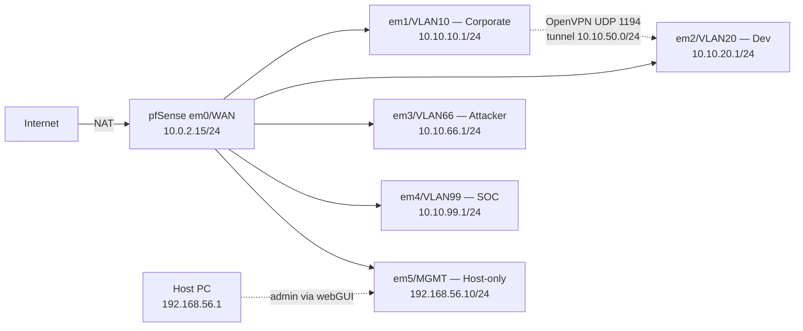
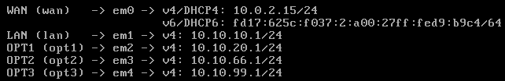
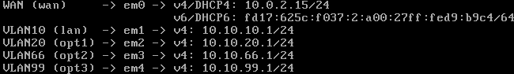
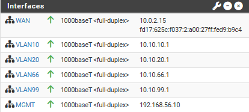
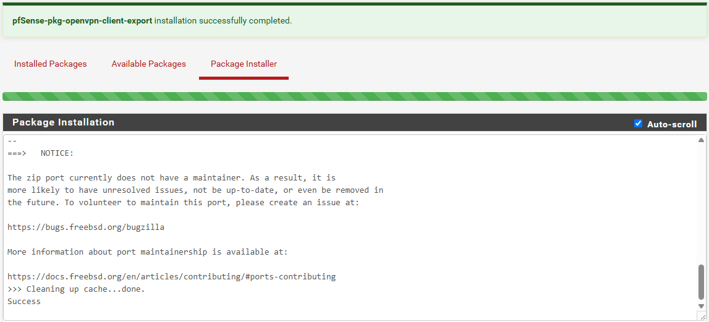
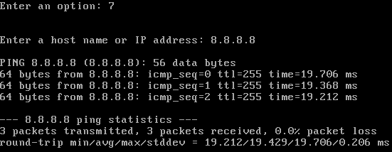
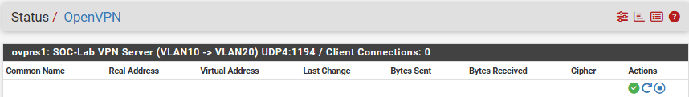
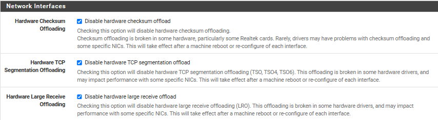

# Phase 1 — Part 1 Network Backbone (pfSense + OpenVPN)
 
## Overview
 
pfSense was deployed as the lab's edge router, providing inter-VLAN routing and NAT for internet egress, and as the lab's VPN concentrator for the controlled crossing between the Corporate and Development segments. The deployment consists of the pfSense VM with six interfaces (1 WAN + 4 LAN/OPT + 1 host-only MGMT), a temporary host-only network used to bootstrap webGUI access before any endpoint VM exists, an internal PKI (Certificate Authority + server certificate), and an OpenVPN remote-access server bound to the Corporate VLAN.
 
---
 
## Architecture
 

 
Inter-VLAN traffic is denied by default at the firewall. The only sanctioned crossing between VLAN 10 and VLAN 20 is the OpenVPN tunnel, which adds certificate + user authentication and per-session logging on top of the network controls.
 
---
 
## Deployment
 
### pfSense VM provisioning
 
The pfSense VM was created with six virtual NICs (1 NAT + 4 Internal Network + 1 Host-only) to provide one interface per VLAN plus the WAN uplink and a bootstrap management path. All adapters use **Intel PRO/1000 MT Desktop (82540EM)** because FreeBSD has native drivers for this NIC.


 
`Promiscuous Mode: Allow All` was selected on all internal adapters because Suricata needs to inspect every frame traversing the firewall, including broadcast/multicast traffic central to attack techniques such as ARP poisoning.
 
### pfSense installation
 
pfSense 2.8.1-RELEASE was installed from the Netgate Installer ISO. Installation parameters: UFS file system and GPT partition scheme.
 
### Interface assignment and IP configuration
 
From the pfSense console, interfaces were assigned (em0=WAN, em1=LAN, em2=OPT1, em3=OPT2, em4=OPT3) via console option `1) Assign Interfaces`. 
 
IPs were configured via option `2) Set interface(s) IP address`. LAN was already provisioned from the pre-install wizard; OPT1, OPT2, OPT3 were configured manually.
 
| Interface | IPv4 / mask     | DHCP server          |
| --------- | --------------- | -------------------- |
| WAN       | DHCP — 10.0.2.15 | n/a                 |
| LAN       | 10.10.10.1/24   | Enabled (.100–.200) |
| OPT1      | 10.10.20.1/24   | Enabled (.100–.200) |
| OPT2      | 10.10.66.1/24   | Enabled (.100–.200) |
| OPT3      | 10.10.99.1/24   | Enabled (.100–.200) |
 
The DHCP range `.100–.200` reserves `.10–.99` for static assets (AD DC, workstations, Wazuh, Kali). 


 
### Management interface bootstrap (host-only adapter)
 
The pfSense webGUI is only reachable from a host inside one of the configured networks, and at this point no endpoint VM exists in any VLAN. The host-only network was configured in `File → Host Network Manager` with the host's adapter at `192.168.56.1/24`. pfSense's em5 was assigned the static IP `192.168.56.10/24`
 
This interface is documented as temporary and is intended to be either removed or restricted by firewall rule once Phase 4 brings a Corporate workstation online.
 
### Interface renaming
 
The default pfSense interface names (`LAN`, `OPT1`, `OPT2`, `OPT3`, `OPT4`) were renamed under `Interfaces → [name] → Description` to match the lab vocabulary, so firewall rule tabs and logs are immediately readable.




 
### Firewall rules
 
pfSense applies default-deny on every interface except LAN, which has an automatic anti-lockout rule. The newly created MGMT interface initially blocked all traffic, including the webGUI HTTPS port (see Troubleshooting #5). A permanent rule was added to allow administrative access from the host PC:
 

 
VLAN10, VLAN20, VLAN66, and VLAN99 were left with no allow rules at this stage (default-deny posture).
 
### OpenVPN — PKI setup
 
A two-tier internal PKI was created under `System → Cert Manager`:
 
| Object             | Type        | Common Name           | Algorithm    | Lifetime |
| ------------------ | ----------- | --------------------- | ------------ | -------- |
| SOC-Lab-CA         | CA          | `SOC-Lab-CA`          | RSA 2048 + SHA256 | 3650 d |
| SOC-Lab-VPN-Server | Server cert | `vpn.soclab.internal` | RSA 2048 + SHA256 | 3650 d |
 
2048-bit RSA was selected over 4096 because the security gain at lab scale is marginal while the TLS handshake cost roughly doubles. SHA256 was selected because SHA1 is cryptographically broken and not negotiable for new deployments.
 
### OpenVPN — server configuration
 
Under `VPN → OpenVPN → Servers → Add`:
 
| Setting                       | Value                                |
| ----------------------------- | ------------------------------------ |
| Server Mode                   | Remote Access (SSL/TLS + User Auth)  |
| Backend for authentication    | Local Database                       |
| Device Mode                   | tun (Layer 3)                        |
| Protocol                      | UDP on IPv4 only                     |
| Interface                     | VLAN10                               |
| Local port                    | 1194                                 |
| Peer Certificate Authority    | SOC-Lab-CA                           |
| Server Certificate            | SOC-Lab-VPN-Server                   |
| Data Encryption Algorithms    | AES-256-GCM, AES-128-GCM, CHACHA20-POLY1305 |
| Auth Digest Algorithm         | SHA256                               |
| IPv4 Tunnel Network           | `10.10.50.0/24`                      |
| Redirect IPv4 Gateway         | Unchecked                            |
| IPv4 Local Network(s)         | `10.10.20.0/24`                      |
| Allow Compression             | Refuse any non-stub compression (Most secure) |
| Topology                      | Subnet                               |
| DNS Default Domain            | `soclab.internal`                    |
 
`Remote Access (SSL/TLS + User Auth)` was selected to require both certificate and password authentication.
 
`Redirect IPv4 Gateway` was left unchecked because forcing all client traffic through the tunnel would break the client's internet access (pfSense does not route arbitrary OpenVPN client traffic out the WAN). Only the VLAN 20 route is pushed to clients.
 
Compression was disabled because of VORACLE-class attacks against compressed VPN data planes.
 
### OpenVPN — user and client certificate
 
Under `System → User Manager → Add`:
 
| Setting          | Value                |
| ---------------- | -------------------- |
| Username         | `vpn-corp-user`      |
| Password         | ******************** |
| Full name        | Corporate VPN User   |
| Client certificate | Created inline, signed by SOC-Lab-CA, RSA 2048 + SHA256, 3650 d, type `User Certificate` |
 
### OpenVPN — firewall rule on the OpenVPN tab
 
Creating the OpenVPN server caused a new `OpenVPN` tab to appear under `Firewall → Rules`. The tab is empty by default, meaning tunnel clients can establish the connection but cannot route to any subnet behind the firewall.
 
| Interface | Action | Source              | Destination         | Protocol | Description                                |
| --------- | ------ | ------------------- | ------------------- | -------- | ------------------------------------------ |
| OpenVPN   | Pass   | Net `10.10.50.0/24` | Net `10.10.20.0/24` | any      | Allow OpenVPN clients to reach VLAN20 (dev) |
 
The rule allows any protocol from the tunnel subnet to VLAN 20. A tighter rule restricted to RDP (3389) and SSH (22) would match production practice, but the broader rule was preferred at this stage to allow iteration in subsequent phases. 
 
### OpenVPN — client export
 
The `OpenVPN Client Export Utility` package was installed via `System → Package Manager` to enable single-file client configuration export. 



Under `VPN → OpenVPN → Client Export`, the `vpn-corp-user` entry was exported using **Inline Configurations → Most Clients**, producing a single `.ovpn` file with the CA, client certificate, client key, TLS auth key, and connection parameters all embedded.
 
---
 
## Validation — Connectivity Tests
 
### NAT outbound from pfSense
 
From the pfSense console, option `7) Ping host`:
 
```
ping 8.8.8.8
```


Result: four replies under 50 ms — WAN NAT functional, pfSense reaches the internet through the VirtualBox NAT engine.
 
### OpenVPN service status
 
Under `Status → OpenVPN`, the server listed status **Up** (green). 


 
---
 
## Troubleshooting & Lessons Learned
 
### 1. Interface assignment skipped Optional interfaces
 
After the second install, the first-boot interface assignment wizard prompted for `Optional 1`. An accidental empty Enter caused pfSense to interpret the input as "no more interfaces," resulting in `em2`, `em3`, `em4` (and later `em5`) remaining unassigned. Detection: the console menu showed only WAN and LAN with IPs, and option `2) Set interface(s) IP address` only listed those two interfaces.
 
**Solution:** option `1) Assign Interfaces` was re-run from the main menu, walking through the full sequence and providing all `em` names. Pressing Enter empty is only correct on the prompt *after* the last desired interface.

### 2. NIC hardware offloads need to be disabled in virtualized environments

Even after switching the WAN to a Bridged Adapter (#12 above), throughput remained inconsistent — bursts of fast downloads followed by stalls, occasional checksum errors visible in `Status → System Logs → System`, and TCP retransmissions on sustained transfers.

**Root cause:** NIC hardware offload features — Checksum Offload, TCP Segmentation Offload (TSO / TSO4 / TSO6), and Large Receive Offload (LRO) — are designed to offload network work from the CPU to a physical NIC's silicon. In a virtualized environment the "hardware" is the host's virtual NIC driver, whose offload implementation is frequently incomplete or buggy. The result is that packets generated by the guest sometimes carry malformed checksums or oversized frames that get dropped downstream, forcing TCP to retransmit and stalling throughput.

**Solution:** under `System → Advanced → Networking → Network Interfaces`, all three offload-disabling checkboxes were enabled:



A reboot was performed to apply the changes consistently across all interfaces. After reboot, sustained downloads no longer showed drops or retransmissions, and throughput on `pkg fetch` and webGUI package installs became consistent rather than bursty.
 
### 3. Default-deny lockout on newly created OPT interface
 
After the MGMT interface (em5) was configured with IP `192.168.56.10/24`, the pfSense console announced the webGUI URL. The browser request timed out. The methodology used was a layered connectivity test:
 
| Test                                                  | Result      |
| ----------------------------------------------------- | ----------- |
| `ping 192.168.56.1` (host adapter from pfSense)       | Replies     |
| Host PC's VirtualBox Host-Only adapter has `192.168.56.1` (`ipconfig`) | Confirmed   |
| `ping 192.168.56.10` from host PC                     | Timeout     |
| Browser `https://192.168.56.10`                       | Timeout     |
 
L2 and L3 connectivity were functional from pfSense's side, ruling out a link or routing issue. The lockout was localized to the firewall: pfSense applies default-deny on every interface except LAN (which carries an automatic anti-lockout rule). MGMT had no rules.
 
**Solution:** packet filtering was disabled temporarily via the pfSense console shell with `pfctl -d`, the webGUI was accessed, a permanent allow rule was created on `Firewall → Rules → MGMT` (source `192.168.56.1`, destination `This Firewall (self)`, protocol any), and the packet filter was re-enabled with `pfctl -e`.
 
`pfctl -d` is not a stable workaround: pfSense automatically re-enables the packet filter on `Apply Changes`, service restarts, and several other internal events. The permanent firewall rule is the correct fix.
 
### 4. Misleading "Override DNS" checkbox label
 
The wizard's `Override DNS` checkbox is labelled "Allow DNS servers to be overridden by DHCP/PPP on WAN". The intuitive reading conflicts with the actual behavior:
 
| State          | Actual behavior                                                  |
| -------------- | ---------------------------------------------------------------- |
| Checked        | WAN-DHCP-provided DNS overrides the manually configured entries  |
| Unchecked      | The manually configured entries are authoritative (sticky)       |
 
For predictable lab DNS behavior, the box was unchecked so the manually configured `1.1.1.1` and `8.8.8.8` remain authoritative regardless of WAN DHCP changes.

**Why disabling improves performance:** offloading is a net win only when the offload engine is reliable. In virtualized environments it usually is not. Forcing pfSense to compute checksums and handle segmentation in software is marginally more CPU-intensive per packet, but it eliminates entire classes of corruption-related drops — and the throughput gain from not retransmitting outweighs the per-packet cost.

### 5. Server certificate type matters for OpenVPN
 
The default Certificate Type when creating a new internal certificate in `Cert Manager` is `User Certificate`. Initially, the server certificate for OpenVPN was created with the default. While the OpenVPN service started, client-side connections emitted certificate warnings.
 
**Solution:** the server certificate was recreated with `Certificate Type: Server Certificate`. Server certificates carry the `TLS Web Server Authentication` OID, which OpenVPN clients validate on the server during the handshake.
 
---
 
## Result
 
- pfSense 2.8.1-RELEASE routing traffic between 4 VLANs (10/20/66/99) and out via WAN NAT.
- Six interfaces operational: WAN (DHCP), VLAN10, VLAN20, VLAN66, VLAN99 (each `.1` with /24 DHCP servers on `.100–.200`), and MGMT (host-only, static `192.168.56.10/24`).
- Automatic Outbound NAT active; `ping 8.8.8.8` from the pfSense console confirms internet egress.
- Internal PKI established: `SOC-Lab-CA` root, `SOC-Lab-VPN-Server` server certificate, `vpn-corp-user-cert` client certificate.
- OpenVPN remote-access server bound to VLAN10 (`em1`), listening on UDP 1194, pushing route `10.10.20.0/24` to authenticated clients via tunnel subnet `10.10.50.0/24`.
- `Firewall → Rules → OpenVPN` rule allows the tunnel subnet to reach VLAN 20.
- `Firewall → Rules → MGMT` rule allows the host PC full admin access to pfSense (destination `self`).
- One VPN user (`vpn-corp-user`) with `.ovpn` client configuration exported and stored externally.
- pfSense webGUI accessible from host PC at `https://192.168.56.10` with the packet filter enabled.
- Snapshot `pfsense-vpn-ready` taken in VirtualBox.

---
 
Next: [Phase 2 — VLAN10](02-vlan10.md)
 
