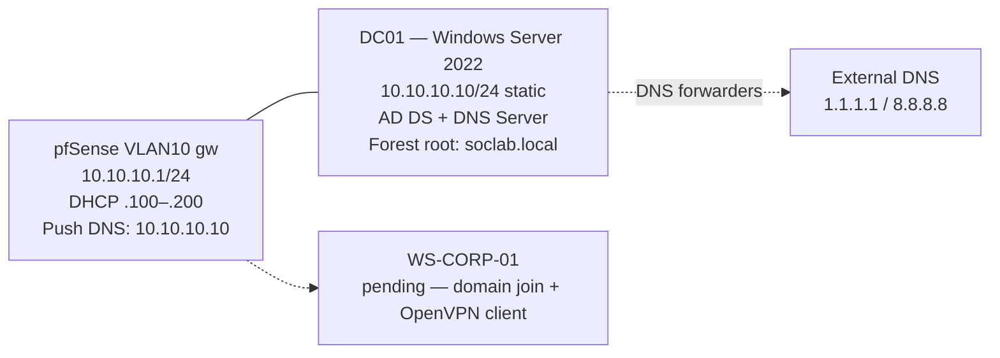

# Phase 3 — VLAN 10 (Corporate Environment)
 
## Overview
 
VLAN 10 is the corporate trust zone. The phase deploys the identity layer that the rest of the lab relies on: a Windows Server 2022 Domain Controller running Active Directory Domain Services as the root of the `soclab.local` forest, with integrated DNS, an organizational unit structure that mirrors a small-company corporate hierarchy, and a non-administrative user account that will serve as the day-to-day identity for subsequent attack and detection scenarios. 
 
The corporate workstation (`WS-CORP-01`) and its OpenVPN client validation are added to this document as a continuation; this version covers the identity layer only.
 
---
 
## Architecture
 

 
The DC is the only host in VLAN 10 with a static IP and is the only host that holds the DNS Server role. All other VLAN 10 hosts receive their IP via DHCP from pfSense and their DNS resolver via the DHCP push option, ensuring all domain queries route through DC01 before being forwarded externally.
 
---
 
## Deployment
 
### Windows Server 2022 VM provisioning
 
The `WinSrv2022` VM was created in VirtualBox with one virtual NIC attached to the `vbox-vlan10-corp` Internal Network. The intent is that the DC is reachable only from inside VLAN 10 — there is no admin shortcut from the host or from any other VLAN.
 
| Resource | Value |
| -------- | ----- |
| vCPU     | 2 |
| RAM      | 4 GB |
| Disk     | 60 GB, VDI, dynamically allocated |
| NIC 1    | Internal Network `vbox-vlan10-corp`, Intel PRO/1000 MT Desktop, Promiscuous Allow All |
| Audio    | Disabled |
| USB      | Disabled |
| Boot order | Optical → Hard Disk |
 
### Windows Server 2022 installation
 
Windows Server 2022 was installed from the Microsoft Evaluation Center ISO using the **Standard (Desktop Experience)** edition. The Server Core variant was considered and rejected: while it has a smaller attack surface and lower resource footprint, Active Directory administration via PowerShell-only is a productivity tax that adds no learning value for a SOC L1 portfolio. Desktop Experience matches what an analyst encounters in most mid-tier corporate environments.
 
A custom install on the unpartitioned 60 GB disk was performed. The installer auto-created the standard partition layout. After the final reboot, an Administrator password was set and the VM logged in for the first time as the local Administrator.
 
### Hostname, static IP, and connectivity baseline
 
The default Windows hostname (`WIN-XXXXXXX`) was renamed to `DC01` via System Properties → Change. A reboot was triggered to apply.
 
The Ethernet adapter was switched from DHCP to a static IPv4 configuration through Settings → Network & Internet:
 
| Setting          | Value           |
| ---------------- | --------------- |
| IP address       | `10.10.10.10`   |
| Subnet prefix    | `24`            |
| Gateway          | `10.10.10.1`    |
| Preferred DNS    | `10.10.10.10`   |
| Alternate DNS    | (none)          |
 
The DNS server was configured to point at the host itself. This is the standard Domain Controller pattern — the DC is its own primary DNS resolver because the AD DS role installs and depends on the local DNS Server. Using the static IP (`10.10.10.10`) rather than `127.0.0.1` is preferred because it is consistent with the pattern used in multi-DC environments, where DCs point at each other's real IPs.
 
Connectivity was validated before any role installation:
 
| Test                    | Expected result      |
| ----------------------- | -------------------- |
| `ping 10.10.10.1`       | Replies (pfSense gw) |
| `ping 8.8.8.8`          | Replies (NAT egress) |
| `Resolve-DnsName google.com` | Failure — expected, the local DNS server does not yet exist |
 
The DNS failure was the explicit expected state — DC01's resolver points to itself, but the DNS Server role is not yet installed. The error confirms that the network path is correct and that DC01 is not silently falling back to an upstream resolver.
 
### Active Directory Domain Services role installation
 
From Server Manager → Manage → Add Roles and Features, the **Active Directory Domain Services** role was selected. The dependency dialog ("Add features that are required for AD DS?") was accepted, pulling in the AD DS management tools and Group Policy Management Console. No additional features were selected.
 
The installation completed without errors. At this stage the role binaries are present, but the server is not yet a domain controller — that requires explicit promotion.
 
### Domain Controller promotion — soclab.local forest
 
The yellow alert flag in Server Manager indicated "Configuration required for Active Directory Domain Services" and offered **Promote this server to a domain controller** as the action. The promotion wizard was completed with these parameters:
 
| Setting                              | Value                  |
| ------------------------------------ | ---------------------- |
| Deployment operation                 | Add a new forest       |
| Root domain name                     | `soclab.local`         |
| Forest functional level              | Windows Server 2016    |
| Domain functional level              | Windows Server 2016    |
| Domain Name System (DNS) server      | Enabled                |
| Global Catalog (GC)                  | Enabled (required for first DC) |
| Read-only domain controller (RODC)   | Disabled               |
| DSRM password                        | Set (recorded externally) |
| NetBIOS domain name                  | `SOCLAB`               |
| Paths (NTDS, SYSVOL, LOG)            | Defaults               |
 
The forest functional level was set to **Windows Server 2016**, which is the highest level offered by the wizard. Microsoft did not introduce new functional levels with Server 2019 or 2022 — Server 2016 remains the modern baseline. The level is permanent once set; it can be raised later but never lowered.
 
The Directory Services Restore Mode (DSRM) password is the credential required to boot the DC into the recovery mode used to repair a corrupted AD database. It is separate from the Administrator password and is rarely used, but losing it means losing the ability to recover the DC if AD ever breaks. Both passwords are recorded externally in a credential store.
 
The prerequisites check completed with two warnings:
 
- A delegation for this DNS server cannot be created — expected in a standalone lab without a parent DNS authority. Documented under Troubleshooting #1.
- Cryptography compatibility warnings related to the use of CNG keys — informational, no action required at lab scale.
The server reboot at the end of the promotion completed the transformation into a Domain Controller.
 
### Post-promotion verification
 
After the post-promotion reboot, the login screen presented `SOCLAB\Administrator` rather than the previous local administrator — confirmation that the local account had been migrated to the new domain. PowerShell tests confirmed identity, DNS, and time services were operational:
 
| Test                              | Expected                              | Observed |
| --------------------------------- | ------------------------------------- | -------- |
| `$env:USERDOMAIN`                 | `SOCLAB`                              | ✓        |
| `$env:USERDNSDOMAIN`              | `soclab.local`                        | ✓        |
| `Resolve-DnsName soclab.local`    | Returns DC01's IP                     | ✓        |
| `Resolve-DnsName dc01.soclab.local` | Returns `10.10.10.10`               | ✓        |
| `Resolve-DnsName google.com`      | Returns external IP via DNS forwarders | ✓        |
| `w32tm /query /status`            | Source: pool.ntp.org or similar       | ✓        |
 
`Active Directory Users and Computers` (ADUC) was opened from Server Manager → Tools. The domain `soclab.local` appeared with the default container set (`Builtin`, `Computers`, `Domain Controllers`, `Users`, etc.). DC01 was correctly listed under the `Domain Controllers` OU.
 
### OU structure and corporate user
 
The default AD container layout is functional but flat; for any structure that mirrors a small corporate environment, a dedicated OU hierarchy is needed. The following structure was created under `soclab.local`:
 
```
soclab.local
└── Corporate
    ├── Users
    ├── Workstations
    └── Servers
```
 
Each OU was created with the **Protect container from accidental deletion** flag enabled to prevent fat-finger removal in ADUC.
 
A first non-administrative user was created in `Corporate/Users`:
 
| Attribute            | Value           |
| -------------------- | --------------- |
| First name           | David           |
| Last name            | Bandarica       |
| Full name            | David Bandarica |
| User logon name      | `dbandarica`    |
| Pre-Windows 2000 logon | `dbandarica`  |
| Password             | Set (recorded externally) |
| User must change password at next logon | Disabled |
| Password never expires | Enabled (lab convenience; would be a security finding in production) |
| Job title (notes)    | IT Support      |
 
This user account will be used to validate domain join from `WS-CORP-01` and as the day-to-day identity for subsequent attack/detection scenarios. It is intentionally not a member of any privileged group — domain attacks that target standard users are far more representative of real-world incident response than attacks that start with `Domain Admin` credentials in hand.
 
### pfSense DHCP modification — DNS push to clients
 
By default, the pfSense DHCP server for VLAN 10 advertises the same DNS servers as those configured globally on pfSense itself (`1.1.1.1` and `8.8.8.8`). Workstations receiving leases from this scope would not be able to resolve `_ldap._tcp.soclab.local` and other AD SRV records required for domain join.
 
Under `Services → DHCP Server → VLAN10`, the `DNS Servers` field was set to:
 
| Position | Value         |
| -------- | ------------- |
| Primary  | `10.10.10.10` |
| Secondary | (blank)      |
 
Save → Apply Changes. From this point on, any new DHCP lease in VLAN 10 advertises DC01 as the primary DNS resolver. The DC itself uses DNS forwarders (configured automatically during the AD DS promotion) to handle external queries — workstations therefore get full internet name resolution via DC01 without any additional configuration.
 
A fallback DNS server was deliberately left blank rather than set to `1.1.1.1`: a workstation that fails to resolve via the DC should fail visibly, not silently fall back to an external resolver. Silent fallback would mask broken AD records and make troubleshooting harder during attack scenarios in later phases.
 
---
 
## Validation — Identity Services Tests
 
The following tests were executed on DC01 after the OU and user setup, confirming the identity layer is operational end-to-end:
 
### Domain membership and identity
 
```powershell
$env:USERDOMAIN          # SOCLAB
$env:USERDNSDOMAIN       # soclab.local
$env:LOGONSERVER         # \\DC01
whoami                   # SOCLAB\Administrator
```
 
### DNS resolution
 
```powershell
Resolve-DnsName soclab.local                   # 10.10.10.10
Resolve-DnsName dc01.soclab.local              # 10.10.10.10
Resolve-DnsName _ldap._tcp.soclab.local -Type SRV   # DC01.soclab.local port 389
Resolve-DnsName google.com                      # external IP via DC forwarders
```
 
The `_ldap._tcp.soclab.local` SRV record is the critical one — its presence and correctness is what allows any future Windows client in VLAN 10 to discover the DC during domain join, and it is the canonical "AD is healthy" smoke test in production.
 
### AD object enumeration
 
```powershell
Get-ADUser -Filter * -SearchBase "OU=Users,OU=Corporate,DC=soclab,DC=local"
Get-ADOrganizationalUnit -Filter * | Select Name, DistinguishedName
```
 
The first command returned `dbandarica` as the only user object under the Corporate OU. The second returned the four OUs (`Domain Controllers`, `Corporate`, `Corporate/Users`, `Corporate/Workstations`, `Corporate/Servers`).
 
### Event log baseline
 
`Event Viewer → Applications and Services Logs → Directory Service` was scanned for errors. The only events present were the expected NTDS startup notifications and an `Event 1865` (NTDS Replication — not connecting to other DCs), which is expected when running a single DC and is not an error condition.
 
---
 
## Troubleshooting & Lessons Learned
 
### 1. DNS delegation warning during DC promotion
 
The promotion wizard's prerequisites check displayed a warning:
 
> "A delegation for this DNS server cannot be created because the authoritative parent zone cannot be found or it does not run Windows DNS server. If you are integrating with an existing DNS infrastructure, you should manually create a delegation to this DNS server in the parent zone to ensure reliable name resolution from outside the domain soclab.local."
 
The methodology was to evaluate whether this warning was actionable in the current architecture:
 
| Question | Answer |
| --- | --- |
| Is there a parent DNS authority for the `local` TLD? | No — `.local` is a private TLD, no global authority exists |
| Will external hosts ever need to resolve `soclab.local`? | No — the lab is closed; nothing outside it queries the domain |
| Could the warning indicate a real configuration problem? | No — it is informational only and appears on every standalone-forest promotion |
 
**Conclusion:** the warning was acknowledged and the promotion proceeded. The warning is documented here because every reader reproducing this lab will see it, and a SOC analyst needs to be able to distinguish between an informational message that universally appears and an actual misconfiguration. The two often look identical at first glance.
 
### 2. Domain TLD selection — `.local` retained despite mDNS warning
 
The pfSense Setup Wizard (Phase 2) warned against the use of `.local` as the domain TLD because mDNS protocols (Avahi, Bonjour, AirPrint, Windows Network Discovery on some configurations) claim that namespace. The lab domain was nonetheless set to `soclab.local`. The decision is recorded as a deliberate exception with the following reasoning:
 
- The lab contains only Windows and Linux endpoints. No macOS, iOS, or other aggressively-mDNS-claiming devices are present or planned.
- The downstream tooling (Wazuh agents, Sysmon, AD-integrated services) does not interact with mDNS in any way that would create a conflict with `.local`.
- The historical convention for AD lab environments has been `.local`, and using it produces documentation that matches what most public AD attack/defense write-ups reference (e.g., `corp.local`, `lab.local`).
**Trade-off accepted:** if a macOS or iOS device is ever added to the lab — for example, for a mobile-attack scenario in a later phase — name resolution conflicts may surface, and the lab domain would be re-evaluated at that point. The decision is reversible only by rebuilding AD from scratch; this risk is accepted for the current scope.
 
The conservative alternatives (`.internal`, `.lan`, `.home.arpa`) would be the correct choice for any environment that might include mDNS-aware devices.
 
---
 
## Result
 
- Windows Server 2022 Standard (Desktop Experience) deployed as `DC01` on VLAN 10 with static IP `10.10.10.10/24`.
- Active Directory Domain Services role installed and the server promoted to be the first Domain Controller of the new forest `soclab.local`.
- Forest and domain functional levels set to Windows Server 2016 (the current maximum).
- DC01 runs the Windows DNS Server role for `soclab.local`, with external DNS forwarders to `1.1.1.1` and `8.8.8.8` for internet name resolution.
- AD SRV records (`_ldap._tcp.soclab.local`, etc.) registered and resolvable.
- Time synchronization operational via external NTP.
- OU hierarchy created: `Corporate / Users`, `Corporate / Workstations`, `Corporate / Servers`, all with accidental-deletion protection.
- First non-administrative domain user `dbandarica` (David Bandarica, IT Support) created under `Corporate/Users`.
- pfSense DHCP scope for VLAN 10 reconfigured to advertise `10.10.10.10` as the primary DNS server. New DHCP leases on VLAN 10 will automatically resolve the domain.
- Snapshot `dc01-baseline` captured in VirtualBox before any subsequent workstation join.
---
 
## Screenshots
 
| Screenshot | Description |
| ---------- | ----------- |
|  | Server Manager showing AD DS role installed before promotion |
|  | Promotion wizard — "Add a new forest" with `soclab.local` |
|  | Forest/domain functional level Windows Server 2016, DNS + GC enabled |
|  | Prerequisites check showing the expected DNS delegation warning |
|  | Active Directory Users and Computers with the Corporate OU hierarchy |
|  | The `dbandarica` user under `Corporate/Users` |
|  | pfSense `Services → DHCP Server → VLAN10` with DNS push set to `10.10.10.10` |
|  | PowerShell `Resolve-DnsName _ldap._tcp.soclab.local -Type SRV` returning DC01 |
 
---
 
*Previous: [Phase 2 — Network Backbone (pfSense + OpenVPN)](01-pfsense.md)*
*Next: [Phase 4 — VLAN 20 (Software Development)](03-vlan20.md)*
 
