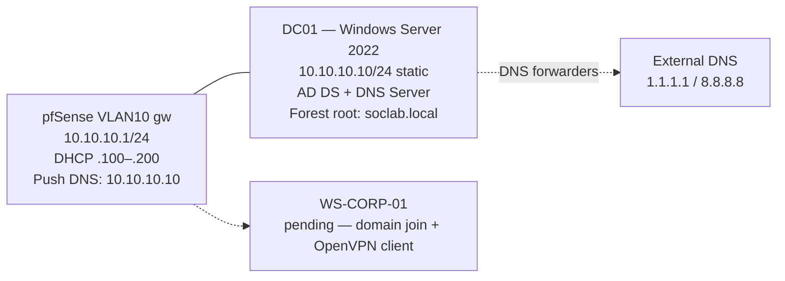

# Phase 3 — VLAN 10 (Corporate Environment)
 
## Overview
 
VLAN 10 is the corporate trust zone. The phase deploys the identity layer that the rest of the lab relies on: a Windows Server 2022 Domain Controller running Active Directory Domain Services as the root of the `soclab.local` forest, with integrated DNS, an organizational unit structure that mirrors a small-company corporate hierarchy, and a non-administrative user account that will serve as the day-to-day identity for subsequent attack and detection scenarios. 
 
The corporate workstation (`WS-CORP-01`) and its OpenVPN client validation are added to this document as a continuation; this version covers the identity layer only.
 
---
 
## Architecture
 

 
The DC is the only host in VLAN 10 with a static IP and is the only host that holds the DNS Server role. All other VLAN 10 hosts receive their IP via DHCP from pfSense and their DNS resolver via the DHCP push option, ensuring all domain queries route through DC01 before being forwarded externally.
 
---
 
## Deployment
 
### Windows Server 2022 VM provisioning
 
The `SOC-10-AD` VM was created in VirtualBox with one virtual NIC attached to the `vbox-vlan10-corp` Internal Network. The intent is that the DC is reachable only from inside VLAN 10 — there is no admin shortcut from the host or from any other VLAN.
 
| Resource | Value |
| -------- | ----- |
| vCPU     | 2 |
| RAM      | 4 GB |
| Disk     | 60 GB |
| NIC 1    | Internal Network `internal-vlan10-corp`, Intel PRO/1000 MT Desktop, Promiscuous Allow All |
 
### Hostname, static IP, and connectivity baseline
 
The default Windows hostname (`WIN-5514TB2`) was renamed to `DC01` via System Properties → Change. 
 
The Ethernet adapter was switched from DHCP to a static IPv4 configuration through ncpa.cpl, Ethernet -> Properties -> Internet Protocol Version 4 (TCP/IPv4) :

 
The DNS server was configured to point at the host itself. This is the standard Domain Controller pattern — the DC is its own primary DNS resolver because the AD DS role installs and depends on the local DNS Server. Using the static IP (`10.10.10.10`) rather than `127.0.0.1` is preferred because it is consistent with the pattern used in multi-DC environments, where DCs point at each other's real IPs.
 
Connectivity was validated before any role installation:
 
| Test                    | Expected result      |
| ----------------------- | -------------------- |
| `ping 10.10.10.1`       | Replies (pfSense gw) |
| `ping 8.8.8.8`          | Replies (NAT egress) |

 
 
### Active Directory Domain Services role installation
 
From Server Manager → Manage → Add Roles and Features, the **Active Directory Domain Services** role was selected. 
 
The installation completed without errors. At this stage the role binaries are present, but the server is not yet a domain controller — that requires explicit promotion.
 
### Domain Controller promotion — soclab.local forest
 
The yellow alert flag in Server Manager indicated "Configuration required for Active Directory Domain Services" and offered **Promote this server to a domain controller** as the action. The promotion wizard was completed with these parameters:
 
| Setting                              | Value                  |
| ------------------------------------ | ---------------------- |
| Deployment operation                 | Add a new forest       |
| Root domain name                     | `soclab.local`         |
| Forest functional level              | Windows Server 2016    |
| Domain functional level              | Windows Server 2016    |
| Domain Name System (DNS) server      | Enabled                |
| Global Catalog (GC)                  | Enabled (required for first DC) |
| Read-only domain controller (RODC)   | Disabled               |
| DSRM password                        | Set (recorded externally) |
| NetBIOS domain name                  | `SOCLAB`               |
| Paths (NTDS, SYSVOL, LOG)            | Defaults               |
 
The forest functional level was set to **Windows Server 2016**, which is the highest level offered by the wizard. Microsoft did not introduce new functional levels with Server 2019 or 2022 — Server 2016 remains the modern baseline.
 
### Post-promotion verification
 
After the post-promotion reboot, the login screen presented `SOCLAB\Administrator` rather than the previous local administrator — confirmation that the local account had been migrated to the new domain. PowerShell tests confirmed identity, DNS, and time services were operational:
 

 
`Active Directory Users and Computers` (ADUC) was opened from Server Manager → Tools. The domain `soclab.local` appeared with the default container set (`Builtin`, `Computers`, `Domain Controllers`, `Users`, etc.). DC01 was correctly listed under the `Domain Controllers` OU.
 
### OU structure and corporate user
 
The default AD container layout is functional but flat; for any structure that mirrors a small corporate environment, a dedicated OU hierarchy is needed. A first non-administrative user was created in `Corporate/Users`: The following structure was created under `soclab.local`: 
 

 
Each OU was created with the **Protect container from accidental deletion** flag enabled to prevent fat-finger removal in ADUC.
 
This user account will be used to validate domain join from `WS-CORP-01` and as the day-to-day identity for subsequent attack/detection scenarios. It is intentionally not a member of any privileged group — domain attacks that target standard users are far more representative of real-world incident response than attacks that start with `Domain Admin` credentials in hand.
 
### pfSense DHCP modification — DNS push to clients
 
By default, the pfSense DHCP server for VLAN 10 advertises the same DNS servers as those configured globally on pfSense itself (`1.1.1.1` and `8.8.8.8`). Workstations receiving leases from this scope would not be able to resolve `_ldap._tcp.soclab.local` and other AD SRV records required for domain join.
 
Under `Services → DHCP Server → VLAN10`, the `DNS Servers` field was set to:
 

 
Save → Apply Changes. From this point on, any new DHCP lease in VLAN 10 advertises DC01 as the primary DNS resolver. The DC itself uses DNS forwarders (configured automatically during the AD DS promotion) to handle external queries — workstations therefore get full internet name resolution via DC01 without any additional configuration.
 
---
 
## Troubleshooting & Lessons Learned
 
 
---
 
## Result
 
- Windows Server 2022 Standard (Desktop Experience) deployed as `DC01` on VLAN 10 with static IP `10.10.10.10/24`.
- Active Directory Domain Services role installed and the server promoted to be the first Domain Controller of the new forest `soclab.local`.
- Forest and domain functional levels set to Windows Server 2016 (the current maximum).
- DC01 runs the Windows DNS Server role for `soclab.local`, with external DNS forwarders to `1.1.1.1` and `8.8.8.8` for internet name resolution.
- AD SRV records (`_ldap._tcp.soclab.local`, etc.) registered and resolvable.
- Time synchronization operational via external NTP.
- OU hierarchy created: `Corporate / Users`, `Corporate / Workstations`, `Corporate / Servers`, all with accidental-deletion protection.
- First non-administrative domain user `dbandarica` (David Bandarica, IT Support) created under `Corporate/Users`.
- pfSense DHCP scope for VLAN 10 reconfigured to advertise `10.10.10.10` as the primary DNS server. New DHCP leases on VLAN 10 will automatically resolve the domain.
- Snapshot `dc01-baseline` captured in VirtualBox before any subsequent workstation join.

---
 
*Previous: [Phase 1 — Network Backbone (pfSense + OpenVPN)](01-pfsense.md)*
*Next: [Phase 3 — VLAN 20 (Software Development)](03-vlan20.md)*
 
