# Phase 3 — VLAN 10 (Corporate Environment)
 
## Overview
 
VLAN 10 is the corporate trust zone. The phase deploys the identity layer that the rest of the lab relies on: a Windows Server 2022 Domain Controller running Active Directory Domain Services as the root of the `soclab.local` forest, with integrated DNS, an organizational unit structure that mirrors a small-company corporate hierarchy, and a non-administrative user account that will serve as the day-to-day identity for subsequent attack and detection scenarios  and the validated OpenVPN client path from VLAN 10 to VLAN 20, completing the authenticated crossing between the two trust zones
 
---
 
## Architecture
 
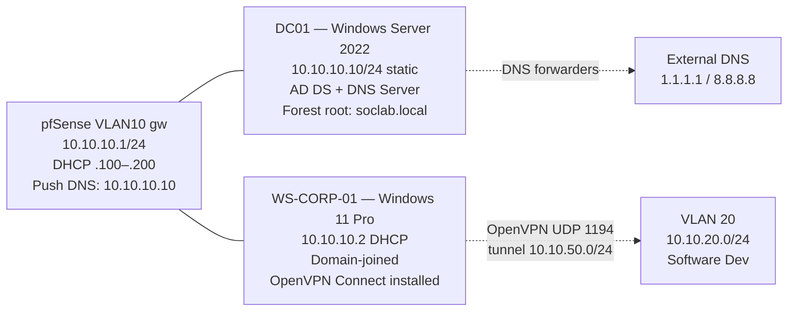
 
The DC is the only host in VLAN 10 with a static IP and is the only host that holds the DNS Server role. All other VLAN 10 hosts receive their IP via DHCP from pfSense and their DNS resolver via the DHCP push option, ensuring all domain queries route through DC01 before being forwarded externally.
 
---
 
## Deployment
 
### Windows Server 2022 VM provisioning
 
The `SOC-10-AD` VM was created in VirtualBox with one virtual NIC attached to the `vbox-vlan10-corp` Internal Network. The intent is that the DC is reachable only from inside VLAN 10 — there is no admin shortcut from the host or from any other VLAN.
 
| Resource | Value |
| -------- | ----- |
| vCPU     | 2 |
| RAM      | 4 GB |
| Disk     | 60 GB |
| NIC 1    | Internal Network `internal-vlan10-corp`, Intel PRO/1000 MT Desktop, Promiscuous Allow All |
 
### Hostname, static IP, and connectivity baseline
 
The default Windows hostname (`WIN-5514TB2`) was renamed to `DC01` via System Properties → Change. 
 
The Ethernet adapter was switched from DHCP to a static IPv4 configuration through ncpa.cpl, Ethernet -> Properties -> Internet Protocol Version 4 (TCP/IPv4) :

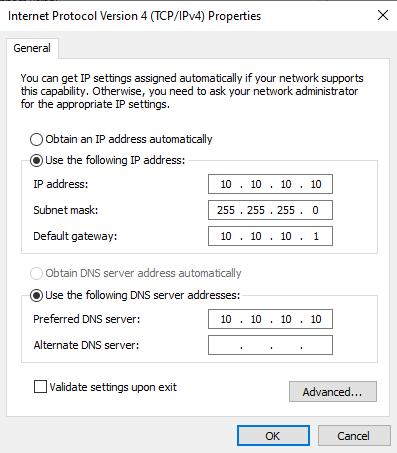
 
The DNS server was configured to point at the host itself. This is the standard Domain Controller pattern — the DC is its own primary DNS resolver because the AD DS role installs and depends on the local DNS Server. Using the static IP (`10.10.10.10`) rather than `127.0.0.1` is preferred because it is consistent with the pattern used in multi-DC environments, where DCs point at each other's real IPs.
 
Connectivity was validated before any role installation:
 
| Test                    | Expected result      |
| ----------------------- | -------------------- |
| `ping 10.10.10.1`       | Replies (pfSense gw) |
| `ping 8.8.8.8`          | Replies (NAT egress) |

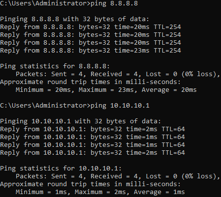
 
 
### Active Directory Domain Services role installation
 
From Server Manager → Manage → Add Roles and Features, the **Active Directory Domain Services** role was selected. 
 
The installation completed without errors. At this stage the role binaries are present, but the server is not yet a domain controller — that requires explicit promotion.
 
### Domain Controller promotion — soclab.local forest
 
The yellow alert flag in Server Manager indicated "Configuration required for Active Directory Domain Services" and offered **Promote this server to a domain controller** as the action. The promotion wizard was completed with these parameters:
 
| Setting                              | Value                  |
| ------------------------------------ | ---------------------- |
| Deployment operation                 | Add a new forest       |
| Root domain name                     | `soclab.local`         |
| Forest functional level              | Windows Server 2016    |
| Domain functional level              | Windows Server 2016    |
| Domain Name System (DNS) server      | Enabled                |
| Global Catalog (GC)                  | Enabled (required for first DC) |
| Read-only domain controller (RODC)   | Disabled               |
| DSRM password                        | Set (recorded externally) |
| NetBIOS domain name                  | `SOCLAB`               |
| Paths (NTDS, SYSVOL, LOG)            | Defaults               |
 
The forest functional level was set to **Windows Server 2016**, which is the highest level offered by the wizard. Microsoft did not introduce new functional levels with Server 2019 or 2022 — Server 2016 remains the modern baseline.
 
### Post-promotion verification
 
After the post-promotion reboot, the login screen presented `SOCLAB\Administrator` rather than the previous local administrator — confirmation that the local account had been migrated to the new domain. PowerShell tests confirmed identity, DNS, and time services were operational:
 
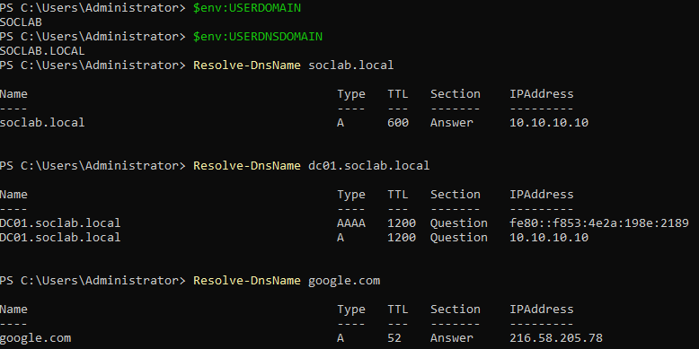
 
`Active Directory Users and Computers` (ADUC) was opened from Server Manager → Tools. The domain `soclab.local` appeared with the default container set (`Builtin`, `Computers`, `Domain Controllers`, `Users`, etc.). DC01 was correctly listed under the `Domain Controllers` OU.
 
### OU structure and corporate user
 
The default AD container layout is functional but flat; for any structure that mirrors a small corporate environment, a dedicated OU hierarchy is needed. A first non-administrative user was created in `Corporate/Users`: The following structure was created under `soclab.local`: 
 
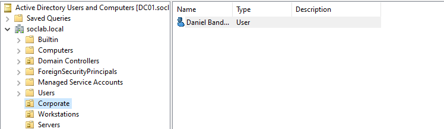
 
Each OU was created with the **Protect container from accidental deletion** flag enabled to prevent fat-finger removal in ADUC.
 
This user account will be used to validate domain join from `WS-CORP-01` and as the day-to-day identity for subsequent attack/detection scenarios. It is intentionally not a member of any privileged group — domain attacks that target standard users are far more representative of real-world incident response than attacks that start with `Domain Admin` credentials in hand.
 
### pfSense DHCP modification — DNS push to clients
 
By default, the pfSense DHCP server for VLAN 10 advertises the same DNS servers as those configured globally on pfSense itself (`1.1.1.1` and `8.8.8.8`). Workstations receiving leases from this scope would not be able to resolve `_ldap._tcp.soclab.local` and other AD SRV records required for domain join.
 
Under `Services → DHCP Server → VLAN10`, the `DNS Servers` field was set to:
 
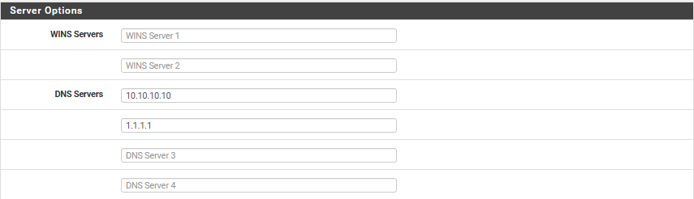
 
Save → Apply Changes. From this point on, any new DHCP lease in VLAN 10 advertises DC01 as the primary DNS resolver. The DC itself uses DNS forwarders (configured automatically during the AD DS promotion) to handle external queries — workstations therefore get full internet name resolution via DC01 without any additional configuration.

### Windows 11 Pro VM provisioning

A `SOC-10-WinCorp` VM was created in VirtualBox with one virtual NIC attached to the same `internal-vlan10-corp` Internal Network as DC01. 
 
| Resource | Value |
| -------- | ----- |
| vCPU     | 2 |
| RAM      | 4 GB |
| Disk     | 60 GB |

### Windows 11 installation with OOBE 25H2 local-account workaround

Windows 11 Pro was installed from the Microsoft download ISO using the **Custom: Install Windows only** option on the full unpartitioned disk. The installation completed without unusual events. 

After the install completed and desktop loaded, `ipconfig` on CMD confirmed the DHCP lease and the DNS push from pfSense were both working as expected:

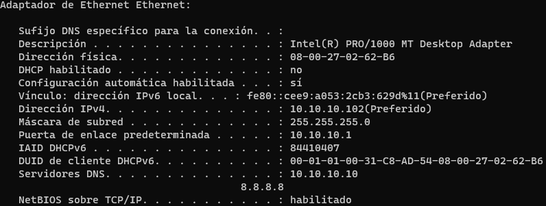

The DNS field confirms end-to-end that the DHCP DNS-push change from the previous section took effect — the workstation will resolve `soclab.local` SRV records correctly during the upcoming domain join, with no manual override needed.

### Domain join — WS-CORP-01 to soclab.local

Via `System Properties → Computer Name → Change`, the workstation was renamed and joined to the domain in a single operation:

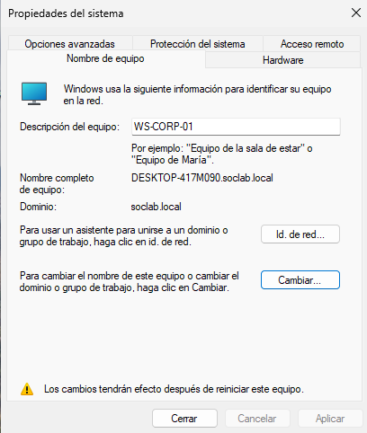

After the reboot, the credentials `SOCLAB\dbandarica` were used to log in interactively. For the validation, I used the following commands in CMD:

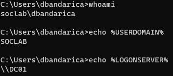

### OpenVPN Connect installation and profile import

The `.ovpn` profile exported during Phase 01 pfSense was downloaded directly inside Win11-Corp by browsing to `https://10.10.10.1` (the pfSense VLAN 10 gateway), authenticating to the pfSense administrator account, and navigating to `VPN → OpenVPN → Client Export → vpn-corp-user → Inline Configurations → Most Clients`. 
 
The OpenVPN Connect client for Windows was downloaded from `https://openvpn.net/client/` and installed with default options. After installation, the client was launched and the previously downloaded `.ovpn` file was imported via `Import Profile → File`. The profile was added to the client and was visible in the profile list, ready to connect, with no active traffic.

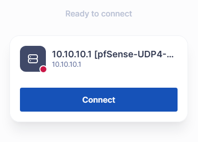

### OpenVPN tunnel — establishment and routing

From the OpenVPN Connect client on `WS-CORP-01`, the imported profile was activated. The client transitioned through `CONNECTING → AUTHENTICATING → CONNECTED`. The status pane displayed:

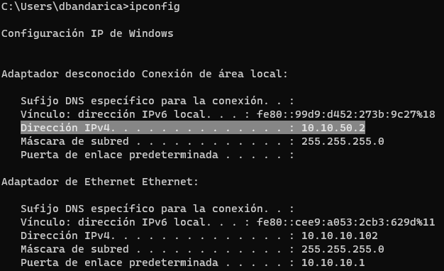

This single test validates the entire tunnel chain end-to-end:

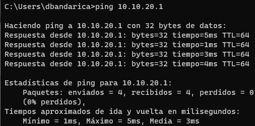

  - The TLS handshake established the tunnel successfully (otherwise the client would not be `CONNECTED`).
  - pfSense received the encapsulated packet, decrypted it, evaluated it against the `Firewall → Rules → OpenVPN` rule (allowing `10.10.50.0/24 → 10.10.20.0/24`), and forwarded it to its VLAN 20 interface.
  - The VLAN 20 gateway interface (`10.10.20.1`) responded.

A route `10.10.20.0    255.255.255.0    10.10.50.1` was visible — the pushed route from the OpenVPN server is correctly installed in the local routing table.

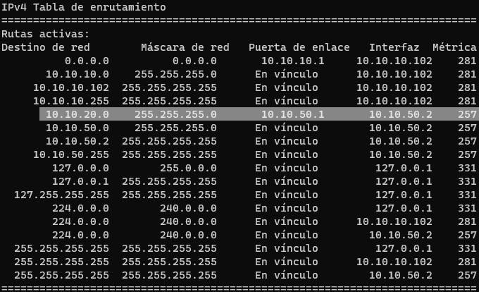

---
 
## Troubleshooting & Lessons Learned

### 1. OpenVPN credentials are local to pfSense, not Active Directory
 
When importing the `.ovpn` profile into OpenVPN Connect, the natural first attempt was to authenticate with `dbandarica` and the AD password used earlier for the Windows login. This failed with "Authentication failure". 
 
The OpenVPN server was configured during Phase 01 pfSense to authenticate against pfSense's own user database, not against AD via LDAP or RADIUS. This means the credential namespace for VPN access is entirely separate from the credential namespace for domain login.
 
**Solution:** the `vpn-corp-user` credentials created during Phase 01 pfSense were used. Authentication succeeded.
 
**Why this design matters:** VPN auth being separate from domain auth is a defensible architectural decision.
 
- **Local Database (current setup):** simpler, decoupled from AD outages — if AD goes down, the VPN keeps working, which is useful for remote IT staff during an AD incident. The downside is having two credential sets per user.
The lab uses Local Database for clarity and incident-time resilience. A future iteration could swap in RADIUS integration as a deliberate learning exercise.
 
---
 
## Result
 
- Windows Server 2022 Standard (Desktop Experience) deployed as `DC01` on VLAN 10 with static IP `10.10.10.10/24`.
- Active Directory Domain Services role installed and the server promoted to be the first Domain Controller of the new forest `soclab.local`.
- Forest and domain functional levels set to Windows Server 2016 (the current maximum).
- DC01 runs the Windows DNS Server role for `soclab.local`, with external DNS forwarders to `1.1.1.1` and `8.8.8.8` for internet name resolution.
- OU hierarchy created: `Corporate / Users`, `Corporate / Workstations`, `Corporate / Servers`, all with accidental-deletion protection.
- First non-administrative domain user `dbandarica` (Daniel Bandarica, IT Support) created under `Corporate/Users`.
- pfSense DHCP scope for VLAN 10 reconfigured to advertise `10.10.10.10` as the primary DNS server. New DHCP leases on VLAN 10 automatically resolve the domain.
- Windows 11 Pro deployed as `WS-CORP-01`, joined to `soclab.local`, computer object moved to `Corporate/Workstations`.
- Interactive login as `SOCLAB\dbandarica` validated; `whoami`, `$env:LOGONSERVER`, and `gpresult` confirm full domain participation.
- OpenVPN Connect installed on `WS-CORP-01`; `.ovpn` profile imported and authenticated with `vpn-corp-user` credentials.
- OpenVPN tunnel established end-to-end: client `CONNECTED`, virtual IP allocated from `10.10.50.0/24`, pushed route to `10.10.20.0/24` installed in the local routing table, `ping 10.10.20.1` succeeded through the tunnel.
- pfSense `Status → OpenVPN` confirms the active session with timestamps and bytes counter; logs show the full authentication chain.

---
 
*Previous: [Phase 1 — Network Backbone (pfSense + OpenVPN)](01-pfsense.md)*
*Next: [Phase 3 — VLAN 20 (Software Development)](03-vlan20.md)*
 
