# Phase 3 — VLAN 20 (Software Development)
 
## Overview
 
VLAN 20 is the Software Development trust zone, kept deliberately separate from the corporate domain in VLAN 10. The phase deploys two endpoints that represent a realistic small-team dev environment: one Windows 11 Pro workstation (`WS-DEV-01`) running as a workgroup member with RDP enabled, and one Ubuntu Desktop 24.04 workstation (`ws-dev-02`) with OpenSSH and a local host firewall.
 
Neither endpoint is joined to the `soclab.local` Active Directory domain. This is the architectural enforcement of the trust-zone separation designed in Phase 0 and implemented in Phase 2: domain credentials from VLAN 10 do not give access to VLAN 20 by themselves, and the only sanctioned crossing remains the OpenVPN tunnel from `WS-CORP-01`. The end-to-end validation of that tunnel — established but never fully tested in Phase 2 VLAN10 because no real VLAN 20 host existed yet — is completed in this phase.
 
The two endpoints are owned by two different developer identities introduced as ficticious lab personas: `khernandez` (Kevin Hernandez, Windows developer) and `arodriguez` (Ana Rodriguez, Linux developer).
 
---
 
## Architecture
 
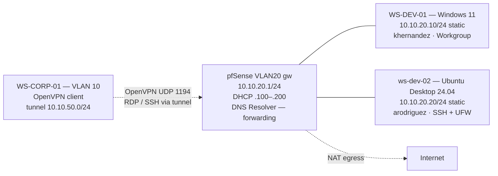
 
The two endpoints sit on a flat L2 segment with no host between them and the gateway. All inter-VLAN traffic is mediated by pfSense; the only path from VLAN 10 to VLAN 20 is the OpenVPN tunnel terminated on pfSense. There is no AD, no shared kerberos realm, no SMB share, no shared credentials with VLAN 10 — the trust zones are isolated by both routing and identity layers.
 
---
 
## Deployment
 
### Win11-Dev VM provisioning
 
A `SOC-20-WinDev` VM was created in VirtualBox with the same Windows 11 hardware requirements as `WS-CORP-01` in Phase 2.
 
| Resource | Value |
| -------- | ----- |
| vCPU     | 2 |
| RAM      | 4 GB |
| Disk     | 60 GB |
| NIC 1    | Internal Network `internal-vlan20-dev`, Promiscuous Allow All |
 
### Win11-Dev configuration — hostname, static IP, and RDP
 
The machine name was changed to `WS-DEV-01` via `System Properties → Computer Name → Change`
 
A static IPv4 configuration was set under `Settings → Network & Internet → Ethernet → Edit IP assignment → Manual`:
 
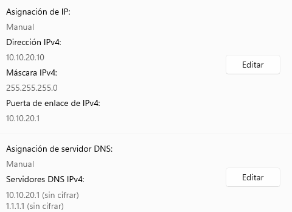
 
The DNS server points at the pfSense VLAN 20 gateway, not at DC01 in VLAN 10.
 
Remote Desktop was enabled under `Settings → System → Remote Desktop → Remote Desktop ON`, and `khernandez` was added explicitly to the `Remote Desktop users` list via the same screen. Without that addition, only the local Administrator would be permitted to RDP.
 
### Ubuntu-Dev VM provisioning
 
| Resource | Value |
| -------- | ----- |
| vCPU     | 2 |
| RAM      | 4 GB |
| Disk     | 40 GB |
| NIC 1    | Internal Network `internal-vlan20-dev`, Promiscuous Allow All |
 
### Ubuntu-Dev network configuration
 
Ubuntu Desktop's NetworkManager handles networking; the GUI configuration was used rather than direct Netplan edits to match how a real developer would change network settings on their own laptop.
 
`Settings → Network → Wired → gear icon → IPv4 tab`:
 
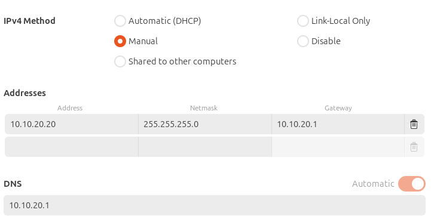
 
### Verification:

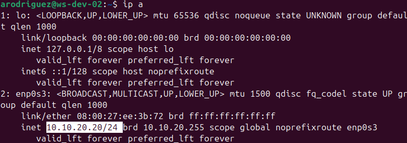 

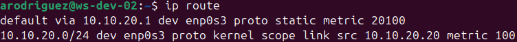

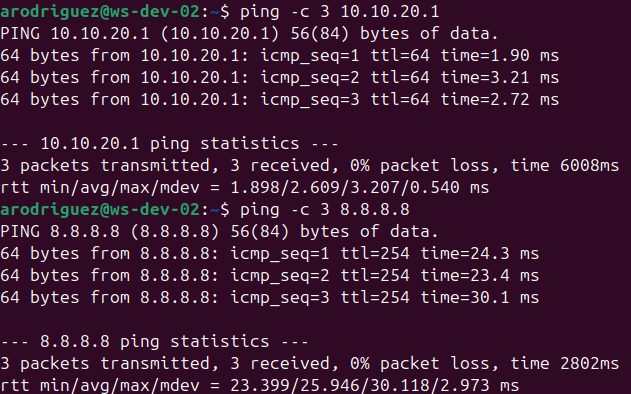
 
### pfSense — VLAN 20 firewall baseline
 
pfSense's default-deny posture on OPT interfaces means a freshly created VLAN cannot reach anything until rules are added. A single permissive Pass rule was added on `Firewall → Rules → VLAN20` to allow VLAN 20 hosts to reach the internet and the pfSense services (DNS Resolver, web GUI):
 
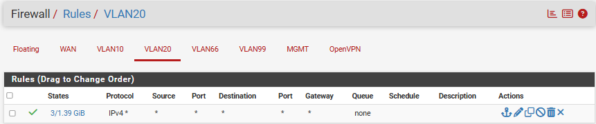
 
Inter-VLAN traffic is still denied by default at the firewall — there is no explicit Pass rule allowing VLAN 20 to reach VLAN 10, VLAN 99, or VLAN 66. 

The OpenVPN tunnel from VLAN 10 remains the only sanctioned crossing into VLAN 20, governed by the `Firewall → Rules → OpenVPN` rule created in Phase 1.
 
---
 
## Validation — Intra-VLAN, Segmentation, and OpenVPN End-to-End
 
### Intra-VLAN connectivity between the two endpoints
 
From `WS-DEV-01` (PowerShell):
 
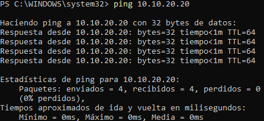
 
Both directions of intra-VLAN traffic succeed.
 
### Inter-VLAN segmentation enforcement
 
The trust-zone separation was verified by attempting to reach VLAN 10 from both endpoints:
 
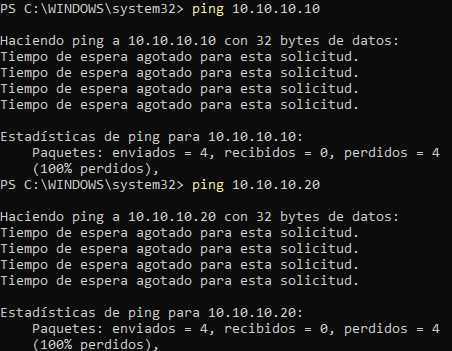
 
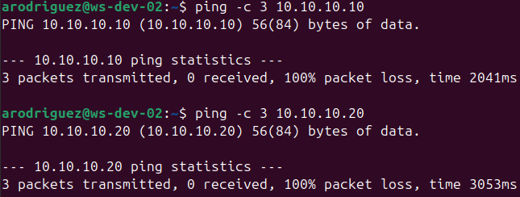
 
Both timeouts are the expected outcome and confirm that pfSense's default-deny correctly drops traffic from VLAN 20 to VLAN 10. 
 
The asymmetry is intentional: VLAN 10 → VLAN 20 is allowed only through the OpenVPN tunnel; VLAN 20 → VLAN 10 has no allowed path at all in either direction.
 
### OpenVPN end-to-end from WS-CORP-01
 
This is the validation deferred from Phase 2: the OpenVPN tunnel was established and the pushed route to `10.10.20.0/24` was confirmed, but `ping 10.10.20.10` returned timeout because no host existed at that address. With `WS-DEV-01` now live at that IP, the full chain was tested:
 
1. From `WS-CORP-01`, OpenVPN Connect was activated and the tunnel reached `CONNECTED` state.
2. `ipconfig` on `WS-CORP-01` confirmed the virtual IP in `10.10.50.0/24` and the existence of the OpenVPN Wintun adapter.
3. `ping 10.10.20.10` from `WS-CORP-01`: replies, with the latency increment that is the signature of the tunnel hop.
4. `ssh arodriguez@10.10.20.20` from a PowerShell on `WS-CORP-01` established an interactive shell into `ws-dev-02`.
All four tests succeeded. This single validation exercise confirms end-to-end every component built across Phases 1, 2, and 3:

### pfSense — audit of the validation traffic
 
While the RDP and SSH sessions were active, the pfSense GUI was inspected to confirm the corresponding events appeared in the logs:
 
- `Status → OpenVPN`: the active session for `vpn-corp-user` showed bytes counters incrementing as RDP frames and SSH keystrokes flowed.

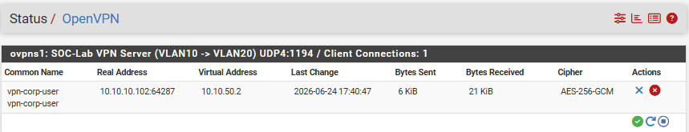
 
- `Status → System Logs → Firewall`: filtering by interface `OpenVPN`, every pass event from `10.10.50.2 → 10.10.20.10` and `10.10.50.2 → 10.10.20.20` was visible, each one timestamped, with source and destination IPs and ports.
These logs are exactly the input Wazuh will ingest in the next phase to build correlations between authenticated VPN sessions and downstream activity in the development VLAN.

 
---
 
## Troubleshooting & Lessons Learned
 
### 1. DNS Resolver hanging in recursive mode behind virtualized NAT
 
After provisioning both VLAN 20 endpoints, neither could resolve external names: `apt update` on Ubuntu-Dev hung indefinitely, `nslookup` on both clients timed out when targeting the VLAN 20 gateway as resolver, and Win11-Dev could not download applications via winget. ICMP to `10.10.20.1` and `8.8.8.8` worked from both endpoints, so basic L3 routing and NAT outbound were functional — the issue was localized to DNS.
 
The methodology was a layered probe from the client side, then a control test from pfSense itself:
 
| Test                                                  | Result                  | Layer eliminated                                       |
| ----------------------------------------------------- | ----------------------- | ------------------------------------------------------ |
| `ping 10.10.20.1` from client                         | Replies                 | L2 / L3 reachability OK                                |
| `ping 8.8.8.8` from client                            | Replies                 | NAT outbound OK                                        |
| `nslookup google.com 1.1.1.1` from client             | Resolves                | Egress on UDP/53 OK                                    |
| `nslookup google.com 10.10.20.1` from client          | Timeout                 | pfSense's DNS service not responding to this segment   |
| `Diagnostics → DNS Lookup` from the pfSense GUI       | Timeout                 | pfSense itself cannot resolve, not just a binding issue |
 
**Root cause:** By default, pfSense’s DNS Resolver (Unbound) operates in recursive mode. In this mode, it bypasses upstream servers and attempts to query the Internet's root DNS servers directly.

Because this lab environment runs nested behind a virtualized NAT layer and a residential ISP router, these direct, non-standard recursive queries to root infrastructure were actively intercepted or rate-limited by the ISP, causing the resolver to hang.

**Solution:** force Unbound into **forwarding mode** so it delegates resolution to the upstream DNS servers configured globally on pfSense (`1.1.1.1`, `8.8.8.8`) instead of querying root servers directly:
 
`Services → DNS Resolver → General Settings`.

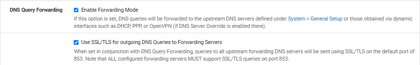
 
**Test**                                                  
 
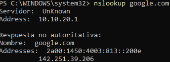

### 2. ICMP Drop via Windows Firewall Profile

**Issue Description**

During the connectivity testing phase, an ICMP echo request (ping) initiated from the OpenVPN client subnet (10.10.50.2) to a target host in VLAN20 (10.10.20.10) resulted in a Request timed out error.
Live firewall logs confirmed that the edge firewall (pfSense/OPNsense) successfully permitted the traffic under the rule Allow OpenVPN clients to reach VLAN20. However, no ICMP reply was generated by the destination host.

**Root Cause Analysis (RCA)**

The root cause was identified as an implicit security policy enforced by the Windows Defender Firewall on the destination host (10.10.20.10).

By default, the host's Network Interface Card (NIC) was assigned to the Public Network Profile. Under this profile, Windows applies a restrictive, zero-trust posture to unsolicited inbound traffic, blocking ICMPv4 echo requests originating from foreign subnets (such as the VPN tunnel network 10.10.50.0/24).

**Packet Flow & Failure Points:**

Ingress: The packet is initiated from the client machine (10.10.50.2) and encapsulated via the OpenVPN tunnel.

Firewall Inspection: The pfSense/OPNsense gateway receives the packet, matches it against the configured firewall rules, and successfully forwards it to the VLAN20 interface.

Host Ingress & Drop: The packet arrives at the target NIC (10.10.20.10). Because the interface profile is set to Public, the OS local firewall intercepts the packet and silently drops it (stealth mode), preventing any outbound echo reply from being sent back through the gateway.

**Solution & Resolution**

The issue was resolved by shifting the network location type from Public to Private on the target VM.

In a Private Profile, Windows Defender Firewall relaxes its inbound restrictions, enabling network discovery and explicitly allowing ICMPv4-In traffic from non-local subnets via the default system rules. Once the profile was updated, bi-directional network communication was fully restored.

---
 
## Result
 
- Two endpoints deployed on VLAN 20 — one Windows 11 Pro (`WS-DEV-01`, `10.10.20.10/24`, user `khernandez`) and one Ubuntu Desktop 24.04 (`ws-dev-02`, `10.10.20.20/24`, user `arodriguez`).
- Both endpoints workgroup / standalone — explicitly not joined to the `soclab.local` domain, enforcing the trust-zone separation from VLAN 10.
- RDP enabled on Win11-Dev with `khernandez` authorized as a Remote Desktop user.
- OpenSSH installed and running on Ubuntu-Dev with UFW allowing TCP/22 inbound.
- pfSense baseline rule on VLAN 20: a single Pass rule allowing VLAN20 → any (outbound to internet + pfSense services). Inter-VLAN traffic to VLAN 10/66/99 remains denied by default; segmentation is enforced.
- pfSense DNS Resolver reconfigured globally to **forwarding mode** — fixes recursive-mode failures behind virtualized NAT and unblocks name resolution for all VLANs.
- Intra-VLAN connectivity validated: ping and service-port checks succeed in both directions between WS-DEV-01 and ws-dev-02.
- Segmentation enforced: ping from either VLAN 20 host to VLAN 10 returns timeout, as expected.
- **OpenVPN tunnel validated end-to-end** for the first time: from WS-CORP-01 (Phase 3), via the OpenVPN tunnel, RDP to WS-DEV-01 succeeded and SSH to ws-dev-02 succeeded.
- pfSense logs show the corresponding firewall pass events on the OpenVPN interface during the RDP and SSH sessions — telemetry source confirmed and ready for Wazuh ingestion in the next phase.

---
 
*Previous: [Phase 2 — VLAN 10 (Corporate Environment)](02-vlan10.md)* *Next: [Phase 4 — Wazuh Deployment & Hardering (All-in-one)](/02-soc-stack/01-wazuh-manager.m)*
