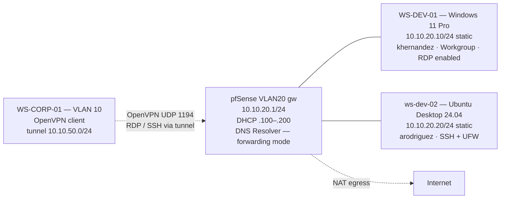

# Phase 4 — VLAN 20 (Software Development)
 
## Overview
 
VLAN 20 is the Software Development trust zone, kept deliberately separate from the corporate domain in VLAN 10. The phase deploys two endpoints that represent a realistic small-team dev environment: one Windows 11 Pro workstation (`WS-DEV-01`) running as a workgroup member with RDP enabled, and one Ubuntu Desktop 24.04 workstation (`ws-dev-02`) with OpenSSH and a local host firewall.
 
Neither endpoint is joined to the `soclab.local` Active Directory domain. This is the architectural enforcement of the trust-zone separation designed in Phase 0 and implemented in Phase 2: domain credentials from VLAN 10 do not give access to VLAN 20 by themselves, and the only sanctioned crossing remains the OpenVPN tunnel from `WS-CORP-01`. The end-to-end validation of that tunnel — established but never fully tested in Phase 2 VLAN10 because no real VLAN 20 host existed yet — is completed in this phase.
 
The two endpoints are owned by two different developer identities introduced as ficticious lab personas: `khernandez` (Kevin Hernandez, Windows developer) and `arodriguez` (Ana Rodriguez, Linux developer).
 
---
 
## Architecture
 

 
The two endpoints sit on a flat L2 segment with no host between them and the gateway. All inter-VLAN traffic is mediated by pfSense; the only path from VLAN 10 to VLAN 20 is the OpenVPN tunnel terminated on pfSense. There is no AD, no shared kerberos realm, no SMB share, no shared credentials with VLAN 10 — the trust zones are isolated by both routing and identity layers.
 
---
 
## Deployment
 
### Win11-Dev VM provisioning
 
A `SOC-20-WinDev` VM was created in VirtualBox with the same Windows 11 hardware requirements as `WS-CORP-01` in Phase 2.
 
| Resource | Value |
| -------- | ----- |
| vCPU     | 2 |
| RAM      | 4 GB |
| Disk     | 60 GB |
| NIC 1    | Internal Network `internal-vlan20-dev`, Promiscuous Allow All |
 
### Win11-Dev configuration — hostname, static IP, and RDP
 
The machine name was changed to `WS-DEV-01` via `System Properties → Computer Name → Change`
 
A static IPv4 configuration was set under `Settings → Network & Internet → Ethernet → Edit IP assignment → Manual`:
 

 
The DNS server points at the pfSense VLAN 20 gateway, not at DC01 in VLAN 10.
 
Remote Desktop was enabled under `Settings → System → Remote Desktop → Remote Desktop ON`, and `khernandez` was added explicitly to the `Remote Desktop users` list via the same screen. Without that addition, only the local Administrator would be permitted to RDP.
 
### Ubuntu-Dev VM provisioning
 
| Resource | Value |
| -------- | ----- |
| vCPU     | 2 |
| RAM      | 4 GB |
| Disk     | 40 GB |
| NIC 1    | Internal Network `internal-vlan20-dev`, Promiscuous Allow All |
 
### Ubuntu-Dev network configuration
 
Ubuntu Desktop's NetworkManager handles networking; the GUI configuration was used rather than direct Netplan edits to match how a real developer would change network settings on their own laptop.
 
`Settings → Network → Wired → gear icon → IPv4 tab`:
 

 
The connection was toggled off and on to apply the static configuration. Verification:
 
```bash
ip a                      
```


```bash
ip route                     
```


```bash
ping -c 3 10.10.20.1         
ping -c 3 8.8.8.8           
```

 
### Ubuntu-Dev — OpenSSH server and local firewall
 
OpenSSH was installed and enabled to provide a target for the OpenVPN end-to-end test later in this phase, and as the canonical remote-access path for any Linux endpoint going forward:
 
```bash
sudo apt update
sudo apt install -y openssh-server
sudo systemctl enable --now ssh
sudo systemctl status ssh    # active (running)
ss -tlnp | grep :22          # confirms sshd listening
```
 
UFW (Uncomplicated Firewall) was activated as a host-level defense-in-depth measure. Even though pfSense already controls inter-VLAN traffic, a host firewall adds an explicit allow-list at the endpoint:
 
```bash
sudo ufw allow ssh
sudo ufw enable
sudo ufw status verbose
```
 
The current UFW state allows TCP/22 inbound from any source within the VLAN and denies everything else. As the lab evolves, additional rules can be added per-service or per-source-IP.
 
### Developer tooling
 
Baseline developer tools were installed on both endpoints to make them plausible attack targets in Phase 7 (a "developer workstation with no tooling" is suspicious; a real one has a git client, a code editor, and a container runtime).
 
**On WS-DEV-01 (PowerShell as Administrator):**
 
```powershell
winget install --id Git.Git -e
winget install --id Microsoft.VisualStudioCode -e
winget install --id Docker.DockerDesktop -e
```
 
Docker Desktop's WSL2 dependency was accepted during install.
 
**On ws-dev-02 (terminal):**
 
```bash
sudo apt install -y git build-essential curl wget python3-pip python3-venv
sudo snap install --classic code
curl -fsSL https://get.docker.com | sudo sh
sudo usermod -aG docker $USER
# logout/login for the group membership to apply
```
 
Tool versions were confirmed after install:
 
```bash
git --version
python3 --version
docker --version
code --version
```
 
### pfSense — VLAN 20 firewall baseline
 
pfSense's default-deny posture on OPT interfaces means a freshly created VLAN cannot reach anything until rules are added. A single permissive Pass rule was added on `Firewall → Rules → VLAN20` to allow VLAN 20 hosts to reach the internet and the pfSense services (DNS Resolver, web GUI):
 
| Action | Source       | Destination | Protocol | Description                              |
| ------ | ------------ | ----------- | -------- | ---------------------------------------- |
| Pass   | VLAN20 net   | any         | any      | Allow VLAN20 outbound (internet + services) |
 
Inter-VLAN traffic is still denied by default at the firewall — there is no explicit Pass rule allowing VLAN 20 to reach VLAN 10, VLAN 99, or VLAN 66. The segmentation between trust zones is preserved by absence of allow rules, not by explicit Block rules. This is functionally equivalent and slightly cleaner: future scenario-specific allow rules (Phase 7) can be added without first being blocked by a higher-priority Block rule.
 
The OpenVPN tunnel from VLAN 10 remains the only sanctioned crossing into VLAN 20, governed by the `Firewall → Rules → OpenVPN` rule created in Phase 2.
 
---
 
## Validation — Intra-VLAN, Segmentation, and OpenVPN End-to-End
 
### Intra-VLAN connectivity between the two endpoints
 
From `WS-DEV-01` (PowerShell):
 
```powershell
ping 10.10.20.20                       # replies
Test-NetConnection 10.10.20.20 -Port 22 # TcpTestSucceeded : True
```
 
From `ws-dev-02` (terminal):
 
```bash
ping -c 3 10.10.20.10                  # replies
nc -zv 10.10.20.10 3389                # succeeded — RDP port open
```
 
Both directions of intra-VLAN traffic succeed, including the service-level reachability (SSH on Ubuntu, RDP on Windows) that the OpenVPN tests will later use.
 
### Inter-VLAN segmentation enforcement
 
The trust-zone separation was verified by attempting to reach VLAN 10 from both endpoints:
 
```powershell
# From WS-DEV-01
ping 10.10.10.10                       # timeout — DC01 unreachable from VLAN 20 directly
ping 10.10.10.20                       # timeout — WS-CORP-01 unreachable
```
 
```bash
# From ws-dev-02
ping -c 3 10.10.10.10                  # timeout
ping -c 3 10.10.10.20                  # timeout
```
 
Both timeouts are the expected outcome and confirm that pfSense's default-deny correctly drops traffic from VLAN 20 to VLAN 10 (and by extension to the other VLANs). If any of these tests had returned replies, an unintended Pass rule would exist and would need to be hunted down and removed.
 
The asymmetry is intentional: VLAN 10 → VLAN 20 is allowed only through the OpenVPN tunnel; VLAN 20 → VLAN 10 has no allowed path at all in either direction.
 
### OpenVPN end-to-end from WS-CORP-01
 
This is the validation deferred from Phase 3: the OpenVPN tunnel was established and the pushed route to `10.10.20.0/24` was confirmed, but `ping 10.10.20.10` returned timeout because no host existed at that address. With `WS-DEV-01` now live at that IP, the full chain was tested:
 
1. From `WS-CORP-01`, OpenVPN Connect was activated and the tunnel reached `CONNECTED` state.
2. `ipconfig` on `WS-CORP-01` confirmed the virtual IP in `10.10.50.0/24` and the existence of the OpenVPN Wintun adapter.
3. `ping 10.10.20.10` from `WS-CORP-01`: replies, with the latency increment that is the signature of the tunnel hop (a few ms above direct VLAN traffic).
4. `mstsc /v:10.10.20.10` from `WS-CORP-01`, authenticating with `khernandez` and the local password, opened an RDP session into `WS-DEV-01`.
5. `ssh arodriguez@10.10.20.20` from a PowerShell prompt on `WS-CORP-01` established an interactive shell into `ws-dev-02`.
All four tests succeeded. This single validation exercise confirms end-to-end every component built across Phases 2, 3, and 4:
 
- The TLS handshake and authentication chain configured in Phase 2.
- The pfSense firewall rule on the OpenVPN tab that permits the tunnel subnet to reach `10.10.20.0/24`.
- The DHCP push and AD-independent local accounts that allow `khernandez` and `arodriguez` to log in.
- The RDP listener on Win11-Dev and the SSH listener on Ubuntu-Dev configured in this phase.
### pfSense — audit of the validation traffic
 
While the RDP and SSH sessions were active, the pfSense GUI was inspected to confirm the corresponding events appeared in the logs:
 
- `Status → OpenVPN`: the active session for `vpn-corp-user` showed bytes counters incrementing as RDP frames and SSH keystrokes flowed.
- `Status → System Logs → Firewall`: filtering by interface `OpenVPN`, every pass event from `10.10.50.x → 10.10.20.10:3389` and `10.10.50.x → 10.10.20.20:22` was visible, each one timestamped, with source and destination IPs and ports.
These logs are exactly the input Wazuh will ingest in Phase 5 to build correlations between authenticated VPN sessions and downstream activity in the development VLAN.
 
---
 
## Troubleshooting & Lessons Learned
 
### 1. Windows hostname change — "Computer description" vs the actual rename
 
When attempting to rename `Win11-Dev` to `WS-DEV-01` via `System Properties → Computer Name`, the value was initially entered into the **"Computer description"** field at the top of the dialog. This field is a free-text label only — visible in some legacy network views but not the actual hostname. The actual computer name remained unchanged at the auto-generated `DESKTOP-XXXXXXX` value, as shown by the "Full computer name" line just below.
 
The methodology:
 
| Action                                                              | Result                                                  |
| ------------------------------------------------------------------- | ------------------------------------------------------- |
| Entered `WS-DEV-01` in the "Computer description" field, clicked Apply | Dialog accepted the change without prompting for reboot |
| Confirmed with `hostname` in PowerShell                             | Returned `DESKTOP-XXXXXXX`, not `WS-DEV-01`              |
| Inspected the dialog more carefully                                 | Found the **Change...** button to the right of the description field |
 
The "Computer description" field accepts any string and does not require a reboot, which is the symptom that betrays it: a real hostname change always requires a restart on Windows. If the "Apply" press did not produce a reboot prompt, the actual hostname was not modified.
 
**Solution:** click `Change...` (button on the right of the description field) to open the secondary dialog where the actual `Computer name` field lives. Enter `WS-DEV-01` there. The dialog then prompts for a reboot, which is the correct sign that the rename will take effect.
 
**Trade-off accepted on the "Computer description" field:** left blank. A descriptive label could be useful in mixed-team environments where humans browse network shares by description, but in this lab there is no value — the hostname is descriptive enough.
 
### 2. DNS Resolver hanging in recursive mode behind virtualized NAT
 
After provisioning both VLAN 20 endpoints, neither could resolve external names: `apt update` on Ubuntu-Dev hung indefinitely, `nslookup` on both clients timed out when targeting the VLAN 20 gateway as resolver, and Win11-Dev could not download applications via winget. ICMP to `10.10.20.1` and `8.8.8.8` worked from both endpoints, so basic L3 routing and NAT outbound were functional — the issue was localized to DNS.
 
The methodology was a layered probe from the client side, then a control test from pfSense itself:
 
| Test                                                  | Result                  | Layer eliminated                                       |
| ----------------------------------------------------- | ----------------------- | ------------------------------------------------------ |
| `ping 10.10.20.1` from client                         | Replies                 | L2 / L3 reachability OK                                |
| `ping 8.8.8.8` from client                            | Replies                 | NAT outbound OK                                        |
| `nslookup google.com 1.1.1.1` from client             | Resolves                | Egress on UDP/53 OK                                    |
| `nslookup google.com 10.10.20.1` from client          | Timeout                 | pfSense's DNS service not responding to this segment   |
| `Diagnostics → DNS Lookup` from the pfSense GUI       | Timeout                 | pfSense itself cannot resolve, not just a binding issue |
 
The fifth test was the discriminator: pfSense resolving names against itself failing means the problem is not interface binding (`Network Interfaces` setting in the DNS Resolver) and not the client's local stub resolver — Unbound itself, the engine behind pfSense's DNS Resolver, cannot complete a lookup.
 
**Root cause:** pfSense's DNS Resolver runs in **recursive mode** by default. In this mode, Unbound contacts the root DNS servers directly (a-m.root-servers.net) and walks the hierarchy down to the answer. This requires unhindered UDP/53 outbound from pfSense to arbitrary external servers across the public root and TLD infrastructure.
 
In a virtualized lab where the WAN is behind a residential ISP router and a VirtualBox NAT layer, that path is often blocked or rate-limited:
 
- Many residential ISPs intercept or block direct connections to root servers from non-recursive resolvers.
- VirtualBox NAT can mangle or limit some UDP/53 destination patterns.
- The end-to-end recursive walk requires many round-trips; any one of them being filtered breaks the whole resolution.
The symptom is misleading: `8.8.8.8` and `1.1.1.1` work from the client because they are well-known and explicitly whitelisted by most filtering layers, but the root servers used by recursive mode are not. **Single-target tests succeed while the resolver hangs** — this is the insight that distinguishes a network problem from a DNS-mode problem.
 
**Solution:** force Unbound into **forwarding mode** so it delegates resolution to the upstream DNS servers configured globally on pfSense (`1.1.1.1`, `8.8.8.8`) instead of querying root servers directly:
 
1. `Services → DNS Resolver → General Settings`.
2. Scroll to **DNS Query Forwarding**.
3. Check **Enable Forwarding Mode**.
4. Leave **Use SSL/TLS for outgoing DNS Queries to forwarding servers** unchecked for now — DNS-over-TLS to upstreams is a hardening step that adds certificate-chain dependencies; it can be enabled later once the baseline works.
5. **Save** → **Apply Changes**. Unbound restarts in 2–3 seconds.
After the change, the same test matrix returned:
 
| Test                                                  | Result before | Result after |
| ----------------------------------------------------- | ------------- | ------------ |
| `Diagnostics → DNS Lookup` from pfSense GUI           | Timeout       | Resolves     |
| `nslookup google.com 10.10.20.1` from client          | Timeout       | Resolves     |
| `apt update` on Ubuntu-Dev                            | Hangs         | Completes    |
 
**Trade-off accepted:** Unbound is now a stub forwarder, not a recursive resolver. pfSense trusts `1.1.1.1` and `8.8.8.8` for resolution rather than walking the DNS hierarchy itself. The trust model changes accordingly:
 
- **Recursive (default):** pfSense is its own DNS authority, no trust in any third-party resolver, full visibility from root down. Best for environments with unrestricted outbound to the DNS infrastructure.
- **Forwarding (this lab):** pfSense delegates to upstream resolvers. Slightly less private (the upstreams see all queries) and dependent on their availability, but works reliably in NATed virtualized environments and is the configuration used by the majority of homelab and SOHO deployments.
For a SOC lab where the primary goal is generating realistic telemetry rather than maximizing DNS sovereignty, forwarding mode is the correct trade-off. The change applies globally — all VLANs benefit from the fix, not just VLAN 20 where the problem first surfaced.
 
---
 
## Result
 
- Two endpoints deployed on VLAN 20 — one Windows 11 Pro (`WS-DEV-01`, `10.10.20.10/24`, user `khernandez`) and one Ubuntu Desktop 24.04 (`ws-dev-02`, `10.10.20.20/24`, user `arodriguez`).
- Both endpoints workgroup / standalone — explicitly not joined to the `soclab.local` domain, enforcing the trust-zone separation from VLAN 10.
- RDP enabled on Win11-Dev with `khernandez` authorized as a Remote Desktop user.
- OpenSSH installed and running on Ubuntu-Dev with UFW allowing TCP/22 inbound.
- Developer tooling installed on both: Git, VS Code, Docker; Ubuntu also gets Python and build-essential.
- pfSense baseline rule on VLAN 20: a single Pass rule allowing VLAN20 → any (outbound to internet + pfSense services). Inter-VLAN traffic to VLAN 10/66/99 remains denied by default; segmentation is enforced.
- pfSense DNS Resolver reconfigured globally to **forwarding mode** — fixes recursive-mode failures behind virtualized NAT and unblocks name resolution for all VLANs.
- Intra-VLAN connectivity validated: ping and service-port checks succeed in both directions between WS-DEV-01 and ws-dev-02.
- Segmentation enforced: ping from either VLAN 20 host to VLAN 10 returns timeout, as expected.
- **OpenVPN tunnel validated end-to-end** for the first time: from WS-CORP-01 (Phase 3), via the OpenVPN tunnel, RDP to WS-DEV-01 succeeded and SSH to ws-dev-02 succeeded.
- pfSense logs show the corresponding firewall pass events on the OpenVPN interface during the RDP and SSH sessions — telemetry source confirmed and ready for Wazuh ingestion in Phase 5.
- Snapshots taken in VirtualBox: `ws-dev-01-baseline` (Win11 Pro + RDP + tooling) and `ubuntu-dev-baseline` (Ubuntu 24.04 + SSH + UFW + tooling).
---
 
## Screenshots
 
| Screenshot | Description |
| ---------- | ----------- |
|  | "Computer description" filled with the desired hostname — the actual rename is via the **Change...** button |
|  | The correct "Change Computer Name" dialog with `WS-DEV-01` entered |
|  | `Settings → Network` showing manual IP `10.10.20.10/24`, gateway `10.10.20.1`, DNS `10.10.20.1` |
|  | `Settings → System → Remote Desktop` with RDP enabled and `khernandez` in the Remote Desktop users list |
|  | Ubuntu installer's "Create your account" screen with `arodriguez` and hostname `ws-dev-02` |
|  | `Settings → Network → Wired → IPv4` Manual configuration with `10.10.20.20/24` |
|  | Terminal showing `systemctl status ssh` active and `ufw status verbose` allowing 22/tcp |
|  | `Services → DNS Resolver → General Settings` with `Enable Forwarding Mode` checked |
|  | pfSense `Diagnostics → DNS Lookup` resolving `google.com` successfully after the forwarding fix |
|  | `Firewall → Rules → VLAN20` showing the Pass rule allowing outbound |
|  | Side-by-side terminals: ping from WS-DEV-01 to ws-dev-02 and vice versa |
|  | `ping 10.10.10.10` from VLAN 20 returning timeout — segmentation working |
|  | RDP session from WS-CORP-01 (via OpenVPN tunnel) into WS-DEV-01 |
|  | SSH session from WS-CORP-01 (via OpenVPN tunnel) into ws-dev-02 |
|  | `Status → System Logs → Firewall` filtered by OpenVPN, showing Pass events for `10.10.50.x → 10.10.20.10:3389` |
 
---
 
*Previous: [Phase 3 — VLAN 10 (Corporate Environment)](02-vlan10.md)*
*Next: [Phase 5 — VLAN 99 (SOC Stack)](04-vlan99.md)*
