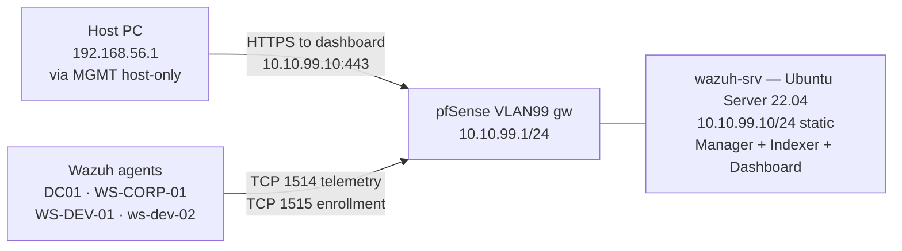
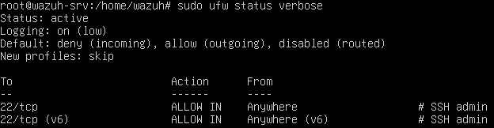
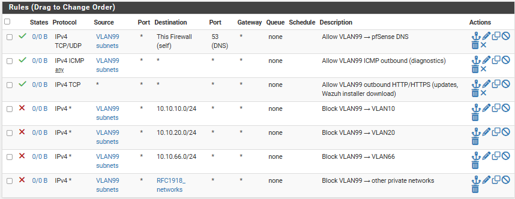
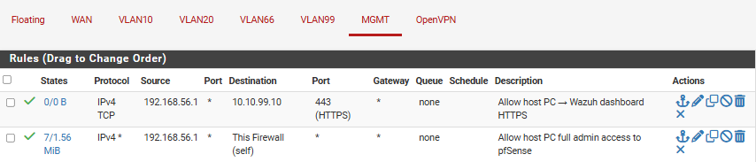
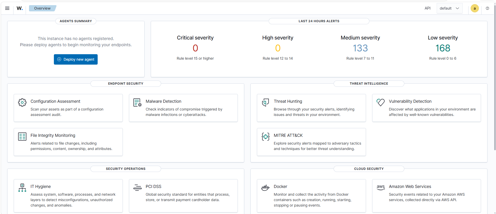
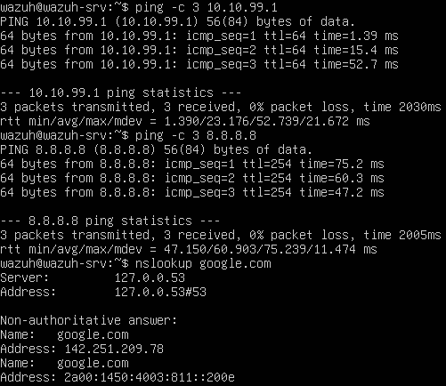
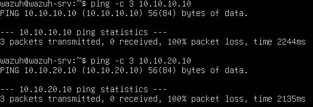

# Phase 2 — Part 1: SOC Stack: Wazuh Manager
 
## Overview
 
The SOC stack is deployed in VLAN 99 — the out-of-band management segment designed in Phase 0 — as a single Ubuntu Server 24.04 LTS host (`wazuh-srv`, `10.10.99.10/24`) running Wazuh 4.14 in its all-in-one configuration: Wazuh Manager, Wazuh Indexer and Wazuh Dashboard co-located on the same VM. This phase is the first to introduce active telemetry collection, every endpoint and gateway built in Phases 1 through 3 (pfSense, the AD domain and the workgroup developer machines) becomes a source of events for this central observability platform.
 
The architectural intent is **asymmetric reachability**. Every monitored VLAN (corporate, development, attacker) must be able to push telemetry into the Wazuh Manager over TCP 1514, and enroll new agents over TCP 1515. Wazuh itself, however, cannot initiate connections back into those VLANs. If the SIEM is ever compromised, it must not become a pivot point toward the production segments — the firewall rules enforce this on pfSense, and the network topology (VLAN 99 as a dedicated out-of-band segment with its own gateway) supports it physically. 
 
This document covers the Manager-side deployment end to end: VM provisioning, Ubuntu Server installation and hardening, network and time configuration, the per-VLAN firewall ruleset that enforces the out-of-band model, execution of the Wazuh all-in-one installer, and verification that the dashboard is reachable. Agent deployment to the four existing endpoints, Sysmon and Auditd installation, pfSense syslog forwarding, and end-to-end event validation will be related on the next phases.
 
---
 
## Architecture
 

 
The asymmetric direction of the arrows is intentional: every flow shown is allowed by explicit firewall rule, and every flow NOT shown is denied by default-deny. There is no Pass rule on VLAN 99 toward VLAN 10, 20, or 66 — the out-of-band principle is enforced at the network layer rather than by relying on host-based controls inside Wazuh.
 
---
 
## Deployment
 
### Ubuntu Server 24.04 LTS VM provisioning
 
A new VirtualBox VM was created with resources sized for the Wazuh all-in-one workload.
 
| Resource | Value |
| -------- | ----- |
| vCPU     | 4 |
| RAM      | 8 GB |
| Disk     | 80 GB |
| NIC 1    | Internal Network `internal-vlan99-soc`, Promiscuous Allow All |
 
### Network configuration (Netplan) and NTP synchronization
 
The installer-generated configuration in `/etc/netplan/00-installer-config.yaml` was replaced with the static configuration required by the lab IP plan:
 
```yaml
network:
  version: 2
  ethernets:
    enp0s3:
      dhcp4: no
      addresses:
        - 10.10.99.10/24
      routes:
        - to: default
          via: 10.10.99.1
      nameservers:
        addresses:
          - 10.10.99.1
          - 1.1.1.1
```
 
The configuration was applied with `sudo netplan apply`
 
DNS was set to point at the pfSense VLAN 99 gateway, which provides resolution via the DNS Resolver configured globally in forwarding mode, `1.1.1.1` is configured as a secondary for resilience.
 
### Pre-install hardening — UFW and apt baseline
 
The system was updated to the latest patch level and a host firewall was activated **before** Wazuh installation, not after. This ordering matters: the Wazuh installer modifies firewall behavior implicitly (binding services to interfaces, opening internal ports), and adding UFW after the fact risks blocking a port that Wazuh expects to be open. Establishing the host firewall as a known baseline first means any subsequent disruption is attributable to the installer rather than a base-system change.
 
```bash
sudo apt update && sudo apt upgrade -y
sudo apt install -y curl wget gnupg ufw
 
sudo ufw default deny incoming
sudo ufw default allow outgoing
sudo ufw allow 22/tcp comment 'SSH admin'
sudo ufw enable
sudo ufw status verbose
```


 
The UFW ruleset at this stage allows only SSH inbound. Wazuh's required ports (1514, 1515, 443, 9200) are not yet open at the host level — the installer is allowed to manage these, and they will be verified after deployment.
 
A reboot was performed to apply any kernel updates pulled by `apt upgrade`.
 
### pfSense firewall rules for VLAN 99
 
Wazuh sits in an out-of-band segment with strict directional rules. Three categories of traffic must be configured:
 
1. **VLAN 99 outbound** — the Wazuh host needs to reach the internet (apt, the Wazuh installer download) and pfSense services (DNS), but must be blocked from initiating connections into other lab VLANs.
2. **Agents → Wazuh** — endpoints on VLAN 10 and VLAN 20 need to reach `10.10.99.10:1514` and `:1515`.
3. **Host PC → Dashboard** — the operator needs HTTPS to `10.10.99.10:443` through the MGMT host-only network.

#### Rules on `Firewall → Rules → VLAN99`


 
#### Rules on `Firewall → Rules → VLAN10` and `VLAN20`
 
A targeted Pass rule was added at the top of each VLAN's rule list to allow agent telemetry — placed explicitly rather than relying on the existing generic outbound rules so that firewall logs make agent traffic visible and distinguishable:
 


 
#### Rule on `Firewall → Rules → MGMT`
 
The existing admin rule on MGMT permits `192.168.56.1 → This Firewall (self)` — it does not allow the host PC to reach `10.10.99.10`. A second rule was added to enable dashboard access:
 

 
### Wazuh 4.14 all-in-one installation
 
Wazuh provides a single shell script that deploys Manager, Indexer, and Dashboard with internal PKI generation in one command. The script is the vendor-recommended path for single-host installations and is significantly more reliable than the per-component manual installs.
 
```bash
curl -sO https://packages.wazuh.com/4.14/wazuh-install.sh
chmod +x wazuh-install.sh
sudo bash wazuh-install.sh -a
```
 
The `-a` flag selects the all-in-one mode. Execution time was approximately 20 minutes and proceeded through these phases:
 
The final output of the script printed the dashboard URL and the admin credentials. These credentials were captured and stored, they are randomly generated.
 
### Dashboard first access and cluster verification
 
From the host PC browser, the dashboard was accessed at `https://10.10.99.10`. The self-signed certificate warning was accepted (the certificate is signed by Wazuh's internal CA generated during install). Login with the `admin` credentials from the installer output succeeded.


 
The first-access verification covered the cluster health rather than agent data (no agents are deployed yet):
 
---
 
## Validation — Connectivity, Segmentation, and GUI
 
### Outbound and DNS from the Wazuh host
 

 
All three tests succeeded. The first confirms intra-VLAN reachability, the second confirms outbound NAT and the third confirms that the DNS Resolver fix from Phase 4 still applies.
 
### Segmentation enforcement (the asymmetric direction)
 

 
Both timeouts confirm the Block rules on VLAN 99 are active. If either had returned replies, a Pass rule allowing VLAN 99 outbound to a production VLAN would exist and would be a misconfiguration to investigate immediately. The segmentation asymmetry — agents can reach Wazuh, but Wazuh cannot reach the agents at the network layer — is the central property of the out-of-band design.
 
---
 
## Result
 
- Ubuntu Server 24.04 LTS deployed as `wazuh-srv` on VLAN 99 with static IP `10.10.99.10/24`.
- OpenSSH installed and reachable on TCP 22 from within VLAN 99.
- UFW host firewall enabled with `default deny incoming` and an explicit allow for SSH; Wazuh ports managed by the installer.
- pfSense firewall rules in place across VLAN99 (3 Pass + 4 Block, enforcing the out-of-band model), VLAN10 and VLAN20 (agent enrollment paths), and MGMT (host PC dashboard access).
- Wazuh 4.14 all-in-one installed in approximately 20 minutes via the vendor script with the `-a` flag.
- Internal PKI generated by the installer covers Manager↔Indexer↔Dashboard mutual TLS.
- Dashboard reachable at `https://10.10.99.10` from the host PC over the MGMT host-only network.
- Server management views confirm the cluster is healthy (Manager, Indexer, Dashboard all green).
- Segmentation validated: from the Wazuh host, ping to VLAN 10 and VLAN 20 hosts returns timeout — the asymmetric out-of-band design holds.
 
---

*Previous: [Phase 1 — Part3: VLAN 20 (Software Development)](../01-infrastructure/03-vlan20.md)*
*Next: [Phase 2 — Part2: SOC Stack Windows Agents + Sysmon](02-windows-agent.md)*
 
