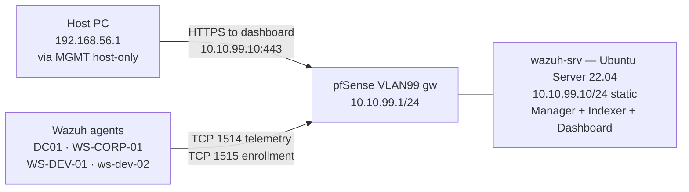

# Phase 1 — SOC Stack: Wazuh Manager
 
## Overview
 
The SOC stack is deployed in VLAN 99 — the out-of-band management segment designed in Phase 0 — as a single Ubuntu Server 24.04 LTS host (`wazuh-srv`, `10.10.99.10/24`) running Wazuh 4.14 in its all-in-one configuration: Wazuh Manager, Wazuh Indexer and Wazuh Dashboard co-located on the same VM. This phase is the first to introduce active telemetry collection, every endpoint and gateway built in Phases 1 through 3 (pfSense, the AD domain and the workgroup developer machines) becomes a source of events for this central observability platform.
 
The architectural intent is **asymmetric reachability**. Every monitored VLAN (corporate, development, attacker) must be able to push telemetry into the Wazuh Manager over TCP 1514, and enroll new agents over TCP 1515. Wazuh itself, however, cannot initiate connections back into those VLANs. If the SIEM is ever compromised, it must not become a pivot point toward the production segments — the firewall rules enforce this on pfSense, and the network topology (VLAN 99 as a dedicated out-of-band segment with its own gateway) supports it physically. 
 
This document covers the Manager-side deployment end to end: VM provisioning, Ubuntu Server installation and hardening, network and time configuration, the per-VLAN firewall ruleset that enforces the out-of-band model, execution of the Wazuh all-in-one installer, and verification that the dashboard is reachable. Agent deployment to the four existing endpoints, Sysmon and Auditd installation, pfSense syslog forwarding, and end-to-end event validation.
 
---
 
## Architecture
 

 
The asymmetric direction of the arrows is intentional: every flow shown is allowed by explicit firewall rule, and every flow NOT shown is denied by default-deny. There is no Pass rule on VLAN 99 toward VLAN 10, 20, or 66 — the out-of-band principle is enforced at the network layer rather than by relying on host-based controls inside Wazuh.
 
---
 
## Deployment
 
### Ubuntu Server 24.04 LTS VM provisioning
 
A new VirtualBox VM was created with resources sized for the Wazuh all-in-one workload.
 
| Resource | Value |
| -------- | ----- |
| vCPU     | 4 |
| RAM      | 8 GB |
| Disk     | 80 GB |
| NIC 1    | Internal Network `internal-vlan99-soc`, Promiscuous Allow All |
 
### Network configuration (Netplan) and NTP synchronization
 
The installer-generated configuration in `/etc/netplan/00-installer-config.yaml` was replaced with the static configuration required by the lab IP plan:
 
```yaml
network:
  version: 2
  ethernets:
    enp0s3:
      dhcp4: no
      addresses:
        - 10.10.99.10/24
      routes:
        - to: default
          via: 10.10.99.1
      nameservers:
        addresses:
          - 10.10.99.1
          - 1.1.1.1
```
 
The configuration was applied with `sudo netplan apply`
 
DNS was set to point at the pfSense VLAN 99 gateway, which provides resolution via the DNS Resolver configured globally in forwarding mode, `1.1.1.1` is configured as a secondary for resilience.
 
### Pre-install hardening — UFW and apt baseline
 
The system was updated to the latest patch level and a host firewall was activated **before** Wazuh installation, not after. This ordering matters: the Wazuh installer modifies firewall behavior implicitly (binding services to interfaces, opening internal ports), and adding UFW after the fact risks blocking a port that Wazuh expects to be open. Establishing the host firewall as a known baseline first means any subsequent disruption is attributable to the installer rather than a base-system change.
 
```bash
sudo apt update && sudo apt upgrade -y
sudo apt install -y curl wget gnupg ufw
 
sudo ufw default deny incoming
sudo ufw default allow outgoing
sudo ufw allow 22/tcp comment 'SSH admin'
sudo ufw enable
sudo ufw status verbose
```


 
The UFW ruleset at this stage allows only SSH inbound. Wazuh's required ports (1514, 1515, 443, 9200) are not yet open at the host level — the installer is allowed to manage these, and they will be verified after deployment.
 
A reboot was performed to apply any kernel updates pulled by `apt upgrade`.
 
### pfSense firewall rules for VLAN 99
 
Wazuh sits in an out-of-band segment with strict directional rules. Three categories of traffic must be configured:
 
1. **VLAN 99 outbound** — the Wazuh host needs to reach the internet (apt, the Wazuh installer download) and pfSense services (DNS), but must be blocked from initiating connections into other lab VLANs.
2. **Agents → Wazuh** — endpoints on VLAN 10 and VLAN 20 need to reach `10.10.99.10:1514` and `:1515`.
3. **Host PC → Dashboard** — the operator needs HTTPS to `10.10.99.10:443` through the MGMT host-only network.

#### Rules on `Firewall → Rules → VLAN99`


 
#### Rules on `Firewall → Rules → VLAN10` and `VLAN20`
 
A targeted Pass rule was added at the top of each VLAN's rule list to allow agent telemetry — placed explicitly rather than relying on the existing generic outbound rules so that firewall logs make agent traffic visible and distinguishable:
 


 
#### Rule on `Firewall → Rules → MGMT`
 
The existing admin rule on MGMT permits `192.168.56.1 → This Firewall (self)` — it does not allow the host PC to reach `10.10.99.10`. A second rule was added to enable dashboard access:
 

 
### Wazuh 4.14 all-in-one installation
 
Wazuh provides a single shell script that deploys Manager, Indexer, and Dashboard with internal PKI generation in one command. The script is the vendor-recommended path for single-host installations and is significantly more reliable than the per-component manual installs (which require careful sequencing of certificate generation, OpenSearch initialization, and dashboard pairing).
 
```bash
curl -sO https://packages.wazuh.com/4.14/wazuh-install.sh
chmod +x wazuh-install.sh
sudo bash wazuh-install.sh -a
```
 
The `-a` flag selects the all-in-one mode. Execution time was approximately 20 minutes and proceeded through these phases:
 
1. Internal certificate authority generation
2. Wazuh Indexer installation and initial cluster bootstrap
3. Wazuh Manager installation and binding to the Indexer
4. Wazuh Dashboard installation and pairing with the Manager
5. Service startup and health checks
The final output of the script printed the dashboard URL and the admin credentials. These credentials were captured and stored externally **before** closing the SSH session — they are randomly generated and not reproducible from configuration files alone.
 
### Dashboard first access and cluster verification
 
From the host PC browser, the dashboard was accessed at `https://10.10.99.10`. The self-signed certificate warning was accepted (the certificate is signed by Wazuh's internal CA generated during install). Login with the `admin` credentials from the installer output succeeded.
 
The first-access verification covered the cluster health rather than agent data (no agents are deployed yet):
 
| Path in dashboard                          | Expected state                                |
| ------------------------------------------ | --------------------------------------------- |
| Server management → Agents                 | Empty list — no agents enrolled               |
| Server management → Status                 | Manager: green · Indexer: green · Dashboard: green |
| Security → Users                           | `admin` present as default                    |
 
A green cluster with an empty agents list is the correct end state for this document. Agent enrollment is the subject of the following documents in Phase 5.
 
---
 
## Validation — Connectivity, Segmentation, and GUI
 
### Outbound and DNS from the Wazuh host
 
```bash
ping -c 3 10.10.99.1                # gateway VLAN 99
ping -c 3 8.8.8.8                   # NAT outbound
nslookup github.com                 # DNS via pfSense Resolver
curl -I https://packages.wazuh.com  # HTTPS outbound — returns HTTP 200
```
 
All four tests succeeded. The first confirms intra-VLAN reachability, the second confirms outbound NAT, the third confirms that the DNS Resolver fix from Phase 4 still applies, and the fourth confirms that HTTPS to vendor endpoints works (necessary for the installer download).
 
### Segmentation enforcement (the asymmetric direction)
 
```bash
ping -c 3 10.10.10.10               # DC01 — must timeout
ping -c 3 10.10.20.10               # WS-DEV-01 — must timeout
```
 
Both timeouts confirm the Block rules on VLAN 99 are active. If either had returned replies, a Pass rule allowing VLAN 99 outbound to a production VLAN would exist and would be a misconfiguration to investigate immediately. The segmentation asymmetry — agents can reach Wazuh, but Wazuh cannot reach the agents at the network layer — is the central property of the out-of-band design.
 
### Dashboard access from the host PC
 
The browser opened `https://10.10.99.10` over the MGMT host-only network. The Wazuh login screen rendered after the self-signed certificate exception was accepted. Authentication with the installer-generated `admin` credentials granted access to the dashboard. Server management views confirmed all three components (Manager, Indexer, Dashboard) reporting healthy.
 
### pfSense log audit during install
 
During the Wazuh installer run, the firewall log on pfSense (`Status → System Logs → Firewall`) was filtered by Source IP `10.10.99.10`. The expected events appeared:
 
- TCP 80/443 outbound to vendor IPs for package downloads — Pass on VLAN99 (rule #3).
- UDP 53 to `10.10.99.1` for DNS lookups — Pass on VLAN99 (rule #1).
- No outbound attempts to `10.10.10.0/24`, `10.10.20.0/24`, or `10.10.66.0/24` — confirming the Wazuh installer does not attempt to reach the production VLANs.
---
 
## Troubleshooting & Lessons Learned
 
### 1. NTP synchronization as a Wazuh prerequisite, verified prophylactically
 
Wazuh's internal PKI (used for Manager↔Indexer↔Dashboard mutual TLS) validates certificate timestamps strictly. If the system clock on the Wazuh host is significantly out of sync with the certificates' issuance time at the moment of validation, the installer can fail with cryptic errors related to certificate verification or cluster initialization — errors that point at TLS without indicating that the underlying cause is clock skew.
 
Rather than reactively diagnosing this after a failed install, the system time was verified before launching the installer:
 
| Test                                  | Expected output                                                  |
| ------------------------------------- | ---------------------------------------------------------------- |
| `timedatectl status`                  | `NTP service: active` and `System clock synchronized: yes`        |
| `date`                                | Current time matches an external reference (e.g. host PC's clock) |
 
The two checks confirm both that the NTP client is operational (`systemd-timesyncd` in Ubuntu 22.04 by default) and that the actual time is correct. A common gotcha occurs when the NTP service is active but the clock has not yet converged — `chronyc tracking` or `timedatectl show-timesync` provides additional detail on sync state in that case.
 
**Lesson learned:** when a vendor installer depends on PKI, verifying time sync is a free, fast check that prevents an entire class of difficult-to-diagnose errors. The same principle applies broadly to AD (Kerberos is also time-sensitive), to log ingestion (timestamps drive correlation), and to any TLS-bearing service. Time is invisible infrastructure until it isn't.
 
### 2. Recurring pattern: pfSense default-deny on every new OPT interface
 
This is the third time in the lab build that the same operational pattern has appeared:
 
| Phase | Interface added | Symptom observed                                            | Resolution                                  |
| ----- | --------------- | ----------------------------------------------------------- | ------------------------------------------- |
| 2     | MGMT (OPT4)     | Web UI not reachable from host PC after IP assignment       | Add explicit Pass rule on MGMT              |
| 4     | VLAN20 (OPT1)   | Endpoints could not reach internet or pfSense services      | Add explicit Pass rule on VLAN20            |
| 5     | VLAN99 (OPT3)   | Wazuh host could not reach internet or pfSense services     | Add explicit Pass rules on VLAN99 (this doc) |
 
pfSense applies default-deny to every interface except LAN. The LAN interface alone carries an automatic anti-lockout rule that allows traffic — every other interface (OPT1 through OPTn) blocks everything inbound until explicit allow rules are configured. This is a deliberate security posture but it is also a consistent source of "I just added this interface and now nothing works" confusion for operators new to pfSense.
 
**Generalized rule for the lab going forward:** any time a new OPT interface is created, two configuration steps are non-negotiable before the segment is usable:
 
1. Add explicit Pass rules for the outbound services the segment requires (DNS, ICMP, HTTP/HTTPS at minimum for management hosts).
2. Add explicit Block rules where directional segmentation is required (such as the asymmetric VLAN 99 → production-VLANs blocks documented in this phase).
A future iteration of the lab could codify this as a pfSense rule template applied via the API at interface creation time. For the current scope, the pattern is documented and verified manually.
 
---
 
## Result
 
- Ubuntu Server 22.04 LTS deployed as `wazuh-srv` on VLAN 99 with static IP `10.10.99.10/24` and NTP-synchronized clock.
- OpenSSH installed and reachable on TCP 22 from within VLAN 99.
- UFW host firewall enabled with `default deny incoming` and an explicit allow for SSH; Wazuh ports managed by the installer.
- pfSense firewall rules in place across VLAN99 (3 Pass + 4 Block, enforcing the out-of-band model), VLAN10 and VLAN20 (agent enrollment paths), and MGMT (host PC dashboard access).
- Wazuh 4.13 all-in-one installed in approximately 20 minutes via the vendor script with the `-a` flag. Wazuh Manager, Indexer (OpenSearch), and Dashboard are co-located and operational on the same host.
- Internal PKI generated by the installer covers Manager↔Indexer↔Dashboard mutual TLS.
- Dashboard reachable at `https://10.10.99.10` from the host PC over the MGMT host-only network; admin credentials captured and stored externally.
- Server management views confirm the cluster is healthy (Manager, Indexer, Dashboard all green) and the agents list is empty as expected.
- Segmentation validated: from the Wazuh host, ping to VLAN 10 and VLAN 20 hosts returns timeout — the asymmetric out-of-band design holds.
- Snapshot taken in VirtualBox: `wazuh-baseline` (manager operational, no agents enrolled yet).
 
---
 
*Previous: [Phase 3 — VLAN 20 (Software Development)](../01-infrastructure/03-vlan20.md)*
*Next: [Phase 5 — Windows Agents (DC01, WS-CORP-01, WS-DEV-01)](02-windows-agents.md)*
 
