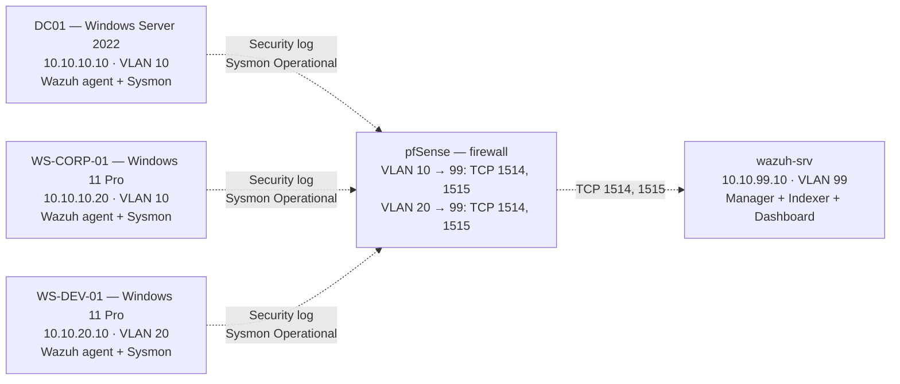
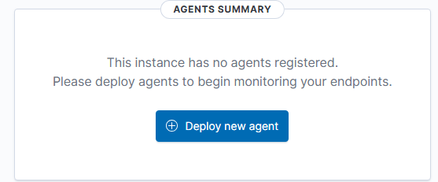
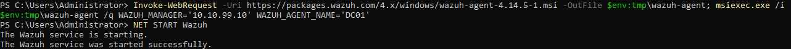
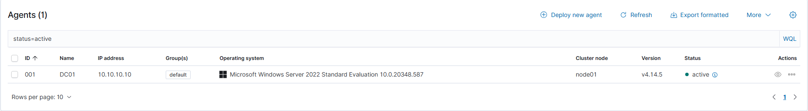
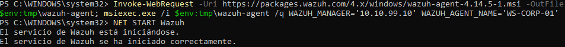
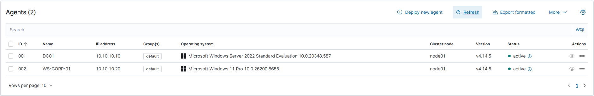
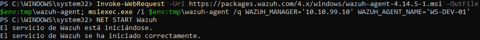
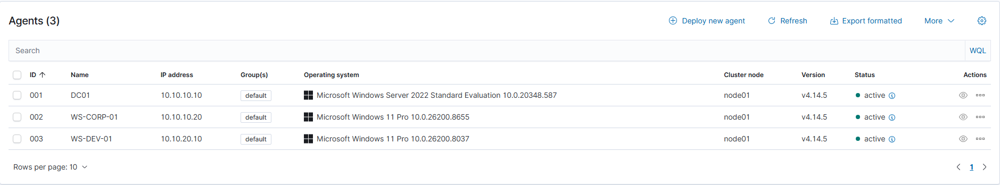

# Phase 2 — SOC Stack  Windows Agents + Sysmon
 
## Overview
 
Three Wazuh agents were deployed across the existing Windows endpoints — `DC01`, `WS-CORP-01`, and `WS-DEV-01` to bring active telemetry into the SIEM platform established in `01-wazuh-manager.md`. 
 
| Host        | Trust zone  | Identity model           | Telemetry profile that justifies inclusion |
| ----------- | ----------- | ------------------------ | ------------------------------------------ |
| DC01        | VLAN 10     | AD Domain Controller     | Generates the Kerberos / NTLM authentication events for the entire domain. Highest-value telemetry source in a Windows environment. |
| WS-CORP-01  | VLAN 10     | AD member | Endpoint-level view of an authenticated corporate workstation. Receives GPO, talks to DC01, exposes typical user-driven activity. |
| WS-DEV-01   | VLAN 20 | Workgroup | The contrast case — same agent technology, same dashboard, no AD involvement. Demonstrates that the SIEM is independent of the identity layer. |
 
After agent deployment, **Sysmon** was installed on all three hosts using the [SwiftOnSecurity](https://github.com/SwiftOnSecurity/sysmon-config) configuration. This transforms the data plane delivered to Wazuh: without Sysmon, the agent forwards only the native Security, System, and Application logs (essentially authentication and service events). With Sysmon, the same agent delivers process creation, network connections per process, registry modifications, file creation, image loads, and DNS queries — the telemetry that turns a SIEM into a EDR.
 
---
 
## Architecture
 

 
The three telemetry streams converge at pfSense, are subject to the cross-VLAN allow rules created in Part 1, and reach `wazuh-srv` on TCP 1514 for ongoing telemetry and 1515 for one-time agent enrollment. The diagram makes the routing visible: VLAN 10 traffic and VLAN 20 traffic both have to traverse pfSense to reach VLAN 99, which is the asymmetric reachability principle expressed at the data-plane level.
 
---
 
## Deployment
 
### Agent deployment via the Wazuh Dashboard wizard
 
Each Windows agent was deployed using the **Deploy new agent** wizard from the Wazuh Dashboard (`Server Management → Agents → Deploy new agent`), which is the vendor-recommended path for first-time agent installation. The wizard generates the exact MSI download URL and `msiexec.exe` command line for the target OS, with manager address, agent name, and group pre-populated from form inputs.


 
The wizard inputs used for each host:
 
| Host       | Operating System         | Server address | Agent name    | Group     |
| ---------- | ------------------------ | -------------- | ------------- | --------- |
| DC01       | Windows MSI 32/64 bits   | `10.10.99.10`  | `DC01`        | `default` |
| WS-CORP-01 | Windows MSI 32/64 bits   | `10.10.99.10`  | `WS-CORP-01`  | `default` |
| WS-DEV-01  | Windows MSI 32/64 bits   | `10.10.99.10`  | `WS-DEV-01`   | `default` |
 
The wizard's output is a two-line PowerShell snippet: an `Invoke-WebRequest` to download the MSI, followed by an `msiexec.exe /i ...` with the agent name, manager IP, and group baked in. Both lines were executed inside an elevated PowerShell session on each host.
 
### Agent install — DC01
 
PowerShell as Administrator on DC01, with the wizard-generated commands:
 
```powershell
Invoke-WebRequest -Uri https://packages.wazuh.com/4.x/windows/wazuh-agent-4.14.5-1.msi -OutFile $env:tmp\wazuh-agent; msiexec.exe /i $env:tmp\wazuh-agent /q WAZUH_MANAGER='10.10.99.10' WAZUH_AGENT_NAME='DC01'

NET START WazuhSvc
```


 
The `Invoke-WebRequest` step initially failed on DC01 with `The remote name could not be resolved: 'packages.wazuh.com'` — see Troubleshooting #2. After fixing DNS forwarders, the three commands ran to completion in approximately 90 seconds, and DC01 appeared in `Server Management → Agents` with status `Active`.


 
### Agent install — WS-CORP-01
 
Same procedure on WS-CORP-01, with the agent name adjusted in the `msiexec` line. WS-CORP-01 appeared `Active` in the dashboard within seconds.




 
### Agent install — WS-DEV-01
 
WS-DEV-01 is in VLAN 20, in workgroup mode. Its DNS server is `10.10.20.1` (pfSense) per the Phase 4 configuration. The enrollment traffic crosses from VLAN 20 to VLAN 99 over pfSense via the per-VLAN allow rule created in Part 1 (`Pass VLAN20 net → 10.10.99.10 TCP 1514:1515`).


 
Same `msiexec` procedure with `WAZUH_AGENT_NAME="WS-DEV-01"`. The agent registered successfully and appeared `Active` in the dashboard. 


 
### Sysmon installation — SwiftOnSecurity configuration
 
After all three agents were `Active`, Sysmon was installed on each host using the SwiftOnSecurity configuration file. This config is the de-facto industry standard for Sysmon deployments: actively maintained, with whitelists tuned to suppress legitimate Windows noise while preserving all the events that matter for security monitoring (process creation, network connections, DNS queries, registry persistence keys, image loads, file creation in suspicious locations, etc.).
 
The two artifacts downloaded once and copied to each host:
 
- `Sysmon64.exe` from `https://download.sysinternals.com/files/Sysmon.zip`
- `sysmonconfig-export.xml` from `https://raw.githubusercontent.com/SwiftOnSecurity/sysmon-config/master/sysmonconfig-export.xml`
On each host, PowerShell as Administrator:
 
```powershell
cd "$env:USERPROFILE\Downloads"
.\Sysmon64.exe -accepteula -i sysmonconfig-export.xml
Get-Service Sysmon64                          # Status: Running
Get-WinEvent -LogName "Microsoft-Windows-Sysmon/Operational" -MaxEvents 5
```
 
Expected installer output:
 
```
Sysmon installed.
SysmonDrv installed.
SysmonDrv started.
Sysmon started.
```
 
The `SysmonDrv` line is significant — Sysmon ships both a user-mode service (`Sysmon64`) and a kernel driver (`SysmonDrv`). The driver is what gives Sysmon its visibility into process creation and image loads at the kernel level; without it, much of the telemetry would be unavailable. The `Get-WinEvent` query against the `Microsoft-Windows-Sysmon/Operational` channel confirms that events are being written to the local event log within seconds of the install.
 
### Wazuh agent — enabling the Sysmon channel in `ossec.conf`
 
Wazuh agent is **intentionally agnostic** to whether Sysmon is installed on a host. The agent forwards whatever event channels it is told to monitor — by default, that is `Security`, `System`, and `Application`. Sysmon writes to a separate channel (`Microsoft-Windows-Sysmon/Operational`) that must be added explicitly to the agent configuration.
 
On each host, `C:\Program Files (x86)\ossec-agent\ossec.conf` was edited with Notepad running as Administrator. A new `<localfile>` block was added after the existing Security/System/Application blocks:
 
```xml
<localfile>
  <location>Microsoft-Windows-Sysmon/Operational</location>
  <log_format>eventchannel</log_format>
</localfile>
```
 
After saving, the agent service was restarted:
 
```powershell
Restart-Service WazuhSvc
Get-Service WazuhSvc                          # Status: Running
```
 
This was repeated on all three hosts. From this point on, every Sysmon event generated on any of the three Windows endpoints is forwarded to the Wazuh Manager, decoded against the Sysmon ruleset, and indexed for search and alerting.
 
---
 
## Validation
 
### Agent health in the dashboard
 
`Server Management → Agents` was inspected after all three deployments. Expected state:
 
| Name        | Status | IP             | Operating System              | Version  |
| ----------- | ------ | -------------- | ----------------------------- | -------- |
| DC01        | Active | `10.10.10.10`  | Microsoft Windows Server 2022 | 4.14.x   |
| WS-CORP-01  | Active | `10.10.10.20`  | Microsoft Windows 11 Pro      | 4.14.x   |
| WS-DEV-01   | Active | `10.10.20.10`  | Microsoft Windows 11 Pro      | 4.14.x   |
 
The IPs span both monitored VLANs (10 and 20), which is the visual evidence that the cross-VLAN enrollment path works end to end.
 
### Synthetic events — native Security log
 
A failed logon was generated from DC01 to exercise both the Security log channel and the Wazuh ruleset against authentication events:
 
```powershell
runas /user:soclab\nonexistentuser cmd.exe
# Password prompt; any input fails since the user does not exist
```
 
In the dashboard, `Explore → Discover` filtered by `agent.name: DC01` and `data.win.system.eventID: 4625`, the event appeared within seconds. Detail view showed the failure reason (`Unknown user name or bad password`), the target account name, the calling process, and the workstation name — the data points an L1 analyst would use to triage a brute-force candidate.
 
The same procedure was repeated on `WS-CORP-01` and `WS-DEV-01`, confirming that all three agents forward Security log events correctly. WS-DEV-01 used a local-account variant (`runas /user:WS-DEV-01\fakelocaluser`) since it is workgroup, not domain-joined.
 
### Synthetic events — Sysmon Operational channel
 
A reconnaissance-style command chain was executed on DC01 to exercise Sysmon process-creation telemetry:
 
```powershell
cmd.exe /c "whoami && hostname"
```
 
This produces three Sysmon Event ID 1 events in rapid succession — `cmd.exe` (parent: `powershell.exe`), `whoami.exe` (parent: `cmd.exe`), `hostname.exe` (parent: `cmd.exe`). In the dashboard with filter `data.win.system.providerName: Microsoft-Windows-Sysmon` and `data.win.system.eventID: 1`, the three events were visible within 10 seconds, with the parent-child relationship readable directly in the event detail (`data.win.eventdata.parentImage` field).
 
The parent-child chain is precisely what a threat hunter follows when reconstructing post-compromise activity, and seeing it surface end to end is the validation that the Sysmon-to-Wazuh pipeline carries the contextual data, not just the bare event.
 
### First real alert — T1105 from the Sysmon binary itself
 
A by-product of the installation procedure produced an unexpected validation: the act of dropping `Sysmon64.exe` into the Administrator's `Desktop` folder on DC01 triggered Wazuh rule `92213` ("Executable file dropped in folder commonly used by malware"), severity 15, mapped to MITRE ATT&CK technique **T1105 (Ingress Tool Transfer)** under the Command and Control tactic.
 
This is a true positive in detection terms even though it is a false positive in operational terms — the rule fired correctly on a pattern that legitimate setup activity happens to match. The triage logic an L1 would apply:
 
| Question                            | Answer in this case                                       | Disposition         |
| ----------------------------------- | --------------------------------------------------------- | ------------------- |
| What was dropped?                   | `Sysmon64.exe`, Microsoft Sysinternals binary             | Known legitimate    |
| Who dropped it?                     | `Administrator`, during documented SOC stack deployment    | Known and expected  |
| Hash verifiable against vendor?     | Yes, `Sysmon64.exe` SHA256 matches Sysinternals release   | Verified legitimate |
| Operational justification?          | Documented Phase 5 step                                   | Justified           |
 
Closure: false positive attributable to setup activity. Note added to the triage log.
 
The conceptual takeaway is the more important one for the portfolio narrative: **the SIEM does not decide whether an activity is malicious. It detects patterns and presents them to a human with enough context to decide.** Seeing this play out on a real event in the first hour of operation is the cleanest possible validation of why the stack is built the way it is.
 
### Sysmon validation across the other two hosts
 
A condensed validation was run on `WS-CORP-01` and `WS-DEV-01`:
 
```powershell
cmd.exe /c "whoami && hostname"
```
 
In the dashboard, filters by `agent.name: WS-CORP-01` and then `agent.name: WS-DEV-01`, both showed the corresponding Sysmon Event ID 1 sequence within 10 seconds. Three distinct hosts feeding Sysmon telemetry into a single SIEM, with WS-DEV-01 doing so across VLAN boundaries — the cross-zone observability is operational.
 
---
 
## Troubleshooting & Lessons Learned
 
### 1. UFW on the manager — host firewall vs perimeter firewall
 
After the Wazuh all-in-one installer completed in Part 1, the dashboard process bound correctly to `0.0.0.0:443` and was reachable via `curl -k https://localhost` from the host itself. However, attempts to reach the dashboard from `WS-CORP-01` via `https://10.10.99.10` timed out at the TCP layer, with `Test-NetConnection -Port 443` returning `TcpTestSucceeded: False`.
 
The methodology used to isolate the cause:
 
| Test                                                       | Result                       | Layer eliminated                   |
| ---------------------------------------------------------- | ---------------------------- | ---------------------------------- |
| `ping 10.10.99.10` from WS-CORP-01                         | Replies                      | L3 reachability OK                 |
| `Test-NetConnection -Port 443` from WS-CORP-01             | `TcpTestSucceeded: False`    | TCP 443 not reaching the manager   |
| `sudo ss -tlnp \| grep :443` on wazuh-srv                  | LISTEN on `0.0.0.0:443`      | Service running, correctly bound   |
| `curl -k https://localhost` from wazuh-srv                 | HTML response from dashboard | Dashboard healthy at host level    |
 
The first three tests showed routing works, the service is running and correctly listening, and the dashboard is healthy locally. The block had to be between TCP arriving at the host and the listening socket — which on Linux is UFW.
 
**Root cause:** UFW on `wazuh-srv` was configured in Part 1 with `default deny incoming` and only TCP 22 explicitly allowed. The Wazuh installer does not modify UFW rules — it assumes the operator opens the required ports as part of the deployment sequence. The decision in Part 1 to defer port opening "until the Wazuh installer finishes" was correct in intent but the follow-up step was forgotten.
 
**Solution:** explicitly open the three Wazuh listening ports on UFW:
 
```bash
sudo ufw allow 443/tcp comment 'Wazuh dashboard HTTPS'
sudo ufw allow 1514/tcp comment 'Wazuh agent telemetry'
sudo ufw allow 1515/tcp comment 'Wazuh agent enrollment'
sudo ufw status verbose
```
 
**Lesson:** in a defense-in-depth network, the perimeter firewall (pfSense) and the host firewall (UFW) are independent control planes. A packet passing pfSense does not automatically pass UFW. Both must be coordinated explicitly. The order applied here — restrictive UFW baseline before Wazuh install, opening the Wazuh ports immediately after install verifies — is deliberate: it ensures no port is open during the brief window between OS hardening and SIEM installation when an attacker scanning the segment could find an exposed, unconfigured service.
 
### 2. DC01 — DNS forwarders not configured for non-local lookups
 
The `Invoke-WebRequest https://packages.wazuh.com/...` step from DC01 failed with `The remote name could not be resolved: 'packages.wazuh.com'`. The methodology:
 
| Test                                            | Result                          | Layer eliminated                |
| ----------------------------------------------- | ------------------------------- | ------------------------------- |
| `ping 10.10.10.1` (gateway)                     | Replies                         | L3 reachability OK              |
| `nslookup dc01.soclab.local`                    | Resolves                        | Internal AD DNS operational     |
| `nslookup packages.wazuh.com`                   | `Non-existent domain`           | No upstream DNS forwarding      |
 
DC01 is the DNS server for `soclab.local`. After AD DS promotion in Phase 3, its own DNS service was set as the primary resolver for the host itself (so the DC can resolve its own domain records). For any name outside `soclab.local`, the DC's DNS service must forward to an upstream resolver — and no upstream was configured at promotion time.
 
**Solution:** configure DNS forwarders on DC01's DNS Server pointing to pfSense (which itself forwards to public resolvers per the global config in Part 1).
 
`Server Manager → Tools → DNS → DC01 (right-click) → Properties → Forwarders → Edit`:
- Add `10.10.10.1` (pfSense VLAN 10 gateway)
After applying, `nslookup packages.wazuh.com` returned an answer, and the `Invoke-WebRequest` step succeeded on retry.
 
**Lesson:** when a domain controller serves DNS for its own domain, by default it does not have a path to resolve names outside that domain. This is silent at promotion time and surfaces only when a service on the DC (or any client using the DC as its DNS) tries to resolve external names. In production, configuring forwarders is part of the AD baseline; in a lab, it surfaces on the first occasion the DC has to act as a normal internet client.
 
### 3. WS-CORP-01 — DHCP lease vs static IP for firewall rule consistency
 
A dashboard convenience exception was added to allow `WS-CORP-01` to reach `https://10.10.99.10` from within VLAN 10. The firewall rule needed a single-host source IP — but `ipconfig` on WS-CORP-01 showed `10.10.10.102`, a DHCP-leased address that would change after the next DHCP cycle, invalidating the firewall rule.
 
**Methodology:** trace the cause from the symptom — a rule using a DHCP-leased address breaks at the next lease renewal. The alternatives evaluated:
 
| Approach                                       | Operational stability                         | Notes                                          |
| ---------------------------------------------- | --------------------------------------------- | ---------------------------------------------- |
| Use the DHCP-leased IP `10.10.10.102` in the rule | Breaks at the next renewal                    | Avoid                                          |
| Convert WS-CORP-01 to static IP `10.10.10.20`  | Stable; aligns with `prerequisites.md`         | Chosen                                         |
| Add DHCP static mapping in pfSense              | Stable; central management                    | Reasonable alternative; not used here          |
 
The host was reconfigured to static IP `10.10.10.20` via Windows Settings → Network → IPv4 Manual. This also matches the IP plan recorded in `00-architecture/prerequisites.md`, removing a piece of accumulated tech debt where the documented assignment differed from the actual configuration.
 
A side gotcha appeared during the change: the Windows 11 Settings GUI rejects `255.255.255.0` in the subnet mask field, requiring the prefix-length form (`24`) instead. The number was rejected initially with a generic "Entrada no válida" error, regardless of formatting. Solved by configuring via PowerShell, which accepts an explicit `-PrefixLength` parameter:
 
```powershell
Get-NetAdapter | Where-Object { $_.Status -eq "Up" }
Remove-NetIPAddress -InterfaceIndex 13 -Confirm:$false
Remove-NetRoute -InterfaceIndex 13 -Confirm:$false
New-NetIPAddress -InterfaceIndex 13 -IPAddress 10.10.10.20 -PrefixLength 24 -DefaultGateway 10.10.10.1
Set-DnsClientServerAddress -InterfaceIndex 13 -ServerAddresses 10.10.10.10,1.1.1.1
```
 
After applying, `ipconfig /all` confirmed `10.10.10.20` and `nltest /sc_query:soclab.local` returned `Trust Relationship Status: Verified` — the IP change did not disturb the domain membership.
 
**Lesson:** firewall rules and DHCP are an unstable combination. Any rule that names a specific host should reference an IP that is either statically configured or DHCP-reserved. The "trust the lease" approach works in production for hours or days but eventually breaks at a bad time. Documenting the IP plan and enforcing it (static or reservation) saves later debugging.
 
### 4. Dashboard convenience exception — VLAN 10 to VLAN 99 (single host)
 
Once the IP was stable, a single rule was added to allow `WS-CORP-01` (single host `10.10.10.20`) to reach the Wazuh dashboard on TCP 443. This is a deliberate exception to the out-of-band model documented in Part 1, made on operator-convenience grounds: the corporate workstation is the most common interactive session in the lab, and routing dashboard access exclusively through MGMT requires switching contexts back to the host PC for every check.
 
The exception is constrained to a single host rather than the full VLAN 10 subnet. The trust boundary degradation is bounded: the SIEM dashboard becomes reachable from one specific administrative workstation, not from every endpoint in the corporate zone. DC01 and any other corporate host remain blocked from the SIEM by default.
 
| Original policy                                       | Modified policy                                              |
| ----------------------------------------------------- | ------------------------------------------------------------ |
| Dashboard reachable only from MGMT (`192.168.56.1`)   | Dashboard reachable from MGMT **and** from `10.10.10.20`     |
| Out-of-band fully enforced                            | Out-of-band relaxed for one administrative host              |
 
In a production deployment, this exception would not be present — administrative access to the SIEM would route through a jump host or a privileged-access workstation outside the monitored segments. For a single-operator lab, the trade-off favors operational comfort, and the exception is auditable as a single specific rule in the pfSense ruleset.
 
### 5. VLAN 99 out-of-band Block rules — accidentally removed during troubleshooting
 
During the UFW / firewall troubleshooting in #1, the four Block rules on VLAN 99 (`Block VLAN99 → VLAN10/20/66/MGMT`) were temporarily removed in an attempt to isolate whether the issue was on the pfSense side or the host side. The block rules were not the cause — UFW was — but the rules were not immediately restored.
 
This left the lab in a degraded state: VLAN 99 had unrestricted outbound to all private networks, defeating the out-of-band principle that is the core of Part 1's design. The condition was caught when reviewing the screenshots before resuming agent deployment.
 
**Methodology:** verify policy state, not just symptoms. The agents were working, the dashboard was reachable, and superficially everything looked good — but the architectural property the design was supposed to guarantee was no longer in place. The fix:
 
| Action | Source | Destination | Description |
| ------ | ------ | ----------- | ----------- |
| Block | VLAN99 net | Network `10.10.10.0/24` | Block VLAN99 → VLAN10 (out-of-band enforcement) |
| Block | VLAN99 net | Network `10.10.20.0/24` | Block VLAN99 → VLAN20 (out-of-band enforcement) |
| Block | VLAN99 net | Network `10.10.66.0/24` | Block VLAN99 → VLAN66 (out-of-band enforcement) |
| Block | VLAN99 net | Network `192.168.56.0/24` | Block VLAN99 → MGMT (out-of-band enforcement) |
 
After re-applying and re-verifying with `ping` tests from wazuh-srv toward each blocked subnet (all timed out as expected), the lab was restored to the intended out-of-band posture.
 
**Lesson:** removing firewall rules to "see if it's the firewall" is a debugging anti-pattern. It changes the system under test in a way that may not be reverted symmetrically, and it can leave the architecture silently degraded after the original problem is fixed by an unrelated change. A safer approach is to **log** the rules in question (turn on per-rule logging) and observe whether they match the failing traffic — diagnostic data without architectural mutation. When rule removal is genuinely necessary, the removed rules must be tracked and restored as the last step before considering the issue closed.
 
---
 
## Result
 
- Three Wazuh agents deployed on `DC01`, `WS-CORP-01`, and `WS-DEV-01`, all `Active` in the dashboard, spanning VLAN 10 (corporate / AD-joined) and VLAN 20 (development / workgroup standalone).
- Sysmon installed on all three hosts with the SwiftOnSecurity configuration. Service `Sysmon64` running, kernel driver `SysmonDrv` loaded, events visible in `Microsoft-Windows-Sysmon/Operational`.
- `ossec.conf` extended on each host with a `<localfile>` entry for the Sysmon channel; agent service restarted and confirmed running.
- Synthetic events generated for validation: failed logon attempts produced Security Event ID 4625 visible in the SIEM within seconds; `cmd.exe /c whoami && hostname` produced the expected Sysmon Event ID 1 chain with parent-child relationship intact.
- First real alert observed in the SIEM: rule `92213` (T1105 — Ingress Tool Transfer) fired on the legitimate drop of `Sysmon64.exe` to the Administrator's Desktop on DC01, triaged as a contextually-justified false positive.
- pfSense firewall extended with a single-host exception allowing `WS-CORP-01 → 10.10.99.10:443` for dashboard access; out-of-band policy on VLAN 99 verified and restored after a temporary removal during troubleshooting.
- Five distinct gotchas surfaced and documented: UFW on the manager, DNS forwarders on DC01, DHCP vs static IP for firewall rule consistency, the dashboard convenience exception design, and the VLAN 99 Block rule restoration.
 
---
 
*Previous: [Phase 5 — SOC Stack (Part 1: Wazuh Manager)](01-wazuh-manager.md)*
*Next: [Phase 5 — SOC Stack (Part 3: Linux Agent on Ubuntu-Dev)](03-linux-agent.md)*

