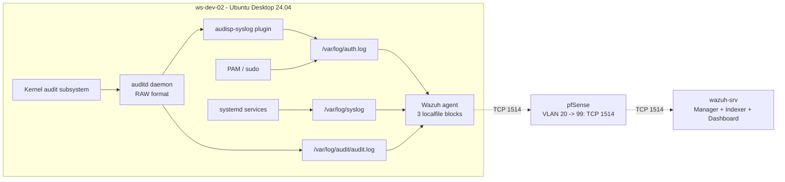

# Phase 5 — SOC Stack (Part 3: Linux Agent + auditd)
 
## Overview
 
A fourth Wazuh agent was deployed on `ws-dev-02` (Ubuntu Desktop 24.04, VLAN 20, workgroup) to bring Linux telemetry into the SIEM platform alongside the three Windows agents from Part 2. The Linux endpoint completes the cross-OS coverage: one Domain Controller, two Windows workstations (corporate + dev), and one Linux developer station — four agents spanning two trust zones, two operating systems, and two identity models, all reporting to the same `wazuh-srv` manager.
 
The architectural contrast with the Windows agents is the central pedagogical theme of this document. **Windows requires an external component (Sysmon) to achieve EDR-grade visibility**: process creation, network connections per process, registry persistence, and file events all live in a separate channel that Sysmon adds. **Linux already exposes the same visibility natively through the kernel audit subsystem (`auditd`)** — no external instrumentation is needed, only configuration. The same SIEM agent (Wazuh) consumes both, demonstrating that the SIEM layer is independent of how the OS makes its events available.
 
This document covers the agent installation, the deployment of `auditd` with custom rules tuned for SOC L1 scenarios, and the **multi-source ingestion strategy** that emerged during deployment: instead of relying on a single log file with a single decoder, the agent monitors three complementary sources (`auth.log`, `syslog`, `audit.log`) each parsed by its appropriate Wazuh decoder. Six distinct gotchas surfaced during the deployment, all documented with methodology and solution; one limitation was accepted as a known constraint of the current Wazuh + Ubuntu 24.04 pairing.
 
---
 
## Architecture
 

 
The three log sources are complementary, not redundant — each contributes a different perspective on the same events:
 
| Source                              | Perspective                  | Captures                                                              | Decoder        |
| ----------------------------------- | ---------------------------- | --------------------------------------------------------------------- | -------------- |
| `/var/log/auth.log`                 | PAM authentication layer     | sudo authentications, login attempts, SSH session lifecycle           | `pam`, `sudo`  |
| `/var/log/syslog`                   | systemd services             | service start/stop, cron, generic system messages                     | `syslog`       |
| `/var/log/audit/audit.log`          | kernel audit subsystem       | syscalls (execve, connect), file watches, config changes              | `auditd`       |
 
Maintaining all three gives defense-in-depth at the data plane level: if any single decoder has issues with a specific event type, the same security-relevant activity is likely captured by another source. This redundancy proved essential during deployment (see Troubleshooting #6).
 
---
 
## Deployment
 
### Pre-flight check — NTP and firewall
 
The same NTP discipline applied to `wazuh-srv` in Part 1 was applied to `ws-dev-02` before any Wazuh component was installed. Wazuh's internal PKI between agent and manager validates certificates against the host clock; a few minutes of drift causes silent enrollment failures.
 
```bash
timedatectl status
```
 
Expected: `NTP service: active` and `System clock synchronized: yes`. The clock was already synchronized via `systemd-timesyncd` (default in Ubuntu Desktop 24.04).
 
Connectivity to the manager was confirmed before triggering the wizard:
 
```bash
ping -c 3 10.10.99.10                    # replies, ICMP via pfSense
```
 
The pfSense rule `Pass VLAN20 net → 10.10.99.10 TCP 1514:1515` provisioned in Part 1 was verified to be in place before agent enrollment.
 
### Agent deployment via the Wazuh Dashboard wizard
 
The same wizard-driven approach used for the three Windows agents in Part 2 was used here, with **Linux DEB amd64** selected as the operating system. Wizard inputs:
 
| Field           | Value          |
| --------------- | -------------- |
| Operating system | Linux DEB amd64 |
| Server address  | `10.10.99.10`  |
| Agent name      | `ws-dev-02`    |
| Group           | `default`      |
 
The wizard generated three PowerShell-equivalent shell commands. Executed in order on `ws-dev-02` via SSH:
 
```bash
# 1. Download the agent .deb
curl -so wazuh-agent.deb \
  https://packages.wazuh.com/4.x/apt/pool/main/w/wazuh-agent/wazuh-agent_4.14.x-1_amd64.deb
 
# 2. Install with manager and group preconfigured
sudo WAZUH_MANAGER='10.10.99.10' WAZUH_AGENT_NAME='ws-dev-02' \
     WAZUH_AGENT_GROUP='default' dpkg -i ./wazuh-agent.deb
 
# 3. Enable and start the service
sudo systemctl daemon-reload
sudo systemctl enable wazuh-agent
sudo systemctl start wazuh-agent
```
 
The agent reached `Active` state in `Server Management → Agents` within seconds:
 
| Name        | Status | IP             | Operating System | Version |
| ----------- | ------ | -------------- | ---------------- | ------- |
| ws-dev-02   | Active | `10.10.20.20`  | Ubuntu 24.04     | 4.14.x  |
 
This is the moment where the cross-VLAN enrollment is validated for Linux as well — the path provisioned in Part 1 (`Pass VLAN20 → 10.10.99.10:1514-1515`) now carries telemetry from a fourth host living in a separate trust zone.
 
### Initial validation — baseline coverage from default `<localfile>` blocks
 
Before installing auditd, baseline validation was performed using the localfile blocks the Wazuh agent ships with by default (`/var/log/dpkg.log`, `/var/ossec/logs/active-responses.log`, and the `journald` block). A synthetic failed-sudo event was generated:
 
```bash
sudo -k                    # invalidate sudo cache
sudo --user=nobody true    # prompts for password; three wrong attempts
```
 
The corresponding PAM authentication failure events appeared in the dashboard within 10 seconds, confirming the agent is forwarding telemetry end-to-end before any custom configuration. This baseline check is what surfaces a broken pipeline early — before the operator starts adding rules and decoders that complicate diagnosis.
 
### auditd installation and configuration
 
`auditd` and its plugin suite were installed:
 
```bash
sudo apt update
sudo apt install -y auditd audispd-plugins
sudo systemctl status auditd
```
 
The default Ubuntu 24.04 configuration writes audit events in `ENRICHED` format, which (as documented in Troubleshooting #3) breaks Wazuh's audit decoder. The format was changed to `RAW`:
 
```bash
sudo sed -i 's/^log_format = ENRICHED/log_format = RAW/' /etc/audit/auditd.conf
sudo grep "^log_format" /etc/audit/auditd.conf
```
 
The default `log_group = adm` was kept rather than switching to `log_group = wazuh`. To allow the Wazuh agent (which runs as user `wazuh`) to read `/var/log/audit/audit.log`, the `wazuh` user was added to the `adm` group:
 
```bash
sudo usermod -aG adm wazuh
groups wazuh                # should include adm
```
 
This decision keeps auditd in its standard Ubuntu configuration and grants read access to wazuh by group membership — see Troubleshooting #1 for the diagnostic path that led here.
 
The audisp-syslog plugin was activated so that auditd events are also forwarded to syslog, providing a second ingestion path through `/var/log/auth.log`:
 
```bash
sudo sed -i 's/^active = no/active = yes/' /etc/audit/plugins.d/syslog.conf
sudo cat /etc/audit/plugins.d/syslog.conf | grep "^active"
```
 
auditd was restarted to apply all changes:
 
```bash
sudo systemctl stop auditd
sleep 2
sudo systemctl start auditd
sudo systemctl status auditd | head -5
```
 
### Custom audit rules — SOC L1 ruleset
 
A curated rule set was placed in `/etc/audit/rules.d/soc-monitoring.rules`. The intent was a small, focused set covering privilege escalation and identity file modifications — broad enough to demonstrate detection capabilities, narrow enough to avoid the noise that comes with shipping STIG-style rulesets.
 
```
## Privilege escalation: any command run as root from a non-root user
-a always,exit -F arch=b64 -S execve -F euid=0 -F auid>=1000 -F auid!=-1 -k priv_esc
 
## Identity file modifications
-w /etc/passwd -p wa -k identity_files
-w /etc/shadow -p wa -k identity_files
-w /etc/sudoers -p wa -k identity_files
```
 
Rules were loaded into the kernel:
 
```bash
sudo augenrules --load
sudo auditctl -l
```
 
`auditctl -l` confirmed the rules are active. The same key strings (`priv_esc`, `identity_files`) appear in audit events when the corresponding activity occurs, making the events filterable in the SIEM by content.
 
### Wazuh agent configuration — three complementary `<localfile>` blocks
 
This is where the deployment took its current shape. After the debug paths documented in Troubleshooting #2 through #6, the working configuration uses **three log sources in parallel**, each with the correct decoder:
 
`/var/ossec/etc/ossec.conf` was extended with three blocks (added inside `<ossec_config>`):
 
```xml
<localfile>
  <log_format>audit</log_format>
  <location>/var/log/audit/audit.log</location>
  <only-future-events>no</only-future-events>
</localfile>
 
<localfile>
  <log_format>syslog</log_format>
  <location>/var/log/auth.log</location>
</localfile>
 
<localfile>
  <log_format>syslog</log_format>
  <location>/var/log/syslog</location>
</localfile>
```
 
The `only-future-events: no` setting on the audit.log block forces the agent to read from the beginning of the file on restart, ensuring no events are missed when the agent service cycles.
 
After validating the XML and restarting the agent:
 
```bash
sudo xmllint --noout /var/ossec/etc/ossec.conf && echo "XML OK"
sudo systemctl stop wazuh-agent
sleep 3
sudo find /var/ossec/queue -name "*.state" -delete 2>/dev/null
sudo systemctl start wazuh-agent
sleep 10
sudo grep "Analyzing file" /var/ossec/logs/ossec.log | tail -5
```
 
The agent log confirmed it was monitoring all three new sources:
 
```
INFO: (1950): Analyzing file: '/var/log/audit/audit.log'.
INFO: (1950): Analyzing file: '/var/log/auth.log'.
INFO: (1950): Analyzing file: '/var/log/syslog'.
```
 
---
 
## Validation
 
### Agent health in the dashboard
 
`Server Management → Agents` confirmed `ws-dev-02` joined the existing roster:
 
| Name        | Status | IP             | OS                            |
| ----------- | ------ | -------------- | ----------------------------- |
| DC01        | Active | `10.10.10.10`  | Microsoft Windows Server 2022 |
| WS-CORP-01  | Active | `10.10.10.20`  | Microsoft Windows 11 Pro      |
| WS-DEV-01   | Active | `10.10.20.10`  | Microsoft Windows 11 Pro      |
| **ws-dev-02** | **Active** | **`10.10.20.20`** | **Ubuntu 24.04**          |
 
Four agents, two operating systems, two VLANs, two identity models — the SIEM data plane is operational across the lab.
 
### Multi-source telemetry — three decoders working in parallel
 
Three dashboard queries confirmed each ingestion path is delivering events:
 
```
agent.name: "ws-dev-02" and decoder.name: "auditd"        # 258 hits
agent.name: "ws-dev-02" and decoder.name: "sudo"          # 136 hits
agent.name: "ws-dev-02" and full_log: "priv_esc"          # 30 hits
```
 
Each result represents a distinct view of the same host:
- The `auditd` decoder processes events from `/var/log/audit/audit.log` (CONFIG_CHANGE, AVC, DAEMON_*).
- The `sudo` decoder processes events from `/var/log/auth.log` (PAM session lifecycle, sudo authentications).
- Content searches on `full_log` retrieve SYSCALL events containing the rule keys, even when the auditd decoder doesn't fully extract them (see Troubleshooting #6).
### Synthetic event — privilege escalation
 
```bash
sudo -k
sudo whoami
```
 
This dispatches several events across all three pipelines simultaneously:
- A `type=SYSCALL ... key="priv_esc"` event in `/var/log/audit/audit.log`
- A `pam_unix(sudo:session): session opened` event in `/var/log/auth.log`
- A `sudo: arodriguez : ... COMMAND=/usr/bin/whoami` event in `/var/log/auth.log`
Within 15 seconds, the dashboard showed:
- `decoder.name: sudo` events for the sudo session (PAM + command logging)
- `full_log: priv_esc` events for the auditd SYSCALL captures
- Rule mapping to MITRE T1078 (Valid Accounts) for the PAM session events
### Synthetic event — identity file modification
 
```bash
sudo bash -c 'echo "# test comment $(date)" >> /etc/passwd'
sudo head -3 /etc/passwd
sudo sed -i '/# test comment/d' /etc/passwd
```
 
The first command writes to `/etc/passwd`, the third undoes it. Both writes trigger the `identity_files` audit rule. The dashboard filter `agent.name: "ws-dev-02" and full_log: "identity_files"` returned events with timestamps matching the actions, demonstrating that the file-watch rules dispatch correctly through the pipeline.
 
### Agent ossec.log audit
 
`/var/ossec/logs/ossec.log` was inspected after the validation run to confirm no buffer drops or queue saturation:
 
```bash
sudo grep -iE "queue|drop|buffer" /var/ossec/logs/ossec.log | tail -10
```
 
The only line returned was the standard buffer status:
 
```
wazuh-agentd: INFO: Buffer agent.conf updated, enable: 1 size: 5000
```
 
No drop events occurred — the volume of telemetry produced during validation stayed comfortably within the agent's 5000-event buffer.
 
---
 
## Result
 
- Wazuh agent deployed on `ws-dev-02` (Ubuntu Desktop 24.04, `10.10.20.20/24`, VLAN 20, workgroup ), `Active` in the dashboard alongside the three Windows agents from Part 2.
- Cross-VLAN enrollment path validated: VLAN 20 → VLAN 99 over TCP 1514/1515, traversing the pfSense allow rule provisioned in Part 1.
- Custom audit ruleset in `/etc/audit/rules.d/soc-monitoring.rules` 
- Synthetic events validated: `sudo whoami` produces priv_esc auditd events and PAM session events; modifications to `/etc/passwd` trigger identity_files audit events.
  
---
 
## Screenshots
 
| Screenshot | Description |
| ---------- | ----------- |
|  | `Server Management → Agents` showing the fourth agent connected |
|  | `systemctl status auditd` after install, RAW format applied |
|  | `auditctl -l` showing the priv_esc and identity_files rules loaded |
|  | `groups wazuh` confirming adm membership for audit.log read access |
|  | The three complementary `<localfile>` blocks added to the agent config |
|  | Agent log confirming it monitors auth.log, syslog, and audit.log |
|  | Filter `decoder.name: auditd` showing 258 events for ws-dev-02 |
|  | Filter `decoder.name: sudo` showing 136 events from PAM |
|  | Filter `full_log: priv_esc` showing 30 SYSCALL events with the rule key |
|  | A PAM session event mapped to MITRE Valid Accounts (T1078) |
|  | The final agent roster: DC01, WS-CORP-01, WS-DEV-01, ws-dev-02, all Active |
 
---
 
*Previous: [Phase 5 — SOC Stack (Part 2: Windows Agents + Sysmon)](02-windows-agents.md)*
*Next: [Phase 5 — SOC Stack (Part 4: pfSense Syslog Integration)](04-pfsense-syslog.md)*
