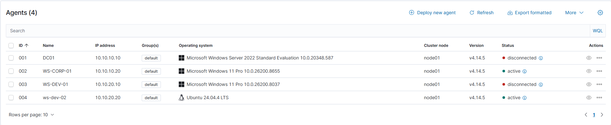
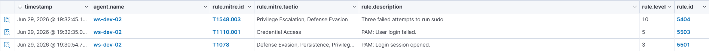
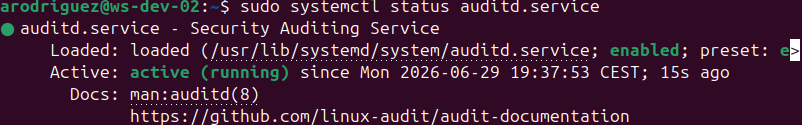
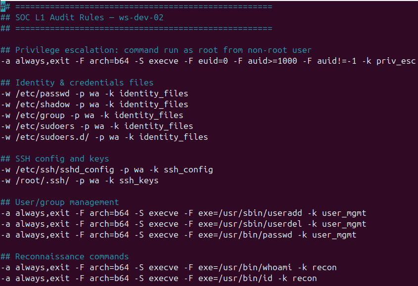
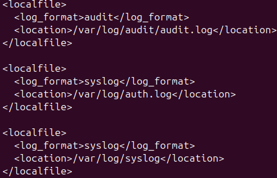
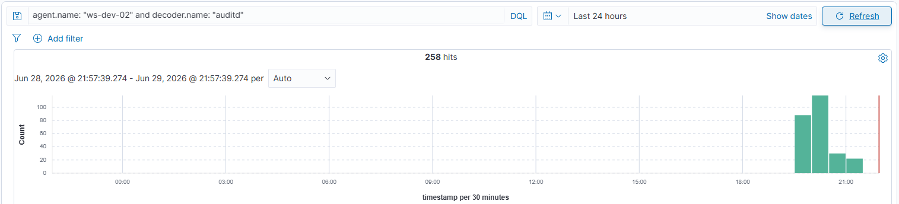
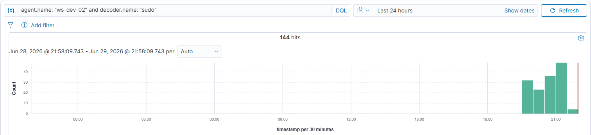
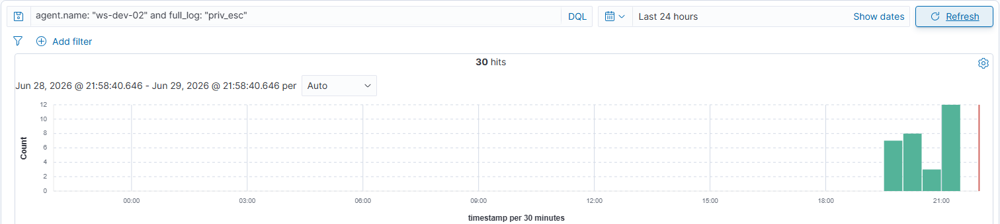

# Phase 5 — SOC Stack Linux Agent + auditd
 
## Overview
 
A fourth Wazuh agent was deployed on `ws-dev-02` (Ubuntu Desktop 24.04, VLAN 20, workgroup) to bring Linux telemetry into the SIEM platform alongside the three Windows agents from Part 2. The Linux endpoint completes the cross-OS coverage: one Domain Controller, two Windows workstations (corporate + dev), and one Linux developer station — four agents spanning two trust zones, two operating systems, and two identity models, all reporting to the same `wazuh-srv` manager.
 
The architectural contrast with the Windows agents is the central pedagogical theme of this document. **Windows requires an external component (Sysmon) to achieve EDR-grade visibility**: process creation, network connections per process, registry persistence, and file events all live in a separate channel that Sysmon adds. **Linux already exposes the same visibility natively through the kernel audit subsystem (`auditd`)** — no external instrumentation is needed, only configuration. The same SIEM agent (Wazuh) consumes both, demonstrating that the SIEM layer is independent of how the OS makes its events available.
 
This document covers the agent installation, the deployment of `auditd` with custom rules tuned for SOC L1 scenarios, and the **multi-source ingestion strategy** that emerged during deployment: instead of relying on a single log file with a single decoder, the agent monitors three complementary sources (`auth.log`, `syslog`, `audit.log`) each parsed by its appropriate Wazuh decoder. Six distinct gotchas surfaced during the deployment, all documented with methodology and solution; one limitation was accepted as a known constraint of the current Wazuh + Ubuntu 24.04 pairing.
 
---
 
## Architecture
 
---
 
### Agent deployment via the Wazuh Dashboard wizard
 
The same wizard-driven approach used for the three Windows agents in Part 2 was used here, with **Linux DEB amd64** selected as the operating system. Wizard inputs:
 
| Field           | Value          |
| --------------- | -------------- |
| Operating system | Linux DEB amd64 |
| Server address  | `10.10.99.10`  |
| Agent name      | `ws-dev-02`    |
| Group           | `default`      |
 
The wizard generated PowerShell-equivalent shell commands. Executed in order on `ws-dev-02`:
 
```bash
# 1.
wget https://packages.wazuh.com/4.x/apt/pool/main/w/wazuh-agent/wazuh-agent_4.14.5-1_amd64.deb && sudo WAZUH_MANAGER='10.10.99.10' WAZUH_AGENT_NAME='ws-dev-02' dpkg -i ./wazuh-agent_4.14.5-1_amd64.deb

# 2. Enable and start the service
sudo systemctl daemon-reload
sudo systemctl enable wazuh-agent
sudo systemctl start wazuh-agent
```
 
The agent reached `Active` state in `Server Management → Agents` within seconds:
 

 
This is the moment where the cross-VLAN enrollment is validated for Linux as well — the path provisioned in Part 1 (`Pass VLAN20 → 10.10.99.10:1514-1515`) now carries telemetry from a fourth host living in a separate trust zone.
 
### Initial validation — baseline coverage from default `<localfile>` blocks
 
Before installing auditd, baseline validation was performed using the localfile blocks the Wazuh agent ships with by default (`/var/log/dpkg.log`, `/var/ossec/logs/active-responses.log`, and the `journald` block). A synthetic failed-sudo event was generated:
 
```bash
sudo -k                    # invalidate sudo cache
sudo --user=nobody true    # prompts for password; three wrong attempts
```


The corresponding PAM authentication failure events appeared in the dashboard within 10 seconds, confirming the agent is forwarding telemetry end-to-end before any custom configuration. This baseline check is what surfaces a broken pipeline early — before the operator starts adding rules and decoders that complicate diagnosis.
 
### auditd installation and configuration
 
`auditd` and its plugin suite were installed:
 
```bash
sudo apt update
sudo apt install -y auditd audispd-plugins
sudo systemctl status auditd
```



 
### Custom audit rules — SOC L1 ruleset
 
A curated rule set was placed in `/etc/audit/rules.d/soc-monitoring.rules`. The intent was a small, focused set covering privilege escalation and identity file modifications — broad enough to demonstrate detection capabilities, narrow enough to avoid the noise that comes with shipping STIG-style rulesets.
 
`
 
Rules were loaded into the kernel:
 
```bash
sudo augenrules --load
sudo auditctl -l
```
 
`auditctl -l` confirmed the rules are active. The same key strings (`priv_esc`, `identity_files`) appear in audit events when the corresponding activity occurs, making the events filterable in the SIEM by content.
 
### Wazuh agent configuration — three complementary `<localfile>` blocks
 
This is where the deployment took its current shape. The working configuration uses **three log sources in parallel**, each with the correct decoder:
 
`/var/ossec/etc/ossec.conf` was extended with three blocks:
 
`
 
---
 
## Validation
 
### Agent health in the dashboard
 
`Server Management → Agents` confirmed `ws-dev-02` joined the existing roster:
 
| Name        | Status | IP             | OS                            |
| ----------- | ------ | -------------- | ----------------------------- |
| DC01        | Active | `10.10.10.10`  | Microsoft Windows Server 2022 |
| WS-CORP-01  | Active | `10.10.10.20`  | Microsoft Windows 11 Pro      |
| WS-DEV-01   | Active | `10.10.20.10`  | Microsoft Windows 11 Pro      |
| **ws-dev-02** | **Active** | **`10.10.20.20`** | **Ubuntu 24.04**          |
 
Four agents, two operating systems, two VLANs, two identity models — the SIEM data plane is operational across the lab.
 
### Multi-source telemetry — three decoders working in parallel
 
Three dashboard queries confirmed each ingestion path is delivering events:
 
```
agent.name: "ws-dev-02" and decoder.name: "auditd"        # 258 hits
agent.name: "ws-dev-02" and decoder.name: "sudo"          # 144 hits
agent.name: "ws-dev-02" and full_log: "priv_esc"          # 30 hits
```






 
Each result represents a distinct view of the same host:
- The `auditd` decoder processes events from `/var/log/audit/audit.log` (CONFIG_CHANGE, AVC, DAEMON_*).
- The `sudo` decoder processes events from `/var/log/auth.log` (PAM session lifecycle, sudo authentications).
- Content searches on `full_log` retrieve SYSCALL events containing the rule keys.
 
---
 
## Result
 
- Wazuh agent deployed on `ws-dev-02` (Ubuntu Desktop 24.04, `10.10.20.20/24`, VLAN 20, workgroup ), `Active` in the dashboard alongside the three Windows agents from Part 2.
- Cross-VLAN enrollment path validated: VLAN 20 → VLAN 99 over TCP 1514/1515, traversing the pfSense allow rule provisioned in Part 1.
- Custom audit ruleset in `/etc/audit/rules.d/soc-monitoring.rules` 
- Synthetic events validated: `sudo whoami` produces priv_esc auditd events and PAM session events; modifications to `/etc/passwd` trigger identity_files audit events.

---
 
*Previous: [Phase 5 — SOC Stack (Part 2: Windows Agents + Sysmon)](02-windows-agents.md)*
*Next: [Phase 5 — SOC Stack (Part 4: pfSense Syslog Integration)](04-pfsense-syslog.md)*
