# Phase 2 — Part 4: SOC Stack pfSense Syslog Integration
 
## Overview
 
The fifth telemetry source of the SOC stack is `pfSense` itself. Adding pfSense as a syslog source transforms the SIEM from *endpoint-centric* to *endpoint+network*: firewall pass/block events, DHCP leases, OpenVPN session lifecycle, and system events all become searchable and correlatable alongside the four agents deployed in Parts 2 and 3. If an attacker compromises a monitored host and disables its Wazuh agent, the network-layer telemetry from pfSense still flows into the SIEM independently — telemetry survives the endpoint.
 
This document covers the syslog transport configuration UDP/514, the activation of Wazuh Archives for storing raw events beyond just alerts, the deployment of a custom decoder that extracts structured fields from filterlog messages, and the OpenSearch index pattern setup that surfaces the archived events in the dashboard.
 
---
 
## Architecture
 
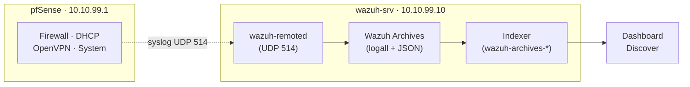
 
The syslog transport travels VLAN 99-internal from `10.10.99.1` (pfSense) to `10.10.99.10:514` (wazuh-srv). Three independent defense layers filter this path: UFW at the OS level restricts by source IP, the `<remote>` block in `ossec.conf` applies `allowed-ips` at the Wazuh application layer. Once received, events pass through the custom decoder, are stored in the archives (both text and JSON formats), and are shipped by Filebeat to the OpenSearch indexer where they become searchable via the `wazuh-archives-*` index pattern.
 
---
 
## Deployment
 
### 1. UFW — allow UDP/514 from pfSense only
 
The Wazuh manager was configured in Part 1 with a deny-by-default UFW posture. TCP/443 (dashboard), 1514, and 1515 (agents) were opened during agent deployment. Syslog reception on UDP/514 required a separate rule, scoped to the pfSense source IP:
 
```bash
sudo ufw allow proto udp from 10.10.99.1 to any port 514 comment 'pfSense syslog inbound'
```
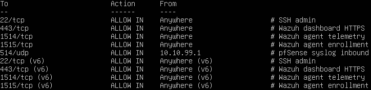
 
The `from 10.10.99.1` restriction is deliberate. Opening `to any port 514` without a source filter would turn the SIEM into a receiver of syslog from any host that can route to the VLAN 99 interface — a needless expansion of attack surface. The restriction acts as the first of three defense layers filtering this path.
 
### 2. Wazuh manager — `<remote>` block for syslog
 
The all-in-one installation of Wazuh already includes one `<remote>` block for agent enrollment on TCP/1514–1515. A **second** `<remote>` block was added for syslog reception. The existing block was left unchanged.
 
`/var/ossec/etc/ossec.conf`, inside `<ossec_config>`:
 
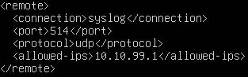
 
The `allowed-ips` restriction is the second defense layer. Even if UFW were relaxed by mistake, packets from unauthorized sources would be dropped at the Wazuh application layer.
 
After saving, wazuh-manager has de be restarted to apply the configuration, the XML was validated checking if wazuh-remoted is listening on 10.10.99.10:514 :

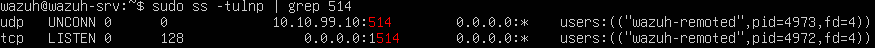
 
### 3. Wazuh Archives — enable `logall` and `logall_json`
 
By default, Wazuh only persists events that trigger alerts (in `wazuh-alerts-*`). All other events pass through the manager and are discarded. For forensic investigation and threat hunting, this is a significant limitation — an event that seemed benign at ingestion time may become interesting weeks later.
 
Wazuh Archives, enabled via two global flags, changes this: **every event received by the manager is persisted**, regardless of whether a rule fired.
 
`/var/ossec/etc/ossec.conf`, inside the `<global>` block:
 
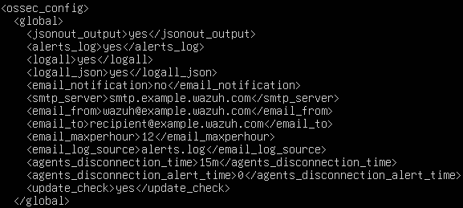
 
`logall` writes to `/var/ossec/logs/archives/archives.log` in Wazuh's text format. `logall_json` writes to `archives.json` with structured JSON. Both were enabled to have maximum flexibility for downstream analysis.
 
### 4. pfSense — Remote Syslog configuration
 
`Status → System Logs → Settings`, section **Remote Logging Options**:
 
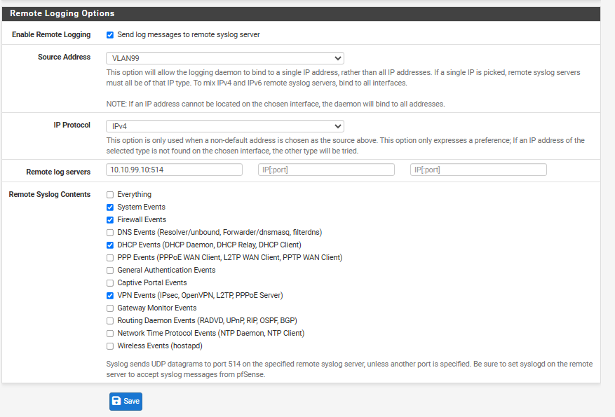
 
The **Source Address: VLAN99** selection is critical. Without it, pfSense may send syslog packets from any of its interfaces depending on routing decisions, and packets from unexpected sources are dropped by the `allowed-ips` filter on Wazuh. Explicitly binding the syslog source to VLAN 99 ensures the source IP is always `10.10.99.1`, matching the whitelist.
 
The four sub-systems selected cover the operationally relevant surface for SOC L1: firewall pass/block events (most volume, most signal), DHCP leases (host enumeration, rogue device detection), OpenVPN connect/disconnect (correlation with VLAN 20 activity), and system events (pfSense reboots, config changes — audit trail).
 
### 5. Custom decoder for filterlog
 
A custom decoder was developed instead, as a pedagogical exercise in understanding Wazuh's decoder XML syntax and the filterlog CSV format. The custom decoder covers the core fields needed for SOC L1 detection queries.
 
`/var/ossec/etc/decoders/pfsense_custom.xml`:
 
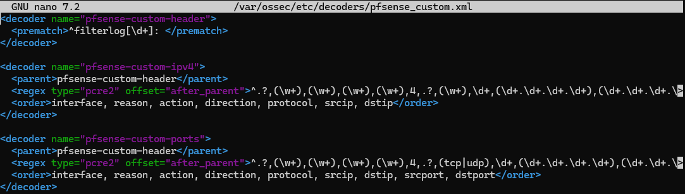
 
The design follows Wazuh's standard parent+children pattern: a lightweight parent that matches the syslog prefix (`filterlog[PID]:`), and two children specialized by protocol family (IPv4 base fields, and IPv4 with ports for TCP/UDP). When Wazuh evaluates an event, the parent matches first, then the children are tried in order until one matches — the pattern with more captured fields wins for TCP/UDP events, while the base IPv4 pattern catches ICMP and other protocols.
 
After creating the file, the manager was restarted and events verified:
 
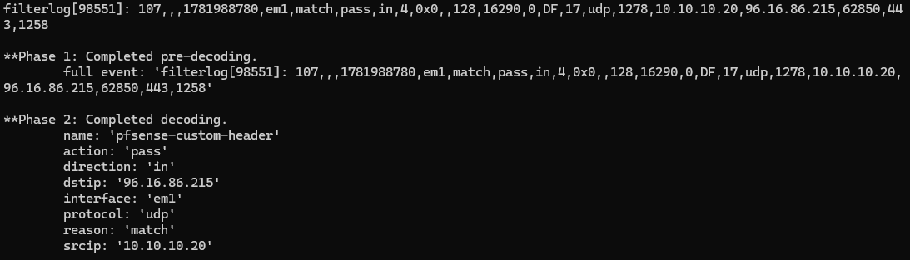
 
### 6. Dashboard — index pattern for archives
 
Wazuh Dashboard did not include an index pattern for `wazuh-archives-*` by default (only for `wazuh-alerts-*`). Without an index pattern, events land in the OpenSearch indexer but are invisible in Discover — a subtle failure mode covered in Troubleshooting #5.
 
`Menu → Dashboard Management → Dashboards Management → Index Patterns → Create index pattern`:
 
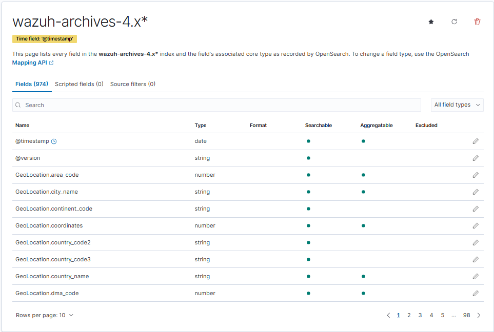
 
After creation, `Discover` was opened, the new pattern was selected, and events became visible immediately.

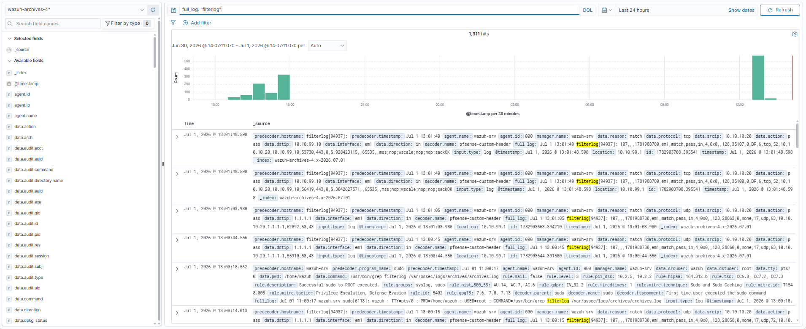
 
---
 
## Validation
 
### 1. Transport — UDP/514 reception on wazuh-srv
 
`tcpdump` confirmed pfSense was sending syslog to the manager:
 
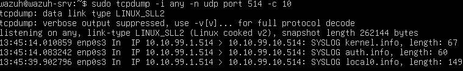
 
Sample output:
 
```
IP 10.10.99.1.514 > 10.10.99.10.514: SYSLOG kernel.info, length: 67
IP 10.10.99.1.514 > 10.10.99.10.514: SYSLOG auth.info, length: 60
IP 10.10.99.1.514 > 10.10.99.10.514: SYSLOG local0.info,   length: 149
```
 
Source IP `10.10.99.1` (pfSense VLAN 99) → destination `10.10.99.10:514` (Wazuh listener). All packets from the expected source, matching UFW and `allowed-ips` filters.
 
### 2. End-to-end — synthetic blocked ping
 
To validate the complete pipeline from a controlled event, the intentional VLAN 20 → VLAN 10 segmentation block was tested. From `WS-CORP-01`:
 
```cmd
ping 10.10.20.20
```
 
All four ICMP requests timed out (as designed — the segmentation rule ). The dashboard filtered by `data.srcip: "10.10.10.20" and data.action: "block"` returned the four corresponding block events, with `data.protocol: "icmp"` and `data.dstip: "10.10.10.10"`. Every layer of the pipeline (pfSense filterlog → syslog → wazuh-remoted → archives → decoder → indexer → dashboard) confirmed to be operational end-to-end.


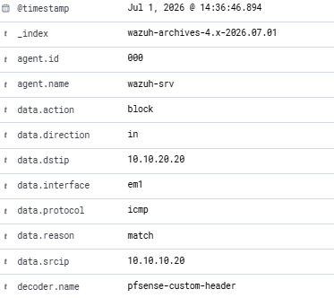
 
---
 
## Troubleshooting & Lessons Learned
 
### 1. Wazuh Archives not enabled by default
 
Initial dashboard searches for pfSense events returned nothing, even though `tcpdump` confirmed packets arriving. The events were being received by `wazuh-remoted`, decoded, checked against rules — but discarded, because none of them matched a rule that produced an alert.
 
**Root cause:** by default, Wazuh only persists events that fire an alert (`<logall>no</logall>`, `<logall_json>no</logall_json>` in the `<global>` block). Firewall pass events, DHCP lease events, and most other pfSense syslog messages do not fire built-in Wazuh rules — they are legitimate telemetry that has no reason to alert. Wazuh processes them through the decoder and then drops them.
 
**Solution:** enable both archive flags in `<global>`:
 
```xml
<logall>yes</logall>
<logall_json>yes</logall_json>
```
 
The events then persist to `/var/ossec/logs/archives/archives.log` (text) and `archives.json` (JSON). Filebeat ships them to the OpenSearch indexer.
 
**Lesson:** SIEM systems have a fundamental architectural split between **alerts** (rule-triggered, high-signal) and **archives** (raw ingestion, high-volume). For forensic investigation and threat hunting, archives are essential. They let an analyst investigate events that seemed benign at ingestion time. Alert-only storage is efficient but blind to slow-developing patterns.
 
### 2. Filebeat's `archives.enabled` must be true
 
Even with `logall_json` enabled and events in `archives.json`, they did not appear in the OpenSearch indexer. Filebeat's default configuration for the Wazuh module only ships alerts to the indexer; archives are configured separately.
 
**Root cause:** `/etc/filebeat/filebeat.yml` contains the Wazuh module configuration with two independent switches — one for alerts, one for archives. The all-in-one installer enables alerts by default (needed for the dashboard to function) but leaves archives disabled to avoid unnecessary indexer load in deployments that don't need archive search.
 
**Solution:** enable the archives switch:
 
```yaml
filebeat.modules:
  - module: wazuh
    alerts:
      enabled: true
    archives:
      enabled: true    # <— was false
```
 
Restart Filebeat: `sudo systemctl restart filebeat`.
 
---
 
## Result
 
- pfSense syslog transport operational on UDP/514 with three defense layers (UFW source-IP restriction, Wazuh `allowed-ips` application-layer filter.
- Source Address explicitly set to VLAN99 in pfSense Remote Logging, guaranteeing consistent `10.10.99.1` source IP.
- Wazuh Archives enabled globally (`<logall>yes</logall>` + `<logall_json>yes</logall_json>`) — all events persisted regardless of alert status.
- Filebeat configured with `archives.enabled: true` shipping archive events to the OpenSearch indexer.
- Custom decoder `pfsense_custom.xml` extracting 7 structured fields from filterlog messages (interface, reason, action, direction, protocol, srcip, dstip, +ports for TCP/UDP).
- Dashboard index pattern `wazuh-archives-*` covering current and future daily indices automatically.
- Four sub-systems exported: firewall (highest volume, `filterlog` messages), DHCP (lease and offer events), OpenVPN (session lifecycle), system events.
- End-to-end validation with synthetic blocked ping: VLAN 20 → VLAN 10 ICMP timeouts appear in the dashboard within 20 seconds with `data.action: "block"`, `data.protocol: "icmp"`.
- **Phase 5 complete**: five telemetry sources feeding the SIEM (DC01, WS-CORP-01, WS-DEV-01, ws-dev-02, pfSense), covering endpoint + network layer across all trust zones.

---
 
*Previous: [Phase 2 — Part 3: SOC Stack Linux Agent + auditd](03-linux-agent.md)*
*Next: [Phase 2 — Part 5: SOC Stack SOC L1 Overview Dashboard](05-soc-dashboard.md)*
