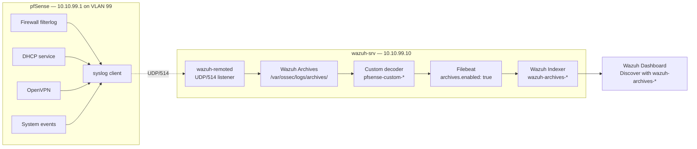

# Phase 4 — SOC Stack pfSense Syslog Integration
 
## Overview
 
The fifth telemetry source of the SOC stack is `pfSense` itself. Adding pfSense as a syslog source transforms the SIEM from *endpoint-centric* to *endpoint+network*: firewall pass/block events, DHCP leases, OpenVPN session lifecycle, and system events all become searchable and correlatable alongside the four agents deployed in Parts 2 and 3. If an attacker compromises a monitored host and disables its Wazuh agent, the network-layer telemetry from pfSense still flows into the SIEM independently — telemetry survives the endpoint.
 
This document covers the syslog transport configuration UDP/514, the activation of Wazuh Archives for storing raw events beyond just alerts, the deployment of a custom decoder that extracts structured fields from filterlog messages, and the OpenSearch index pattern setup that surfaces the archived events in the dashboard.
 
---
 
## Architecture
 

 
The syslog transport travels VLAN 99-internal from `10.10.99.1` (pfSense) to `10.10.99.10:514` (wazuh-srv). Three independent defense layers filter this path: UFW at the OS level restricts by source IP, the `<remote>` block in `ossec.conf` applies `allowed-ips` at the Wazuh application layer, and `local_ip` binds the listener to a specific interface. Once received, events pass through the custom decoder, are stored in the archives (both text and JSON formats), and are shipped by Filebeat to the OpenSearch indexer where they become searchable via the `wazuh-archives-*` index pattern.
 
---
 
## Deployment
 
### 1. UFW — allow UDP/514 from pfSense only
 
The Wazuh manager was configured in Part 1 with a deny-by-default UFW posture. TCP/443 (dashboard), 1514, and 1515 (agents) were opened during agent deployment. Syslog reception on UDP/514 required a separate rule, scoped to the pfSense source IP:
 
```bash
sudo ufw allow proto udp from 10.10.99.1 to any port 514 comment 'pfSense syslog inbound'
sudo ufw status verbose | grep 514
```
 
The `from 10.10.99.1` restriction is deliberate. Opening `to any port 514` without a source filter would turn the SIEM into a receiver of syslog from any host that can route to the VLAN 99 interface — a needless expansion of attack surface. The restriction acts as the first of three defense layers filtering this path.
 
### 2. Wazuh manager — `<remote>` block for syslog
 
The all-in-one installation of Wazuh already includes one `<remote>` block for agent enrollment on TCP/1514–1515. A **second** `<remote>` block was added for syslog reception. The existing block was left unchanged.
 
`/var/ossec/etc/ossec.conf`, inside `<ossec_config>`:
 
```xml
<remote>
  <connection>syslog</connection>
  <port>514</port>
  <protocol>udp</protocol>
  <allowed-ips>10.10.99.1</allowed-ips>
  <local_ip>10.10.99.10</local_ip>
</remote>
```
 
| Field           | Value          | Rationale                                                       |
| --------------- | -------------- | --------------------------------------------------------------- |
| `connection`    | `syslog`       | Distinguishes this block from the agent-facing `secure` block   |
| `port`          | `514`          | Standard syslog port                                            |
| `protocol`      | `udp`          | Standard for syslog; TCP is available if reliability is critical |
| `allowed-ips`   | `10.10.99.1`   | Application-layer filter — Wazuh drops packets from other IPs   |
| `local_ip`      | `10.10.99.10`  | Binds listener to VLAN 99 interface only, not `0.0.0.0`         |
 
The `allowed-ips` restriction is the second defense layer. Even if UFW were relaxed by mistake, packets from unauthorized sources would be dropped at the Wazuh application layer.
 
The `local_ip` restriction is the third defense layer. Rather than binding to `0.0.0.0` (all interfaces), the listener is tied to the VLAN 99 IP explicitly. If a second NIC were added to the manager in a future phase, the listener would not automatically expose itself on that new interface without an explicit configuration change.
 
After saving, the XML was validated and the manager restarted:
 
```bash
sudo xmllint --noout /var/ossec/etc/ossec.conf && echo "XML OK"
sudo systemctl restart wazuh-manager
sleep 5
sudo ss -ulnp | grep 514
```
 
The `ss` command confirmed `wazuh-remoted` listening on `10.10.99.10:514`.
 
### 3. Wazuh Archives — enable `logall` and `logall_json`
 
By default, Wazuh only persists events that trigger alerts (in `wazuh-alerts-*`). All other events pass through the manager and are discarded. For forensic investigation and threat hunting, this is a significant limitation — an event that seemed benign at ingestion time may become interesting weeks later.
 
Wazuh Archives, enabled via two global flags, changes this: **every event received by the manager is persisted**, regardless of whether a rule fired.
 
`/var/ossec/etc/ossec.conf`, inside the `<global>` block:
 
```xml
<global>
  ...
  <logall>yes</logall>
  <logall_json>yes</logall_json>
  ...
</global>
```
 
`logall` writes to `/var/ossec/logs/archives/archives.log` in Wazuh's text format. `logall_json` writes to `archives.json` with structured JSON. Both were enabled to have maximum flexibility for downstream analysis.
 
After restart, the archive files were verified:
 
```bash
sudo ls -la /var/ossec/logs/archives/
sudo tail -5 /var/ossec/logs/archives/archives.log
```
 
Both files were being written continuously, growing at approximately 1–2 MB per hour during normal lab activity.
 
### 4. pfSense — Floating rule for outbound syslog
 
pfSense's default-deny applies to outbound traffic originated by pfSense itself just as it applies to transit traffic. A rule was needed to allow pfSense to reach the manager on UDP/514. The rule was placed in the **Floating** tab with `direction: out`, rather than in the VLAN99 tab, for a specific reason detailed in Troubleshooting #1.
 
`Firewall → Rules → Floating → Add`:
 
| Field            | Value                              |
| ---------------- | ---------------------------------- |
| Action           | Pass                               |
| Quick            | ✓                                  |
| Interface        | VLAN99                             |
| Direction        | out                                |
| Address Family   | IPv4                               |
| Protocol         | UDP                                |
| Source           | This Firewall (self)               |
| Destination      | Single host — `10.10.99.10`        |
| Destination Port | `Syslog (514)` to `Syslog (514)`   |
| Log              | ✓ (for initial verification)       |
| Description      | Allow pfSense → Wazuh syslog       |
 
Save → Apply Changes.
 
### 5. pfSense — Remote Syslog configuration
 
`Status → System Logs → Settings`, section **Remote Logging Options**:
 
| Field                     | Value                                                    |
| ------------------------- | -------------------------------------------------------- |
| Enable Remote Logging     | ✓                                                        |
| Source Address            | **VLAN99**                                               |
| IP Protocol               | IPv4                                                     |
| Remote log servers        | `10.10.99.10:514`                                        |
| Remote Syslog Contents    | System Events, Firewall Events, DHCP Events, VPN Events  |
 
The **Source Address: VLAN99** selection is critical. Without it, pfSense may send syslog packets from any of its interfaces depending on routing decisions, and packets from unexpected sources are dropped by the `allowed-ips` filter on Wazuh. Explicitly binding the syslog source to VLAN 99 ensures the source IP is always `10.10.99.1`, matching the whitelist.
 
The four sub-systems selected cover the operationally relevant surface for SOC L1: firewall pass/block events (most volume, most signal), DHCP leases (host enumeration, rogue device detection), OpenVPN connect/disconnect (correlation with VLAN 20 activity), and system events (pfSense reboots, config changes — audit trail).
 
Save. pfSense applied the change without a reboot.
 
### 6. Custom decoder for filterlog
 
Wazuh includes a built-in decoder for pfSense (`0455-pfsense_decoders.xml` in newer releases). For this deployment, a custom decoder was developed instead, as a pedagogical exercise in understanding Wazuh's decoder XML syntax and the filterlog CSV format. The custom decoder covers the core fields needed for SOC L1 detection queries; a v2 iteration would replace it with the vendor built-in for broader field coverage (rule tracker IDs, TCP flags, IP length).
 
`/var/ossec/etc/decoders/pfsense_custom.xml`:
 
```xml
<decoder name="pfsense-custom-header">
  <prematch>^filterlog\[\d+\]: </prematch>
</decoder>
 
<decoder name="pfsense-custom-ipv4">
  <parent>pfsense-custom-header</parent>
  <regex type="pcre2" offset="after_parent">
    ^.?,(\w+),(\w+),(\w+),(\w+),4,.?,(\w+),\d+,(\d+\.\d+\.\d+\.\d+),(\d+\.\d+\.\d+\.\d+)
  </regex>
  <order>interface, reason, action, direction, protocol, srcip, dstip</order>
</decoder>
 
<decoder name="pfsense-custom-ports">
  <parent>pfsense-custom-header</parent>
  <regex type="pcre2" offset="after_parent">
    ^.?,(\w+),(\w+),(\w+),(\w+),4,.?,(tcp|udp),\d+,(\d+\.\d+\.\d+\.\d+),(\d+\.\d+\.\d+\.\d+),(\d+),(\d+)
  </regex>
  <order>interface, reason, action, direction, protocol, srcip, dstip, srcport, dstport</order>
</decoder>
```
 
The design follows Wazuh's standard parent+children pattern: a lightweight parent that matches the syslog prefix (`filterlog[PID]:`), and two children specialized by protocol family (IPv4 base fields, and IPv4 with ports for TCP/UDP). When Wazuh evaluates an event, the parent matches first, then the children are tried in order until one matches — the pattern with more captured fields wins for TCP/UDP events, while the base IPv4 pattern catches ICMP and other protocols.
 
After creating the file, the manager was restarted and events verified:
 
```bash
sudo systemctl restart wazuh-manager
sleep 8
sudo grep "filterlog" /var/ossec/logs/archives/archives.log | tail -3
```
 
### 7. Dashboard — index pattern for archives
 
Wazuh Dashboard did not include an index pattern for `wazuh-archives-*` by default (only for `wazuh-alerts-*`). Without an index pattern, events land in the OpenSearch indexer but are invisible in Discover — a subtle failure mode covered in Troubleshooting #5.
 
`Menu → Stack Management → Index Patterns → Create index pattern`:
 
| Field                | Value                    |
| -------------------- | ------------------------ |
| Index pattern name   | `wazuh-archives-*`       |
| Time field           | `@timestamp`             |
 
The `*` wildcard was essential. Wazuh creates a new index each day (`wazuh-archives-4.x-YYYY.MM.DD`); a pattern with a hardcoded date matches only that day's events and misses everything before and after.
 
After creation, `Discover` was opened, the new pattern was selected, and events became visible immediately.
 
---
 
## Validation
 
### 1. Transport — UDP/514 reception on wazuh-srv
 
`tcpdump` confirmed pfSense was sending syslog to the manager:
 
```bash
sudo tcpdump -i any -n udp port 514 -c 10
```
 
Sample output:
 
```
IP 10.10.99.1.514 > 10.10.99.10.514: SYSLOG local0.info, length: 140
IP 10.10.99.1.514 > 10.10.99.10.514: SYSLOG local0.info, length: 146
IP 10.10.99.1.514 > 10.10.99.10.514: SYSLOG cron.info,   length: 75
```
 
Source IP `10.10.99.1` (pfSense VLAN 99) → destination `10.10.99.10:514` (Wazuh listener). All packets from the expected source, matching UFW and `allowed-ips` filters.
 
### 2. Archives — events being persisted
 
Filterlog events in the archive file:
 
```bash
sudo grep "filterlog" /var/ossec/logs/archives/archives.log | wc -l
```
 
Returned **542** at time of validation, growing continuously.
 
Sample event:
 
```
2026 Jul 01 11:00:12 wazuh-srv->10.10.99.1 Jul 1 13:00:14 filterlog[94937]:
  107,,,1781988780,em1,match,pass,in,4,0x0,,128,61510,0,DF,6,tcp,52,
  10.10.10.20,20.231.128.67,61038,443,0,S,4054351847,,65535,,mss;nop;wscale;nop;nop;sackOK
```
 
Fields visible in the raw log: rule number (107), tracker ID (1781988780), interface (em1), action (pass), direction (in), protocol (tcp), source (10.10.10.20:61038 → WS-CORP-01 outbound HTTPS), destination (20.231.128.67:443), TCP flags (S — SYN).
 
### 3. Decoder — structured field extraction
 
A dashboard query for `full_log: "filterlog"` on the `wazuh-archives-*` index returned 1,311 events with the custom decoder applied. Sample event fields extracted:
 
| Field              | Value                     |
| ------------------ | ------------------------- |
| `decoder.name`     | `pfsense-custom-header`   |
| `data.interface`   | `em1`                     |
| `data.reason`      | `match`                   |
| `data.action`      | `pass`                    |
| `data.direction`   | `in`                      |
| `data.protocol`    | `tcp`                     |
| `data.srcip`       | `10.10.10.20`             |
| `data.dstip`       | `10.10.99.10`             |
 
Structured field queries were then possible — e.g., `data.action: "block"` filters to only blocked traffic, `data.srcip: "10.10.20.10"` filters to Win11-Dev origin.
 
### 4. End-to-end — synthetic blocked ping
 
To validate the complete pipeline from a controlled event, the intentional VLAN 20 → VLAN 10 segmentation block was tested. From `WS-DEV-01`:
 
```cmd
ping 10.10.10.10
```
 
All four ICMP requests timed out (as designed — the segmentation rule from Phase 4 denies this direction). Within 20 seconds, the dashboard filtered by `data.srcip: "10.10.20.10" and data.action: "block"` returned the four corresponding block events, with `data.protocol: "icmp"` and `data.dstip: "10.10.10.10"`. Every layer of the pipeline (pfSense filterlog → syslog → wazuh-remoted → archives → decoder → indexer → dashboard) confirmed to be operational end-to-end.
 
---
 
## Troubleshooting & Lessons Learned
 
### 1. Floating rule with `direction: out`, not a rule on VLAN99
 
The natural instinct when adding a firewall rule to allow pfSense syslog is to add it to the pfSense interface where the traffic exits — in this case, the VLAN99 tab. This does not work.
 
**Root cause:** pfSense evaluates traffic against interface-tab rules only for packets **entering** that interface from an external host. Traffic **originated by pfSense itself** (like syslog client packets) leaves through an interface but is not evaluated against that interface's tab rules. It is evaluated instead against the **Floating tab with `direction: out`**.
 
The methodology to identify this:
 
| Test                                                       | Result                              |
| ---------------------------------------------------------- | ----------------------------------- |
| `tcpdump` on wazuh-srv for UDP/514                         | No packets arriving                 |
| pfSense firewall log filtered by destination 10.10.99.10   | Block entries with reason "Default" |
| Attempt: add Pass rule in VLAN99 tab (Source → Destination) | No effect — packets still blocked   |
| Attempt: add Floating rule with `direction: out`           | Packets began flowing               |
 
**Solution:** create a Floating rule with `direction: out`, source `This Firewall (self)`, destination `10.10.99.10:514`. See §"Deployment #4" above for the full parameters.
 
**Lesson:** pfSense's rule evaluation model has three contexts: (1) transit traffic evaluated on the ingress interface tab, (2) locally-originated outbound traffic evaluated on Floating with `direction: out`, and (3) inbound to the firewall itself evaluated on the ingress interface. When a rule "should work" but doesn't, the first question to ask is which of these three contexts the traffic falls under.
 
### 2. Source Address selection in pfSense syslog config
 
After adding the Floating rule, syslog packets were reaching wazuh-srv, but with an unexpected source IP — sometimes `10.10.99.1`, sometimes another interface IP depending on pfSense's routing. The `allowed-ips` filter in Wazuh dropped packets from non-`10.10.99.1` sources silently.
 
**Root cause:** pfSense's Remote Logging defaults to `Default (any)` for Source Address, which means the syslog client can bind to whichever interface pfSense's routing prefers at the moment. Under normal conditions this is `10.10.99.1` (since the destination is on VLAN 99), but transient routing changes or interface reconfigurations can shift the source IP.
 
**Solution:** explicitly set **Source Address: VLAN99** in `Status → System Logs → Settings → Remote Logging Options`. This binds the syslog client to the VLAN 99 interface unconditionally.
 
**Lesson:** when a downstream filter is source-IP-specific, the upstream source must be bound explicitly. Relying on "should be that IP" routing assumptions creates a class of intermittent failures that are hard to diagnose because they only appear when routing shifts.
 
### 3. Wazuh Archives not enabled by default
 
Initial dashboard searches for pfSense events returned nothing, even though `tcpdump` confirmed packets arriving. The events were being received by `wazuh-remoted`, decoded, checked against rules — but discarded, because none of them matched a rule that produced an alert.
 
**Root cause:** by default, Wazuh only persists events that fire an alert (`<logall>no</logall>`, `<logall_json>no</logall_json>` in the `<global>` block). Firewall pass events, DHCP lease events, and most other pfSense syslog messages do not fire built-in Wazuh rules — they are legitimate telemetry that has no reason to alert. Wazuh processes them through the decoder and then drops them.
 
**Solution:** enable both archive flags in `<global>`:
 
```xml
<logall>yes</logall>
<logall_json>yes</logall_json>
```
 
The events then persist to `/var/ossec/logs/archives/archives.log` (text) and `archives.json` (JSON). Filebeat ships them to the OpenSearch indexer.
 
**Lesson:** SIEM systems have a fundamental architectural split between **alerts** (rule-triggered, high-signal) and **archives** (raw ingestion, high-volume). For forensic investigation and threat hunting, archives are essential — they let an analyst investigate events that seemed benign at ingestion time. Alert-only storage is efficient but blind to slow-developing patterns.
 
### 4. Filebeat's `archives.enabled` must be true
 
Even with `logall_json` enabled and events in `archives.json`, they did not appear in the OpenSearch indexer. Filebeat's default configuration for the Wazuh module only ships alerts to the indexer; archives are configured separately.
 
**Root cause:** `/etc/filebeat/filebeat.yml` contains the Wazuh module configuration with two independent switches — one for alerts, one for archives. The all-in-one installer enables alerts by default (needed for the dashboard to function) but leaves archives disabled to avoid unnecessary indexer load in deployments that don't need archive search.
 
**Solution:** enable the archives switch:
 
```yaml
filebeat.modules:
  - module: wazuh
    alerts:
      enabled: true
    archives:
      enabled: true    # <— was false
```
 
Restart Filebeat: `sudo systemctl restart filebeat`.
 
**Lesson:** the pipeline from event ingestion to dashboard visibility has multiple hops (`wazuh-remoted → decoder → archives.json → Filebeat → indexer → dashboard`). A gap at any hop breaks visibility. When events "should be there but aren't", verifying each hop in sequence with `sudo tail -f` on the intermediate files and `curl` on the indexer is faster than guessing.
 
### 5. Index pattern with static date vs wildcard
 
After enabling archives and Filebeat archives shipping, events appeared in the indexer but not in Discover — a final gap that was the most confusing to diagnose because everything upstream verified as working.
 
**Root cause:** Wazuh creates a new index per day (`wazuh-archives-4.x-2026.06.30`, `wazuh-archives-4.x-2026.07.01`, etc.). The dashboard's Discover view requires an **index pattern** to map queries to indices. An initial index pattern was created with a hardcoded date (`wazuh-archives-4.x-2026.06.30*`) — this matches only the June 30 index. Today's events (July 1) landed in a different index, invisible to the pattern.
 
The methodology:
 
| Test                                                                    | Result                            |
| ----------------------------------------------------------------------- | --------------------------------- |
| `sudo curl -k https://localhost:9200/_cat/indices \| grep archives`     | Both indices present, both with docs |
| Dashboard filter: `Last 24 hours` on the dated index pattern            | Only yesterday's events visible   |
| Stack Management → Index Patterns                                       | Only `wazuh-archives-4.x-2026.06.30*` existed |
| Create new pattern `wazuh-archives-*` (wildcard)                        | Both indices matched, all events visible |
 
**Solution:** create a new index pattern with the wildcard:
 
```
Name: wazuh-archives-*
Time field: @timestamp
```
 
The wildcard matches all current and future daily indices automatically. No maintenance needed at each day rollover.
 
**Lesson:** OpenSearch/Elasticsearch daily-index rotation is standard practice, and index patterns must be defined with wildcards to survive the daily rollover. A pattern with a specific date is a subtle bug that "works" until midnight and then silently stops matching new events. When events are visible in `_cat/indices` but not in Discover, the index pattern is the first place to check.
 
### 6. Custom decoder vs built-in trade-off (accepted decision)
 
Wazuh ships a built-in decoder for pfSense that covers many more fields (rule tracker IDs, TCP flags, IP length, ICMP types, IP flags, etc.) than the custom decoder used here. The custom decoder was retained instead of switching to the built-in.
 
**Trade-off accepted:**
 
| Aspect                       | Custom decoder (current)              | Built-in decoder                          |
| ---------------------------- | ------------------------------------- | ----------------------------------------- |
| Fields extracted             | 7 (interface, action, protocol, ...) | 15+ (adds rule tracker, TCP flags, ...)   |
| Detection rule compatibility | Custom rules only                    | Vendor-supplied rules match automatically |
| Maintenance                  | Manual updates by operator           | Vendor-maintained with each Wazuh release |
| Pedagogical value            | Demonstrates decoder authoring       | Standard, no custom work                  |
 
For this lab, the custom decoder was kept as a demonstration of the decoder XML syntax and the filterlog CSV format understanding. In a production deployment, the built-in decoder would be preferable — it enables the full Wazuh pfSense rule set to match against extracted fields, providing detection capabilities that the custom decoder can only approximate with hand-written rules.
 
**Roadmap note:** a v2 iteration of this lab would switch to the built-in decoder by removing `/var/ossec/etc/decoders/pfsense_custom.xml` (or renaming to `.bak`) and restarting the manager. The built-in decoder file `/var/ossec/ruleset/decoders/0455-pfsense_decoders.xml` becomes active automatically once no custom decoder is present to compete.
 
**Lesson:** building custom decoders is a valuable exercise for understanding SIEM internals, but production systems favor vendor-maintained decoders that receive updates and match vendor rule sets. Choose custom decoders when the vendor doesn't provide one, or when the source format is proprietary; choose the vendor's decoder for well-known sources like pfSense.
 
---
 
## Result
 
- pfSense syslog transport operational on UDP/514 with three defense layers (UFW source-IP restriction, Wazuh `allowed-ips` application-layer filter, `local_ip` interface binding).
- Floating rule in pfSense with `direction: out` allowing the outbound syslog packets from pfSense to `10.10.99.10:514`.
- Source Address explicitly set to VLAN99 in pfSense Remote Logging, guaranteeing consistent `10.10.99.1` source IP.
- Wazuh Archives enabled globally (`<logall>yes</logall>` + `<logall_json>yes</logall_json>`) — all events persisted regardless of alert status.
- Filebeat configured with `archives.enabled: true` shipping archive events to the OpenSearch indexer.
- Custom decoder `pfsense_custom.xml` extracting 7 structured fields from filterlog messages (interface, reason, action, direction, protocol, srcip, dstip, +ports for TCP/UDP).
- Dashboard index pattern `wazuh-archives-*` (wildcard) covering current and future daily indices automatically.
- Four sub-systems exported: firewall (highest volume, `filterlog` messages), DHCP (lease and offer events), OpenVPN (session lifecycle), system events.
- End-to-end validation with synthetic blocked ping: VLAN 20 → VLAN 10 ICMP timeouts appear in the dashboard within 20 seconds with `data.action: "block"`, `data.protocol: "icmp"`.
- 1,311 pfSense events indexed and searchable at time of validation, growing continuously.
- Six troubleshooting entries documented with methodology: Floating rule direction, Source Address binding, Archives global flags, Filebeat archives switch, index pattern wildcard vs date, custom vs built-in decoder trade-off.
- **Phase 5 complete**: five telemetry sources feeding the SIEM (DC01, WS-CORP-01, WS-DEV-01, ws-dev-02, pfSense), covering endpoint + network layer across all trust zones.
---
 
## Screenshots
 
| Screenshot | Description |
| ---------- | ----------- |
|  | `ss -ulnp \| grep 514` confirming wazuh-remoted binding to `10.10.99.10:514` |
|  | UDP/514 traffic from `10.10.99.1` to `10.10.99.10` in `tcpdump` output |
|  | The Floating rule with `direction: out` allowing syslog outbound |
|  | Remote Logging Options with Source Address: VLAN99 and four sub-systems selected |
|  | `ls -la /var/ossec/logs/archives/` showing archives.log and archives.json growing |
|  | `filebeat.yml` with `archives.enabled: true` |
|  | `pfsense_custom.xml` with parent + children decoders |
|  | Creating `wazuh-archives-*` in Stack Management |
|  | Discover showing 1,311 filterlog events with the custom decoder applied |
|  | An individual event with `data.action`, `data.srcip`, `data.dstip` populated |
|  | The synthetic VLAN 20 → VLAN 10 block appearing in the dashboard |
 
---
 
*Previous: [Phase 5 — SOC Stack (Part 3: Linux Agent + auditd)](03-linux-agent.md)*
*Next: [Phase 5 — SOC Stack (Part 5: SOC L1 Overview Dashboard)](05-soc-dashboard.md)*
