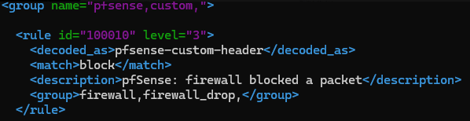
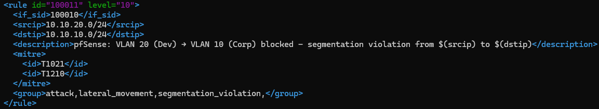
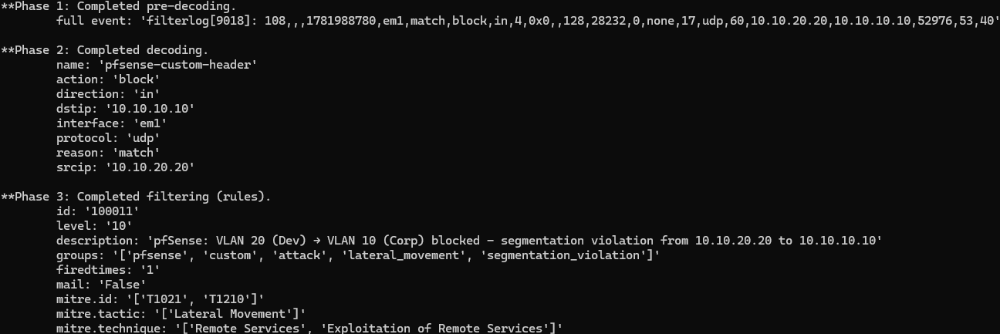
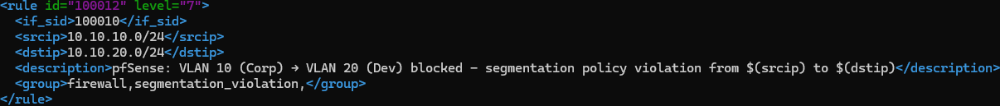

# Phase 5 — SOC Stack SOC L1 Overview Dashboard
 
## Overview
 
Parts 1 through 4 deployed the SIEM infrastructure: manager, three Windows agents, one Linux agent, and pfSense syslog integration. Five telemetry sources feeding a shared indexer. But telemetry alone is not a SOC, it is a data pipeline. This document builds the layer that turns the pipeline into an operational tool: **detection rules** that transform raw events into meaningful alerts, and a **single-pane dashboard** designed for a Level 1 analyst's daily workflow.
 
The narrative of this document is the transition from *"we have logs"* to *"we have visibility"*. Two custom detection rules were written to identify network-segmentation violations from pfSense telemetry (converting the passive firewall drops into active alerts with MITRE ATT&CK mapping). Seven visualizations were built on the `wazuh-alerts-*` index, each answering a specific question a L1 analyst asks during a shift. Finally, the seven were composed into a single **SOC L1 Overview** dashboard with a four-row layout matching the natural reading order of an incident triage.

## Dashboard Overview

The dashboard is built exclusively over `wazuh-alerts-*`, the index that holds only events that triggered a rule, to ingest pfSense Firewall events which are originally routed to wazuh-archives into wazuh-alerts, I created custom Wazuh rules.

## Custom detection rules
 
### Context — from Archives to Alerts
 
At the end of Part 4, pfSense telemetry was flowing to `wazuh-archives-*`: filterlog events, DHCP leases, OpenVPN sessions. None of these were reaching `wazuh-alerts-*` because Wazuh's built-in ruleset does not fire alerts on generic pfSense pass/block events by default. To make network telemetry actionable for a SOC L1, custom detection rules were needed that identify **specifically the network behaviors that matter** in this lab's threat model.
 
The lab's segmentation architecture defines VLAN 20 (Dev) and VLAN 10 (Corp) as isolated trust zones. Cross-VLAN traffic is denied by default at pfSense. Any packet blocked between these VLANs is by definition a **policy violation** — either an attack (lateral movement attempt from a compromised host) or a misconfiguration (a service or user trying to reach an endpoint they shouldn't). Both are events a L1 analyst wants to see, but they should not be treated identically.
 
Two custom rules were written to encode this logic.

### Rule 100010 — pfSense block base rule

The parent rule matches any pfSense event where the action is `block`. It fires at level 3 (informational). 

The `<decoded_as>pfsense-custom-header</decoded_as>` conditional ensures the rule only evaluates events already decoded by the custom decoder from Part 4 (the parent decoder that matches `filterlog[PID]:`). The `<match>block</match>` string check finds the word "block" in the raw event. Together they identify any pfSense-originated firewall block, regardless of source, destination, or protocol.

Level 3 is deliberate — an alert on every firewall block would generate hundreds per hour in normal lab operation.

### Rule 100011 — VLAN 20 → VLAN 10 segmentation violation

The specialization rule detects the specific case that matters most: a host in the Dev network attempting to reach the Corp network. This direction is the canonical **lateral movement** pattern — an attacker who has established a foothold in a less-trusted environment attempting to pivot toward more-valuable systems (Active Directory, DC01, corporate workstations).

### Local rule validation

Rules were validated with `wazuh-logtest` before deployment. A representative pfSense filterlog event triggered the expected outcome:

The interpolated description with actual IPs, the resolved MITRE tactic and technique names, and the correct level 10 severity confirmed the rule structure.

### Rule 100012 — The reverse-direction rule 

A third rule (id 100012) covering VLAN 10 → VLAN 20 (Corp attempting to reach Dev) was scoped and documented but not deployed. This direction is treated asymmetrically because the threat model is different: Corp attempting to reach Dev is more commonly a legitimate operational mistake (misconfigured service, user error) than a lateral movement attempt. 

Note the differences from rule 100011: level 7 (Low-Medium instead of Medium-High), no MITRE mapping (the direction does not cleanly correspond to an ATT&CK technique), and description phrasing ("policy violation" vs "lateral movement"). This asymmetric severity is the encoded threat model — not every segmentation violation is equally suspicious.

## Dashboard visualizations

