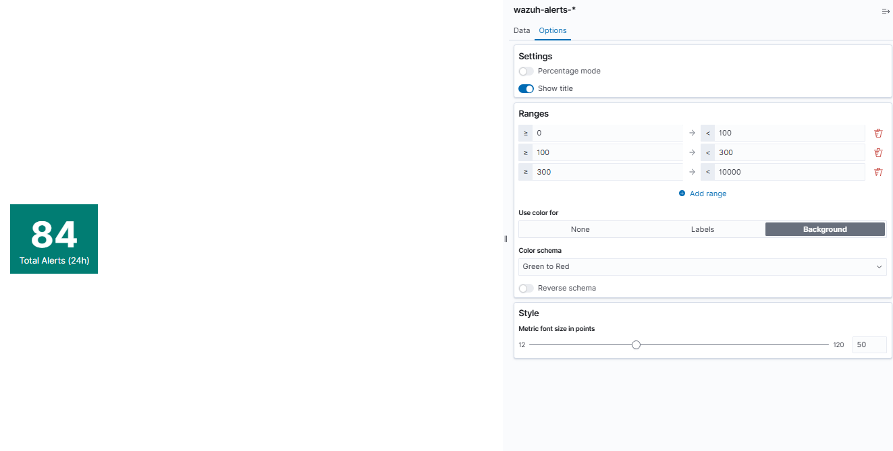
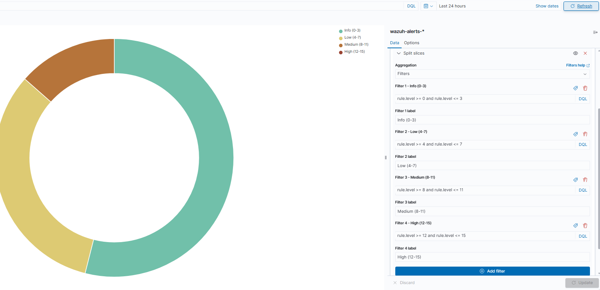
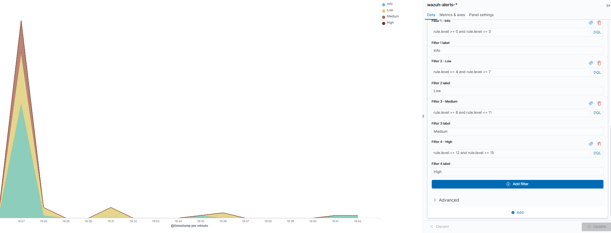
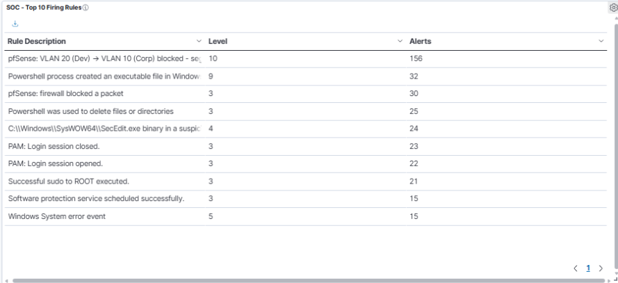
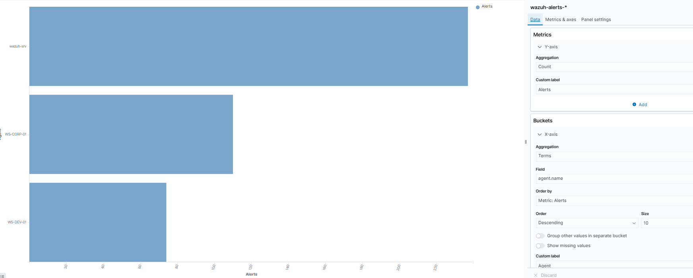
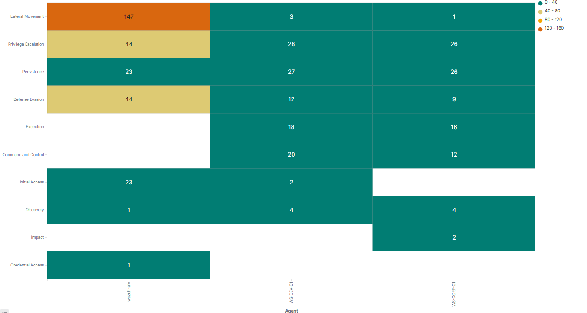
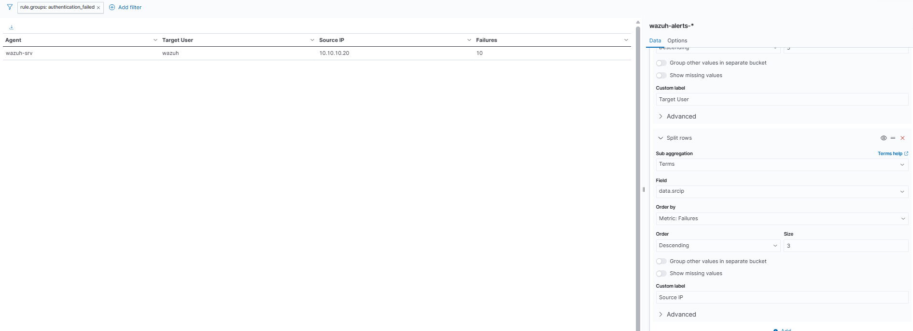

# Phase 2 — Part 5: SOC Stack SOC L1 Overview Dashboard
 
## Overview
 
Parts 1 through 4 deployed the SIEM infrastructure: manager, three Windows agents, one Linux agent, and pfSense syslog integration. Five telemetry sources feeding a shared indexer. But telemetry alone is not a SOC, it is a data pipeline. This document builds the layer that turns the pipeline into an operational tool: **detection rules** that transform raw events into meaningful alerts, and a **single-pane dashboard** designed for a Level 1 analyst's daily workflow.
 
The narrative of this document is the transition from *"we have logs"* to *"we have visibility"*. Two custom detection rules were written to identify network-segmentation violations from pfSense telemetry (converting the passive firewall drops into active alerts with MITRE ATT&CK mapping). Seven visualizations were built on the `wazuh-alerts-*` index, each answering a specific question a L1 analyst asks during a shift. Finally, the seven were composed into a single **SOC L1 Overview** dashboard with a four-row layout matching the natural reading order of an incident triage.

## Dashboard Overview

The dashboard is built exclusively over `wazuh-alerts-*`, the index that holds only events that triggered a rule, to ingest pfSense Firewall events which are originally routed to wazuh-archives into wazuh-alerts, I created custom Wazuh rules.

## Custom detection rules
 
### Context — from Archives to Alerts
 
At the end of Part 4, pfSense telemetry was flowing to `wazuh-archives-*`: filterlog events, DHCP leases, OpenVPN sessions. None of these were reaching `wazuh-alerts-*` because Wazuh's built-in ruleset does not fire alerts on generic pfSense pass/block events by default. To make network telemetry actionable for a SOC L1, custom detection rules were needed that identify **specifically the network behaviors that matter** in this lab's threat model.
 
The lab's segmentation architecture defines VLAN 20 (Dev) and VLAN 10 (Corp) as isolated trust zones. Cross-VLAN traffic is denied by default at pfSense. Any packet blocked between these VLANs is by definition a **policy violation** — either an attack (lateral movement attempt from a compromised host) or a misconfiguration (a service or user trying to reach an endpoint they shouldn't). Both are events a L1 analyst wants to see, but they should not be treated identically.
 
Two custom rules were written to encode this logic.

### Rule 100010 — pfSense block base rule

The parent rule matches any pfSense event where the action is `block`. It fires at level 3 (informational). 

The `<decoded_as>pfsense-custom-header</decoded_as>` conditional ensures the rule only evaluates events already decoded by the custom decoder from Part 4 (the parent decoder that matches `filterlog[PID]:`). The `<match>block</match>` string check finds the word "block" in the raw event. Together they identify any pfSense-originated firewall block, regardless of source, destination, or protocol.

Level 3 is deliberate — an alert on every firewall block would generate hundreds per hour in normal lab operation.

### Rule 100011 — VLAN 20 → VLAN 10 segmentation violation

The specialization rule detects the specific case that matters most: a host in the Dev network attempting to reach the Corp network. This direction is the canonical **lateral movement** pattern — an attacker who has established a foothold in a less-trusted environment attempting to pivot toward more-valuable systems (Active Directory, DC01, corporate workstations).

### Local rule validation

Rules were validated with `wazuh-logtest` before deployment. A representative pfSense filterlog event triggered the expected outcome:

The interpolated description with actual IPs, the resolved MITRE tactic and technique names, and the correct level 10 severity confirmed the rule structure.

### Rule 100012 — The reverse-direction rule 

A third rule (id 100012) covering VLAN 10 → VLAN 20 (Corp attempting to reach Dev) was scoped and documented but not deployed. This direction is treated asymmetrically because the threat model is different: Corp attempting to reach Dev is more commonly a legitimate operational mistake (misconfigured service, user error) than a lateral movement attempt. 

Note the differences from rule 100011: level 7 (Low-Medium instead of Medium-High), no MITRE mapping (the direction does not cleanly correspond to an ATT&CK technique), and description phrasing ("policy violation" vs "lateral movement"). This asymmetric severity is the encoded threat model — not every segmentation violation is equally suspicious.

## Dashboard visualizations

Seven visualizations were built, each targeting a specific question a L1 analyst asks during triage. The `wazuh-alerts-*` index pattern is used throughout. All widgets respect the dashboard's global timeframe filter (defaulting to Last 24 Hours).Seven visualizations were built, each targeting a specific question a L1 analyst asks during triage. The `wazuh-alerts-*` index pattern is used throughout. All widgets respect the dashboard's global timeframe filter (defaulting to Last 24 Hours).

### 1. Total Alerts (24h) — Metric widget

**Question answered:** *"Is the current alert volume normal, elevated, or anomalous?"*

A single large number showing the count of alerts in the selected timeframe, with a color-coded background driven by configurable thresholds:

| Range | Color | Meaning |
| --- | --- | --- |
| 0-100 | Green | Baseline operational volume |
| 100-300 | Yellow | Elevated — worth investigating |
| 300+ | Red | Anomalous — active investigation required |

### 2. Alerts by Severity — Pie chart

**Question answered:** *"Is the alert volume dominated by low-severity noise or by high-severity events that need attention?"*

A pie chart with four slices corresponding to Wazuh's severity bands. Implementation uses the `Filters` bucket aggregation rather than `Range` — each slice is a DQL query with a custom label:
 
| DQL query                                          | Label            |
| -------------------------------------------------- | ---------------- |
| `rule.level >= 0 and rule.level <= 3`              | Info (0-3)       |
| `rule.level >= 4 and rule.level <= 7`              | Low (4-7)        |
| `rule.level >= 8 and rule.level <= 11`             | Medium (8-11)    |
| `rule.level >= 12 and rule.level <= 15`            | High (12-15)     |

### 3. Alerts Timeline — Area chart
 
**Question answered:** *"When did alerts fire? Are there anomalous spikes outside expected activity windows?"*
 
An area chart with `@timestamp` on the X-axis (Date Histogram, Auto interval) and Count on the Y-axis. A `Split series` bucket further breaks each time interval into severity bands (same four Filters as the pie chart), producing a stacked area chart where each color represents a severity level over time.

At validation time the chart shows a clear pattern: near-zero activity for most of the timeframe, then a massive spike around 21:00 when the rule 100011 testing was performed.

### 4. Top 10 Firing Rules — Data table

**Question answered:** *"Which rules are generating the most alerts? Is anything anomalous, or is a rule misconfigured?"*
 
A data table with three columns: Rule Description, Level, and Alerts (count). Configuration uses `Split rows` with a `Terms` aggregation on `rule.description` (size 10, ordered by Count descending), plus a sub-bucket on `rule.level` (size 1) to add the Level column.
 
The table at validation time reveals immediately that the custom detection engineering is working:
 
| Rule Description                                                | Level | Alerts |
| --------------------------------------------------------------- | ----- | ------ |
| pfSense: VLAN 20 (Dev) → VLAN 10 (Corp) blocked ...             | 10    | 156    |
| Powershell process created an executable file in Windows ...    | 9     | 32     |
| pfSense: firewall blocked a packet                              | 3     | 30     |
| Powershell was used to delete files or directories              | 3     | 25     |
| C:\\Windows\\SysWOW64\\SecEdit.exe binary in a suspicious ...   | 4     | 24     |
| PAM: Login session closed.                                      | 3     | 23     |
| PAM: Login session opened.                                      | 3     | 22     |
| Successful sudo to ROOT executed.                               | 3     | 21     |

 
**Rule 100011 (custom) is the top firing rule with 156 hits**, more than four times the second-place rule. This is not a bug. In a production environment, a rule generating 4x more than the second-place rule would prompt investigation ("why is this rule so noisy? is it miscalibrated?"). Here, the volume is expected because rule 100011 detects exactly the events being tested.

### 5. Top Agents by Alert Volume — Horizontal bar chart
 
**Question answered:** *"Which host is generating the most alerts? Is it justified by its role, or is something unusual happening on that host?"*
 
A horizontal bar chart with `agent.name` on the Y-axis (Terms aggregation, ordered by Count descending, size 10) and Count on the X-axis.
 
The distribution at validation time:
 
| Agent       | Approximate Alerts |
| ----------- | ------------------ |
| wazuh-srv   | ~230               |
| WS-DEV-01   | ~115               |
| WS-CORP-01  | ~75               |

 
`wazuh-srv` appearing at the top is expected — the manager also runs a local agent monitoring itself, so PAM sessions, sudo events, and the failed authentication tests during Part 5 development are all attributed to it.

A L1 analyst uses this widget to detect **anomalous host activity**: an agent that normally generates 20 alerts per day but suddenly generates 500 is a strong signal of compromise or misconfiguration.

### 6. MITRE ATT&CK Tactics Coverage — Heat map
 
**Question answered:** *"Which MITRE ATT&CK tactics are being observed across the environment, and on which hosts?"*
 
A heat map with `rule.mitre.tactic` on the Y-axis (Terms aggregation, size 12) and `agent.name` on the X-axis (Terms aggregation). Cell intensity is the alert count, using a Green-to-Red color schema where green indicates low activity and red indicates high activity.
 
This widget is the visual centerpiece of the dashboard because it maps detection activity to the industry-standard threat framework. At validation time it shows:
 
- **Lateral Movement** with 147 alerts on `wazuh-srv` in strong orange — direct consequence of rule 100011 firings (T1021 mapping)
- **Privilege Escalation** at 44/28/26 across hosts — from auditd priv_esc detections on ws-dev-02 and sudo events on Windows
- **Persistence** at 23/27/26 — Active Directory and registry events
- **Defense Evasion** at 44/12/9 — Sysmon detecting Windows techniques
- **Command and Control** at 20/12 — Sysmon detecting PowerShell activity
- **Initial Access, Credential Access, Discovery, Impact** — at 23/2, showing framework coverage across multiple techniques

### 7. Failed Authentications — Data table
 
**Question answered:** *"Is anyone attempting to authenticate and failing? Where from? Against which accounts?"*
 
A data table filtered by `rule.groups: "authentication_failed"`, with three grouping columns: Agent, Target User (`data.dstuser`), Source IP (`data.srcip`), and a Failures count column.
 
The filter `rule.groups: "authentication_failed"` is critical to the widget's usefulness. Without it, the table would include all authentication events (successful and failed sudo, PAM opens/closes, etc.), turning it into noise. With the filter, the table only shows events where a failed authentication was detected, the actual signal a L1 analyst looks for.

 
At validation time the widget shows one row: `wazuh-srv` / `wazuh` / `10.10.10.20` with 10 failures, corresponding to the synthetic failed sudo tests performed during Part 5 development. In a lab at baseline, the table would be empty, which is **exactly what a healthy operational environment looks like**. Empty tables in this widget are a feature, not a bug, they signal that no active credential attack is in progress. Populated tables are what warrant attention.

---

## Dashboard composition
 
The seven visualizations were composed into a single dashboard named **SOC L1 Overview**. Layout was designed around the natural reading order of an incident triage: rapid situational awareness first, then temporal context, then operational detail, then investigation-ready detail.

### Design decision — alerts-only, not archives
 
Every widget in the dashboard uses `wazuh-alerts-*` as its data source, deliberately excluding `wazuh-archives-*`. This choice implements a foundational SIEM operational principle: **alerts are events that required detection logic to identify**, while archives are the raw substrate.

---

### Global filters and timeframe
 
The dashboard supports global filters that affect all widgets simultaneously. Common filter patterns:
 
| Filter                                        | Use case                                             |
| --------------------------------------------- | ---------------------------------------------------- |
| `agent.name: "WS-CORP-01"`                    | Focus on a specific host during investigation        |
| `rule.level >= 8`                             | Hide Info/Low noise, see only Medium+ alerts         |
| `rule.groups: "segmentation_violation"`       | Focus on network-policy alerts specifically          |
| `rule.mitre.tactic: "Lateral Movement"`       | Investigate tactic-specific activity across hosts    |

 
---

## Result
 
- Two custom Wazuh detection rules deployed: 100010 (parent: any pfSense block, level 3) and 100011 (VLAN 20 → VLAN 10 segmentation violation, level 10, MITRE T1021/T1210).
- Rules validated via `wazuh-logtest` with correct decoder, level, description interpolation, and MITRE tactic resolution.
- Deployment gotcha documented and resolved: `<field name="action">` rejected as static field, corrected to `<match>` string check.
- Roadmap documented for rule 100012 (reverse direction VLAN 10 → VLAN 20 at level 7 with different threat model interpretation).
- Seven Wazuh visualizations built on `wazuh-alerts-*` index pattern, each answering a specific SOC L1 triage question.
- Visualizations composed into a single **SOC L1 Overview** dashboard with a four-row semantic layout (rapid awareness → temporal → operational → investigation).
- Design decision documented: alerts-only data source, deliberately excluding archives to keep the dashboard focused on actionable events.
- Global filters and unbound timeframe by design, supporting both real-time triage and historical analysis.
- End-to-end validation: synthetic VLAN 20 → VLAN 10 ping generated four alerts visible across all seven widgets within 20 seconds.
- Directional specificity of rule 100011 confirmed via reverse-direction test (rule does not fire for VLAN 10 → VLAN 20, only parent rule 100010 does at level 3).
- Phase 5 complete: five telemetry sources, custom detection engineering, single-pane operational dashboard with MITRE ATT&CK integration.

---
 
*Previous: [Phase 4 — SOC Stack pfSense Syslog Integration](04-pfsense-syslog.md)*
*Next: Attacker Environment (VLAN 66 + Kali Linux)*

