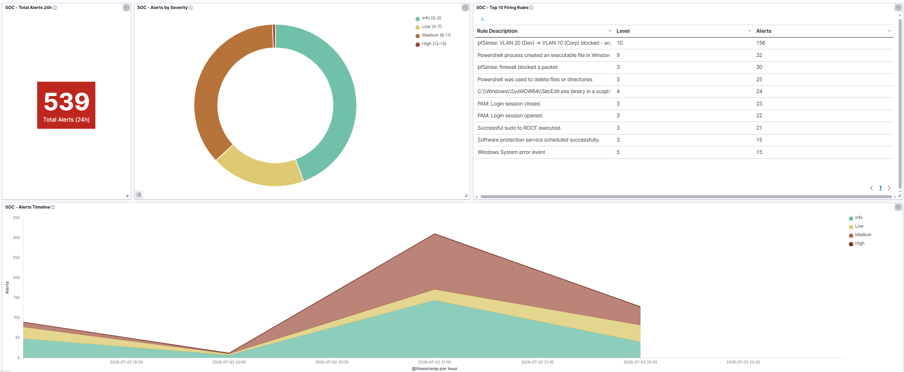
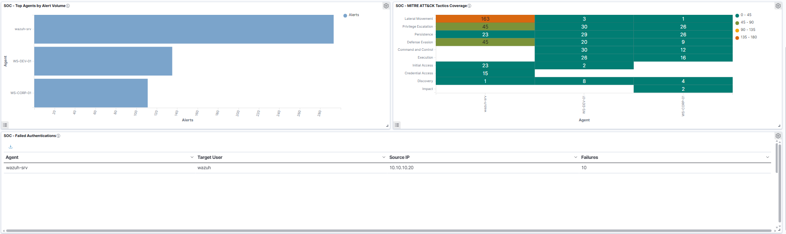

# Phase 5 — SOC Stack SOC L1 Overview Dashboard
 
## Overview
 
Parts 1 through 4 deployed the SIEM infrastructure: manager, three Windows agents, one Linux agent, and pfSense syslog integration. Five telemetry sources feeding a shared indexer. But telemetry alone is not a SOC, it is a data pipeline. This document builds the layer that turns the pipeline into an operational tool: **detection rules** that transform raw events into meaningful alerts, and a **single-pane dashboard** designed for a Level 1 analyst's daily workflow.
 
The narrative of this document is the transition from *"we have logs"* to *"we have visibility"*. Two custom detection rules were written to identify network-segmentation violations from pfSense telemetry (converting the passive firewall drops into active alerts with MITRE ATT&CK mapping). Seven visualizations were built on the `wazuh-alerts-*` index, each answering a specific question a L1 analyst asks during a shift. Finally, the seven were composed into a single **SOC L1 Overview** dashboard with a four-row layout matching the natural reading order of an incident triage.

## Dashboard Overview

