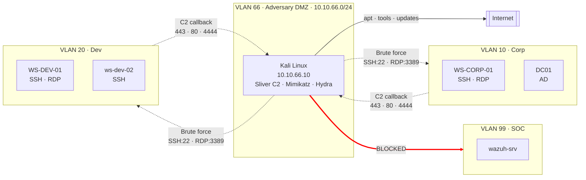
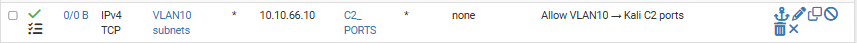
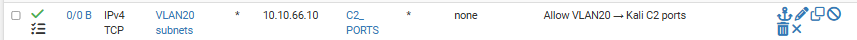
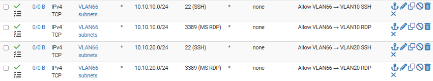

# Phase 3 — Adversary Environment
 
## Overview
 
Phases 1 and 2 built the defender's environment: pfSense as the network perimeter, segmented VLANs for Corp and Dev, an SOC stack with five telemetry sources, custom detection rules, and an operational dashboard. Phase 3 shifts perspective. It stops asking *"how do I detect?"* and starts asking *"what do I need to detect?"*.
 
The paradigm chosen is **Assume Breach**: rather than modelling an external attacker at the perimeter (a scenario where modern defences like CDN edge protection, cloud WAFs, and provider-side DDoS mitigation absorb most of the work), the lab models the moment **after the perimeter has already failed**. Kali Linux is not "attacker on the Internet". Kali is **an attacker who has already established a foothold inside the environment** — through a compromised endpoint, a stolen VPN credential, or a phishing-delivered implant. The defender's job is not to prevent the initial breach in this lab. It is to detect the activity that follows.
 
Assume Breach labs demonstrate that the operator understands **post-compromise detection**: lateral movement, credential theft, command-and-control, persistence, discovery. These are the tactics MITRE ATT&CK covers in depth, the tactics that SOC L1 analysts triage daily, and the tactics that mature threat detection is built around.
 
Three attack vectors were modelled to bring the attacker into the environment. Each vector represents a specific real-world entry path and dictates a specific capability envelope for Kali: what it can reach, what it can send, and what it cannot touch. The pfSense firewall rules that implement this envelope are the technical embodiment of the threat model — every rule maps to a vector, and every deny rule maps to a boundary the attacker should not be able to cross.

---
 
## Architecture

The dashed arrows are **allowed attack paths**, the capabilities Kali needs to execute the three modelled vectors. Solid arrows are legitimate traffic (Internet for tool downloads). The crossed-out arrow to VLAN 99 (SOC) is an **immutable boundary**: no rule, in any direction, allows Kali to reach the SIEM. This asymmetry is deliberate, the defender's tooling must remain outside the attacker's reach even under Assume Breach.

---
 
## Threat model — three attack vectors
 
Each vector is modelled by a specific configuration of firewall rules that permits the traffic pattern the vector requires, while denying everything else.
 
### Vector 1 — Phishing to command-and-control
 
**Real-world scenario:** A user in the Corp environment opens a phishing email, executes the attached document, and a payload installs on their workstation. The payload initiates an outbound HTTPS connection to a command-and-control server on the Internet.
 
**Lab modelling:** WS-CORP-01 (or any endpoint) runs a Sliver-generated implant. The implant is configured to callback to `10.10.66.10` on TCP 443 (or 80, 4444, 8080). Kali receives the callback and issues commands.
 
**Firewall requirements:** VLAN 10 (and VLAN 20) endpoints must be able to **initiate outbound TCP** connections to Kali on the C2 ports. This is contrary to the "Kali cannot reach internal networks" isolation from Vector 2 — here, the internal endpoint reaches out to Kali, not the other way around. The firewall must permit VLAN 10/20 → VLAN 66 on the specific C2 ports.
 
**Rule that enables this vector:**

Every alert generated by this rule in the SIEM is intentional telemetry — the SOC L1 sees a workstation reaching out to a suspicious IP on an unusual port, which is exactly the pattern that indicates C2 activity in production.

### Vector 2 — Brute force SSH and RDP
 
**Real-world scenario:** An attacker who has established initial access (perhaps through a different vector, or through a compromised network device) discovers accessible SSH and RDP services and attempts credential attacks — dictionary attacks, credential spraying, targeted account brute forcing.
 
**Lab modelling:** Kali uses hydra, nxc/crackmapexec, or Metasploit modules to attempt authentication against SSH on ws-dev-02 (Linux), SSH on WS-CORP-01 (Windows with OpenSSH server enabled), and RDP on WS-CORP-01. Each attempt generates authentication failure events consumed by the SIEM.
 
**Firewall requirements:** Kali must be able to **initiate outbound TCP** connections to VLAN 10 and VLAN 20 on ports 22 and 3389. Other ports are not needed for this vector and remain blocked.
 
**Rules that enable this vector:**

### Vector 3 — Stolen VPN credentials
 
**Real-world scenario:** A remote employee's VPN credentials leak through a breach on an unrelated service, a phishing site, or malware. The attacker uses the credentials to authenticate to the corporate VPN as if they were the legitimate employee.
 
**Lab modelling:** Kali runs an OpenVPN client, connects to pfSense's OpenVPN server on WAN UDP 1194, authenticates with "stolen" credentials (in the lab, these are credentials provisioned specifically for the attacker scenario). Once the tunnel is up, Kali obtains an IP in the VPN tunnel network and is treated by the network as a legitimate remote worker.
 
**Firewall requirement:** Kali must be able to reach pfSense's WAN interface on UDP 1194. This is the only inbound-facing service Kali is permitted to reach on the firewall itself.
 
**Rule that enables this vector:**

---
