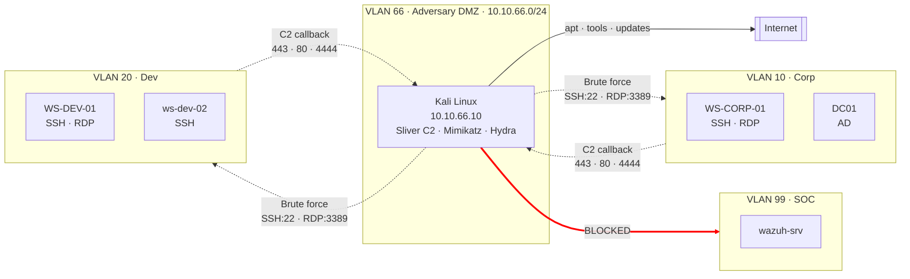

# Phase 3 — Adversary Environment
 
## Overview
 
Phases 1 and 2 built the defender's environment: pfSense as the network perimeter, segmented VLANs for Corp and Dev, an SOC stack with five telemetry sources, custom detection rules, and an operational dashboard. Phase 3 shifts perspective. It stops asking *"how do I detect?"* and starts asking *"what do I need to detect?"*.
 
The paradigm chosen is **Assume Breach**: rather than modelling an external attacker at the perimeter (a scenario where modern defences like CDN edge protection, cloud WAFs, and provider-side DDoS mitigation absorb most of the work), the lab models the moment **after the perimeter has already failed**. Kali Linux is not "attacker on the Internet". Kali is **an attacker who has already established a foothold inside the environment** — through a compromised endpoint, a stolen VPN credential, or a phishing-delivered implant. The defender's job is not to prevent the initial breach in this lab. It is to detect the activity that follows.
 
Assume Breach labs demonstrate that the operator understands **post-compromise detection**: lateral movement, credential theft, command-and-control, persistence, discovery. These are the tactics MITRE ATT&CK covers in depth, the tactics that SOC L1 analysts triage daily, and the tactics that mature threat detection is built around.
 
Three attack vectors were modelled to bring the attacker into the environment. Each vector represents a specific real-world entry path and dictates a specific capability envelope for Kali: what it can reach, what it can send, and what it cannot touch. The pfSense firewall rules that implement this envelope are the technical embodiment of the threat model — every rule maps to a vector, and every deny rule maps to a boundary the attacker should not be able to cross.

---
 
## Architecture

The dashed arrows are **allowed attack paths**, the capabilities Kali needs to execute the three modelled vectors. Solid arrows are legitimate traffic (Internet for tool downloads). The crossed-out arrow to VLAN 99 (SOC) is an **immutable boundary**: no rule, in any direction, allows Kali to reach the SIEM. This asymmetry is deliberate — the defender's tooling must remain outside the attacker's reach even under Assume Breach.

 
---
