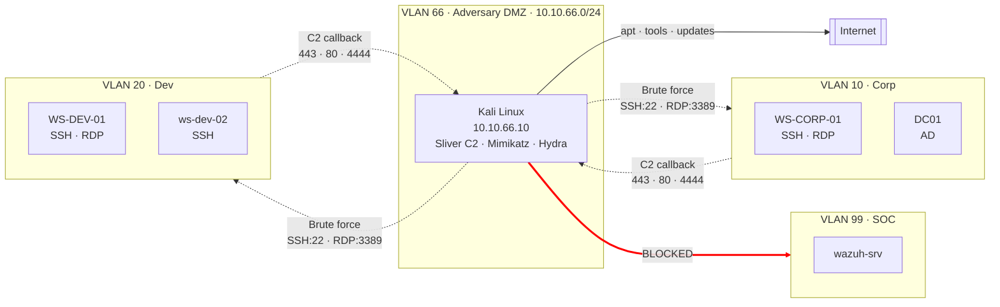
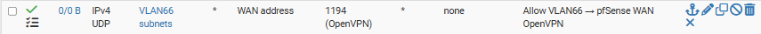
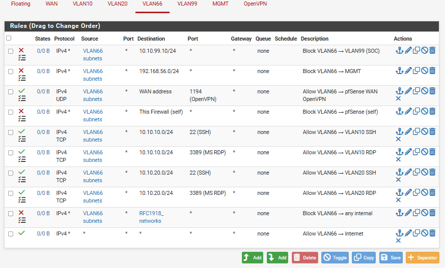
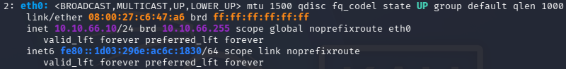
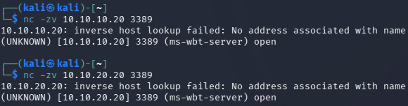
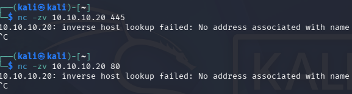
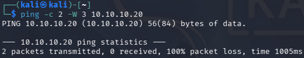

# Phase 3 — Adversary Environment
 
## Overview
 
Phases 1 and 2 built the defender's environment: pfSense as the network perimeter, segmented VLANs for Corp and Dev, an SOC stack with five telemetry sources, custom detection rules, and an operational dashboard. Phase 3 shifts perspective. It stops asking *"how do I detect?"* and starts asking *"what do I need to detect?"*.
 
The paradigm chosen is **Assume Breach**: rather than modelling an external attacker at the perimeter (a scenario where modern defences like CDN edge protection, cloud WAFs, and provider-side DDoS mitigation absorb most of the work), the lab models the moment **after the perimeter has already failed**. Kali Linux is not "attacker on the Internet". Kali is **an attacker who has already established a foothold inside the environment** — through a compromised endpoint, a stolen VPN credential, or a phishing-delivered implant. The defender's job is not to prevent the initial breach in this lab. It is to detect the activity that follows.
 
Assume Breach labs demonstrate that the operator understands **post-compromise detection**: lateral movement, credential theft, command-and-control, persistence, discovery. These are the tactics MITRE ATT&CK covers in depth, the tactics that SOC L1 analysts triage daily, and the tactics that mature threat detection is built around.
 
Three attack vectors were modelled to bring the attacker into the environment. Each vector represents a specific real-world entry path and dictates a specific capability envelope for Kali: what it can reach, what it can send, and what it cannot touch. The pfSense firewall rules that implement this envelope are the technical embodiment of the threat model — every rule maps to a vector, and every deny rule maps to a boundary the attacker should not be able to cross.

---
 
## Architecture

The dashed arrows are **allowed attack paths**, the capabilities Kali needs to execute the three modelled vectors. Solid arrows are legitimate traffic (Internet for tool downloads). The crossed-out arrow to VLAN 99 (SOC) is an **immutable boundary**: no rule, in any direction, allows Kali to reach the SIEM. This asymmetry is deliberate, the defender's tooling must remain outside the attacker's reach even under Assume Breach.

---
 
## Threat model — three attack vectors
 
Each vector is modelled by a specific configuration of firewall rules that permits the traffic pattern the vector requires, while denying everything else.
 
### Vector 1 — Phishing to command-and-control
 
**Real-world scenario:** A user in the Corp environment opens a phishing email, executes the attached document, and a payload installs on their workstation. The payload initiates an outbound HTTPS connection to a command-and-control server on the Internet.
 
**Lab modelling:** WS-CORP-01 (or any endpoint) runs a Sliver-generated implant. The implant is configured to callback to `10.10.66.10` on TCP 443 (or 80, 4444, 8080). Kali receives the callback and issues commands.
 
**Firewall requirements:** VLAN 10 (and VLAN 20) endpoints must be able to **initiate outbound TCP** connections to Kali on the C2 ports. This is contrary to the "Kali cannot reach internal networks" isolation from Vector 2 — here, the internal endpoint reaches out to Kali, not the other way around. The firewall must permit VLAN 10/20 → VLAN 66 on the specific C2 ports.
 
**Rule that enables this vector:**

Every alert generated by this rule in the SIEM is intentional telemetry — the SOC L1 sees a workstation reaching out to a suspicious IP on an unusual port, which is exactly the pattern that indicates C2 activity in production.

### Vector 2 — Brute force SSH and RDP
 
**Real-world scenario:** An attacker who has established initial access (perhaps through a different vector, or through a compromised network device) discovers accessible SSH and RDP services and attempts credential attacks — dictionary attacks, credential spraying, targeted account brute forcing.
 
**Lab modelling:** Kali uses hydra, nxc/crackmapexec, or Metasploit modules to attempt authentication against SSH on ws-dev-02 (Linux), SSH on WS-CORP-01 (Windows with OpenSSH server enabled), and RDP on WS-CORP-01. Each attempt generates authentication failure events consumed by the SIEM.
 
**Firewall requirements:** Kali must be able to **initiate outbound TCP** connections to VLAN 10 and VLAN 20 on ports 22 and 3389. Other ports are not needed for this vector and remain blocked.
 
**Rules that enable this vector:**

### Vector 3 — Stolen VPN credentials
 
**Real-world scenario:** A remote employee's VPN credentials leak through a breach on an unrelated service, a phishing site, or malware. The attacker uses the credentials to authenticate to the corporate VPN as if they were the legitimate employee.
 
**Lab modelling:** Kali runs an OpenVPN client, connects to pfSense's OpenVPN server on WAN UDP 1194, authenticates with "stolen" credentials (in the lab, these are credentials provisioned specifically for the attacker scenario). Once the tunnel is up, Kali obtains an IP in the VPN tunnel network and is treated by the network as a legitimate remote worker.
 
**Firewall requirement:** Kali must be able to reach pfSense's WAN interface on UDP 1194. This is the only inbound-facing service Kali is permitted to reach on the firewall itself.
 
**Rule that enables this vector:**

### What no vector permits
 
Beyond the three vectors, no capability is granted to Kali. The following boundaries are **absolute** and enforced by explicit block rules with logging:
 
| Boundary            | Reason                                                            |
| ------------------- | ----------------------------------------------------------------- |
| VLAN 66 → VLAN 99   | The SIEM must be unreachable from the attacker                    |
| VLAN 66 → MGMT      | The management network is out-of-band and never touched           |
| VLAN 66 → pfSense   | The firewall itself is not attackable from the adversary DMZ      |
| Any other port      | Default deny — every attack path is explicit, everything else is silent |
 
Every attempt to cross these boundaries is logged. If Kali attempts to reach the SIEM (through misconfiguration in a scenario, or intentionally), the block appears as a pfSense filterlog event in `wazuh-archives-*` — the attempt itself becomes telemetry.
 
---

### VLAN 66 rules (Kali outbound)

`Firewall → Rules → VLAN66`:

Rule order is significant. pfSense evaluates rules top-down and applies the first match. The VPN pass rule (#3) must precede the pfSense self-block (#4), otherwise the block would catch VPN traffic first. The SSH/RDP pass rules (#5-8) must precede the internal catch-all block (#9). The Internet allow (#10) is the last rule; all traffic not matched by an earlier rule falls through to it and reaches the Internet.

---

## Kali deployment
 
### VM specifications
 
| Attribute      | Value                       |
| -------------- | --------------------------- |
| OS             | Kali Linux                  |
| RAM            | 4 GB                        |
| CPU            | 2 vCPUs                     |
| Disk           | 60 GB                       |
| Network        | Internal Network (VLAN 66)  |
| Static IP      | 10.10.66.10                 |
| Gateway        | 10.10.66.1 (pfSense VLAN66) |
| DNS            | 1.1.1.1                     |
 
### Network configuration
 
The Kali VM was configured with a manual static IP rather than DHCP.
 
- Address: `10.10.66.10`
- Netmask: `24`
- Gateway: `10.10.66.1`
- DNS: `1.1.1.1`
After applying the configuration, the connection was restarted with `sudo systemctl restart NetworkManager` to force reload, and `ip addr show eth0` was used to verify the interface received the correct IP.

---
 
## Tool inventory
 
Tools are categorised by MITRE ATT&CK tactic. This categorisation is not just cosmetic — it maps each tool to the detection categories that Phase 4 attack scenarios will exercise and Phase 5 detection rules will target.
 
| Tool                    | Tactic                                | Purpose                                                              |
| ----------------------- | ------------------------------------- | -------------------------------------------------------------------- |
| Sliver C2               | Command and Control                   | Modern C2 framework: HTTP/S, DNS, mTLS implants for Win/Linux/macOS  |
| Mimikatz                | Credential Access                     | Extract credentials, hashes, and Kerberos tickets from Windows LSASS |
| Invoke-TheHash          | Lateral Movement, Credential Access   | PowerShell pass-the-hash execution via SMB/WMI without Mimikatz      |
| nmap                    | Reconnaissance, Discovery             | Port scanning, service enumeration, OS fingerprinting, NSE scripts   |
| hydra                   | Credential Access                     | Online brute force against SSH, RDP, HTTP, FTP, SMB                  |
| metasploit-framework    | Multiple                              | Exploit framework, auxiliary scanners, post-exploitation modules     |
| crackmapexec / nxc      | Lateral Movement, Discovery           | SMB/WinRM/LDAP enumeration and command execution across hosts        |
| impacket-scripts        | Lateral Movement, Credential Access   | secretsdump, psexec, wmiexec, smbexec, ntlmrelayx, GetNPUsers        |
| responder               | Credential Access                     | LLMNR/NBT-NS/mDNS poisoning to capture NetNTLM hashes                |
| bloodhound / neo4j      | Discovery                             | Active Directory attack path analysis and privilege escalation graph |
| kerbrute                | Credential Access, Discovery          | Kerberos pre-auth username enumeration and password spraying against AD |
| certipy                 | Privilege Escalation, Persistence     | Active Directory Certificate Services (AD CS) abuse (ESC1-ESC15)     |
| john, hashcat           | Credential Access                     | Offline password cracking (dictionary, mask, rules, GPU)             |
| openvpn                 | Initial Access (Vector 3)             | OpenVPN client for stolen VPN credential scenarios                   |
| wireshark, tcpdump      | Discovery, Collection                 | Network traffic capture and protocol analysis                        |
| chisel                  | Command and Control                   | TCP/UDP tunneling for pivoting through compromised hosts             |
| socat, netcat           | Command and Control, Lateral Movement | Port relays, reverse shells, generic TCP utility                     |
| evil-winrm              | Lateral Movement                      | Interactive shell over WinRM using PSCredentials or NTLM hashes      |

---
 
## Validation

Connectivity tests from Kali confirmed the capability envelope defined by the firewall rules — permitted paths respond, denied paths silently fail.

### Vector 2 — Brute force paths 

RDP ports are enabled on both OS, SSH port is enabled only on Linux, Linux and Winodws. The validation was taken on ws-dev-01 ¨10.10.20.20¨ (Linux OS) and WS-CORP-01 ¨10.10.10.20¨ (Windows OS).

All three responded `open`, confirming Vector 2 outbound is enabled.

### Denied paths 

All three scenarios failed exactly as designed. The SMB and HTTP timeouts confirm that only ports explicitly allowed reach the target. The ICMP failures confirm the ping-denial policy. The SOC unreachability confirms the immutable boundary.

---

## Troubleshooting

### Ping to gateway 10.10.66.1 fails, but Internet works
 
During validation, an initially confusing observation appeared: `ping 10.10.66.1` (the pfSense gateway for VLAN 66) returned no response, while `ping 1.1.1.1` (Internet) succeeded. Since Internet traffic necessarily passes through the gateway, this appeared contradictory.
 
The root cause is design, not defect. Rule #4 in the VLAN 66 firewall set explicitly blocks `VLAN66 net → This Firewall (self)`, which includes the VLAN 66 gateway IP `10.10.66.1`. pfSense refuses to respond to ICMP directed at itself from the adversary DMZ, protecting the firewall from reconnaissance.
 
Internet traffic, however, is not directed at pfSense as a destination — it is routed through pfSense. The routing logic operates before the firewall rules that block traffic *to* pfSense self. Packets to `1.1.1.1` pass through, undergo NAT translation on the WAN, and reach the Internet unblocked.
 
The `traceroute -n 1.1.1.1` command confirms this behaviour: the first hop (the gateway) shows as `* * *` because pfSense will not respond to traceroute probes either, yet subsequent hops complete normally as the trace continues out through the WAN.
 
**Lesson:** Firewall rules that deny traffic *to* the firewall itself as a destination do not deny traffic *routed through* the firewall. The two paths are evaluated at different points in the packet processing pipeline. When a gateway appears unreachable but external destinations respond, the firewall is likely configured to protect itself from probes while still forwarding transit traffic — an intentional and correct hardening pattern.

## Result
 
- Assume Breach paradigm adopted as the threat model, moving the lab from external-attacker scenarios to post-compromise detection.
- Three attack vectors defined and infrastructurally supported: phishing to C2 (inbound to Kali on ports 443/80/4444/8080 from VLAN 10 and VLAN 20), brute force SSH/RDP (outbound from Kali to VLAN 10 and VLAN 20 on ports 22 and 3389), and stolen VPN credentials (outbound from Kali to pfSense WAN on UDP 1194, capability provisioned for future scenario execution).
- pfSense firewall configured with 10 rules on VLAN 66 implementing the capability envelope (2 immutable blocks to SOC/MGMT, 1 VPN allow, 1 pfSense self-block, 4 brute-force allows, 1 internal catch-all block, 1 Internet allow), plus 2 rules on VLAN 10 and VLAN 20 permitting inbound C2 to Kali.
- Two aliases created for maintainability: RFC1918 (private address space) and C2_PORTS (443, 80, 4444, 8080).
- Kali Linux deployed with static IP 10.10.66.10, connectivity verified against all permitted and denied paths.
- Sliver C2 installed and operationally tested with a Windows amd64 implant generation.
- Windows payloads staged: Mimikatz (canonical credential extraction) and Invoke-TheHash (PowerShell pass-the-hash without Mimikatz).
- Target preparation: OpenSSH Server enabled on WS-CORP-01, Remote Desktop enabled.
- Immutable boundaries validated: Kali cannot reach VLAN 99 (SOC), MGMT, or pfSense (except UDP 1194); every crossing attempt would produce logged telemetry.
- All attack paths logged at the firewall level: Phase 4 scenarios will produce dual-channel evidence — the attacker's outbound activity in Kali logs, and the pfSense-observed traversal in `wazuh-archives-*`.

---
 
*Previous: [Phase 2 — Part 5: SOC Stack SOC L1 Overview Dashboard](../02-soc-stack/05-soc-dashboard.md)*
*Next: Phase 4 — Attack Scenarios*

