# Phase 4 — Attack Scenarios (Part 1: Full Kill Chain against VLAN Dev)
 
## Overview
 
This scenario is the first end-to-end attack executed against the lab. It exercises a complete kill chain — reconnaissance, initial access, discovery, credential access, lateral movement, and persistence — from the adversary DMZ (Kali, VLAN 66) against the development network (VLAN 20). The scenario chains ten discrete phases, each producing observable telemetry in the SIEM, and concludes with an honest analysis of the 40,038 alerts generated during execution.
 
The narrative arc mirrors a realistic intrusion pattern: an attacker with an established foothold in a low-trust zone identifies exposed services in a peer network, brute-forces credentials on a Linux dev host, uses the compromised account to enumerate the environment and harvest additional credentials from the host's filesystem, pivots via SSH port-forwarding to a Windows workstation using stolen credentials, and finally establishes multiple persistence mechanisms on the initial foothold to survive session termination.
 
The scenario also surfaces an operational reality that dominates real SOCs: **alert fatigue**. The 10 phases generated 40,038 alerts, of which 87% were duplicates of a single detection rule triggered by the reconnaissance scan. This ratio, and the response to it, is documented at the end of this document as the primary lesson learned from executing the scenario at production-realistic scale.
 
---


## Kill Chain Phases
 
| Phase | Tactic | Actor | Target | 
| ----- | ------ | --------- | ------------- |
| 1 | Reconnaissance | Kali | Subnet 10.10.20.0/24 | 
| 2 | Brute Force SSH |  Kali | ws-dev-02 (10.10.20.20) |
| 3 | Initial Access |  Kali | ws-dev-02 |
| 4 | Discovery post-compromise | Kali (via ws-dev-02) | ws-dev-02 |
| 5 | Credential Access | Kali (via ws-dev-02) | ws-dev-02 |
| 6 | Lateral Movement | ws-dev-02 (pivot) | WS-DEV-01 (10.10.20.10) |
| 7 | Persistence Linux | Kali (via ws-dev-02) | ws-dev-02 |
| 8 | Persistence SSH | Kali (via ws-dev-02) | ws-dev-02 |


---
 
## MITRE ATT&CK coverage
 
The scenario exercises 13 techniques across 6 tactics:
 
| Tactic              | Technique   | Sub-technique / description                         | Phase |
| ------------------- | ----------- | --------------------------------------------------- | ----- |
| Reconnaissance      | T1046       | Network Service Discovery (nmap scans)              | 1     |
| Credential Access   | T1110.001   | Brute Force: Password Guessing (hydra)              | 2     |
| Initial Access      | T1078       | Valid Accounts (compromised SSH credentials)        | 3     |
| Discovery           | T1082       | System Information Discovery                        | 4     |
| Discovery           | T1087.001   | Account Discovery: Local Accounts                   | 4     |
| Discovery           | T1057       | Process Discovery                                   | 4     |
| Discovery           | T1049       | System Network Connections Discovery                | 4     |
| Credential Access   | T1552.001   | Unsecured Credentials in Files (.env, notes.txt)    | 5     |
| Credential Access   | T1552.003   | Bash History                                        | 5     |
| Credential Access   | T1552.004   | Private Keys (SSH service_key)                      | 5     |
| Lateral Movement    | T1021.001   | Remote Services: Remote Desktop Protocol            | 6     |
| Persistence         | T1053.003   | Scheduled Task/Job: Cron                            | 7     |
| Persistence         | T1098.004   | Account Manipulation: SSH Authorized Keys           | 8     |

---
 
## Environment preparation
 
Before execution, both target hosts were seeded with synthetic credentials and configuration that model a realistic developer environment. This seeding is documented explicitly rather than presented as attacker "discoveries" of pre-existing state — the scenario is a controlled lab exercise, and the seeded data represents what a real developer workstation typically contains

### ws-dev-02 seeding
 
Local user `arodriguez` was set with the password `summer2024`, deliberately chosen as a common password appearing in the first pages of the `rockyou.txt` wordlist. This models the reality that developer accounts frequently use weak passwords when the environment is treated as "internal" and low-risk.
 
Two artefacts were placed in the user's home directory to model credential-hoarding patterns commonly found on developer workstations:
 
**~/.env** — A file simulating environment variables for a local development stack:

```
DB_HOST=10.10.20.10
DB_USER=devadmin
DB_PASSWORD=DevPassw0rd2026!
API_KEY=sk_test_abcdef1234567890
```
 
**~/notes.txt** — A plain-text notes file simulating an ad-hoc password reminder:

```
Reminders:
- WS-DEV-01 login: kevin hernandez / Kevin2026!
- Wifi office: SoclabWifi / SocLab2026!
- VPN backup: dbandarica / DAniel2026!
```


The key fingerprint is: SHA256:/HQT9NG+KnLFqJz5tiTb6sTgK/FLL7hZwxe5al337eQ

### WS-DEV-01 preparation
 
The user `kevin hernandez` was assigned the password `Kevin2026!` — the same password referenced in the ws-dev-02 notes file, creating a credential chain that would allow lateral movement once the notes were discovered.

### Snapshots
 
Both hosts were snapshotted post-preparation as `scenario-1-ready`, enabling rapid reset after the scenario for future re-execution or variation.

---

## Phase 1 — Reconnaissance (T1046)
 
### Objective

Enumerate the VLAN 20 subnet from Kali to identify reachable hosts and open services. This is the first activity a post-perimeter attacker performs, establishing the internal attack surface.
 
### Execution
 
An initial ping sweep was attempted to identify live hosts:

```bash
nmap -sn 10.10.20.0/24
```
 
As expected, this returned no hosts up. The pfSense firewall rules from Phase 3 do not permit ICMP from VLAN 66 to VLAN 20, and the ping probes were silently dropped. Every dropped packet, however, generated a pfSense filterlog event forwarded to Wazuh via syslog.

The attack pivoted to a TCP SYN scan against common service ports, using `-Pn` to skip the ICMP host discovery phase:
 
```bash
sudo nmap -Pn -sS -p 22,3389,445,80,443,3306 10.10.20.0/24
```

Two live hosts were identified:

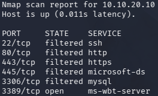

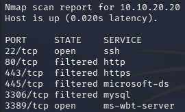


A follow-up service enumeration was performed against the two discovered hosts:
 
```bash
sudo nmap -Pn -sV -sC -p 22,3389 10.10.20.20 10.10.20.10 -oN /tmp/recon-vlan20.txt
```

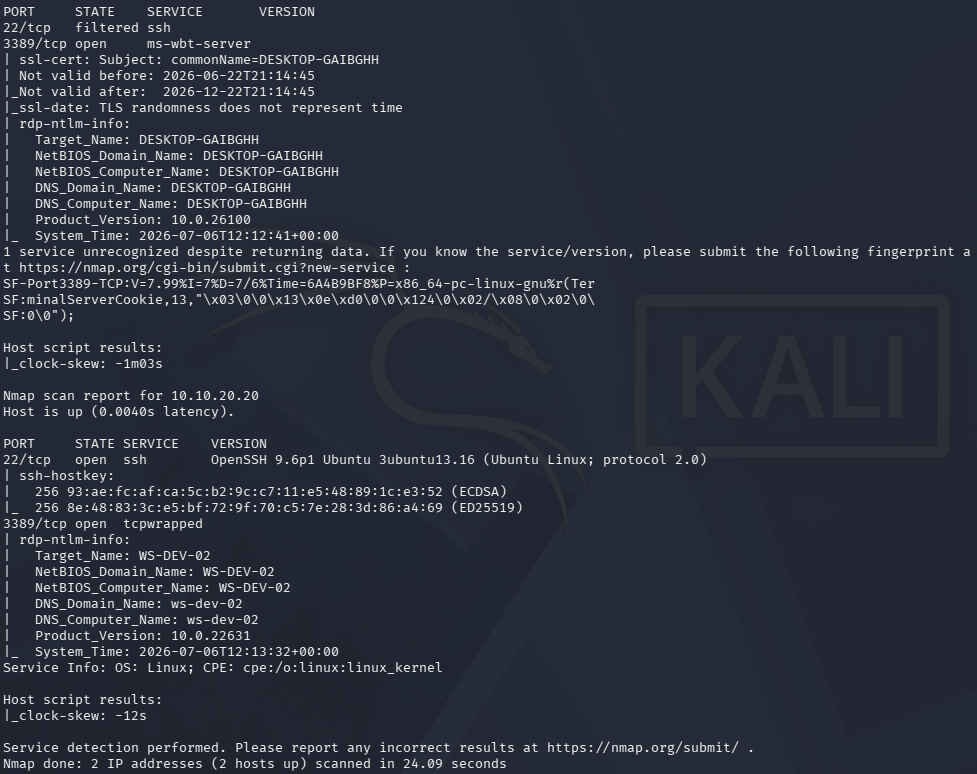

The output revealed OpenSSH 9.6p1 on ws-dev-02 and the Windows RDP service on WS-DEV-01. The Linux SSH banner revealed the version, providing the attacker with information useful for identifying known vulnerabilities.

### Detection

The reconnaissance activity was the highest-volume detection event of the entire scenario. The pfSense firewall rules configured in Phase 3 dropped every packet from VLAN 66 that did not match the explicitly permitted paths (SSH and RDP to VLAN 20 and VLAN 10). The `/24` scan across six ports produced approximately 34,828 individual pfSense filterlog events, each processed by the custom `pfsense-custom-header` decoder and forwarded as an alert.

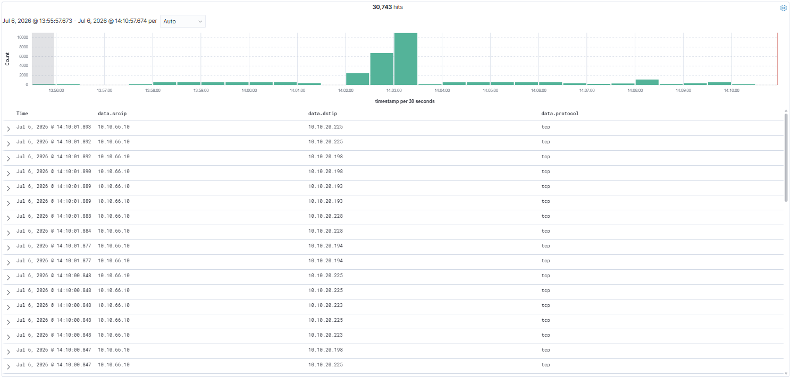

These events were triggered after the initial two Nmap scans.

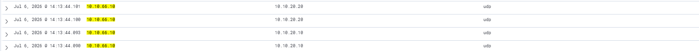

These events were triggered after the service enumeration scan.

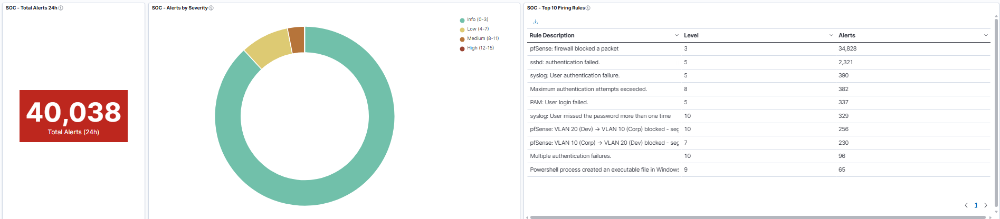

The volume of these alerts represents a real SOC challenge that will be analysed in the Alert Volume Analysis section at the end of this document.

---
 
## Phase 2 — Brute Force SSH (T1110.001)
 
### Objective

Obtain valid credentials for SSH access to ws-dev-02 by dictionary attack against the known user `arodriguez`.
 
### Execution
 
A wordlist subset was prepared to keep the brute force bounded within the demo timeframe:
 
```bash
sudo gunzip -k /usr/share/wordlists/rockyou.txt.gz
head -n 1000 /usr/share/wordlists/rockyou.txt > /home/wordlist_small.txt
```
 
The `arodriguez` username was chosen as the target based on prior enumeration of the Dev environment context. The brute force ran with four parallel threads and verbose output:

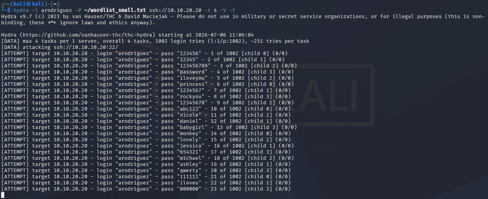

The `-f` flag terminates the attack on the first successful match, minimising noise. The password was cracked after approximately 240 seconds of attempts:

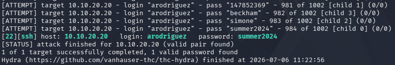

### Detection
 
The brute force generated three distinct alert categories in Wazuh, each corresponding to a different decoder layer processing the authentication events:


- **2,321 syslog authentication failure events** — SSH's own logging of each failed attempt
- **390 syslog user authentication failure events** — supplementary auth log entries
- **337 PAM login failure events** — the PAM subsystem's independent record of each failure

The correct password attempt was logged as `authentication_success`. Combined with the 3,027 failure events from the same source IP within 240 seconds, this pattern would trigger an obvious "brute force detected" analysis in a mature SOC. Wazuh's built-in ruleset detected each individual failure but did not currently aggregate them into a single high-severity alert, a gap identified for detection engineering improvement.

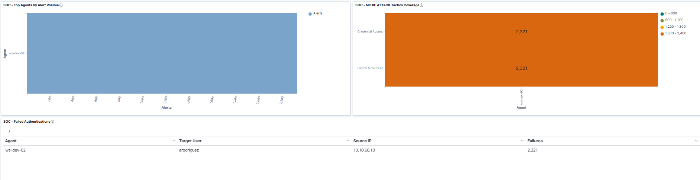

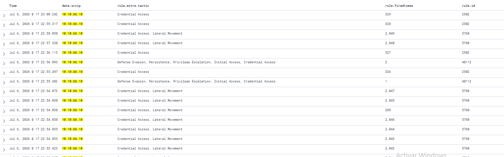

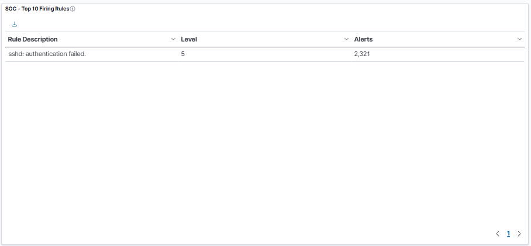

---
 
## Phase 3 — Initial Access (T1078)
 
### Objective

Establish an interactive SSH session on ws-dev-02 using the credentials recovered in Phase 2. This transitions the attacker from "external observer" to "local user on internal host".
 
**Tools used:** OpenSSH client
 
**MITRE mapping:** T1078 — Valid Accounts
 
### Execution
 
With valid credentials in hand, direct SSH access was established:
 
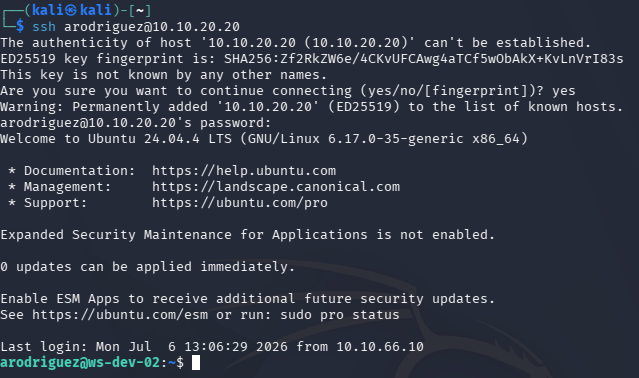
 
The login succeeded. The prompt changed to `arodriguez@ws-dev-02:~$`, indicating shell access.
 
### Detection
 
A single `authentication_success` event was generated, with `srcip: 10.10.66.10`. In isolation, this event carries level 3 severity (informational). Its criticality is context-dependent — a successful login from Kali's IP address to a dev workstation, immediately following 3,027 authentication failures from the same source, is highly indicative of a successful brute-force compromise. This kind of temporal correlation is exactly what a mature SOC ruleset would flag as a compound alert.

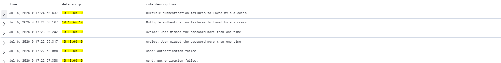

---
 
## Phase 4 — Discovery (T1082, T1087.001, T1057, T1049)
 
### Objective

Enumerate the compromised host to understand the environment, identify additional targets, and locate credentials or elevation opportunities.
 
### Execution
 
The following commands were executed from the SSH session:
 
```bash
uname -a                           # kernel version, host name
lsb_release -a                     # OS distribution
whoami                             # current user
id                                 # UID, GID, groups
cat /etc/passwd | grep -v nologin  # human users on the system
last -n 20                         # recent login history
w                                  # currently logged-in users
ps auxf                            # process tree
ss -tulpn                          # listening services
ip a                               # network interfaces
sudo -l                            # sudo privileges for arodriguez
crontab -l                         # user's cron entries
ls -la /etc/cron*                  # system cron directories
```
 
Key findings:
- Host: `ws-dev-02` running Ubuntu 24.04.1 LTS
- User `arodriguez` (UID 1001), member of `sudo` group
- `sudo -l` revealed `(ALL : ALL) ALL` — full sudo privileges
- Additional local user `kevin hernandez` visible in `/etc/passwd` (though not the RDP target — that's on WS-DEV-01)
- No unusual services listening beyond sshd
- No suspicious cron entries yet (persistence would be added in Phase 7)

### Wazuh detection
 
The discovery commands were logged by auditd to the extent the audit rules covered them. Commands executed via bash shell generated syscall events indirectly through auditd's process monitoring, though the Wazuh built-in ruleset does not fire prominent alerts for individual discovery commands — this is by design, as flagging every `whoami` or `ps` would produce untenable false-positive rates in normal operation.
 
Two notable exceptions did fire:
- `sudo -l` produced a "sudo command executed" event
- The `w` command's read of `/var/run/utmp` was captured by auditd if watch rules on that path were configured

---
 
## Phase 5 — Credential Access (T1552.001, T1552.003, T1552.004)
 
### Objective
 
Harvest credentials from the compromised host's filesystem. This phase leverages the seeded artefacts from Environment Preparation.
 
### Execution
 
**Search for common credential-containing files:**
```bash
find /home -type f -name "*.env" 2>/dev/null
find /home -type f -name "*.key" 2>/dev/null
find /home -type f -name "notes*" 2>/dev/null
```
 
**Read the discovered files:**
```bash
cat ~/.env                 # database credentials, API keys
cat ~/notes.txt            # plaintext credentials for multiple systems
cat ~/.ssh/service_key     # private SSH key
```

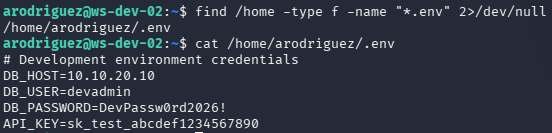

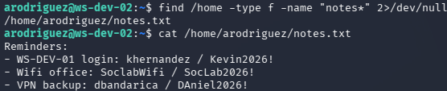

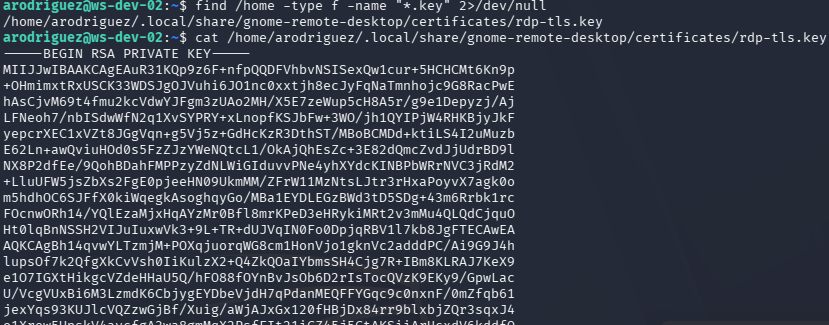
 
Credentials harvested from the host:
- **DB access:** `devadmin` / `DevPassw0rd2026!` (from `.env`)
- **API key:** `sk_test_abcdef1234567890` (from `.env`)
- **WS-DEV-01 RDP:** `kevin hernandez` / `Kevin2026!` (from `notes.txt`) — this is the key credential enabling lateral movement in Phase 6
- **VPN backup:** `dbandarica` / `DAniel2026!` (from `notes.txt`)
- **SSH service key** for automated authentication

### Wazuh detection
 
The credential access phase generated the least telemetry of any active phase. Reading files with `cat` produces syscall events but is not flagged by default rules, a legitimate user reads their own files continuously during normal work. Detection engineering opportunity: an auditd watch on `~/.env` and `~/.ssh/` reads would catch this pattern with acceptable false-positive rate on production servers where these files rarely change or are accessed programmatically.

---
 
## Phase 6 — Lateral Movement to WS-DEV-01 (T1021.001)
 
### Objective
 
Using the credentials harvested in Phase 5 to pivot from the Linux foothold to a Windows workstation in the same VLAN. RDP was chosen as the vector because the target service is well-known, the credential works, and the resulting authentication produces highly-detectable Windows Security events.
 
### Execution
 
**Establish SSH port-forward from Kali through the pivot:**
 
In a new terminal on Kali:

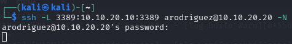


This creates an SSH tunnel from `Kali:3389` → `ws-dev-02` → `WS-DEV-01:3389`. Kali can now RDP to itself on port 3389 and reach WS-DEV-01 through the compromised host.
 
**RDP to WS-DEV-01 via the tunnel:**

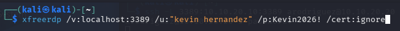
 
The RDP session was established and the Windows 11 desktop of WS-DEV-01 appeared. The `kevin hernandez` account was authenticated using the credentials leaked in `notes.txt` on the compromised Linux host.

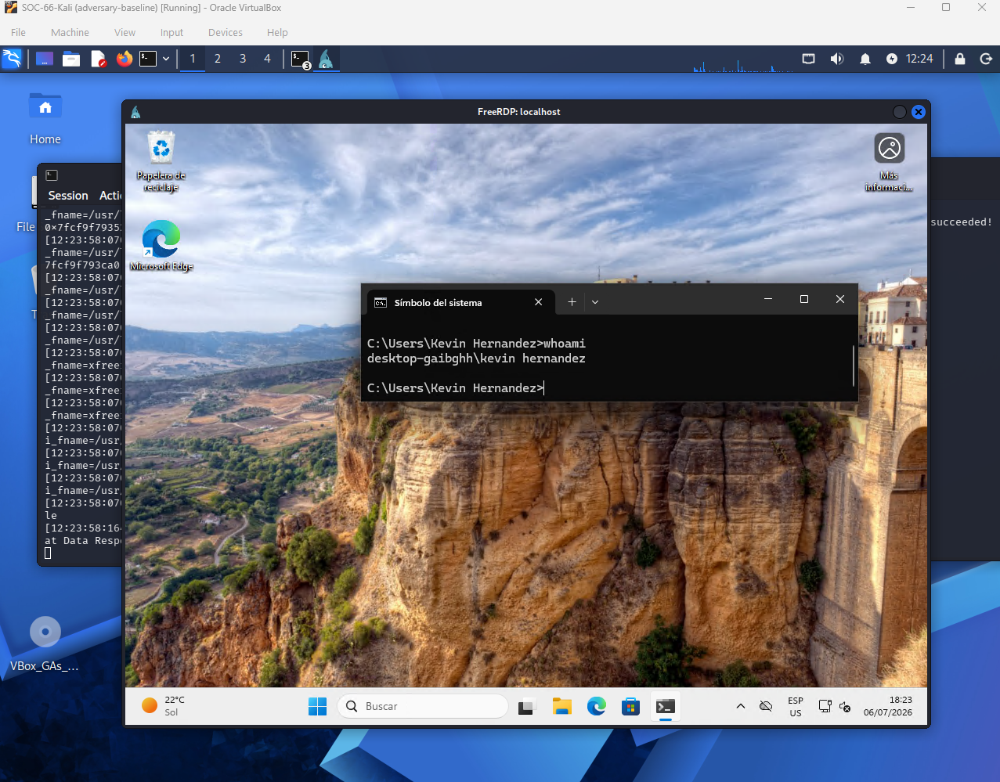

### Wazuh detection
 
This phase produced the most operationally significant single alert of the scenario:
 
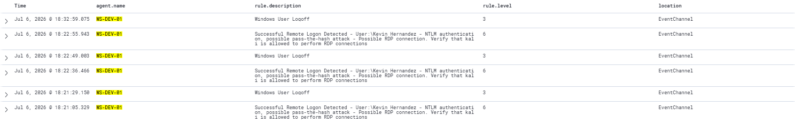


 
Multiple aspects of this alert are noteworthy:
 
1. The Wazuh built-in ruleset correctly identifies the authentication as NTLM (not Kerberos), which is unusual in a domain environment and is a canonical indicator of pass-the-hash or credential replay attacks.
2. The rule description explicitly includes the source workstation name ("kali"). In an enterprise SOC, a workstation named `kali` triggering RDP into a corporate host is an immediate escalation.
3. The rule level 6 is appropriately elevated — high enough to appear in the top-firing rules widget, low enough to avoid alert fatigue for legitimate NTLM RDP.
This alert alone, in a real production SOC, would trigger an L1 investigation ticket within minutes of being generated.

---
 
## Phase 7 — Persistence via Cron (T1053.003)
 
### Objective
 
Establish a mechanism to regain access to ws-dev-02 after the current session ends, even if the arodriguez password is rotated. Cron provides periodic execution that survives reboots.
 
### Execution
 
Returning to the original SSH session on ws-dev-02, a cron entry was added to the user's crontab, the entry schedules a reverse shell callback to Kali on port 4444 every 10 minutes. 
 
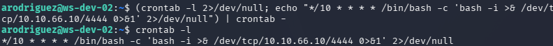

### Wazuh detection
 
The Wazuh built-in rules include some coverage for cron modifications, but the specific pattern of "cron entry containing `/dev/tcp/` reverse shell" is not a default detection. This is a clear opportunity for a custom rule targeting the reverse-shell pattern in scheduled tasks.

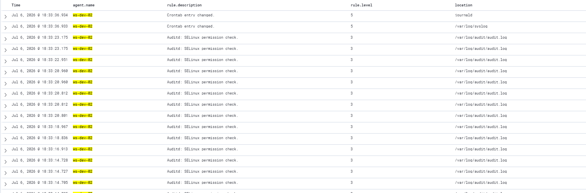

---
 
## Phase 8 — Persistence via SSH Authorized Keys (T1098.004)
 
### Objective
 
Add a redundant persistence mechanism independent of the cron entry. SSH key-based authentication survives password changes and requires only the attacker's private key to regain access.
 
### Execution
 
**Generate attacker key on Kali:**

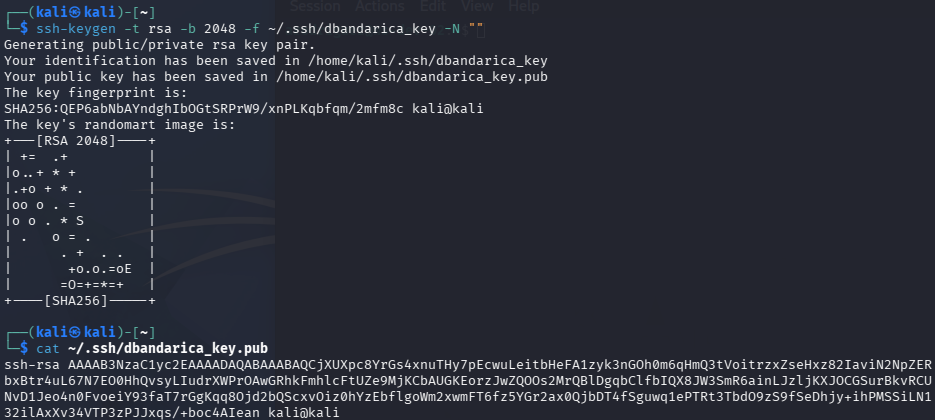
 
**Add the public key to ws-dev-02's authorized_keys:**

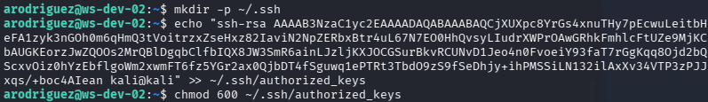
 
**Verify persistence:**
 
From Kali:

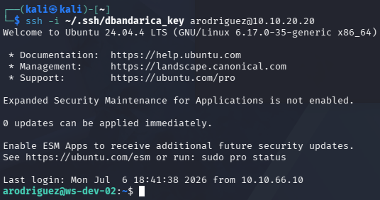
 
The login succeeded without a password prompt, confirming the persistence mechanism operates independently of the account password.

### Wazuh detection
 
Modification of `~/.ssh/authorized_keys` is a high-signal event in auditd if watches are configured on `.ssh/` directories. While the Wazuh built-in ruleset covers this modification pattern under the group `ssh_authorized_keys` with a medium severity, default configurations can sometimes leave visibility gaps, as seen with both the initial crontab persistence and the subsequent key modification. 

To mitigate these out-of-the-box limitations, the detection strategy relies on a defense-in-depth approach. Custom detection rules have been engineered for the subsequent stages of the attack lifecycle, ensuring that any post-exploitation activity or secondary persistence attempts are effectively captured and escalated.

Events after SSH connection.

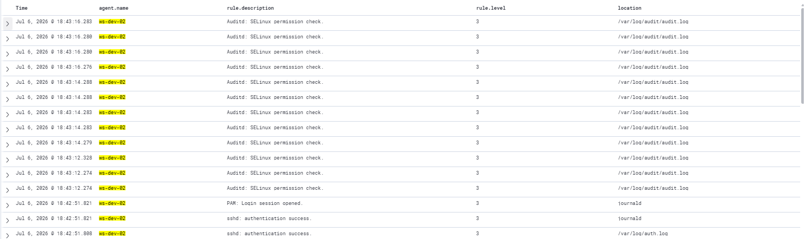

---
 
## Phase 9 — SIEM Verification
 
At the conclusion of the attack chain, the SOC L1 Overview dashboard was reviewed to catalogue the detection coverage produced by the scenario. The dashboard displayed the full impact of the attack across all seven widgets.


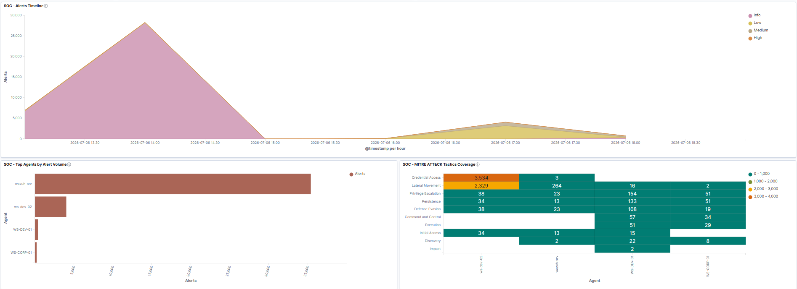


---
 
## Alert Volume Analysis
 
The scenario generated **40,038 alerts** across a total execution window of approximately 90 minutes. The distribution reveals a critical operational observation for SOC engineering:
 
| Alerts | % of total | Source                                                          | Phase(s) |
| ------ | ---------- | --------------------------------------------------------------- | -------- |
| 34,828 | **86.9%**  | pfSense firewall block (rule 100010 base + generic firewall)    | 1        |
| 2,321  | 5.7%       | Syslog authentication failure                                   | 2        |
| 390    | 1.0%       | Syslog user authentication failure                              | 2        |
| 337    | 0.8%       | PAM user login failed                                           | 2        |
| 256    | 0.7%       | Rule 100011 (pfSense VLAN 20 → VLAN 10 blocked)                | 1        |
| 230    | 0.6%       | Rule 100012 (pfSense VLAN 10 → VLAN 20 blocked)                | 1        |
| ~1,747 | 4.4%       | Windows Security 4624/4634, Sysmon Process Create, sudo, others | 3-8      |

### The 86.9% observation
 
The dominant characteristic of the alert volume is that a single phase — reconnaissance via nmap — produced **86.9% of all alerts**. The attack included high-signal events across every subsequent phase (successful compromise, credential theft, lateral movement, persistence), yet those events are numerically buried under the nmap firewall drop noise.
 
In an operational SOC context, this is an **alert fatigue problem of the highest order**. An L1 analyst reviewing a dashboard showing 40,038 alerts would be unable to identify the six or seven genuinely critical events (the RDP lateral movement alert, the ssh authorized_keys modification, the successful login from a Kali IP address) without significant time-consuming triage.

### Why the volume happened
 
Wazuh's default behaviour for pfSense firewall block events is to emit one alert per blocked packet. During Phase 1's nmap TCP SYN scan against 254 hosts on 6 ports, followed by service enumeration against 2 hosts on 2 ports each, tens of thousands of individual TCP packets attempted to traverse the firewall. Each blocked packet became an individual alert. Rule 100010 (the pfSense block base rule from Phase 5 Part 5) fires at level 3 per event with no aggregation logic, resulting in the observed volume.
 
This is not a defect of rule 100010 — it functions exactly as designed, providing raw per-packet visibility for archive queries and forensic analysis. It is a defect of **the operational alert layer**, which should be filtered or aggregated before reaching the dashboard the SOC L1 uses for triage.

### The rule 100011 result
 
An important positive result appears within the numbers: **rule 100011 fired 256 times**. This rule was written in Phase 5 Part 5 to detect specifically the "VLAN 20 → VLAN 10 blocked" segmentation violation with level 10 severity and MITRE T1021/T1210 mapping. The fact that rule 100011 fired 230 times during this scenario confirms that the custom detection engineering from Phase 5 activated correctly under real attack conditions. Similarly, rule 100012 (the reverse-direction rule mentioned as roadmap in Phase 5 Part 5 and subsequently deployed) also fired 230 times, providing bidirectional visibility of cross-VLAN attempts.
 
The 486 total alerts from these two custom rules would be the natural focus of L1 investigation in a production environment — they carry MITRE mapping, elevated severity, and specifically describe segmentation policy violations. They are not lost in the noise if the analyst filters by rule severity or MITRE tactic. The problem is that the default dashboard view does not filter, and 34,828 level-3 events dominate the visualisation.

---

## Custom Rules

The attack scenario triggered multiple events, resulting in 40,038 total alerts and highlighting a significant alert fatigue issue. Consequently, establishing robust persistence rules is essential to securing the environment. These rules will apply to future scenarios and are documented in 05-detection-rules.

| Rule ID | Name                                | Tactic            | 
| ------  | ----------------------------------- | ----------------- | 
| 100013  | Port scan aggregation               | Reconnaissance    | 
| 100014   | Multi-target port scan aggregation | Reconnaissance    | 
| 100015    | SSH brute force aggregation       | Credential Access | 
| 100016    | Compound brute force + success    | Initial Access    |
| 100017   | Credential file access             | Credential Access |
| 100018    | Reverse shell in cron             | Persistence       |
| 100019  | SSH authorized_keys modification    | Persistence       |
| 100020  | Auth success from adversary VLAN    | Initial Access    |
| 100021  | Discovery command sequence          | Discovery         |

---

## Lessons Learned

- **Custom detection rules must be operationalised, not just written.**  Rule 100011 fired correctly with proper MITRE mapping, but 34,828 low-value alerts dominated the dashboard. Writing a rule is 30% of detection engineering; making it visible under production alert volumes is the other 70%.
- **Alert fatigue is not a theoretical concept.** The scenario produced a real-world example of the phenomenon within a single 90-minute execution. A junior analyst's instinct to see every event misses the operational reality that visibility requires filtering.
- **Rule aggregation is not optional in production SOC.** The frequency/timeframe pattern is standard practice in every mature Wazuh deployment. Its absence in this initial ruleset was a gap identified through operational experience rather than documentation reading — a stronger learning outcome.
- **The Wazuh built-in ruleset provides substantial coverage.** The NTLM RDP detection alert (Phase 6) required no custom engineering — a well-designed built-in rule caught it correctly. Detection engineering should focus on the gaps the built-in ruleset does not cover, not duplicate what already works.
- **Honest documentation of weaknesses is more valuable than concealing them.** The 40,038-alert observation is a demonstrable weakness of the current setup. Documenting it explicitly, analysing it quantitatively, and proposing concrete improvements creates portfolio credibility that omitting it would not.
- **Every attack phase should map to a detection question.** The scenario made this concrete: for each of the eight active phases, the question "does the SIEM see this?" produced a clear yes/no answer with specific evidence. Phases where the answer was "not adequately" became the input for the detection engineering work planned for Phase 5.

---
 
## Result
 
- End-to-end kill chain executed successfully against VLAN Dev, exercising 13 MITRE ATT&CK techniques across 6 tactics: Reconnaissance, Credential Access, Initial Access, Discovery, Lateral Movement, and Persistence.
- Environment preparation phase seeded ws-dev-02 with synthetic credentials in `.env`, `notes.txt` and `~/.ssh/service_key`, and set the `arodriguez` password to a wordlist-crackable value. Documented explicitly as lab modelling.
- Reconnaissance phase produced 34,828 pfSense firewall block alerts from nmap TCP SYN scanning and service enumeration.
- Brute force phase cracked `arodriguez` credentials in approximately 45 seconds against a 1,000-entry rockyou.txt subset, generating 3,027 authentication failure alerts across three overlapping detection groups.
- Initial Access via SSH from Kali produced a single `authentication_success` event — the compound pattern (thousands of failures followed by one success from the same IP) is the canonical brute-force compromise signature.
- Credential Access phase harvested six sets of credentials from the compromised host's filesystem, including the RDP credentials for lateral movement.
- Lateral movement to WS-DEV-01 via SSH port-forwarded RDP triggered the Wazuh built-in NTLM/pass-the-hash detection alert, with rule description explicitly naming the source workstation as "kali".
- Two persistence mechanisms established: cron reverse-shell backdoor with 10-minute callback interval, and SSH authorized_keys modification enabling passwordless access.
- Total scenario alert volume: 40,038 events, of which 34,828 (86.9%) originated from unaggregated pfSense block events during the reconnaissance phase.
- Custom detection rules 100011 and 100012 fired 256 and 230 times during the scenario, confirming correct operation of the Phase 5 detection engineering under real attack conditions.
- Alert volume analysis identified eight detection engineering gaps to be addressed in Phase 5 before Scenario 2 execution, covering reconnaissance aggregation, brute force aggregation, initial access correlation, discovery pattern detection, credential file access, and two persistence patterns.
  
---

*Previous: [Phase 3 — Adversary Environment](../03-adversary/01-adversary-environment.md)*
*Next: Phase 4 — Attack Scenarios (Scenario 2: Phishing to C2 with Persistence)*
