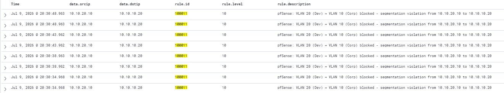

# Rule 100011: VLAN 20 → VLAN 10 Segmentation Violation
 
## Metadata
| Field | Value |
|-------|-------|
| Rule ID | `100011` |
| Severity | High |
| MITRE ATT&CK Tactic | Lateral Movement |
| MITRE ATT&CK Technique | T1021 — Remote Services / T1210 — Exploitation of Remote Services |
| Data Source | pfSense syslog (via rule 100010) |
| Platform | Network |
| Status | Active |
 
---
 
## Threat Context
 
### Description
Fires when pfSense blocks traffic originating in VLAN 20 (Dev) destined for VLAN 10 (Corp). This direction of blocked traffic is treated as high-severity because it matches the canonical pattern of lateral movement from a less-trusted zone (development environment) toward a higher-value zone (corporate workstations, domain controller, Active Directory).
 
### Real-World Usage
Cross-VLAN lateral movement attempts appear in nearly every published incident report on enterprise breaches. Attackers who establish an initial foothold in less-secured environments — dev/test networks, partner-accessible subnets, contractor workstations — routinely attempt to pivot toward domain-joined corporate assets. Public examples include the Colonial Pipeline incident (2021), the Kaseya VSA compromise (2021), and multiple LockBit affiliate campaigns documented by CISA advisories.
 
### Why This Matters
A dev workstation attempting to reach a corporate host in this lab has no legitimate reason to do so — the segmentation policy exists precisely to prevent this. Every alert of this rule warrants investigation because the origin host is either compromised, misconfigured, or being used by an operator bypassing established network boundaries. In production environments, this alert typically escalates to a P2 incident ticket.
 
---
 
## Detection Strategy
 
### Logic
Inherits from rule 100010 via `<if_sid>`, ensuring the event is a validated pfSense block. Adds two constraints: source IP must be in the VLAN 20 subnet (`10.10.20.0/24`) and destination IP must be in the VLAN 10 subnet (`10.10.10.0/24`). The Wazuh rule engine applies these as native IP range matches using CIDR notation.
 
### Data Source Requirements
- Source: rule 100010 event stream (which itself derives from pfSense syslog)
- Required fields: `srcip`, `dstip`
- Prerequisites: rule 100010 must be deployed and firing correctly
  
### Thresholds
Not applicable — the rule fires per matched event.
 
---
 
## Implementation
 
### Wazuh Rule (XML)
```xml
<group name="pfsense,custom,">
  <rule id="100011" level="10">
    <if_sid>100010</if_sid>
    <srcip>10.10.20.0/24</srcip>
    <dstip>10.10.10.0/24</dstip>
    <description>pfSense: VLAN 20 (Dev) → VLAN 10 (Corp) blocked - segmentation violation from $(srcip) to $(dstip)</description>
    <mitre>
      <id>T1021</id>
      <id>T1210</id>
    </mitre>
    <group>attack,lateral_movement,segmentation_violation,</group>
  </rule>
</group>
```
 
---
 
## Atomic Testing
 
### Test Command
From any host in VLAN 20 (for example WS-DEV-01 at `10.10.20.10`):

```bash
ping -c 8 10.10.10.20
```
 
### Expected Result

Eight alerts in `wazuh-alerts-*` (one per ICMP echo request blocked) with:
- data.srcip: 10.10.20.10
- data.dstip: 10.10.10.20
- `rule.id: 100011`
- `rule.level: 10`
- `rule.description` containing "VLAN 20 (Dev) → VLAN 10 (Corp) blocked - segmentation violation from 10.10.20.10 to 10.10.10.20"
  
### Validation Screenshot


 
---
 
## False Positives
 
### Known FP Scenarios
- Misconfigured dev application attempting to reach a service migrated to Corp infrastructure — a DNS entry may point developers to the wrong environment.
- Developer manual testing of production connectivity from a dev workstation during troubleshooting.
- Automation scripts scheduled on dev hosts that were not updated when a corporate service was decommissioned or relocated.
  
### Mitigations
- Investigate each alert — legitimate operational issues still represent security policy violations that warrant remediation (relocating the service, updating configuration, granting explicit exceptions).
- If a specific host is a known source of legitimate cross-VLAN traffic, the source can be excluded via `<not_srcip>`.

---
 
## References

- [MITRE ATT&CK T1021 — Remote Services](https://attack.mitre.org/techniques/T1021/)
- [MITRE ATT&CK T1210 — Exploitation of Remote Services](https://attack.mitre.org/techniques/T1210/)
- [CISA advisory AA22-249A — Iranian actors leveraging lateral movement](https://www.cisa.gov/news-events/cybersecurity-advisories/aa22-249a)
- Internal reference: `docs/01-infrastructure/03-vlan20.md`
