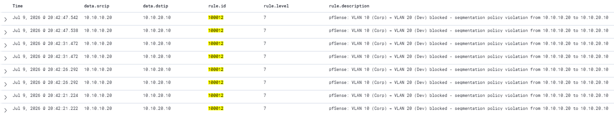

# Rule 100012: VLAN 10 → VLAN 20 Segmentation Policy Violation
 
## Metadata
| Field | Value |
|-------|-------|
| Rule ID | `100012` |
| Severity | Medium |
| MITRE ATT&CK Tactic | N/A (policy violation, not attack indicator) |
| MITRE ATT&CK Technique | N/A |
| Data Source | pfSense syslog (via rule 100010) |
| Platform | Network |
| Status | Active |
 
---
 
## Threat Context
 
### Description
Fires when pfSense blocks traffic originating in VLAN 10 (Corp) destined for VLAN 20 (Dev). The reverse direction of rule 100011 is treated at a lower severity because Corp reaching Dev typically indicates operational error rather than intentional attack behaviour — corporate users have no obvious offensive motivation to pivot into a less-trusted network.
 
### Real-World Usage
Reverse-direction segmentation violations most commonly result from user error (opening the wrong terminal, using an outdated bookmark), legacy applications with hardcoded dev endpoint references, or automation jobs that were provisioned before the segmentation policy was enforced. While these are not attack indicators in themselves, they can signal misconfiguration that erodes segmentation over time and should be investigated for policy hygiene.
 
### Why This Matters
Documenting reverse-direction traffic separately from forward-direction lateral movement is an intentional detection engineering choice. Treating both directions identically would either force forward-direction alerts down to the level of policy noise (losing operational visibility of the more serious pattern) or force reverse-direction alerts up to lateral-movement severity (generating unnecessary escalation for what is usually a misconfiguration). Asymmetric severity encodes the threat model accurately.
 
---
 
## Detection Strategy
 
### Logic
Inherits from rule 100010 via `<if_sid>`. Adds source IP in VLAN 10 subnet (`10.10.10.0/24`) and destination IP in VLAN 20 subnet (`10.10.20.0/24`). Level 7 (Medium) places the rule below the immediate investigation threshold of level 10 but above the informational noise floor of level 3.
 
### Data Source Requirements
- Source: rule 100010 event stream
- Required fields: `srcip`, `dstip`
- Prerequisites: rule 100010 deployed and firing
### Thresholds
Not applicable — per-event evaluation.
 
---
 
## Implementation
 
### Wazuh Rule (XML)
```xml
<group name="pfsense,custom,">
  <rule id="100012" level="7">
    <if_sid>100010</if_sid>
    <srcip>10.10.10.0/24</srcip>
    <dstip>10.10.20.0/24</dstip>
    <description>pfSense: VLAN 10 (Corp) → VLAN 20 (Dev) blocked - segmentation policy violation from $(srcip) to $(dstip)</description>
    <group>firewall,segmentation_violation,</group>
  </rule>
</group>
```
 
Note the absence of `<mitre>` tags — this rule does not map to an ATT&CK technique because the direction described is not an attack behaviour, it is a policy hygiene indicator.
 
---
 
## Atomic Testing
 
### Test Command
From any host in VLAN 10 (for example WS-CORP-01 at `10.10.10.20`):

```cmd
ping 10.10.20.10
```
 
### Expected Result
Four alerts in `wazuh-alerts-*` (one per blocked ICMP echo request) with:
- `data.srcip: 10.10.10.20`
- `data.dstip: 10.10.20.10`
- `rule.id: 100012`
- `rule.level: 7`
- `rule.description` containing "VLAN 10 (Corp) → VLAN 20 (Dev) blocked - segmentation policy violation from 10.10.10.20 to 10.10.20.20"
- No MITRE mapping present

### Validation Screenshot

 
---
 
## False Positives
 
### Known FP Scenarios
- Corporate user attempting to SSH or RDP to a dev workstation using an obsolete IP address.
- Corporate monitoring script performing legitimate reachability checks against dev hosts (typically results from misconfigured monitoring targets).
- Software updates or licensing checks that attempt to reach dev-hosted internal services.
  
### Mitigations
- Level 7 is deliberately low to accept these scenarios as noise rather than flag them as attacks.
- Recurring FP sources should be investigated for policy hygiene: either the corporate host is misconfigured, or a legitimate cross-VLAN need exists that should be formalised with an explicit pass rule.
- Aggregate by `srcip` in dashboard queries to identify hosts generating repeated violations for targeted remediation.
  
---
 
## References
- [MITRE ATT&CK — Enterprise mitigation M1030 (Network Segmentation)](https://attack.mitre.org/mitigations/M1030/)
- Internal reference: `docs/01-infrastructure/02-vlan10.md`
 
