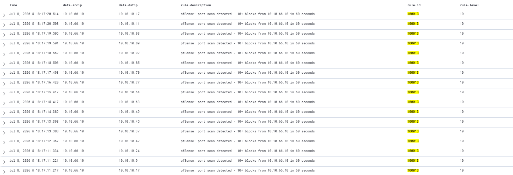

# Rule 100013: Port Scan Detection (Single Target)
 
## Metadata
| Field | Value |
|-------|-------|
| Rule ID | `100013` |
| Severity | High |
| MITRE ATT&CK Tactic | Reconnaissance |
| MITRE ATT&CK Technique | T1046 — Network Service Discovery |
| Data Source | pfSense syslog (aggregated from rule 100010) |
| Platform | Network |
| Status | Active |
 
---
 
## Threat Context
 
### Description
Fires when 10 or more pfSense block events target 10 or more distinct destination ports from the same source IP within a 60-second sliding window. This pattern is the canonical signature of active port scanning — probing multiple services on a target to identify the attack surface. The rule promotes the pattern to a single Medium-High alert instead of leaving thousands of individual level-3 blocks scattered across the alerts index.
 
### Real-World Usage
Port scanning is Step 1 of virtually every intrusion documented in threat intelligence. Reconnaissance precedes exploitation. Tools like nmap, masscan, and zmap generate this pattern in seconds. Documented examples of port scanning as an initial phase of larger campaigns include Mirai and its variants routinely scanning IP ranges for exposed telnet and SSH services, ransomware affiliates (LockBit, ALPHV, Play) performing internal reconnaissance immediately after gaining initial access, and APT groups such as APT28 performing targeted service enumeration against high-value hosts.
 
### Why This Matters
Without this rule, a single nmap execution generates thousands of individual pfSense block alerts, all at level 3. The pattern is fully visible in the raw data but invisible in the operational dashboard — a classic alert fatigue scenario. With this rule, one alert per target per 60-second window is generated, which is manageable for L1 triage and appropriately severe to appear in the Top 10 Firing Rules widget.
 
---
 
## Detection Strategy
 
### Logic
The rule is a frequency-based aggregation rule that references rule 100010 as its parent via `<if_matched_sid>`. Wazuh's correlation engine tracks the count of 100010 matches over the last 60 seconds, grouped implicitly by `same_srcip` and constrained to require distinct destination ports via `different_dstport`. When the count reaches 10 within the window, one alert is emitted; the counter then resets for that group.
 
The `different_dstport` constraint is essential to distinguish port scanning from application retry behaviour: a broken application attempting the same port 100 times does not match, while a scanner probing 10 different ports on the same target does.
 
### Data Source Requirements
- Source: rule 100010 event stream
- Required fields: `srcip`, `dstport`
- Prerequisites: rule 100010 deployed and firing; pfSense syslog integration operational
  
### Thresholds
- **frequency = 10** — chosen to detect even slow "stealth" scans (`nmap -T2 --scan-delay 5s` produces approximately 12 events per minute, matching the threshold with margin).
- **timeframe = 60 seconds** — standard aggregation window that balances detection latency (alert appears within 60s) against burst detection.
- **Level 10** — Medium-High severity, elevating from the parent rule's level 3. High enough to appear prominently in dashboards and MITRE heatmap, low enough to leave headroom for higher-severity meta-aggregation.
---
 
## Implementation
 
### Wazuh Rule (XML)
```xml
<group name="pfsense,custom,">
  <rule id="100013" level="10" frequency="10" timeframe="60">
    <if_matched_sid>100010</if_matched_sid>
    <same_srcip />
    <different_dstport />
    <description>pfSense: port scan detected - 10+ different ports blocked from $(srcip) in 60s</description>
    <mitre>
      <id>T1046</id>
    </mitre>
    <group>attack,reconnaissance,portscan,</group>
  </rule>
</group>
```
 
---
 
## Atomic Testing
 
### Test Command

From Kali:
```bash
sudo nmap -Pn -sS -p 22,80,443,3306,3389,445,5985,8080,8443,9090 10.10.10.0/24
```
 
Ten distinct ports against a single target ensures the pattern matches with margin above the threshold.
 
### Expected Result
One alert in `wazuh-alerts-*` with:
- `data.srcip: 10.10.66.10`
- `data.dstip: 10.10.10.XX`
- `rule.description` containing "port scan detected - 10+ different ports blocked from 10.10.66.10 in 60s"
- `rule.id: 100013`
- `rule.level: 10`

Multiple rule 100010 alerts (one per probed port) will exist in parallel for forensic drill-down.
 
### Validation Screenshot

 
---
 
## False Positives
 
### Known FP Scenarios
- Authorised vulnerability scanners (Nessus, Qualys, Rapid7 InsightVM) performing scheduled scans from known IPs.
- Network monitoring tools (Nagios, LibreNMS) performing port probes across many services during health checks.
- CI/CD pipelines that test service endpoint availability across multiple ports as part of deployment verification.

### Mitigations
- The `<different_dstport />` constraint already excludes single-port retry patterns from broken applications, eliminating a significant class of false positives.
- Authorised scanner IPs should be added to a `SCANNER_ALLOWLIST` alias and excluded via `<not_srcip>SCANNER_ALLOWLIST</not_srcip>` in a scanner-specific version of the rule.
- Threshold can be tuned upward (frequency=20-30) in environments with heavy automated network activity, at the cost of missing stealthier scans.
  
---
 
## References
- [MITRE ATT&CK T1046 — Network Service Discovery](https://attack.mitre.org/techniques/T1046/)
- [Wazuh documentation — Frequency and timeframe attributes](https://documentation.wazuh.com/current/user-manual/ruleset/ruleset-xml-syntax/rules.html)
- [Nmap reference documentation — Timing templates](https://nmap.org/book/performance-timing-templates.html)
- Internal reference: `docs/04-attack-scenarios/01-full-kill-chain-vlan-dev.md`
