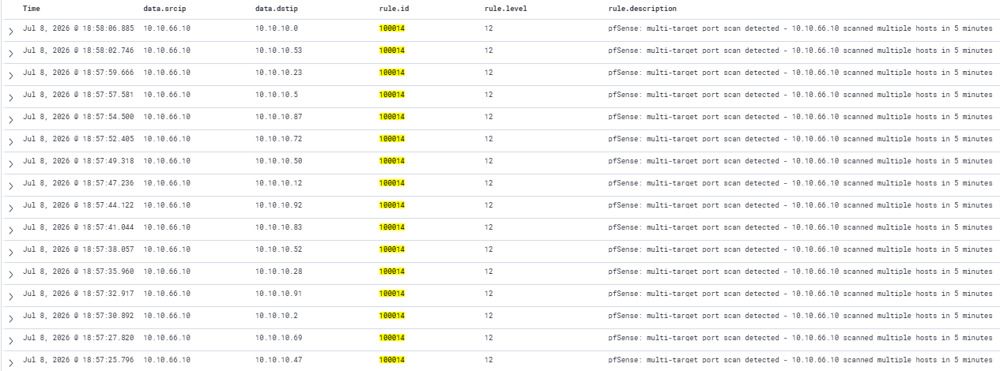

# Rule 100014: Multi-Target Port Scan Detection
 
## Metadata
| Field | Value |
|-------|-------|
| Rule ID | `100014` |
| Severity | Critical |
| MITRE ATT&CK Tactic | Reconnaissance |
| MITRE ATT&CK Technique | T1046 — Network Service Discovery / T1018 — Remote System Discovery |
| Data Source | Wazuh alerts (aggregated from rule 100013) |
| Platform | Network |
| Status | Active |
 
---
 
## Threat Context
 
### Description
Meta-aggregation rule that fires when 5 or more rule 100013 alerts are generated from the same source IP within a 600-second (10-minute) window. This pattern indicates the source is not scanning a single host but sweeping across multiple targets — the canonical signature of subnet reconnaissance or network mapping activity.
 
### Real-World Usage
Multi-host scanning is the follow-up to single-host reconnaissance in nearly every documented intrusion. After initial access, attackers routinely scan the internal subnet to identify additional targets for lateral movement (documented in incident reports from Mandiant, CrowdStrike, and Elastic Security Labs). Automated worm-like malware such as Mirai and EternalBlue-based ransomware variants scans large IP ranges as a core propagation mechanism. Red team engagements and penetration tests explicitly use subnet scanning as part of the discovery phase.
 
### Why This Matters
This rule is the top of the reconnaissance rule chain. It consolidates multiple scan events into a single high-severity alert that dominates the dashboard's operational view. In empirical testing during rule development, a single nmap subnet scan producing 791 raw block events was consolidated through the chain into 70 rule 100013 alerts and finally into 17 rule 100014 alerts — a 97.9% reduction in operational alert count while preserving 100% of the forensic detail via rule 100010 in the archives.
 
---
 
## Detection Strategy
 
### Logic
Rule 100014 uses `<if_matched_sid>100013</if_matched_sid>` to consume the output of rule 100013 as its input stream. Grouped by `same_srcip`, the rule counts occurrences of 100013 alerts and fires when 5 or more accumulate within 600 seconds. The design implements a meta-aggregation pattern: rule 100013 aggregates raw pfSense blocks into per-target scan alerts, then rule 100014 aggregates those per-target alerts into a per-attacker campaign alert.
 
### Data Source Requirements
- Source: rule 100013 event stream
- Required fields: `srcip`
- Prerequisites: rules 100010 and 100013 must be deployed and firing correctly
  
### Thresholds
- **frequency = 5** — requires 5 distinct target hosts to have triggered 100013 within the window. This threshold is higher than 3 (an initial version) to reduce false positives from applications hitting different services on 2-3 known-blocked ports.
- **timeframe = 600 seconds (10 minutes)** — a wider window than rule 100013 because subnet scanning is typically slower than single-host scanning; a full `/24` sweep with default nmap settings can take 3-8 minutes.
- **Level 12** — Critical severity, one step above rule 100013's High. Level 12 alerts are top-priority events in the SOC L1 Overview dashboard, appearing in the Alerts by Severity pie chart's High slice and prominently in the MITRE heatmap under Reconnaissance.
**Empirical threshold validation:** Testing with the parameter combination `frequency=5 timeframe=600` in a nmap `/24` scan against VLAN 10 with 10 ports produced 791 rule 100010 events, 70 rule 100013 alerts, and 17 rule 100014 alerts. The observed 4:1 ratio for the 100013→100014 stage closely matches the theoretical 5:1 (given frequency=5), confirming that the aggregation logic operates as designed and the threshold is neither too permissive (generating excessive alerts) nor too restrictive (missing legitimate scan campaigns).
 
---
 
## Implementation
 
### Wazuh Rule (XML)
```xml
<group name="pfsense,custom,">
  <rule id="100014" level="12" frequency="5" timeframe="600">
    <if_matched_sid>100013</if_matched_sid>
    <same_srcip />
    <description>pfSense: multi-target port scan detected - $(srcip) scanned multiple hosts in 10 minutes</description>
    <mitre>
      <id>T1046</id>
      <id>T1018</id>
    </mitre>
    <group>attack,reconnaissance,portscan,multi_target,</group>
  </rule>
</group>
```
 
---
 
## Atomic Testing
 
### Test Command
From Kali, a subnet scan against VLAN 10 with multiple ports:
```bash
sudo nmap -Pn -sS -p 22,80,443,3306,3389,445,5985,8080,8443,9090 10.10.10.0/24
```
 
The scan will trigger multiple rule 100013 alerts (one per targeted host with sufficient blocks), which then triggers rule 100014.
 
### Expected Result
One or more alerts in `wazuh-alerts-*` with:
- `data.srcip: 10.10.66.10`
- `data.dstip: 10.10.10.XX`
- `rule.id: 100014`
- `rule.level: 12`
- `rule.description` containing "multi-target port scan detected - 10.10.66.10 scanned multiple hosts in 10 minutes"

The number of 100014 alerts depends on scan duration — long scans that extend beyond 10 minutes produce sequential 100014 alerts as the window slides.
 
### Validation Screenshot


 
---
 
## False Positives
 
### Known FP Scenarios
- Authorised vulnerability scanners performing scheduled subnet scans — the tool is doing exactly what rule 100014 detects, just legitimately.
- Network discovery tools (Nmap, Zenmap, angryIP) executed by network engineers during troubleshooting or inventory audits.
- Container orchestration platforms performing service discovery across a subnet after node reconfiguration.
  
### Mitigations
- Authorised scanner IPs should be excluded via `<not_srcip>` referencing a `SCANNER_ALLOWLIST` alias.
- The empirically validated thresholds (frequency=5, timeframe=600) already reduce false positive rate compared to more permissive settings.
- Alert investigations should include time-of-day context: scheduled scanner activity typically follows predictable patterns (nightly, weekend maintenance windows) that can be confirmed against IT operations calendars.
  
---
 
## References
- [MITRE ATT&CK T1046 — Network Service Discovery](https://attack.mitre.org/techniques/T1046/)
- [MITRE ATT&CK T1018 — Remote System Discovery](https://attack.mitre.org/techniques/T1018/)
- [Wazuh documentation — Composite rules and `if_matched_sid`](https://documentation.wazuh.com/current/user-manual/ruleset/ruleset-xml-syntax/rules.html)
- Internal reference: `docs/04-attack-scenarios/01-full-kill-chain-vlan-dev.md`
 
