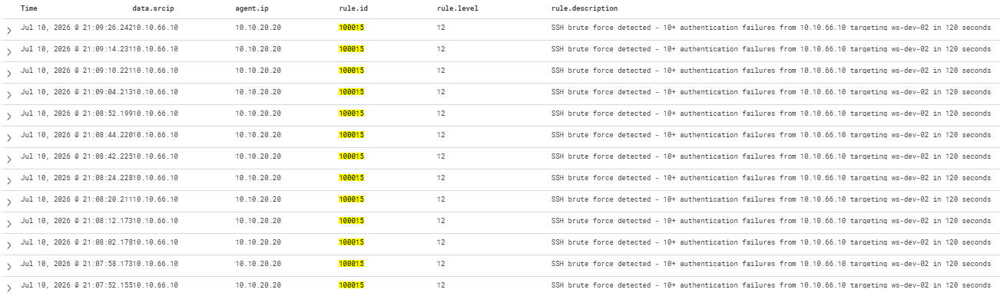

# Rule 100015: SSH Brute Force Aggregation
 
## Metadata
| Field | Value |
|-------|-------|
| Rule ID | `100015` |
| Severity | Critical |
| MITRE ATT&CK Tactic | Credential Access |
| MITRE ATT&CK Technique | T1110.001 — Brute Force: Password Guessing |
| Data Source | Wazuh (aggregated from built-in `authentication_failed` group) |
| Platform | Linux |
| Status | Active |
 
---
 
## Threat Context
 
### Description
Fires when 10 or more authentication failure events are generated from the same source IP within a 120-second sliding window. The rule aggregates events from multiple built-in Wazuh sources — SSH authentication failures, PAM login failures, and generic syslog authentication failures — into a single high-severity alert that unambiguously identifies a brute-force campaign against SSH services.
 
### Real-World Usage
SSH brute forcing is one of the oldest and most consistently observed attacker techniques on the internet. It appears in nearly every honeypot dataset, threat intelligence feed, and post-breach incident report. Prominent examples include the botnets Mirai and its variants routinely brute-forcing telnet and SSH across large IP ranges, the FritzFrog peer-to-peer botnet that has compromised thousands of Linux SSH servers since 2020, and ransomware affiliate operators such as LockBit and REvil that regularly use SSH brute force as an initial access vector against exposed Linux administration interfaces.
 
### Why This Matters
Without this rule, a single hydra execution generates thousands of individual authentication failure alerts across three overlapping built-in Wazuh rules, drowning the analyst in low-severity noise while the actual attack pattern is obscured. In the Scenario 1 execution, 3,027 authentication failure alerts from a single 45-second brute force were emitted in parallel — the aggregated pattern was invisible in the dashboard. This rule consolidates the pattern into 1-2 alerts per attack burst, restoring operational visibility of the credential attack.
 
---
 
## Detection Strategy
 
### Logic
The rule uses `<if_matched_group>authentication_failed</if_matched_group>` to consume any Wazuh event tagged with the `authentication_failed` group as its input stream. This group is applied by the built-in ruleset to SSH failures, PAM failures, and syslog auth failures alike, which means a single aggregation rule covers all three sources. Grouped by `same_srcip`, the rule counts events and fires when 10 or more accumulate within 120 seconds.
 
The `<if_matched_group>` pattern is more elegant than inheriting from a specific rule ID because it captures the full spectrum of authentication failure sources without requiring one aggregation rule per source rule.
 
### Data Source Requirements
- Source: Any Wazuh event with `rule.groups: authentication_failed`
- Required fields: `srcip`
- Prerequisites: Wazuh built-in ruleset for `sshd`, `pam`, and `syslog` deployed (default in standard Wazuh installations); Linux agent forwarding SSH and PAM events to the manager
### Thresholds
- **frequency = 10** — chosen deliberately above the range of realistic human error. A human typing incorrect credentials 10 times in 2 minutes is not a mistake, it is an automated tool. This threshold eliminates false positives from users mistyping passwords during legitimate troubleshooting or after credential rotation.
- **timeframe = 120 seconds** — a 2 minute sliding window captures burst-mode brute forcing (hydra with default threading generates dozens of attempts per second) while remaining short enough to produce distinct alerts if the attacker pauses and resumes.
- **Level 12** — Critical severity. Successful triggering of this rule indicates a near-certain attack in progress; no legitimate operational activity matches the pattern.
---
 
## Implementation
 
### Wazuh Rule (XML)
```xml
<group name="authentication,custom,">
  <rule id="100015" level="12" frequency="10" timeframe="120">
    <if_matched_group>authentication_failed</if_matched_group>
    <same_srcip />
    <description>SSH brute force detected - 10+ authentication failures from $(srcip) targeting $(hostname) in 120 seconds</description>
    <mitre>
      <id>T1110.001</id>
    </mitre>
    <group>attack,credential_access,brute_force,</group>
  </rule>
</group>
```
 
The rule lives in a separate `<group>` from the pfSense rules because it is not derived from firewall telemetry — placing it in the pfSense group would be semantically misleading.
 
---
 
## Atomic Testing
 
### Test Command
From Kali, using hydra against ws-dev-02 with a short wordlist targeting arodriguez user:
```bash
head -n 1000 /usr/share/wordlists/rockyou.txt > /tmp/wordlist-small.txt
hydra -l arodriguez -P /tmp/wordlist-small.txt ssh://10.10.20.20 -t 4 -V
```
 
The scan generates approximately 25 failed authentication attempts in 15-20 seconds, exceeding the threshold with margin.
 
### Expected Result
One alert in `wazuh-alerts-*` with:
- `data.srcip: 10.10.66.10`
- `agent.ip: 10.10.20.20`
- `rule.id: 100015`
- `rule.level: 12`
- `rule.description` containing "SSH brute force detected - 10+ authentication failures from 10.10.66.10 in 120 seconds"
- 
In parallel, 10+ built-in authentication failure alerts will exist in `wazuh-alerts-*` for forensic drill-down — the aggregation does not replace the raw events, it summarises them into a prominent operational alert.
 
### Validation Screenshot

 
---
 
## False Positives
 
### Known FP Scenarios
- Legitimate password rotation events where automation scripts on multiple hosts simultaneously retry authentication with old credentials before updating to new ones.
- Backup jobs or monitoring agents configured with expired credentials attempting to reconnect repeatedly.
- Load testing tools targeting SSH endpoints as part of infrastructure validation.
### Mitigations
- The threshold of 10 attempts in 120 seconds is high enough to exclude typical human error and casual troubleshooting; only automation reaches this rate.
- Legitimate automation sources should be excluded via `<not_srcip>` referencing an `AUTOMATION_SOURCES` alias.
- If specific service accounts are known to generate high volumes of authentication events during their normal operation, they can be excluded by filtering `dstuser` in a variant of the rule.
---
 
## References
- [MITRE ATT&CK T1110.001 — Brute Force: Password Guessing](https://attack.mitre.org/techniques/T1110/001/)
- [Wazuh documentation — Composite rules](https://documentation.wazuh.com/current/user-manual/ruleset/ruleset-xml-syntax/rules.html)
- [FritzFrog botnet analysis (Guardicore Labs, 2020)](https://www.akamai.com/blog/security/fritzfrog-p2p)
- Internal reference: `docs/04-attack-scenarios/01-full-kill-chain-vlan-dev.md` (Phase 2 brute force analysis)
 
