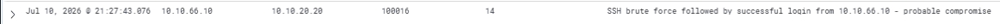

# Rule 100016: Compound Brute Force Followed by Successful Login
 
## Metadata
| Field | Value |
|-------|-------|
| Rule ID | `100016` |
| Severity | Critical |
| MITRE ATT&CK Tactic | Initial Access / Credential Access |
| MITRE ATT&CK Technique | T1078 — Valid Accounts / T1110.001 — Brute Force: Password Guessing |
| Data Source | Wazuh (compound correlation) |
| Status | Active |
 
---
 
## Threat Context
 
### Description
Fires when a successful SSH authentication event is observed from the same source IP that previously triggered rule 100015 (SSH brute force detected) within the correlation window. The rule identifies the exact moment a brute force attack succeeds — the transition from noise to genuine compromise — and is the highest-severity alert in the reconnaissance-and-credential-access rule chain.
 
### Real-World Usage
The transition from failed to successful authentication after a brute force attempt is the canonical indicator of a compromised account. It appears prominently in nearly every published post-breach incident report where SSH was the initial vector. Notable examples include the FritzFrog botnet operations, where compromised SSH credentials on Linux servers seeded the peer-to-peer worm's spread, and multiple ransomware operator TTPs (LockBit, Play, ALPHV) that begin with brute-forced SSH into exposed Linux management interfaces.
 
### Why This Matters
Rule 100015 alone tells the analyst "someone is attempting a brute force"; rule 100016 tells the analyst "the brute force succeeded". These are qualitatively different events requiring different response actions. Rule 100015 warrants monitoring and potentially blocking the source IP; rule 100016 warrants immediate containment — session termination, credential rotation, host isolation, and forensic investigation. Distinguishing these two states in the SIEM is essential for appropriate incident response prioritisation.
 
---
 
## Detection Strategy
 
### Logic
The rule is a compound correlation rule — it does not aggregate events, it correlates two distinct event streams. When the current event is a successful SSH authentication (Wazuh built-in rule 5715), the engine checks whether the same source IP triggered rule 100015 within the default correlation window. If both conditions are true, rule 100016 fires.
 
Unlike rules 100013, 100014, and 100015 which use `<frequency>` and `<timeframe>` to aggregate multiple events into one alert, rule 100016 uses `<if_matched_sid>` alone to establish the temporal correlation between two events. The Wazuh correlator maintains state on previously matched rule IDs and evaluates the correlation at the moment the second event arrives.
 
### Data Source Requirements
- Source: `wazuh-alerts-*` (both built-in and custom rule outputs)
- Required fields: `srcip` on both the successful auth event and the prior rule 100015 alert
- Prerequisites: rules 100015 and Wazuh built-in rule 5715 (SSH successful authentication) must be deployed and firing correctly

### Thresholds
- **No `frequency` attribute** — the rule fires on the correlation itself, not on repeated occurrences. During implementation an attempt to use `frequency="1"` was rejected by Wazuh with the error `Invalid frequency: 1. Must be higher than 1 and lower than 10000.` The engine reserves frequency-based semantics for aggregation of multiple events; correlation of two distinct events uses `<if_matched_sid>` without frequency.
- **Implicit correlation window** — Wazuh applies a default correlation window (typically 600 seconds) when `<if_matched_sid>` is used without explicit timeframe. This window is sufficient for the realistic scenario where an attacker completes brute force and immediately attempts login with the recovered credentials.
- **Level 14 (Critical)** — the highest severity in the current custom ruleset. Successful compromise is the most operationally urgent event a SOC L1 can observe.

---
 
## Implementation
 
### Wazuh Rule (XML)
```xml
<group name="authentication,custom,">
  <rule id="100016" level="14">
    <if_sid>5715</if_sid>
    <if_matched_sid>100015</if_matched_sid>
    <same_srcip />
    <description>SSH brute force followed by successful login from $(srcip) - probable compromise</description>
    <mitre>
      <id>T1078</id>
      <id>T1110.001</id>
    </mitre>
    <group>attack,credential_access,brute_force_success,compromise,</group>
  </rule>
</group>
```

---
 
## Atomic Testing
 
### Test Command
Execute both stages of the compound event in sequence:
```bash
# Stage 1: trigger rule 100015 with brute force
head -n 1000 /usr/share/wordlists/rockyou.txt > /tmp/wordlist-small.txt
hydra -l arodriguez -P /tmp/wordlist-small.txt ssh://10.10.20.20 -t 4 -V
 
# Stage 2: successful login from same srcip triggers rule 100016
ssh arodriguez@10.10.20.20
```
 
### Expected Result
One alert in `wazuh-alerts-*` with:
- `data.srcip: 10.10.66.10`
- `agent.ip: 10.10.20.20`
- `rule.id: 100016`
- `rule.level: 14`
- `rule.description` containing "SSH brute force followed by successful login from 10.10.66.10 - probable compromise"

In parallel, the prior rule 100015 alert remains visible in the alerts index, providing the full attack timeline: brute force alert → successful login alert.
 
### Validation Screenshot

 
---
 
## False Positives
 
### Known FP Scenarios
- Legitimate user who mistyped their password 10+ times, then finally succeeded — extremely rare in practice given the elevated threshold of rule 100015, but theoretically possible for users returning after credential rotation.
- Password rotation event where automation scripts on the source host had cached old credentials, failed repeatedly during rotation, and eventually succeeded when the update propagated.
- Legitimate security testing exercises where authorised operators intentionally reproduce the brute force + success pattern.

### Mitigations
- The upstream rule 100015 already filters out casual human error through its 10-attempt threshold, dramatically reducing the population of source IPs that could trigger this rule.
- Known authorised source IPs (penetration test kickoff systems, red team infrastructure) should be excluded via `<not_srcip>` referencing a `SECURITY_TESTING_ALLOWLIST` alias.
- If a specific host is a known source of legitimate password-caching automation, that pattern should be investigated for credential management improvements rather than whitelisted.
  
---
 
## References
- [MITRE ATT&CK T1078 — Valid Accounts](https://attack.mitre.org/techniques/T1078/)
- [MITRE ATT&CK T1110.001 — Brute Force: Password Guessing](https://attack.mitre.org/techniques/T1110/001/)
- [Wazuh documentation — Correlation with `if_matched_sid`](https://documentation.wazuh.com/current/user-manual/ruleset/ruleset-xml-syntax/rules.html)
- Internal reference: `docs/04-attack-scenarios/01-full-kill-chain-vlan-dev.md` (Phase 2 and 3 — the exact pattern this rule detects)
- Internal reference: `docs/05-detection-rules/rule-100015-ssh-brute-force-aggregation.md` (parent rule this correlation depends on)
