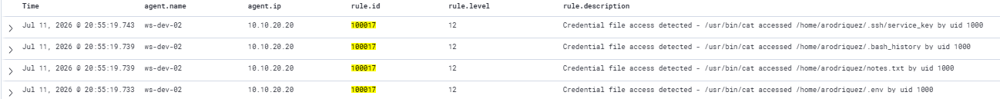

# Rule 100017: Credential File Access Detection
 
## Metadata
| Field | Value |
|-------|-------|
| Rule ID | `100017` |
| Severity | Critical |
| MITRE ATT&CK Tactic | Credential Access |
| MITRE ATT&CK Technique | T1552.001 — Unsecured Credentials in Files / T1552.003 — Bash History / T1552.004 — Private Keys |
| Data Source | auditd (via Wazuh Linux agent) |
| Platform | Linux |
| Status | Active |
 
---
 
## Threat Context
 
### Description
Fires when a process reads any file tagged as a credential-bearing artefact through auditd file watches. The rule detects direct file access to environment configuration files (`.env`), plaintext notes containing credentials (`notes.txt`), shell command history (`.bash_history`), and any file within the user's SSH directory (`.ssh/`). Each of these paths hosts credentials that are frequently harvested by attackers during post-compromise reconnaissance.
 
### Real-World Usage
Credential harvesting from filesystem artefacts is one of the most common post-exploitation activities documented in threat intelligence. Once an attacker gains initial foothold on a Linux host, standard practice is to search for `.env` files (containing database credentials, API keys, cloud tokens), `.ssh/` directories (for private keys enabling lateral movement to other hosts), and shell histories (for typed passwords and command patterns). Notable examples include Team TNT campaigns targeting cloud metadata and `.env` files on compromised Docker hosts, the WatchDog cryptojacking campaign that specifically enumerated SSH keys for propagation, and multiple ransomware groups (LockBit, ALPHV) whose playbooks explicitly include harvesting `~/.aws/credentials`, `.env`, and `.ssh/id_rsa` before deployment.
 
### Why This Matters
Credential file access is a silent operation. Unlike brute force or exploitation, reading a file with `cat` produces no error, triggers no service, and generates no user-visible symptom. Without explicit detection, an attacker can harvest an entire host's credential material in seconds without any signal in the SIEM. This rule surfaces the activity as a Critical-severity alert precisely because the operation is otherwise invisible. The detection is what turns "silent credential theft" into "observed credential access" — the difference between undetected breach and active incident response.
 
---
 
## Detection Strategy
 
### Logic
The detection operates in two layers. First, auditd on the target host is configured with file watches that generate kernel-level audit events whenever the specified paths are accessed for read (or read/write/attribute change in the case of `.ssh/`). Each watch is tagged with a distinctive key so subsequent filtering can identify the specific credential type accessed. Second, a Wazuh custom rule consumes any audit event whose key matches one of the credential-access tags and promotes it to a Critical alert with MITRE mapping.
 
The two-layer design is important: auditd operates at kernel syscall level (`openat`, `read`) with no dependency on shell history or command parsing, making it robust against evasion techniques that avoid `cat`, `less`, or other user-space tools. Any process that opens the watched file — including scripts, editors, or exfiltration utilities — triggers the audit event.
 
### Data Source Requirements
- Source: auditd via Wazuh Linux agent (`<localfile>` block reading `/var/log/audit/audit.log`)
- Required fields: `audit.key`, `audit.exe`, `audit.file.name`, `audit.uid`
- Prerequisites:
  - auditd installed and running (`systemctl status auditd`)
  - Custom watch rules deployed in `/etc/audit/rules.d/credential-access.rules` (see Implementation section)
  - Wazuh Linux agent configured with audit log ingestion
  - Wazuh built-in ruleset group `audit` operational
### Thresholds
Not applicable — this rule fires per matched event. Every access to a watched credential path generates one alert. This design is intentional: credential access is high-signal enough that aggregation would obscure operationally critical detail. A single successful `cat ~/.env` warrants investigation.
 
**Level 12 (Critical)** — placed at the same severity as SSH brute force aggregation (100015) and just below compromise confirmation (100016). Credential harvest is a high-impact operation whose consequences propagate to other systems accessed with the stolen material.
 
---
 
## Implementation
 
### Prerequisite — auditd watch configuration
 
The following watch rules must be deployed on each Linux host under detection. Create `/etc/audit/rules.d/credential-access.rules`:
 
```bash
sudo tee /etc/audit/rules.d/credential-access.rules > /dev/null <<'EOF'
# Watch sensitive credential files for read access
-w /home/arodriguez/.env -p r -k env_file_access
-w /home/arodriguez/notes.txt -p r -k notes_file_access
-w /home/arodriguez/.bash_history -p r -k bash_history_access
 
# Watch SSH directory for read, write, and attribute change
-w /home/arodriguez/.ssh/ -p rwa -k ssh_dir_access
EOF
```
 
Load the rules:
 
```bash
sudo augenrules --load
sudo auditctl -l | grep -E "env_file|notes_file|bash_history|ssh_dir"
```
 
Notes on the watch configuration:
- `-p r` enables read-only monitoring (sufficient for credential harvest detection).
- `-p rwa` on the `.ssh/` directory catches read (harvesting), write (adding attacker keys — covered separately by rule 100019), and attribute changes.
- The keys (`env_file_access`, etc.) are the pivotal field that the Wazuh rule filters on. Distinct keys per path enable dashboard drill-down and per-artefact reporting.
- In production environments, watches would be applied to all user home directories with pattern-based rules (`-w /home/*/`) rather than named users. The named-user approach is used here to match the lab's fixed user set.
### Wazuh Rule (XML)
 
```xml
<group name="audit,custom,">
  <rule id="100017" level="12">
    <if_group>audit</if_group>
    <field name="audit.key">env_file_access|notes_file_access|bash_history_access|ssh_dir_access</field>
    <description>Credential file access detected - $(audit.exe) accessed $(audit.file.name) by uid $(audit.uid)</description>
    <mitre>
      <id>T1552.001</id>
      <id>T1552.003</id>
      <id>T1552.004</id>
    </mitre>
    <group>attack,credential_access,sensitive_file_access,</group>
  </rule>
</group>
```
 
Key structural decisions:
- `<if_group>audit</if_group>` restricts matching to events already processed by the Wazuh built-in audit ruleset, ensuring the audit fields are populated.
- `<field name="audit.key">A|B|C|D</field>` uses regex OR to match any of the four credential-access keys with a single rule instead of four near-identical rules.
- The description interpolates the executing binary, the accessed file, and the acting user, giving the L1 analyst all triage-critical information at first glance without opening the event detail.
  
---
 
## Atomic Testing
 
### Test Command
From an SSH session on the target host, execute reads against each watched artefact:
 
```bash
cat /home/arodriguez/.env
cat /home/arodriguez/notes.txt
cat /home/arodriguez/.bash_history
cat /home/arodriguez/.ssh/service_key
```
 
### Expected Result
Four alerts in `wazuh-alerts-*`, one per file access, with:
- `agent.name: ws-dev-02`
- `agent.ip: 10.10.20.20`
- `rule.id: 100017`
- `rule.level: 12`
- `rule.description` containing the accessed file path (e.g., "Credential file access detected - /usr/bin/cat accessed /home/arodriguez/.env by uid 1000")
  
### Validation Screenshot


 
---
 
## False Positives
 
### Known FP Scenarios
- The user themselves reading their own configuration files during legitimate work — for example, a developer opening `.env` in a text editor to update a credential.
- Backup software (rsync, borg, restic, duplicity) reading files during scheduled backup runs. These generate high volumes of matching events during backup windows.
- System maintenance scripts (fail2ban, logwatch, ossec) that periodically inspect user home directories as part of security auditing.
- IDE and shell tab-completion mechanisms that read `.bash_history` for suggestion features.
  
### Mitigations
- Exclude known backup and maintenance processes by adding `<field name="audit.exe" negate="yes">rsync|borgbackup|restic|duplicity</field>` in a variant of the rule. Whitelist maintenance is required on an ongoing basis as tooling changes.
- Time-of-day filtering: legitimate credential access typically occurs during business hours and is intentional. Automated harvest from a compromised account often occurs off-hours when the legitimate user is offline. Correlation with time context can be added at the dashboard layer rather than in the rule.
- In production environments where the target files are truly write-only from an application (for example a service-only user's `.env`), any read is by definition anomalous and no whitelist is needed.
  
---
 
## References
- [MITRE ATT&CK T1552.001 — Unsecured Credentials in Files](https://attack.mitre.org/techniques/T1552/001/)
- [MITRE ATT&CK T1552.003 — Bash History](https://attack.mitre.org/techniques/T1552/003/)
- [MITRE ATT&CK T1552.004 — Private Keys](https://attack.mitre.org/techniques/T1552/004/)
- [Linux auditd documentation — File and directory watches](https://man7.org/linux/man-pages/man8/auditctl.8.html)
- [Wazuh documentation — Audit rules integration](https://documentation.wazuh.com/current/user-manual/capabilities/auditing-whodata/auditing-linux.html)
- Internal reference: `docs/04-attack-scenarios/01-full-kill-chain-vlan-dev.md` (Phase 5 — the credential harvest sequence this rule detects)
 
