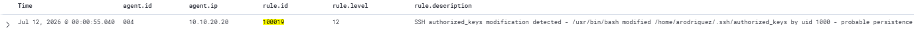

# Rule 100019: SSH Authorized Keys Modification
 
## Metadata
| Field | Value |
|-------|-------|
| Rule ID | `100019` |
| Severity | Critical |
| MITRE ATT&CK Tactic | Persistence |
| MITRE ATT&CK Technique | T1098.004 — Account Manipulation: SSH Authorized Keys |
| Data Source | auditd (via Wazuh Linux agent) |
| Platform | Linux |
| Status | Active |
 
---
 
## Threat Context
 
### Description
Fires when a process modifies the SSH `authorized_keys` file of a monitored user, capturing writes, appends, or attribute changes to the file. The rule detects the canonical Linux persistence technique of inserting an attacker-controlled public key into the target user's authorized_keys, granting the attacker passwordless SSH access that survives password rotations, session terminations, and even most incident-response containment actions short of full authorized_keys review.
 
### Real-World Usage
SSH authorized_keys manipulation is one of the most durable persistence mechanisms available on Linux and appears across the full attacker spectrum. It is a core component of the FritzFrog peer-to-peer botnet, which harvests credentials from compromised hosts and installs its public key to enable rapid re-entry. The Rocke and Kinsing cryptomining campaigns use authorized_keys injection to survive kill scripts and container restarts. Multiple APT operators (documented by Mandiant in APT41 and by CrowdStrike in Panda operators) use authorized_keys entries as long-term footholds that remain active for months after initial compromise, allowing return access even after all other artefacts have been cleaned.
 
### Why This Matters
Password-based authentication can be revoked by rotating the password. Kerberos tickets expire. Session tokens can be invalidated. But an authorized_keys entry persists silently until an administrator manually inspects the file and removes the entry — an inspection that almost never happens outside of active incident response. A single successful modification of authorized_keys effectively gives the attacker permanent access to the account until discovered and removed. This rule fires at Critical severity because the operation is nearly always malicious in production environments where authorized_keys is expected to be immutable outside of formal provisioning workflows.
 
---
 
## Detection Strategy
 
### Logic
The detection uses an auditd file watch scoped precisely to the `authorized_keys` file rather than the containing `.ssh/` directory. The watch is configured with `-p wa` to catch both write operations (the actual attacker payload) and attribute changes (permission modifications that often accompany the attack). A Wazuh custom rule consumes any audit event tagged with the `authorized_keys_write` key and promotes it to a Critical alert with MITRE T1098.004 mapping.
 
### Data Source Requirements
- Source: auditd via Wazuh Linux agent (`<localfile>` block reading `/var/log/audit/audit.log`)
- Required fields: `audit.key`, `audit.exe`, `audit.file.name`, `audit.uid`
- Prerequisites:
  - auditd installed and running
  - File-specific watch on the target's `authorized_keys` deployed in `/etc/audit/rules.d/credential-access.rules`
  - Wazuh Linux agent configured with audit log ingestion
  
### Thresholds
Not applicable — this rule fires per matched event. Every modification of the authorized_keys file generates one alert. Aggregation is intentionally avoided because a single successful modification is a complete persistence outcome; there is no meaningful "burst" pattern to consolidate.
 
**Level 12 (Critical)** — the same severity as rule 100017 (credential file access) and rule 100016 (compound brute force + success). Modifications to authorized_keys are near-certainly malicious in production environments where SSH keys are provisioned through formal workflows (Ansible, configuration management, or manual admin activity that occurs within known change windows).
 
---
 
## Implementation
 
### Prerequisite — auditd watch configuration
 
Add the following watch to `/etc/audit/rules.d/credential-access.rules` (the same file used by rule 100017):
 
```bash
sudo tee -a /etc/audit/rules.d/credential-access.rules > /dev/null <<'EOF'
 
# Watch SSH authorized_keys file specifically for write (persistence detection)
-w /home/arodriguez/.ssh/authorized_keys -p wa -k authorized_keys_write
EOF
```

### Wazuh Rule (XML)
 
```xml
<group name="audit,custom,">
  <rule id="100019" level="12">
    <if_group>audit</if_group>
    <field name="audit.key">authorized_keys_write</field>
    <description>SSH authorized_keys modification detected - $(audit.exe) modified $(audit.file.name) by uid $(audit.uid) - probable persistence</description>
    <mitre>
      <id>T1098.004</id>
    </mitre>
    <group>attack,persistence,ssh_authorized_keys,</group>
  </rule>
</group>
```
 
Key structural decisions:
- `<if_group>audit</if_group>` restricts matching to Wazuh-processed audit events.
- `<field name="audit.key">authorized_keys_write</field>` matches only the specific key tagged by the file-level watch.
- The description explicitly includes "probable persistence" for immediate triage clarity, avoiding ambiguity about the operational nature of the alert.

---
 
## Atomic Testing
 
### Test Command
From an SSH session on the target host, simulate the attacker's persistence injection:
 
```bash
echo "ssh-rsa AAAAB3TESTKEY attacker@kali" >> ~/.ssh/authorized_keys
```
 
### Expected Result
One alert in `wazuh-alerts-*` with:
- `agent.id: 004`
- `agent.ip: 10.10.20.20`
- `rule.id: 100019`
- `rule.level: 12`
- `rule.description` containing "SSH authorized_keys modification detected - /usr/bin/bash modified /home/arodriguez/.ssh/authorized_keys by uid 1000 - probable persistence"
 
### Validation Screenshot


 
---
 
## False Positives
 
### Known FP Scenarios
- Configuration management tools (Ansible, Puppet, Chef, Salt) deploying SSH keys during scheduled runs. These generate alerts during their execution windows.
- Manual key rotation by administrators legitimately updating SSH keys during credential lifecycle operations.
- Onboarding workflows where new user SSH keys are added to service accounts or shared workstations.
- SSH key syncing tools that periodically synchronise authorized_keys with a central identity source.
  
### Mitigations
- Correlate alerts with configuration management execution windows. Modifications during authorised deployment runs can be de-prioritised in triage.
- Exclude known configuration management tool executables via `<field name="audit.exe" negate="yes">/usr/bin/ansible|/usr/bin/puppet|/opt/salt</field>` in a variant of the rule. This whitelist must be maintained as tooling changes.
- Modifications to service account authorized_keys files should be treated more strictly than modifications to human user files, since service accounts are expected to have static key configurations.
- Time-of-day analysis at the dashboard layer: modifications outside change management windows warrant immediate investigation regardless of source.
  
---
 
## References
- [MITRE ATT&CK T1098.004 — Account Manipulation: SSH Authorized Keys](https://attack.mitre.org/techniques/T1098/004/)
- [Linux auditd documentation — File watches and rule specificity](https://man7.org/linux/man-pages/man8/auditctl.8.html)
- [FritzFrog botnet analysis (Guardicore Labs)](https://www.akamai.com/blog/security/fritzfrog-p2p)
- [Rocke and Kinsing cryptomining analysis (Aqua Security)](https://blog.aquasec.com/threat-alert-kinsing-malware-container-vulnerability)
- Internal reference: `docs/04-attack-scenarios/01-full-kill-chain-vlan-dev.md` (Phase 8 — the authorized_keys persistence this rule detects)
- Internal reference: `docs/05-detection-rules/rule-100017-credential-file-access.md` (related rule with which overlap had to be resolved)
