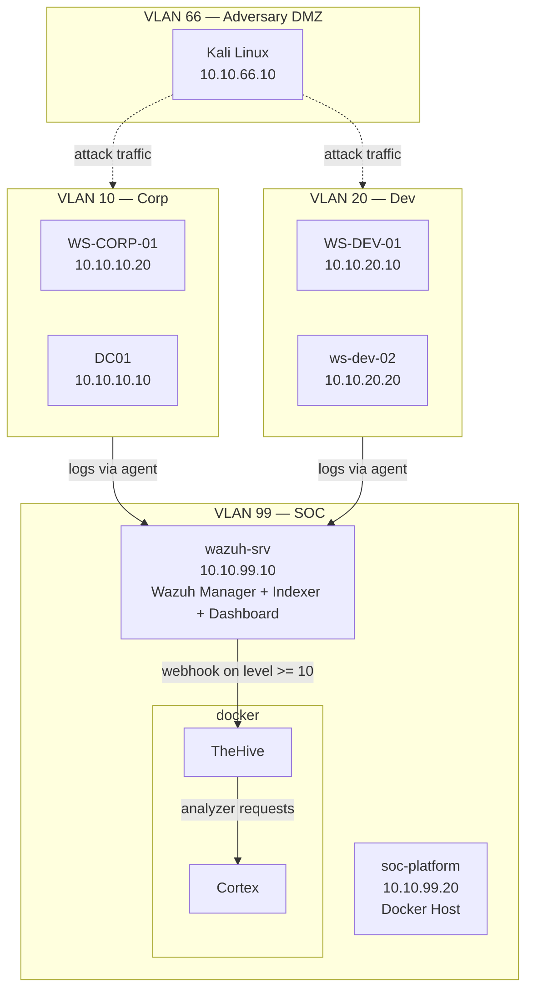

# Phase 7 — SOC Platform Integration
 
## Overview
 
Phase 7 extends the SOC HomeLab from a SIEM-only detection environment (Wazuh) to an integrated SOC platform combining detection, case management, and threat intelligence enrichment. The goal of this phase is to reproduce the operational workflow of a small-to-medium production SOC using entirely open-source tooling.
 
Prior phases established the following capabilities:
- Network infrastructure with pfSense-based VLAN segmentation (Phase 1)
- Wazuh SIEM deployment with agents and dashboards (Phase 2)
- Adversary simulation environment in Kali Linux (Phase 3)
- Attack scenario execution and documentation (Phase 4)
- Custom detection rules mapped to MITRE ATT&CK (Phase 5)
- L1 incident report following industry conventions (Phase 6)
Phase 7 adds the operational tools that turn detection into response.
 
---
 
## Components
 
The Phase 7 stack consists of three tools deployed as Docker containers on a new dedicated VM (`soc-platform`, 10.10.99.20) in the SOC management VLAN.
 
**TheHive** — Security incident response platform providing case management, task tracking, and observable management. Wazuh alerts of severity level 10 or higher trigger the automatic creation of a TheHive case via webhook integration. TheHive is deployed as the entry point for the response layer of the SOC.
 
**Cortex** — Analysis and enrichment engine that integrates with TheHive. Cortex hosts analyzers (IP geolocation, WHOIS, VirusTotal, AbuseIPDB, MISP lookup, and others) that are invoked from TheHive cases to enrich observables automatically. Cortex is deployed alongside TheHive as part of the StrangeBee ecosystem.
 
---
 
## Architecture diagram
 

 
---
 
## Data flow
 
The Phase 7 stack implements the following end-to-end workflow for a typical alert:
 
1. **Endpoint agents and pfSense forward telemetry** to the Wazuh Manager on 10.10.99.10 (Windows and Linux endpoint agents, plus pfSense filterlog via syslog).
2. **Wazuh Manager processes the events** and applies both built-in rules and the custom detection rules developed in Phase 5.
3. **Alerts of severity level 10 or higher trigger a webhook** to TheHive on the `soc-platform` VM (10.10.99.20). TheHive automatically creates a new case containing the alert data and observables.
4. **Analyst reviews the case in TheHive**. From the case interface, the analyst can invoke Cortex analyzers against the case observables (IPs, domains, hashes, URLs).
5. **Analyst uses the enriched context** to decide response actions (containment, escalation, closure).
This flow represents the operational workflow that a SOC L1/L2 analyst executes for each significant alert in a production environment.
 
---
 
## Resource requirements
 
The Phase 7 stack introduces the following resource requirements on the homelab host:
 
| Component | RAM | Disk | CPU | Notes |
|-----------|-----|------|-----|-------|
| soc-platform VM (new) | 10 GB | 60 GB | 4 vCPU | Hosts Docker with TheHive, Cortex |
| Docker: TheHive + Cassandra + Elasticsearch + MinIO | 4 GB | 20 GB | Shared | Cassandra, Elasticsearch and MinIO are backends for TheHive |
| Docker: Cortex | 1 GB | 5 GB | Shared | Analysis engine (runs analyzers as containers) |
 
Total additional resource footprint for Phase 7: approximately **10 GB RAM, 60 GB disk, 4 vCPU**, comfortably accommodated on a 32 GB host.
 
---
 
## Deployment sequence
 
The Phase 7 deployment is broken into sequential steps. Each step produces a functional milestone that can be validated independently before proceeding.
 
**Step 1 — soc-platform VM and Docker infrastructure** Provision the `soc-platform` VM on VLAN 99 (10.10.99.20). Deploy Ubuntu Server 24.04 LTS. Install Docker Engine and Docker Compose. Validate connectivity to the Wazuh Manager and to external networks.
 
**Step 2 — TheHive and Cortex deployment** Deploy TheHive, Cortex, Cassandra, Elasticsearch, and MinIO via a single Docker Compose file. Complete initial configuration (admin accounts, organisation, API integration between TheHive and Cortex). Enable a baseline Cortex analyzer. Verify by creating a test case and running an analyzer against an observable.
 
**Step 3 — Cortex analyzers (external enrichment)** Register with the external intelligence services (VirusTotal, AbuseIPDB, and others with a usable free tier), obtain their API keys, and configure the corresponding Cortex analyzers. Validate each analyzer against a known indicator.
 
**Step 4 — Wazuh-to-TheHive integration** Configure the Wazuh Integrator to send alerts of level ≥ 10 as webhooks to TheHive, producing automatic case creation. Validate with a replay of a Phase 4 attack scenario: Wazuh alert → TheHive case → Cortex enrichment.
 
---

Next: [Phase 7 Docker Infrastructure: TheHive and Cortex](02-docker-infrastructure.md)
