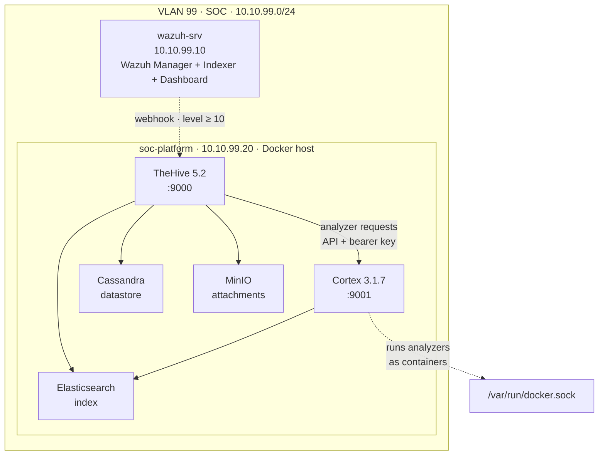
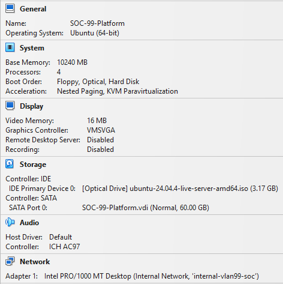
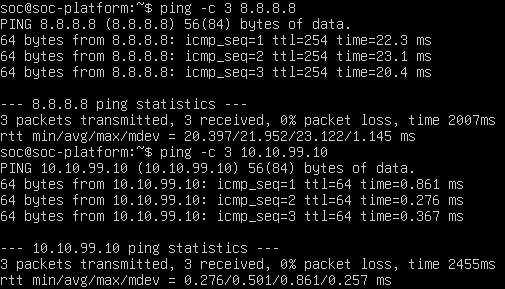
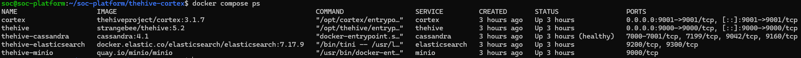
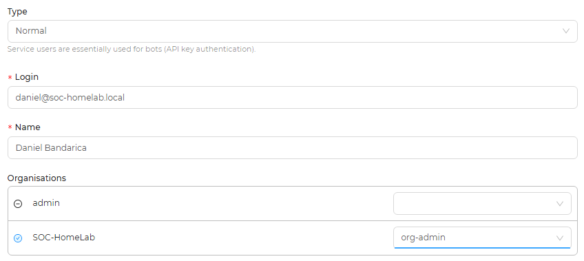
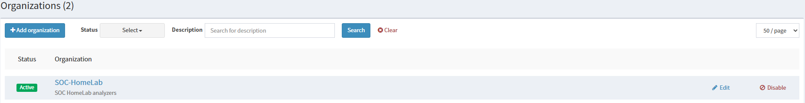
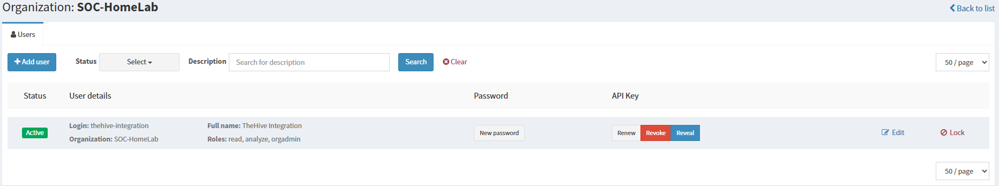
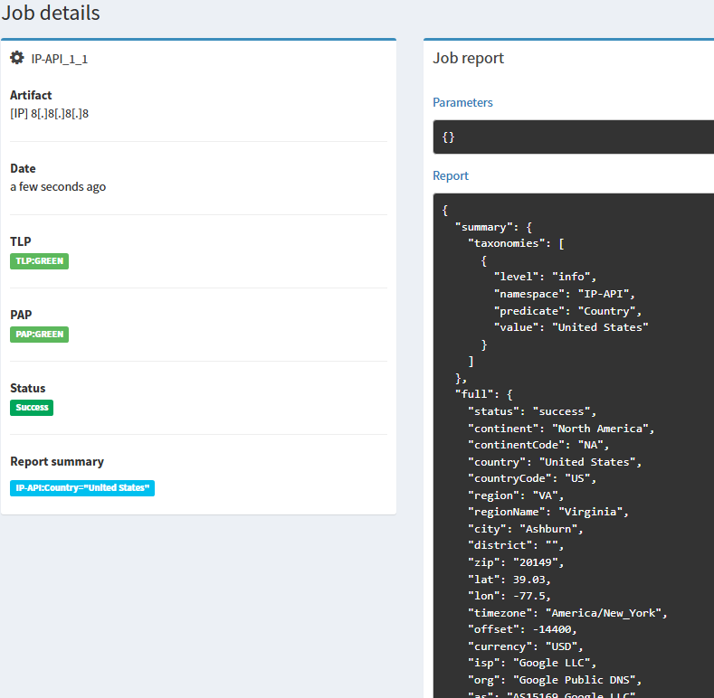
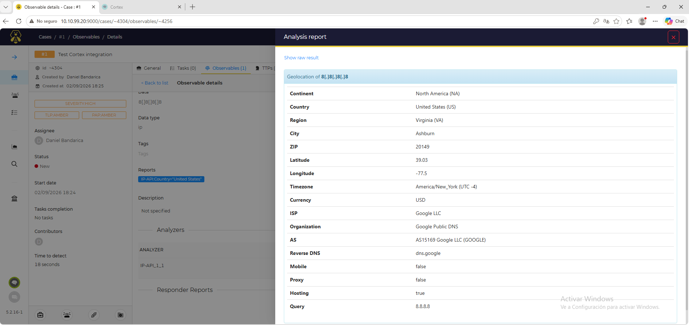

# Phase 7 — Part 1: Docker Infrastructure (TheHive + Cortex)
 
## Overview
 
Phases 1 through 6 built a detection capability: telemetry sources, custom rules, and an operational dashboard that turns raw events into alerts. But detection is only the first half of a SOC's job. An alert that fires on a dashboard is not an outcome — it is the start of a process. Someone has to open it, investigate it, enrich the indicators it contains, decide what it means, and act. Phase 7 builds the half of the SOC that begins where the alert ends.
 
This part deploys the foundation of the response layer: a dedicated host running **TheHive** (case management) and **Cortex** (analysis and enrichment) as containers. The design question here is not "how do I detect?" but "once something has been detected, what does an analyst actually do with it?". The answer is a workflow, alert becomes case, case accumulates observables, observables get enriched with context, context drives a decision, and that workflow needs tooling that Wazuh alone does not provide.
 
The response platform was deliberately placed on a new, separate VM rather than co-located with the Wazuh Manager. The two roles have different failure modes: a runaway container or an out-of-memory event on the response stack must never be able to take down the SIEM that is the lab's primary source of truth. Isolation on a dedicated host, within the same out-of-band SOC VLAN, keeps the blast radius contained while preserving low-latency communication between the two.
 
---
 
## Architecture
 

 
All five containers share a single Docker bridge network, so services address each other by name (`cortex`, `cassandra`, `elasticsearch`) rather than by IP. TheHive is the operational entry point on port 9000; Cortex sits behind it on 9001, invoked over its API. Cassandra, Elasticsearch, and MinIO are backing stores that TheHive requires and that an analyst never touches directly. The dashed webhook from Wazuh is the integration that closes the loop between detection and response, it is documented and deployed in a later part; here the platform is built and validated in isolation so that any fault is attributable to the platform itself, not to the integration.
 
---
 
## Host preparation
 
### VM specifications
 

 
The VM was placed on VLAN 99 alongside the existing Wazuh host. Before any container was deployed, connectivity was validated in both directions that matter: reachability to the Wazuh Manager (`10.10.99.10`) and reachability to external networks (required to pull container images and to let Cortex analyzers query online services).
 


---
 
## The stack
 
### Services
 
The `thehive-cortex` stack comprises five services on a single bridge network:
 
| Service | Image | Role |
| ------- | ----- | ---- |
| cassandra | cassandra | Primary datastore for TheHive |
| elasticsearch | elasticsearch | Index backend for TheHive |
| minio | minio | S3-compatible object storage for case attachments |
| cortex | thehiveproject/cortex | Analysis and enrichment engine |
| thehive | strangebee/thehive | Case management platform |

---
 
## Deployment
 
### Bringing up the stack
 
With the compose file in place, the stack was launched detached:
 
```bash
cd ~/soc-platform/thehive-cortex
docker compose up -d
```
 
The first launch pulls several multi-gigabyte images. Startup is **not** instantaneous once they land: Cassandra and Elasticsearch take one to two minutes to become ready, and TheHive retries its backend connections during that window. Transient "connection refused" lines in the TheHive log during the first minutes are expected and clear on their own once the backends report healthy. Startup was followed with:

 
Once all five containers reported `Up` — with Cassandra showing `healthy` — the stack was considered live.
 


---
 
## Initial configuration
 
### TheHive
 
TheHive 5 separates platform administration from operational work, and the configuration follows that split:
 
1. The platform superadmin (`admin@thehive.local`) had its default password changed on first login.
2. An organisation, `SOC-HomeLab`, was created to hold all case work.
3. An operational analyst user (`daniel@soc-homelab.local`) was created inside that organisation with the `org-admin` profile.
The superadmin exists only to manage organisations and platform-level connectors; every case is worked as the analyst. This mirrors how TheHive is run in production, where the person triaging alerts is never the same identity that administers the platform.
 

 
### Cortex
 
Cortex has its own first-start sequence:
 
1. The database index was initialised through the "Update Database" migration on first access.
2. A platform superadmin was created.
3. An organisation, `SOC-HomeLab`, was created and set to Active.
4. The dedicated `thehive-integration` user was created with `read`, `analyze`, and `orgadmin` roles, and an API key was generated for it.




### Enabling an analyzer
 
To validate the analysis engine without depending on third-party registration, the **IP-API** analyzer (IP geolocation) was enabled. Analyzers that query services requiring an account, VirusTotal, AbuseIPDB and similar, are deferred to the enrichment stage, when API keys for those services will be provisioned.
 


Analyzer is working correctly.
 
---
 
## Integration — TheHive to Cortex
 
The link between the two was configured from TheHive's platform administration interface, under the Cortex connector:
 
| Parameter | Value |
| --------- | ----- |
| Server name | cortex-soc-homelab |
| URL | http://cortex:9001 |
| Auth type | bearer |
| API key | (the `thehive-integration` key created) |
 
The URL uses the Docker service name `cortex`, not the host IP. Because TheHive and Cortex share the `soc-net` bridge, TheHive resolves `cortex` internally, and the link no longer depends on host-level routing. Internal reachability was confirmed first:
 


With the connector in place, the integration was validated from the analyst's perspective: within a case, the previously enabled IP-API analyzer was run against an IP observable, and the enriched result was returned directly into TheHive.

---
 
## Troubleshooting
 
### Analyzer fails with DNS resolution error
 
On the first analyzer run, execution failed with:
 
```
Failed to resolve 'ip-api.com' ([Errno -3] Temporary failure in name resolution)
```
 
The observable had been submitted correctly and the analyzer container had started — but it could not resolve the external hostname it needed to query. The root cause is the interaction between the host's DNS and Docker: Ubuntu resolves DNS through `systemd-resolved` listening on the loopback address `127.0.0.53`, which is unreachable from inside a container. Cortex runs its analyzers **as containers**, so every analyzer inherited a broken resolver.
 
The fix was to give the Docker daemon explicit DNS servers, applied in `/etc/docker/daemon.json`:
 
```json
{
  "dns": ["10.10.99.1", "8.8.8.8"]
}
```
 
followed by `sudo systemctl restart docker`. After the restart, analyzer containers resolved external names and the analysis completed.
 
**Lesson:** when a dockerized Cortex analyzer fails on name resolution while the host itself has working DNS, the daemon is handing containers a loopback resolver they cannot reach. Configuring `dns` in `daemon.json` is a required step for any Cortex-in-Docker deployment, not an optional tweak — without it, every analyzer that touches an external service fails.
 
### Image pull interrupted mid-download
 
The initial `docker compose up -d` aborted partway through with `connection reset by peer` while pulling several large images in parallel. Docker retains the layers that completed, so the pull was simply re-run and resumed from where it stopped rather than starting over. On an unstable link, pulling each image individually with `docker pull` before `docker compose up -d` avoids saturating the connection and isolates any single failed download to one retry instead of restarting the whole set.
 
**Lesson:** a failed compose pull is not a failed deployment. Layers are cached; re-running resumes. Serial `docker pull` is the safer pattern when bandwidth is the constraint.
 
### Cortex "Analyzers" menu is missing
 
While configuring Cortex, the Analyzers management view could not be found. The cause was the account in use: in Cortex, the Analyzers view is **not** visible to the platform superadmin — it belongs to a user holding the `orgadmin` role *inside* an organisation. Logged in as the superadmin, the section simply does not render.
 
**Lesson:** Cortex enforces the same platform/organisation split as TheHive. Platform-level accounts manage organisations and users; analyzer configuration is organisation-level work and requires an `orgadmin` identity within the organisation. If a menu appears to be missing, verify the role of the logged-in user before assuming a broken install.
 
---
 
## Result
 
- Dedicated `soc-platform` VM deployed on VLAN 99 (10.10.99.20), isolated from the Wazuh host so that a fault in the response stack cannot affect the SIEM.
- Five-service stack (Cassandra, Elasticsearch, MinIO, Cortex, TheHive) deployed via a single Compose file on a shared bridge network, all containers healthy.
- Default secrets and credentials hardened before first launch; default admin password changed at first login.
- TheHive configured with a platform/operational split: `SOC-HomeLab` organisation and a dedicated analyst account.
- Cortex configured with its own organisation, a dedicated `thehive-integration` service account, and the IP-API analyzer enabled.
- TheHive-to-Cortex integration established over the internal Docker network using the service name, and reported connected.
- End-to-end enrichment validated: an IP observable in a TheHive case was successfully analyzed by Cortex, with the result returned into the case.
- Three deployment gotchas documented with root cause and lesson: container DNS resolution, interrupted image pulls, and role-scoped analyzer visibility.
 
---
 
*Previous: [Phase 7 — Architecture](00-architecture.md)*
*Next: Phase 7 — Part 2: MISP Deployment (`02-misp-deployment.md`)*


