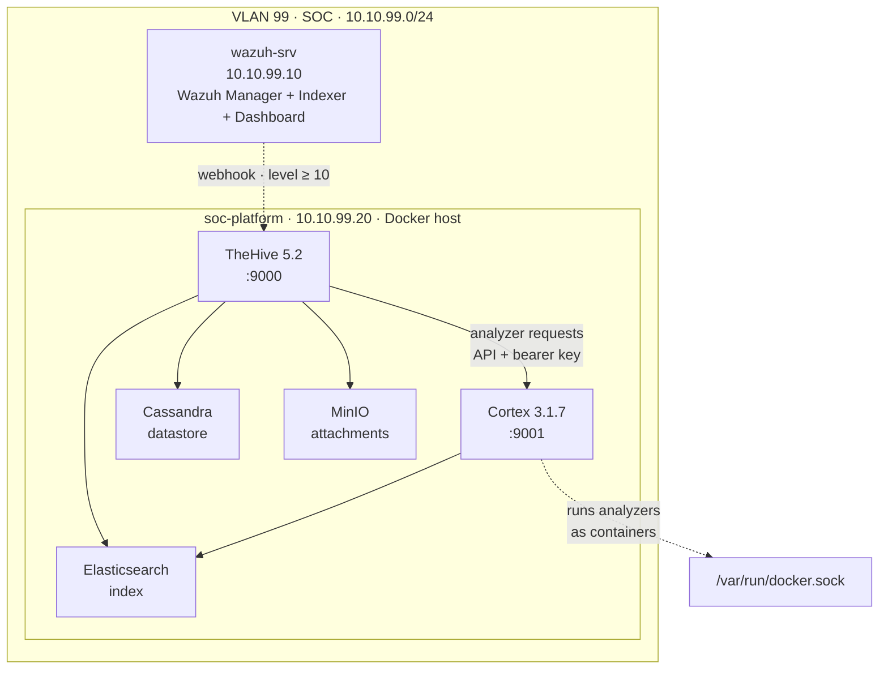

# Phase 7 — Part 1: Docker Infrastructure (TheHive + Cortex)
 
## Overview
 
Phases 1 through 6 built a detection capability: telemetry sources, custom rules, and an operational dashboard that turns raw events into alerts. But detection is only the first half of a SOC's job. An alert that fires on a dashboard is not an outcome — it is the start of a process. Someone has to open it, investigate it, enrich the indicators it contains, decide what it means, and act. Phase 7 builds the half of the SOC that begins where the alert ends.
 
This part deploys the foundation of the response layer: a dedicated host running **TheHive** (case management) and **Cortex** (analysis and enrichment) as containers. The design question here is not "how do I detect?" but "once something has been detected, what does an analyst actually do with it?". The answer is a workflow, alert becomes case, case accumulates observables, observables get enriched with context, context drives a decision, and that workflow needs tooling that Wazuh alone does not provide.
 
The response platform was deliberately placed on a new, separate VM rather than co-located with the Wazuh Manager. The two roles have different failure modes: a runaway container or an out-of-memory event on the response stack must never be able to take down the SIEM that is the lab's primary source of truth. Isolation on a dedicated host, within the same out-of-band SOC VLAN, keeps the blast radius contained while preserving low-latency communication between the two.
 
---
 
## Architecture
 

 
All five containers share a single Docker bridge network, so services address each other by name (`cortex`, `cassandra`, `elasticsearch`) rather than by IP. TheHive is the operational entry point on port 9000; Cortex sits behind it on 9001, invoked over its API. Cassandra, Elasticsearch, and MinIO are backing stores that TheHive requires and that an analyst never touches directly. The dashed webhook from Wazuh is the integration that closes the loop between detection and response, it is documented and deployed in a later part; here the platform is built and validated in isolation so that any fault is attributable to the platform itself, not to the integration.
 
---
 
## Host preparation
 
### VM specifications
 
| Attribute | Value |
| --------- | ----- |
| Name | soc-platform |
| OS | Ubuntu Server 24.04 LTS |
| RAM | 10 GB |
| CPU | 4 vCPUs |
| Disk | 60 GB |
| Network | Internal Network (VLAN 99) |
| Static IP | 10.10.99.20 |
| Gateway | 10.10.99.1 (pfSense VLAN99) |
 
The VM was placed on VLAN 99 alongside the existing Wazuh host. Before any container was deployed, connectivity was validated in both directions that matter: reachability to the Wazuh Manager (`10.10.99.10`) and reachability to external networks (required to pull container images and to let Cortex analyzers query online services).
 

