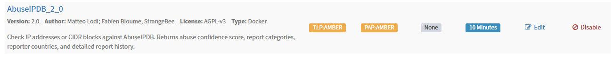
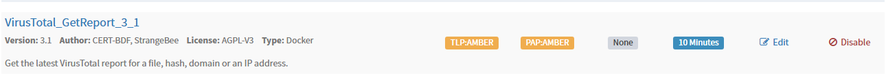
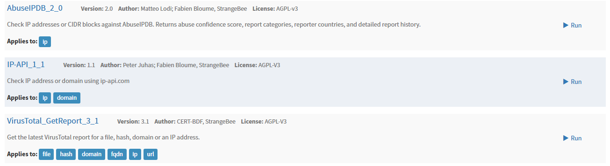
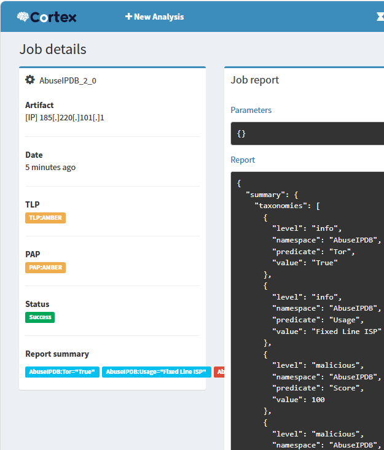
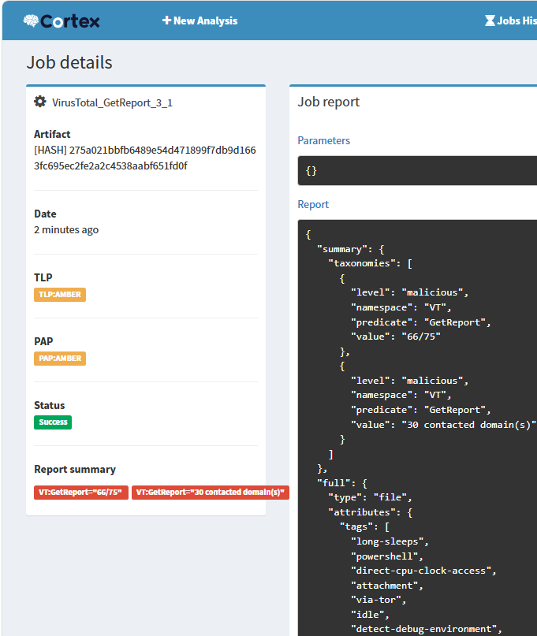
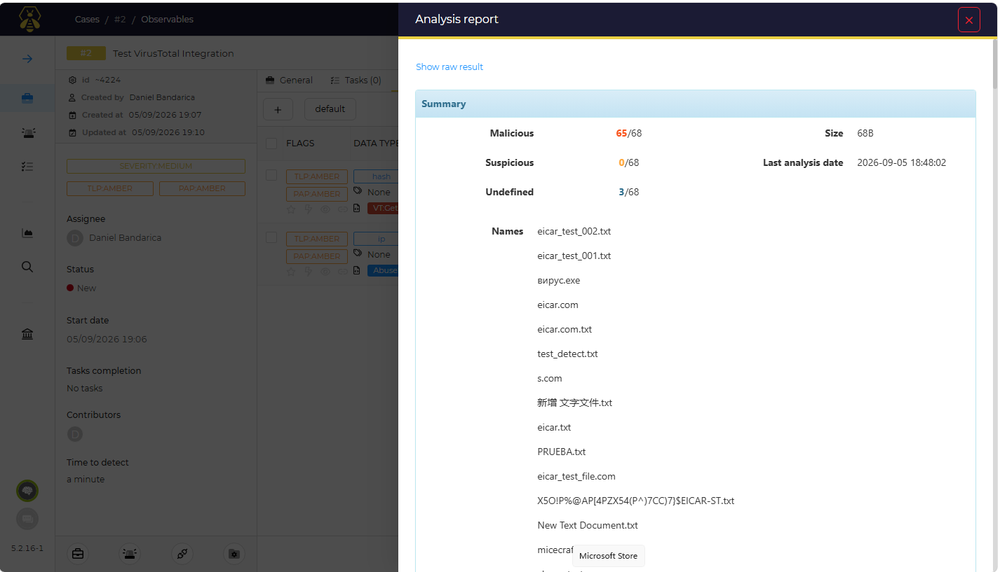

# Phase 7 — Part 2: Cortex Analyzers — External Enrichment
 
## Overview
 
Part 1 left Cortex running with a single analyzer — IP-API — enabled purely to prove the engine worked. That validated the mechanism, but IP geolocation is not threat intelligence: knowing an address sits in Frankfurt says nothing about whether it is hostile. This part gives Cortex the ability to answer the question an analyst actually asks of an indicator, "is this known-bad, and how do we know?", by wiring it into established external reputation services.
 
Two analyzers were added to the IP-API baseline. The selection was driven by observable-type coverage, not by count, a SOC needs to enrich IPs, domains, URLs, and file hashes, and the goal was to cover those types with credible sources rather than to stack many overlapping feeds.
 
---
 
## Analyzer selection
 
| Analyzer | Observable types | Source |
| -------- | ---------------- | ------ | 
| IP-API | ip | ip-api.com (geolocation) |
| AbuseIPDB | ip | Community abuse reports |
| VirusTotal (GetReport) | ip, domain, url, hash | Multi-engine aggregation (Google) |
 
### Why these two

**AbuseIPDB** answers "has this IP been reported for abuse, by how many sources, and how confidently". It is the reference community reputation source for addresses, and its free tier is far beyond anything a lab will consume.
 
**VirusTotal** is the widest-reaching of the free options: a single analyzer that covers IPs, domains, URLs, and file hashes by aggregating dozens of antivirus engines and scanners. It is the one analyzer a SOC analyst is guaranteed to have used, which makes it the highest-value addition to the platform.

---

### AbuseIPDB
 
The AbuseIPDB analyzer was enabled with:
 
| Parameter | Value |
| --------- | ----- |
| key | (AbuseIPDB API key) |
| days | 30 |
| Remaining parameters | default |
 

 
### VirusTotal
 
The VirusTotal_GetReport variant was chosen over VirusTotal_Scan. GetReport queries VirusTotal's existing report for an indicator; Scan submits the indicator to be actively scanned. For enrichment, GetReport is both sufficient and far more economical on the free-tier quota, since it does not consume a scan.
 
| Parameter | Value |
| --------- | ----- |
| key | (VirusTotal API key) |
| Rate limit | default |
| Remaining parameters | default |
 

 
After enabling both, three analyzers were active in the organisation: IP-API, AbuseIPDB, and VirusTotal_GetReport.
 

 
---

## Validation
 
The analyzers were validated against real, known indicators rather than lab-generated ones, the whole point of external enrichment is that it speaks to the real threat landscape. Using an internal simulated IP here would prove nothing, since no external service has an opinion on it.
 
### AbuseIPDB — against a reported IP
 
An IP with a known abuse history was submitted (a commonly-reported Tor exit node, `185.220.101.1`):
 
- Data type: `ip`
- Analyzer: AbuseIPDB
The analyzer returned an abuse confidence score and the number of community reports, confirming live reputation lookup.
 

 
### VirusTotal — against the EICAR test hash
 
The EICAR test file is a harmless standard file that every antivirus engine detects by convention, making it the correct choice for validating detection plumbing without handling real malware. Its SHA-256 hash was submitted:
 
- Data type: `hash`
- Value: `275a021bbfb6489e54d471899f7db9d1663fc695ec2fe2a2c4538aabf651fd0f`
- Analyzer: VirusTotal_GetReport
The analyzer returned detections across multiple engines, confirming the VirusTotal integration and the free-tier key.
 

### From within TheHive
 
Finally, the analyzers were confirmed available where they matter, inside a case. As the analyst user, an IP observable was added to a case and enriched using VirusTotal directly from the TheHive interface, with results returned into the observable.

---
 
## Result
 
- Enrichment extended from a geolocation-only baseline to real external threat intelligence, covering IPs, domains, URLs, and file hashes.
- AbuseIPDB enabled for IP reputation, validated against a known reported address.
- VirusTotal (GetReport) enabled for IP/domain/URL/hash reputation, validated against the EICAR test hash.
- Analyzer selection driven by observable-type coverage rather than source count; Shodan excluded on cost grounds, consistent with the project's tool-selection discipline.
- API keys handled as secrets, never committed, entered only into Cortex configuration.
- Enrichment confirmed end-to-end from within a TheHive case, using real indicators from established sources.
- Two operational gotchas documented with root cause and lesson: analyzer authentication and free-tier rate limiting.
 
---
 
*Previous: [Phase 7 — Part 1: Docker Infrastructure](02-docker-infrastructure.md)*
*Next: [Phase 7 — Part 3: Wazuh-to-TheHive Integration](04-wazuh-thehive-integration.md)*
