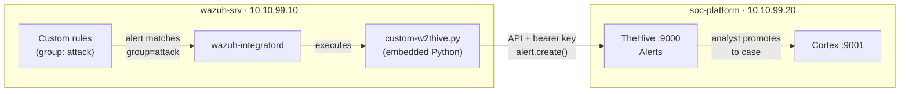

# Phase 7 — Part 3: Wazuh-to-TheHive Integration
 
## Overview
 
Parts 1 and 2 built a response platform that worked in isolation: TheHive held cases, Cortex enriched observables, and an analyst could drive both by hand. But nothing connected detection to that platform. Every case had to be created manually. This part closes the loop, the single most important integration of the phase, so that a Wazuh detection becomes a TheHive alert **automatically**, with no analyst in the middle.
 
The question this part answers is the one that separates a SIEM from a SOC: "when something is detected, how does it become work in front of an analyst?". The answer is the Wazuh Integrator, a manager-side module that executes a custom script whenever an alert matches a filter. The script translates the Wazuh alert into a TheHive alert over TheHive's API and submits it.
 
Getting the connection working was the easy half. The hard and more instructive half was making it behave like a real SOC feed rather than a firehose — which is where most of the engineering, and the most useful lessons, are.
 
---
 
## Architecture
 

 
The Integrator watches the Wazuh alert stream. When an alert carries the `attack` group, the Integrator invokes the `custom-w2thive` wrapper, which runs the Python script under Wazuh's embedded interpreter. The script authenticates to TheHive with a dedicated service-account API key and creates an alert. From there the analyst promotes it to a case and enriches it with the Cortex analyzers from Part 2.
 
---
