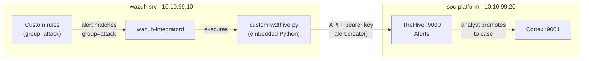
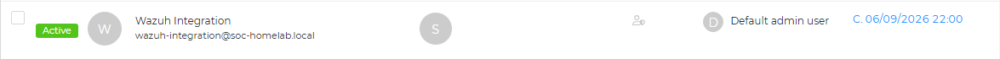
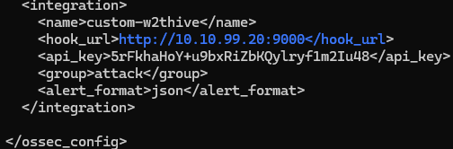
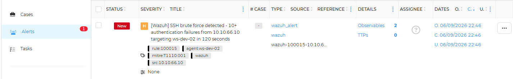
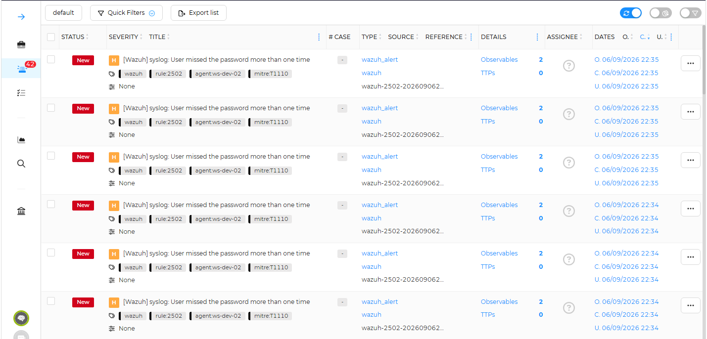

# Phase 7 — Part 3: Wazuh-to-TheHive Integration
 
## Overview
 
Parts 1 and 2 built a response platform that worked in isolation: TheHive held cases, Cortex enriched observables, and an analyst could drive both by hand. But nothing connected detection to that platform. Every case had to be created manually. This part closes the loop, the single most important integration of the phase, so that a Wazuh detection becomes a TheHive alert **automatically**, with no analyst in the middle.
 
The question this part answers is the one that separates a SIEM from a SOC: "when something is detected, how does it become work in front of an analyst?". The answer is the Wazuh Integrator, a manager-side module that executes a custom script whenever an alert matches a filter. The script translates the Wazuh alert into a TheHive alert over TheHive's API and submits it.
 
Getting the connection working was the easy half. The hard and more instructive half was making it behave like a real SOC feed rather than a firehose — which is where most of the engineering, and the most useful lessons, are.
 
---
 
## Architecture
 

 
The Integrator watches the Wazuh alert stream. When an alert carries the `attack` group, the Integrator invokes the `custom-w2thive` wrapper, which runs the Python script under Wazuh's embedded interpreter. The script authenticates to TheHive with a dedicated service-account API key and creates an alert. From there the analyst promotes it to a case and enriches it with the Cortex analyzers from Part 2.
 
---

## The integration account
 
Following the service-account principle used throughout the platform, a dedicated TheHive user was created for the integration rather than reusing a personal or administrative account:
 

 
The `analyst` profile was chosen deliberately over `org-admin`. Creating alerts requires the `manageAlert` permission, which `analyst` already carries; it does not require organisation administration rights. Granting only the profile the task needs is least-privilege applied to a machine identity, if the integration's API key ever leaks, it can create alerts but cannot administer the organisation.

---

## The integration script
 
TheHive is not a native Wazuh integration, so the connection is a custom integration: a Python script plus a shell wrapper in `/var/ossec/integrations/`.
 
- `custom-w2thive.py` — reads the Wazuh alert JSON passed by the Integrator, maps the Wazuh level to TheHive severity, extracts observables (IPs, hashes) from the alert, and creates a TheHive alert via the API.
- `custom-w2thive` — a shell wrapper that runs the script under Wazuh's embedded Python (`/var/ossec/framework/python/bin/python3`).
The script uses **thehive4py v2.1.0**, matched to TheHive 5.2. This matters: almost every guide in circulation targets thehive4py v1 (`from thehive4py.api import TheHiveApi`, `api.create_alert(...)`), whose API is incompatible with v2. The v2 client is constructed as `TheHiveApi(url=..., apikey=...)` and alerts are created with `api.alert.create(alert=...)`.
 
Severity mapping from the Wazuh 0–15 scale to TheHive's 1–4:
 
| Wazuh level | TheHive severity |
| ----------- | ---------------- |
| ≥ 13 | 4 (Critical) |
| 10–12 | 3 (High) |
| 7–9 | 2 (Medium) |
| < 7 | 1 (Low) |
 
Both files require specific permissions and ownership or the Integrator refuses to run them: mode `750`, owner `root:wazuh`.

---

## Configuration — filtering by group, not by level
 
The Integrator is enabled with a block in `/var/ossec/etc/ossec.conf`, inside `<ossec_config>`:
 

 
The most important design decision in this part is the filter: **`<group>attack</group>`, not `<level>10</level>`.**
 
The initial configuration filtered by level (≥ 10). It produced immediate noise, native Wazuh rules like *"User missed the password more than one time"* fire at level 10 and would have created a TheHive case every time someone mistyped a password. Level measures the *technical severity* of an event, not whether it *warrants investigation*. Those are different questions, and using level as the filter conflates them.
 
The custom detection ruleset from Phase 5 already encodes the right distinction. Every intentional attack-detection rule carries the `attack` group; the base and policy-hygiene rules do not:
 
| Rule | Level | `attack` group | Reaches TheHive |
| ---- | ----- | -------------- | --------------- |
| 100001 (auth failed base) | 5 | no | no |
| 100010 (firewall drop base) | 3 | no | no |
| 100012 (segmentation policy) | 7 | no | no |
| 100011, 100013–100019 (attacks) | 10–14 | yes | yes |
 
The clearest proof that group beats level: rule 100018 (cron persistence) fires at level 10 — the *same* level as the native password-typo rule. Filtered by level, both reach TheHive; filtered by group, only the real attack does. Case management receives the analyst's intentional detections and nothing else.

---
 
## Validation
 
With the integration enabled and the manager restarted, a brute-force attack was launched from Kali against ws-dev-02, triggering rule 100015 (level 12, group `attack`):
 
```
hydra -l arodriguez -P rockyou.txt ssh://10.10.20.20 -t 4
```
 
The alert appeared in TheHive automatically, carrying the mapped severity, the MITRE tag from the rule, the source IP, and the extracted observables, ready for enrichment with the Cortex analyzers. Promoting it to a case and running AbuseIPDB and VirusTotal against its observables confirmed the full chain:
 
**attack → Wazuh detection → automatic TheHive alert → case → Cortex enrichment.**
 

 
---
 
## Troubleshooting

### Alert flooding — one attack, 42 alerts
 
Once working, a single brute-force run produced **42 alerts in TheHive**. This is the classic alert-flooding problem: rule 100015 fires every time its frequency window (10 failures in 120 s) refills, and hydra keeps that window full for as long as it runs. One conceptual incident became dozens of alerts — exactly the alert fatigue that undermines a SOC.
 
The fix was a deterministic sourceRef. TheHive deduplicates alerts by their `sourceRef`: reusing the same reference for the same logical incident makes TheHive reject the duplicates instead of creating new alerts. The script builds the reference from rule and source IP, `wazuh-<rule_id>-<srcip>` — rather than a unique timestamp, so every re-fire of the same brute force from the same IP collapses onto one alert.



Auto-generated alert in TheHive before troubleshooting.
 
**Lesson:** a detection rule that fires on a sliding window will re-fire for the duration of an attack; forwarding each re-fire produces alert flooding downstream. Deduplicating at the case-management layer with a deterministic reference keyed to the logical incident (rule + source) turns an attack into a single alert. Distinguishing an *expected* duplicate from a *real* error in the integration's own logging keeps the signal honest.
 
---

## Result
 
- Wazuh-to-TheHive integration deployed via the Integrator module and a custom script/wrapper pair, using thehive4py v2.1.0 matched to TheHive 5.2.
- Dedicated `wazuh-integration` service account created with least-privilege (`analyst` profile, `manageAlert` only); API key handled as a secret.
- Alerts filtered by the `attack` group rather than by level, so only intentional Phase 5 detections create cases and native operational noise (e.g. password-typo events) is excluded, demonstrated against rules that share a level but differ in intent.
- Wazuh level mapped to TheHive severity; IPs and hashes extracted from alerts as observables for downstream enrichment.
- Alert flooding solved with a deterministic `sourceRef` (`wazuh-<rule_id>-<srcip>`): one attack now produces one alert instead of dozens.
- Integration logging refined to record expected duplicates as INFO and reserve ERROR for genuine failures.
- Full detection-to-response chain validated end-to-end: Kali attack → Wazuh custom rule → automatic TheHive alert → case → Cortex enrichment.
- Three deployment gotchas documented with root cause and lesson: missing wrapper file, script truncation on paste, and alert flooding with its deduplication fix.
 
---
 
*Previous: [Phase 7 — Part 2: Cortex Analyzers](02-cortex-analyzers.md)*
