# Phase 1 — Infrastructure Setup
 
## Overview
 
This phase covers the full setup of the virtualized SOC lab environment. All machines run inside VirtualBox on a single host using an isolated internal network, simulating a real enterprise segment without exposing anything to the outside world.

---

## Host Machine Specs

| Component | Spec |
|-----------|------|
| CPU | Intel Core i7-14700KF |
| RAM | 32 GB |
| GPU | NVIDIA RTX 5070 |
| Hypervisor | VirtualBox (latest) |

---

## Network Design
 
All VMs communicate over a VirtualBox **Internal Network** named `SOC-Homelab`.
 
| VM | IP |
|----|----|
| Kali Linux | 192.168.10.10 |
| Ubuntu Desktop 24.04 | 192.168.10.20 |
| Ubuntu — Wazuh Manager | 192.168.10.30 |
| Ubuntu — Splunk | 192.168.10.40 |
| Windows Server 2022 | 192.168.10.50 |
| Windows 10/11 | 192.168.10.60 |
 
## Data Flow

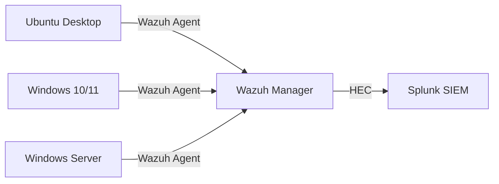
 
---
 
## Virtual Machines
 
### VM 1 — Kali Linux (Attacker)
 
| Setting | Value |
|---------|-------|
| OS | Kali Linux (latest, 64-bit) |
| RAM | 4 GB |
| CPU | 2 cores |
| Disk | 50 GB (dynamically allocated) |
| Adapter 1 | NAT |
| Adapter 2 | Internal Network — `SOC-Homelab` |
| Role | Attack machine (Nmap, Hydra, Metasploit, Burp Suite) |
 
**Static IP configuration** (`/etc/network/interfaces`):
```
Interface: eth1 (Adapter 2)
IP:        192.168.10.10
Netmask:   255.255.255.0
```
 
---
 
### VM 2 — Ubuntu Desktop 24.04 (Linux Target)
 
| Setting | Value |
|---------|-------|
| OS | Ubuntu Desktop 24.04.3 (amd64) |
| RAM | 4 GB |
| CPU | 2 cores |
| Disk | 50 GB (dynamically allocated) |
| Adapter 1 | Internal Network — `SOC-Homelab` |
| Role | Linux attack target + Wazuh Agent host |
 
**Static IP configuration** (Settings → Network → Wired):
```
Interface: enp0s3 (or similar)
IP:        192.168.10.20
Netmask:   255.255.255.0 / CIDR: 24
```
 
---
 
### VM 3 — Ubuntu Server — Wazuh Manager
 
| Setting | Value |
|---------|-------|
| OS | Ubuntu Server 24.04 LTS |
| RAM | 6 GB |
| CPU | 2 cores |
| Disk | 50 GB (dynamically allocated) |
| Adapter 1 | NAT |
| Adapter 2 | Internal Network — `SOC-Homelab` |
| Role | Wazuh Manager (EDR backend) + Suricata IDS + alert forwarding to Splunk via HEC |
 
**Static IP configuration** (`/etc/netplan/00-installer-config.yaml`):
```yaml
network:
  version: 2
  renderer: networkd
  ethernets:
    enp0s3:
      dhcp4: true
    enp0s8:
      dhcp4: false
      addresses:
        - 192.168.10.30/24
```
 
---
 
### VM 4 — Ubuntu Server — Splunk
 
| Setting | Value |
|---------|-------|
| OS | Ubuntu Server 24.04 LTS |
| RAM | 6 GB |
| CPU | 2 cores |
| Disk | 60 GB (dynamically allocated) |
| Adapter 1 | NAT |
| Adapter 2 | Internal Network — `SOC-Homelab` |
| Role | Splunk SIEM (dashboards, SPL queries, correlation rules) |
 
**Static IP configuration** (`/etc/netplan/00-installer-config.yaml`):
```yaml
network:
  version: 2
  renderer: networkd
  ethernets:
    enp0s3:
      dhcp4: true
    enp0s8:
      dhcp4: false
      addresses:
        - 192.168.10.40/24
```
 
---
 
### VM 5 — Windows Server 2022 (Active Directory DC)
 
| Setting | Value |
|---------|-------|
| OS | Windows Server 2022 Evaluation (Desktop Experience) |
| RAM | 4 GB |
| CPU | 2 cores |
| Disk | 60 GB (dynamically allocated) |
| Adapter 1 | Internal Network — `SOC-Homelab` |
| Role | Active Directory Domain Controller + Sysmon + Wazuh Agent |
 
**Static IP configuration** (Control Panel → Network → Adapter → IPv4 Properties):
```
IP:           192.168.10.50
Subnet mask:  255.255.255.0
Gateway:      (empty)
DNS:          192.168.10.50 (self, after AD DS promotion)
```
 
---
 
### VM 6 — Windows 10/11 (Windows Workstation)
 
| Setting | Value |
|---------|-------|
| OS | Windows 10/11 (64-bit) |
| RAM | 4 GB |
| CPU | 2 cores |
| Disk | 60 GB (dynamically allocated) |
| Adapter 1 | Internal Network — `SOC-Homelab` |
| Role | Windows workstation + Sysmon + Wazuh Agent + domain-joined to AD |
 
**Static IP configuration** (Settings → Network → Ethernet → Edit):
```
IP:           192.168.10.60
Subnet mask:  255.255.255.0
Gateway:      (empty)
DNS:          192.168.10.50 (Windows Server AD)
```

---

## Connectivity Verification

Once all VMs are running and IPs are assigned, verify connectivity from each machine:

**From Kali — ping all hosts:**
```bash
ping -c 1 192.168.10.20   # Ubuntu Desktop
ping -c 1 192.168.10.30   # Wazuh Manager
ping -c 1 192.168.10.40   # Splunk
ping -c 1 192.168.10.50   # Windows Server
ping -c 1 192.168.10.60    # Windows Workstation
```
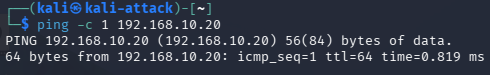

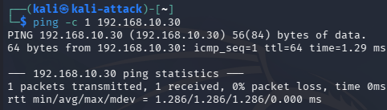

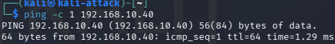

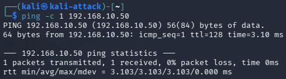

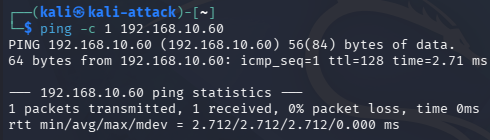


**From Wazuh Manager — ping target and SIEM:**
```bash
ping -c 1 192.168.10.20   # Ubuntu Desktop
ping -c 1 192.168.10.40   # Splunk
```
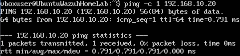

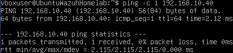


## Screenshots

| Screenshot | Description |
|------------|-------------|
| 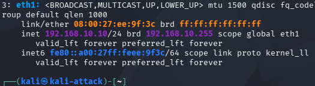 | `ip a` output showing 192.168.10.10 |
| 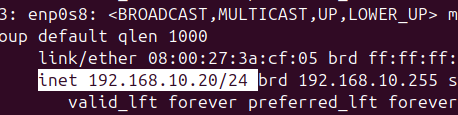 | `ip a` showing 192.168.10.20 |
| 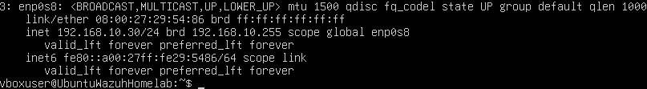 | `ip a` showing 192.168.10.30 |
| 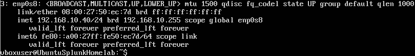 | `ip a` showing 192.168.10.40 |
| 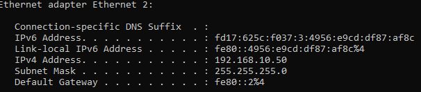 | `ipconfig` showing 192.168.10.50 |
| 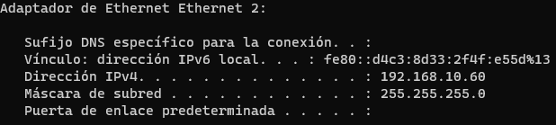 | `ipconfig` showing 192.168.10.60 |

---
 
*Next: [Phase 2 — Wazuh Deployment](phase2-wazuh.md)*

*Next: [Phase 2 — Wazuh Deployment](phase2-wazuh.md)*
