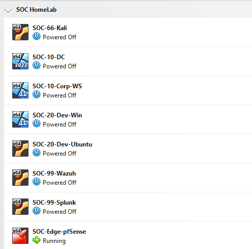

# Phase 1 — VirtualBox Foundation
 
> **Goal:** Prepare the hypervisor, installation media, and operating conventions so that all subsequent phases can provision VMs against a consistent baseline.
 
## Overview
 
Phase 1 is pure preparation. It produces four deliverables:
 
1. A verified VirtualBox installation with the matching Extension Pack
2. All required installation media downloaded
3. A folder structure for ISOs and VM storage
4. Documented naming
 
---
 
## 1. Host requirements
 
- Intel Core i7-14700KF (20 cores, 28 threads)
- 32 GB DDR5 Minimum
- NVMe storage with 250 GB+ free for VM disks

---
 
## 2. Installation media
 
Six ISO files are downloaded for the lab. Two ISOs (Ubuntu Server, Windows 11 Pro) are reused across multiple VMs to save bandwidth and storage.
 
| OS | Edition | Source |
|---|---|---|
| pfSense CE (via Netgate Installer) | v1.2-RELEASE | https://www.pfsense.org/download/ → Netgate Store |
| Windows Server 2022 | Eval (180 day) | https://www.microsoft.com/en-us/evalcenter/evaluate-windows-server-2022 |
| Windows 11 Pro | Latest | https://www.microsoft.com/en-us/software-download/windows11 |
| Ubuntu Server | 24.04 LTS | https://ubuntu.com/download/server |
| Ubuntu Desktop | 24.04 LTS | https://ubuntu.com/download/desktop |
| Kali Linux | Installer (latest) | https://www.kali.org/get-kali/#kali-installer-images |
 
---
 
## 3. VirtualBox preparation
 
A VM Group named **`SOC HomeLab`** is created in VirtualBox to group all eight lab VMs in one collapsible folder. The group exists empty at the end of Phase 1; VMs are added to it as they are created in Phase 2 onward.
 
The four VirtualBox Internal Networks used to model the VLANs are *not* pre-created. They materialize automatically the first time a VM with a matching adapter is started (this happens in Phase 2 when pfSense boots for the first time). The names used are case-sensitive and whitespace-sensitive:
 
| Network name | VLAN | Purpose |
|---|---|---|
| `vlan10-corp` | 10 | Corporate domain |
| `vlan20-dev` | 20 | Development workstations |
| `vlan66-attack` | 66 | Attacker DMZ |
| `vlan99-soc` | 99 | SOC management |
 
---
 
## 6. Conventions
 
### VM naming
 
Format: `SOC-{VLAN-or-zone}-{Role}`. All VMs go inside the `SOC HomeLab` VM Group.
 
| VM | Name |
|---|---|
| pfSense edge router | `SOC-Edge-pfSense` |
| Active Directory DC | `SOC-10-DC` |
| Windows 11 Pro Corporate | `SOC-10-Corp-WS` |
| Windows 11 Pro Dev | `SOC-20-Dev-Win` |
| Ubuntu Desktop Dev | `SOC-20-Dev-Ubuntu` |
| Wazuh manager | `SOC-99-Wazuh` |
| Splunk SIEM | `SOC-99-Splunk` |
| Kali attacker | `SOC-66-Kali` |

---
 
## Next phase
 
[Phase 2 — Network Backbone](phase2-network-backbone.md)
 
