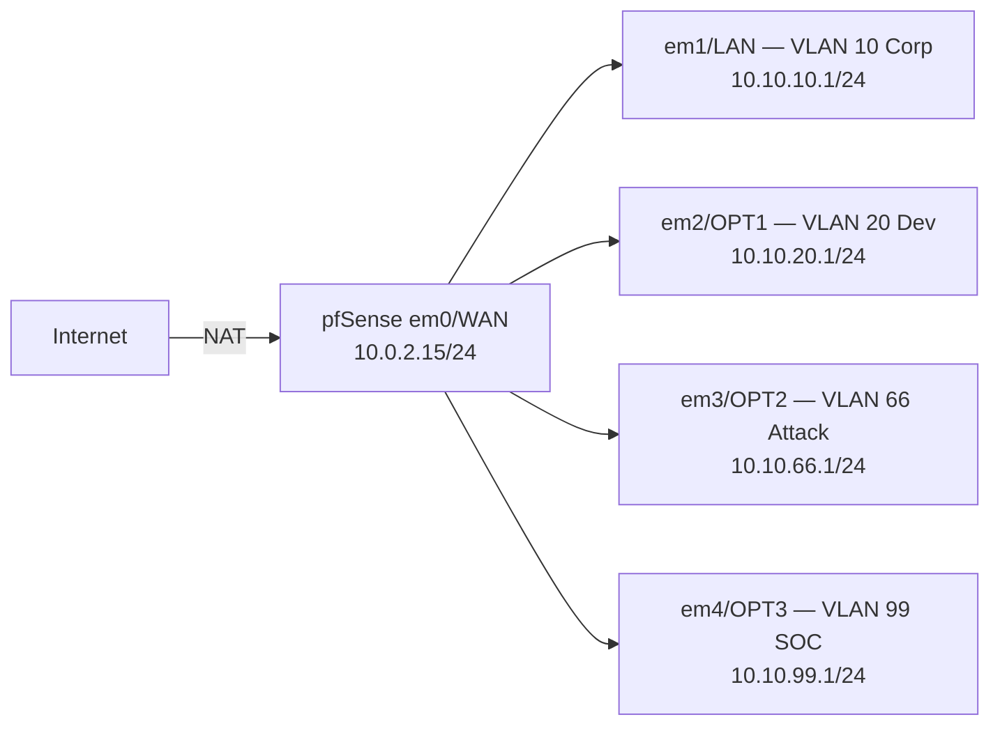
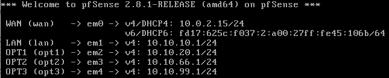
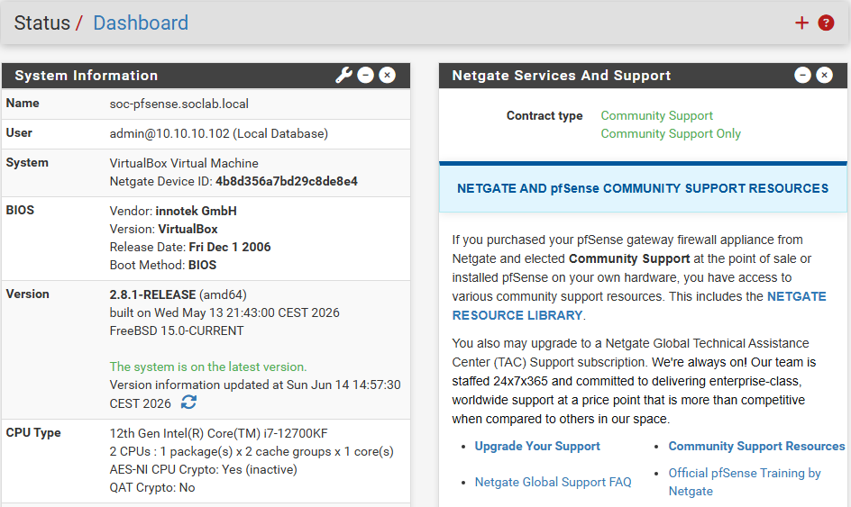
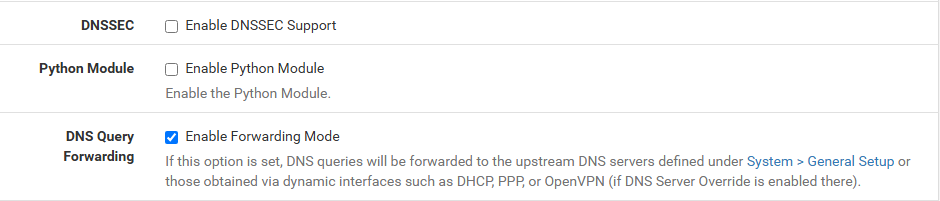
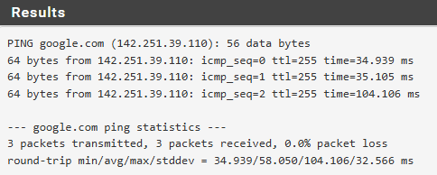

# Phase 2 — Network Backbone (pfSense)
 
## Overview
 
pfSense was deployed as the lab's edge router, providing routing between four isolated VLANs and NAT for internet egress. The deployment consists of the pfSense VM with five interfaces (1 WAN + 4 LAN/OPT), a Windows 11 Pro Corporate workstation used to bootstrap webGUI access, and Suricata installed as the IDS package. VLAN segmentation is implemented through VirtualBox Internal Networks rather than 802.1Q tagged trunks.
 
---
 
## Environment
 
| Component       | Version       | Host                                 |
| --------------- | ------------- | ------------------------------------ |
| pfSense CE      | 2.8.1-RELEASE | FreeBSD VM — 5 NICs                  |
| Suricata        | 7.0.8_5       | pfSense package                      |
| Win 11 Pro Corp | 24H2          | VLAN 10 — 10.10.10.102 (DHCP)        |
 
> Wazuh Manager and Splunk Enterprise are deployed in [Phase 3 — SOC Stack Deployment](phase3-soc-stack.md).
 
---
 
## Architecture
 

 
---
 
## Deployment
 
### pfSense VM provisioning
 
The pfSense VM was created with five virtual NICs (1 NAT + 4 Internal Network) to provide one interface per VLAN plus the WAN uplink. All adapters use **Intel PRO/1000 MT Desktop (82540EM)** because FreeBSD has native drivers for this NIC.
 
| Adapter | Attached to                         | Promiscuous Mode |
| ------- | ----------------------------------- | ---------------- |
| 1 (em0) | NAT                                 | Deny             |
| 2 (em1) | Internal Network `vlan10-corp`      | Allow VMs        |
| 3 (em2) | Internal Network `vlan20-dev`       | Allow VMs        |
| 4 (em3) | Internal Network `vlan66-attack`    | Allow VMs        |
| 5 (em4) | Internal Network `vlan99-soc`       | Allow VMs        |
 
### pfSense installation
 
pfSense 2.8.1 was installed from the Netgate Installer ISO (`netgate-installer-v1.2-RELEASE-amd64.iso.gz`, decompressed before mounting). Installation parameters: UFS file system, GPT partition scheme, `ada0` as target disk.
 
### Interface assignment and IP configuration
 
From the pfSense console, interfaces were assigned (em0=WAN, em1=LAN, em2=OPT1, em3=OPT2, em4=OPT3) and IP addresses configured per the lab IP plan:
 
| Interface | IPv4 / mask     | DHCP server                |
| --------- | --------------- | -------------------------- |
| WAN       | DHCP — 10.0.2.15 | n/a                       |
| LAN       | 10.10.10.1/24    | Enabled (.100-.200)       |
| OPT1      | 10.10.20.1/24    | Enabled (.100-.200)       |
| OPT2      | 10.10.66.1/24    | Disabled (static Kali)    |
| OPT3      | 10.10.99.1/24    | Disabled (static SOC VMs) |
 
### Win 11 Corp bootstrap
 
The pfSense webGUI is only reachable from a host inside one of the configured VLANs. The Windows 11 Pro Corporate workstation was provisioned in VLAN 10 to serve as the bootstrap admin host, receiving `10.10.10.102` via DHCP and accessing the webGUI at `https://10.10.10.1`. Further configuration of this workstation (domain join, Sysmon, Wazuh agent) is deferred to [Phase 4 — Corporate Environment](phase4-corporate-env.md).
 
### Setup Wizard
 
The first-run wizard was completed with:
 
| Setting                       | Value                                  |
| ----------------------------- | -------------------------------------- |
| Hostname                      | `soc-pfsense`                          |
| Domain                        | `soclab.local`                         |
| Primary DNS                   | `1.1.1.1`                              |
| Secondary DNS                 | `8.8.8.8`                              |
| Timezone                      | `Europe/Madrid`                        |
| Block RFC1918 on WAN          | Unchecked                              |
 
`Block RFC1918 Private Networks` was unchecked because the VirtualBox NAT gateway lives in `10.0.2.0/24`, which is RFC1918 — blocking it would prevent pfSense from reaching its own gateway.
 
### NAT outbound mode
 
NAT outbound was changed from Automatic to **Hybrid Outbound NAT rule generation** under `Firewall → NAT → Outbound`. Hybrid preserves the auto-generated rules while allowing manual rules to be added on top.
 
### Firewall rules — permissive baseline
 
OPT1, OPT2, and OPT3 have no default rules and deny all traffic by default. A permissive "allow any to any" rule was added per OPT interface to enable subsequent VMs to install packages and download tools:
 
| Interface | Action | Source         | Destination | Description                                                                |
| --------- | ------ | -------------- | ----------- | -------------------------------------------------------------------------- |
| OPT1      | Pass   | OPT1 subnets   | any         | Allow OPT1 (Development) to any — bootstrap permissive, tightened in Phase 8 |
| OPT2      | Pass   | OPT2 subnets   | any         | Allow OPT2 (Attacker DMZ) to any — bootstrap permissive, tightened in Phase 8 |
| OPT3      | Pass   | OPT3 subnets   | any         | Allow OPT3 (SOC Management) to any — bootstrap permissive, tightened in Phase 8 |
 
> In pfSense 2.8.1 the source/destination dropdown renames `OPT1 net` (from older versions) to `OPT1 subnets`. Same meaning — the entire subnet behind the interface.
 
Strict inter-VLAN policy is added in the session immediately before Phase 8, when all eight VMs are running and traffic samples are available to validate against.
 
### Suricata package
 
Suricata was installed via `System → Package Manager → Available Packages`:
 
- Package: `suricata` 7.0.8_5 (pfSense package wrapper)
- Dependency: `suricata-7.0.1` (FreeBSD upstream port — the actual Suricata binary)
The package and its dependency installed automatically. Suricata is left unconfigured at this stage — interfaces, rule sets and `eve.json` output are configured in [Phase 4 — Corporate Environment](phase4-corporate-env.md) after the SOC stack exists to ingest alerts.
 
---
 
## Validation — Connectivity Tests
 
To verify end-to-end routing and NAT functionality after configuration, the following tests were run from the Windows 11 Pro Corporate workstation:
 
**Gateway reachability:**
 
```cmd
ping 10.10.10.1
```
 
Result: replies under 1 ms — pfSense LAN interface reachable.
 
**Internet egress via NAT:**
 
```cmd
ping 8.8.8.8
ping google.com
```
 
Both succeeded after fix #3 in troubleshooting below, confirming the full path Win11 Corp → pfSense → NAT → Internet works for both IP and DNS-based traffic.
 
---
 
## Troubleshooting & Lessons Learned
 
### 1. "CPU doesn't support long mode" on pfSense boot
 
The pfSense installer aborted on first boot with the message `CPU doesn't support long mode` and looped back to the loader prompt. The host CPU (Intel i7-14700KF) supports x86-64, so the issue was in how VirtualBox exposed CPU features to the guest.
 
**Solution:** the VM was configured with OS Type `FreeBSD` (32-bit). Changing it to `FreeBSD (64-bit)` in Settings → General → Basic resolved the issue. The Netgate Installer is amd64-only and refuses to boot on a guest presented as 32-bit.
 
---
 
### 2. pfSense 2.8.1 console asks for DHCP yes/no before static IP
 
When configuring the LAN interface from the console, the first prompt was `Configure IPv4 address LAN interface via DHCP? (y/n)`, not the direct IP entry shown in older tutorials and guides. Typing an IP address at this prompt caused it to repeat.
 
**Solution:** the prompts in pfSense 2.8.x are reordered compared to older releases. Answer `n` at the DHCP prompt for static interfaces, then the wizard asks for IPv4 address, subnet bit count, gateway, IPv6 settings, and DHCP server in sequence.
 
---
 
### 3. DNS resolver blocking Suricata install
 
The Suricata package install from the webGUI failed to fetch the package with `name resolution failure`. From the pfSense console shell, `pkg install pfSense-pkg-suricata` returned the same error. The methodology used to isolate the problem was a classic "is it the network or is it DNS" split test, using `Diagnostics → Ping` in the pfSense webGUI:
 
| Test                 | Result                                     |
| -------------------- | ------------------------------------------ |
| `ping 8.8.8.8`       | Success — IP-layer connectivity OK         |
| `ping google.com`    | Failure — name resolution broken           |
 
The split test localized the problem to DNS resolution on pfSense itself, not connectivity.
 
**Solution:** `Services → DNS Resolver → General Settings` → uncheck `Enable DNSSEC Support` → Save → Apply Changes. The DNSSEC validation was failing because VirtualBox's NAT proxies DNS through the host resolver and does not consistently forward the full DNSSEC chain data, causing signed-zone queries to return `SERVFAIL`. After disabling DNSSEC, name resolution worked and Suricata installed without issues.
 
> DNSSEC is correct security practice in production environments where the upstream resolver chain is trustworthy. For this lab the trade-off favours availability over signature validation. In production with proper DNSSEC-aware upstream resolvers, this would be re-enabled.
 
---
 
### 4. Windows 11 24H2 OOBE — no local account option
 
The standard `OOBE\BYPASSNRO` workaround for creating a local account during Windows 11 install was removed in 24H2. The OOBE reached the "Let's connect you to a network" screen and would not allow a local account — only Microsoft account sign-in.
 
**Solution:** disconnect the virtual network cable in VirtualBox (`Devices → Network → uncheck "Connect Network Adapter"`) at the network prompt. The OOBE detects no internet and offers the "Continue with limited setup" path. The cable is reconnected after the local account is created.
 
---
 
### 5. VirtualBox GUI exposes only 4 NIC tabs
 
The pfSense VM needs 5 NICs but the GUI Network panel in Settings only exposes 4 adapter tabs.
 
**Solution:** the GUI limit is 4, but the VM supports up to 8 NICs. The 5th adapter was configured via `VBoxManage modifyvm --nic5 ...` from PowerShell (see the *pfSense VM provisioning* section above for the exact command). The adapter is fully functional after CLI configuration, even though the GUI continues to show only 4 tabs.
 
---
 
## Result
 
- pfSense 2.8.1 routing traffic between 4 VLANs (10/20/66/99) and out via WAN NAT
- Five interfaces configured: WAN (DHCP), LAN, OPT1, OPT2, OPT3 with lab IPs
- DHCP server active on LAN and OPT1; OPT2 and OPT3 reserved for static hosts
- Hybrid NAT outbound mode active
- Permissive baseline firewall rules on OPT1/OPT2/OPT3 (allow any out — tightened in Phase 8)
- Suricata 7.0.8_5 installed as a pfSense package (configuration deferred to Phase 4)
- Win 11 Pro Corp bootstrap workstation in VLAN 10, accessing the webGUI at `https://10.10.10.1`
- VirtualBox snapshots: `base-config` and `working` on pfSense, `clean-install` on Win11 Corp
---
 
## Screenshots
 
| Screenshot | Description |
| ---------- | ----------- |
| [](../screenshots/phase2/01-pfsense-console-interfaces-configured.png) | pfSense console banner showing the 5 interfaces with their IPs |
| [](../screenshots/phase2/02-pfsense-webgui-dashboard.png) | pfSense webGUI dashboard after Setup Wizard |
| [](../screenshots/phase2/03-opt-firewall-rules.png) | The three permissive baseline rules on OPT1/OPT2/OPT3 |
| [](../screenshots/phase2/04-diagnostics-ping-8888-success.png) | `Diagnostics → Ping → 8.8.8.8` — IP-layer connectivity OK |
| [](../screenshots/phase2/05-diagnostics-ping-google-fails.png) | `Diagnostics → Ping → google.com` — DNS resolution broken |
| [](../screenshots/phase2/06-dns-resolver-dnssec-unchecked.png) | `Services → DNS Resolver` — `Enable DNSSEC Support` unchecked |
| [](../screenshots/phase2/07-diagnostics-ping-google-success.png) | `Diagnostics → Ping → google.com` — DNS works after DNSSEC disabled |
| [](../screenshots/phase2/08-suricata-install-success.png) | `Package Manager` — Suricata 7.0.8_5 installed successfully |
 
---
 
*Previous: [Phase 1 — VirtualBox Foundation](phase1-virtualbox-foundation.md)*  
*Next: [Phase 3 — SOC Stack Deployment](phase3-soc-stack.md)*
