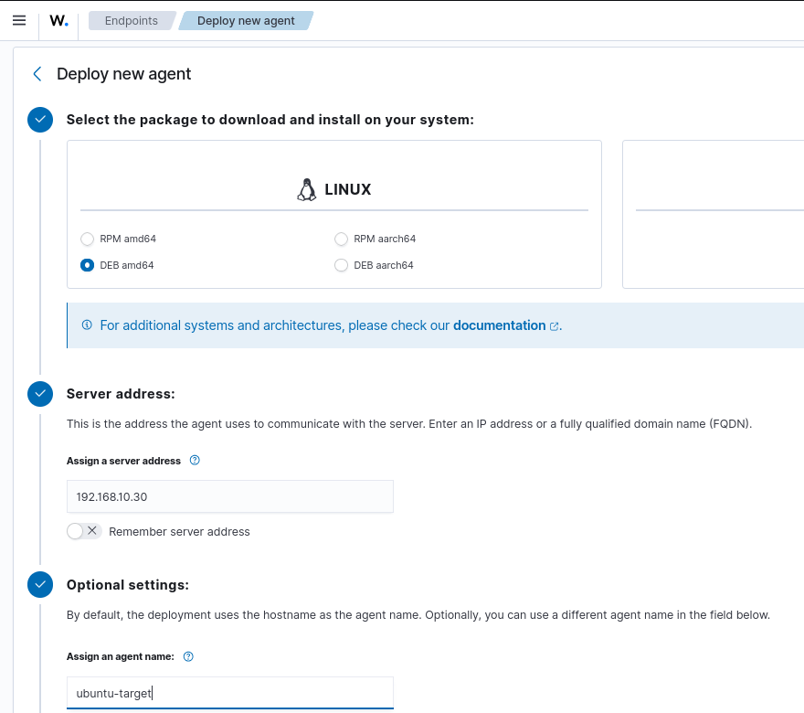
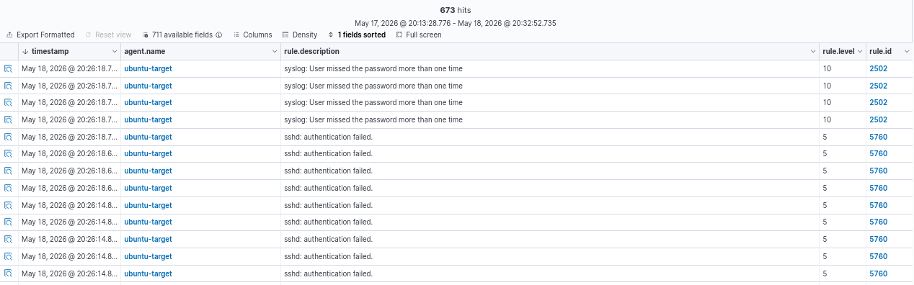
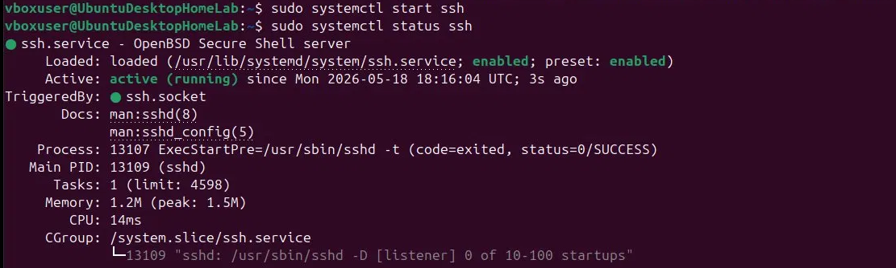
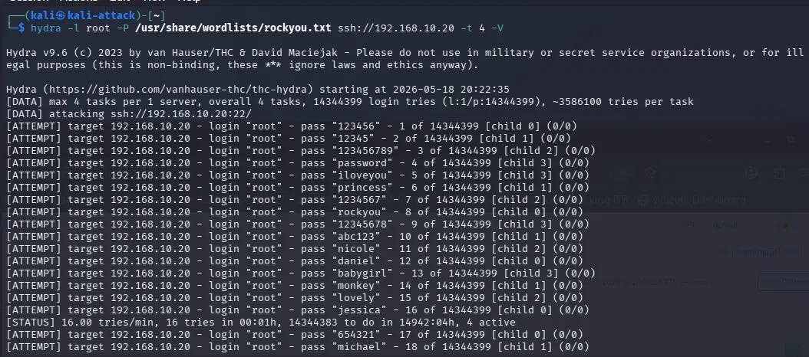
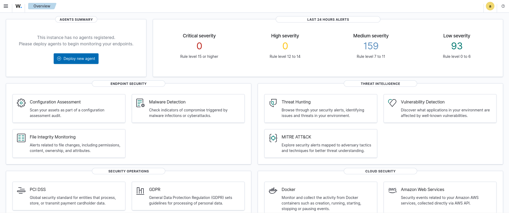
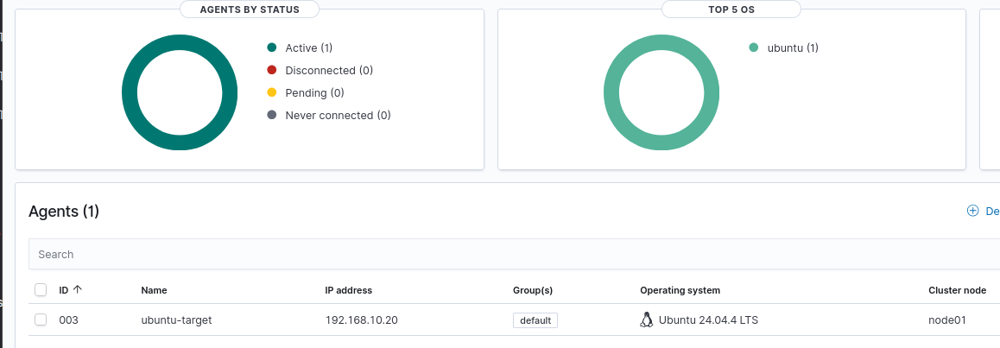

# Phase 2 — Wazuh Deployment
 
## Overview
 
Wazuh was deployed as the EDR solution for the lab, providing endpoint visibility, log collection, and real-time alert generation. The deployment consists of three components running on the Wazuh Manager VM, and an agent installed on the Ubuntu Desktop target. Additional agents for Windows endpoints are deployed in Phase 5.

---
 
## Environment
 
| Component | Version | Host |
|-----------|---------|------|
| Wazuh Manager | 4.14.5 | Ubuntu Server 24.04 — 192.168.10.30 |
| Wazuh Indexer | 4.14.5 | Ubuntu Server 24.04 — 192.168.10.30 |
| Wazuh Dashboard | 4.14.5 | Ubuntu Server 24.04 — 192.168.10.30 |
| Wazuh Agent | 4.14.5 | Ubuntu Desktop 24.04 — 192.168.10.20 |
 
> Windows Server 2022 and Windows 10/11 agents are enrolled in [Phase 5 — Sysmon Deployment](phase5-sysmon.md).
 
---
 
## Architecture
 
```
Ubuntu Desktop 24.04 (192.168.10.20)
        │  Wazuh Agent
        ▼
Ubuntu Server 24.04 (192.168.10.30)
        ├── Wazuh Manager   — rule engine, alert processing
        ├── Wazuh Indexer   — OpenSearch-based log indexing
        └── Wazuh Dashboard — web UI (https://192.168.10.30)
```
 
---
 
## Deployment
 
### Wazuh Manager
 
The Wazuh Manager was installed on Ubuntu Server 24.04 using the all-in-one installation script, which deploys the Manager, Indexer, and Dashboard in a single-node configuration:
 
```bash
curl -sO https://packages.wazuh.com/4.14/wazuh-install.sh
sudo bash ./wazuh-install.sh -a
```
 
The `-a` flag performs a complete all-in-one installation. Upon completion, the installer outputs the admin credentials required to access the dashboard.
 
The dashboard is accessible at `https://192.168.10.30` from any machine on the `SOC-Homelab` network.

### Wazuh Agent

The agent was enrolled directly from the Wazuh Dashboard using the **Deploy new agent** wizard, selecting:

- Package: Linux — DEB amd64
- Server address: `192.168.10.30`
- Agent name: `ubuntu-target`



The wizard generated the following installation commands, executed on the Ubuntu Desktop target:

```bash
wget https://packages.wazuh.com/4.x/apt/pool/main/w/wazuh-agent/wazuh-agent_4.14.5-1_amd64.deb
sudo WAZUH_MANAGER='192.168.10.30' WAZUH_AGENT_NAME='ubuntu-target' dpkg -i ./wazuh-agent_4.14.5-1_amd64.deb
sudo systemctl daemon-reload
sudo systemctl enable wazuh-agent
sudo systemctl start wazuh-agent
```

---

## Validation — SSH Brute Force Test

To verify end-to-end communication between the Wazuh Agent and the Wazuh Manager, an SSH brute force attack was simulated from the Kali Linux machine against the Ubuntu Desktop target.

**Setup on Ubuntu Desktop** — SSH server enabled:

```bash
sudo systemctl enable ssh
sudo systemctl start ssh
```

**Attack from Kali Linux** using Hydra with the rockyou wordlist:

```bash
hydra -l root -P /usr/share/wordlists/rockyou.txt ssh://192.168.10.20 -t 4 -V
```

**Alerts generated in Wazuh Dashboard:**

| Rule ID | Level | Description |
|---------|-------|-------------|
| 5760 | 5 | sshd: authentication failed |
| 2502 | 10 | syslog: User missed the password more than one time |

Rule 2502 at level 10 confirms that Wazuh correctly correlated multiple failed authentication attempts into a brute force alert, validating the full pipeline from endpoint log collection to alert generation in the dashboard.





---

## Result

- Wazuh Manager, Indexer, and Dashboard running on 192.168.10.30
- Agent `ubuntu-target` enrolled and reporting with status **Active**
- Security events from the Ubuntu Desktop target visible in the dashboard under **Threat Hunting**

---

## Screenshots

| Screenshot | Description |
|------------|-------------|
|  | Wazuh Dashboard overview |
|  | Agent ubuntu-target — Active status |
|  | Security events visible in Threat Hunting |

---
*Previous: [Phase 1 — Infrastructure Setup](phase1-infrastructure.md)*  
*Next: [Phase 3 — Splunk Deployment](phase3-splunk.md)*
