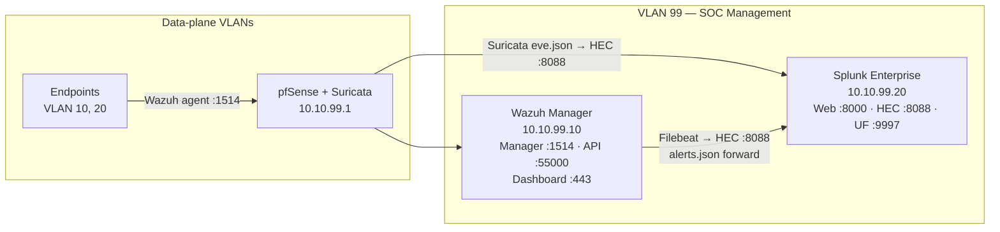
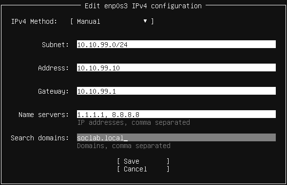
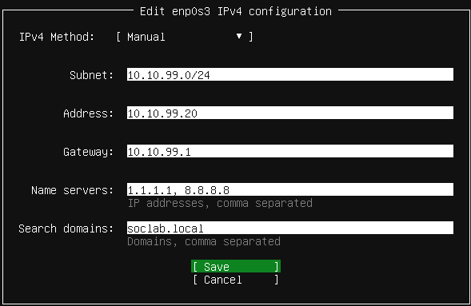
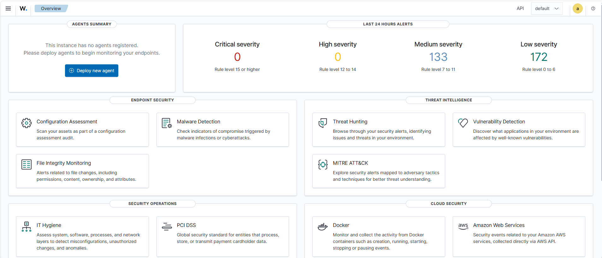
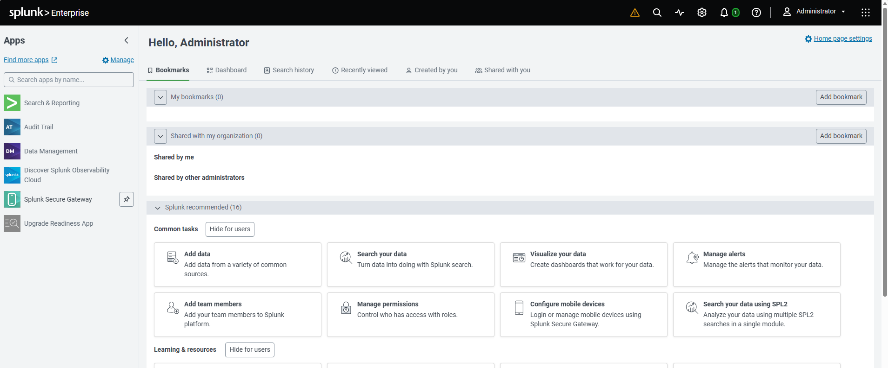

# Phase 3 — SOC Stack Deployment (Wazuh + Splunk)
 
## Overview
 
The SOC management plane is deployed within a dedicated VLAN 99 utilizing two Ubuntu Server VMs operating in tandem: Wazuh serves as the central manager for distributed endpoint EDR agents, while Splunk Enterprise acts as the central SIEM, ingest-parsing alerts and raw telemetry for unified threat hunting, dashboarding, and incident response.
 
---
 
## Environment
 
| Component                    | Version          | Host                              |
| ---------------------------- | ---------------- | --------------------------------- |
| Wazuh (manager + indexer + dashboard) | 4.14.5    | Ubuntu Server 24.04 LTS VM        |
| Splunk Enterprise            | 10.4.0           | Ubuntu Server 24.04 LTS VM        |
| Wazuh → Splunk integration   | Custom Integrator + curl → HEC 8088 | Ubuntu Server 22.04 LTS VM |
 
---
 
## Architecture
 

 
---
 
## Deployment
 
### SOC VMs provisioning
 
Two Ubuntu Server VMs were created in VirtualBox attached to Internal Network `vlan99-soc`.
 
| VM              | vCPU | RAM   | Disk        | IP            |
| --------------- | ---- | ----- | ----------- | ------------- |
| SOC-99-Wazuh    | 4    | 8 GB  | 60 GB | 10.10.99.10   |
| SOC-99-Splunk   | 2    | 4 GB  | 40 GB | 10.10.99.20   |
 
### Ubuntu Server Network Configuration
 
| Screenshot | Description |
| ---------- | ----------- |
|  | Wazuh Network IPv4 Configuration |
| | Splunk Network IPv4 Configuration |

---

### Wazuh Integration
 
The Wazuh Manager was installed on Ubuntu Server 24.04 using the all-in-one installation script, which deploys the Manager, Indexer, and Dashboard in a single-node configuration:
 
```bash
curl -sO https://packages.wazuh.com/4.14/wazuh-install.sh
sudo bash ./wazuh-install.sh -a
```
 
The `-a` flag performs a complete all-in-one installation. Upon completion, the installer outputs the admin credentials required to access the dashboard.
 
The dashboard is accessible at `https://10.10.99.10:443`.



---

### Splunk Enterprise

Splunk Enterprise 10.4.0 was installed on Ubuntu Server 24.04 using the official `.deb` package downloaded from the Splunk portal:

```bash
sudo dpkg -i splunk-10.4.0-f798d4d49089-linux-amd64.deb
sudo /opt/splunk/bin/splunk start --accept-license
sudo /opt/splunk/bin/splunk enable boot-start
```

The dashboard is accessible at `http:/10.10.99.20:8000`.



## HTTP Event Collector (HEC)

The HEC was configured in Splunk to receive Wazuh alerts over HTTP:

- **Settings → Data Inputs → HTTP Event Collector → Global Settings** — HEC enabled, SSL disabled, port `8088`
- A dedicated token was created with the following settings:
  - Name: `Wazuh_Alerts`
  - Source type: `wazuh`
  - Default index: `wazuh`

A dedicated index was created to isolate Wazuh data:

- **Settings → Indexes → New Index**
- Index name: `wazuh`

---
 
## Result
 
- Two Ubuntu Server VMs operational in VLAN 99 (`10.10.99.10` Wazuh, `10.10.99.20` Splunk)
- Wazuh 4.14 all-in-one stack running (manager + indexer + dashboard) at `https://10.10.99.10`
- Splunk Enterprise 10.4 running at `http://10.10.99.20:8000`
- HEC enabled on Splunk port 8088 with `wazuh-alerts` token issued
  
---
 
## Screenshots
 
| Screenshot | Description |
| ---------- | ----------- |
| [](../screenshots/phase3/02-wazuh-services-active.png) | `systemctl status wazuh-manager wazuh-indexer wazuh-dashboard` all active |
| [](../screenshots/phase3/04-splunk-hec-token.png) | `wazuh-alerts` HEC token created and enabled |
 
---
 
*Previous: [Phase 2 — Network Backbone (pfSense)](phase2-network-backbone.md)*  
*Next: [Phase 4 — Corporate Environment & Endpoint Telemetry](phase4-corporate-env.md)*
