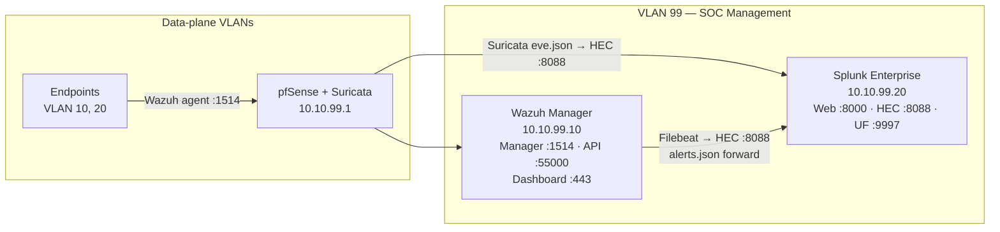

# Phase 3 — SOC Stack Deployment (Wazuh + Splunk)
 
## Overview
 
The SOC management plane is deployed within a dedicated VLAN 99 utilizing two Ubuntu Server VMs operating in tandem: Wazuh serves as the central manager for distributed endpoint EDR agents, while Splunk Enterprise acts as the central SIEM, ingest-parsing alerts and raw telemetry for unified threat hunting, dashboarding, and incident response.
 
This phase follows the out-of-band SOC architecture defined in [Phase 0](phase0-planning-design.md) — the SOC VLAN never initiates connections into data-plane VLANs; endpoints push telemetry outbound through pfSense to Wazuh manager (1514/tcp) and Suricata pushes IDS alerts to Splunk via HEC (8088/tcp).
 
---
 
## Environment
 
| Component                    | Version          | Host                              |
| ---------------------------- | ---------------- | --------------------------------- |
| Wazuh (manager + indexer + dashboard) | 4.14.5    | Ubuntu Server 24.04 LTS VM        |
| Splunk Enterprise            | 10.4.0           | Ubuntu Server 24.04 LTS VM        |
| Wazuh → Splunk integration   | Filebeat 7.10.2 + HEC 8088 | Wazuh manager host        |
| Ubuntu Server                | 24.04 LTS        | Both SOC VMs                      |
 
---
 
## Architecture
 

 
Endpoints (Phase 4 onwards) ship Sysmon + native event logs to the Wazuh manager via the Wazuh agent. Wazuh's rules engine processes events and writes alerts to `alerts.json`; Filebeat reads this file and forwards alerts to Splunk via HEC, enabling centralized search of EDR alerts alongside Suricata IDS alerts in a single SIEM frontend.
 
---
 
## Deployment
 
### SOC VMs provisioning
 
Two Ubuntu Server VMs were created in VirtualBox attached to Internal Network `vlan99-soc`. Both use Intel PRO/1000 MT Desktop NICs and dynamic disks.
 
| VM              | vCPU | RAM   | Disk        | IP            |
| --------------- | ---- | ----- | ----------- | ------------- |
| SOC-99-Wazuh    | 4    | 8 GB  | 100 GB dyn  | 10.10.99.10   |
| SOC-99-Splunk   | 2    | 4 GB  | 40 GB dyn   | 10.10.99.20   |
 
The Wazuh VM is sized generously because the all-in-one install runs OpenSearch as the indexer, which is memory-hungry and disk-intensive.
 
### Ubuntu Server installation
 
Standard Ubuntu Server 22.04 LTS install on both VMs with these key settings:
 
| Setting               | SOC-99-Wazuh   | SOC-99-Splunk  |
| --------------------- | -------------- | -------------- |
| Hostname              | `wazuh-homelab` | `splunk-homelab` |
| Username              | `admin`        | `admin`        |
| Storage               | Entire disk + LVM | Entire disk + LVM |
| OpenSSH server        | Installed      | Installed      |
| IPv4 Method           | Manual         | Manual         |
| IP / Subnet           | `10.10.99.10/24` | `10.10.99.20/24` |
| Gateway               | `10.10.99.1`   | `10.10.99.1`   |
| DNS                   | `1.1.1.1, 8.8.8.8` | `1.1.1.1, 8.8.8.8` |
| Search domain         | `soclab.local` | `soclab.local` |
 
VLAN 99 has no DHCP server (it's defined as static-only in Phase 2), so the IPs are configured manually during the installer.
 
### LVM disk expansion
 
Ubuntu Server's "guided LVM" install allocates only ~50% of the available disk to the initial logical volume. Before installing the heavy applications, the LV is extended to consume the entire volume group on both VMs:
 
```bash
sudo vgs
sudo lvs
sudo lvextend -l +100%FREE /dev/ubuntu-vg/ubuntu-lv
sudo resize2fs /dev/mapper/ubuntu--vg-ubuntu--lv
df -h
```
 
After this, `/` reports the full disk available — critical for Wazuh's indexer which grows quickly with ingested events.
 
### Splunk Enterprise install (SOC-99-Splunk)
 
Splunk 10.4.0 was downloaded directly from Splunk's permanent release archive and installed via `dpkg`:
 
```bash
wget -O splunk-10.4.0-f798d4d49089-linux-amd64.deb \
  "https://download.splunk.com/products/splunk/releases/10.4.0/linux/splunk-10.4.0-f798d4d49089-linux-amd64.deb"
 
sudo dpkg -i splunk-10.4.0-f798d4d49089-linux-amd64.deb
sudo /opt/splunk/bin/splunk start --accept-license
sudo /opt/splunk/bin/splunk enable boot-start
```
 
The admin user + password are set interactively during `splunk start`. Splunk Web becomes available at `http://10.10.99.20:8000`.
 
#### Enabling HTTP Event Collector (HEC)
 
HEC was enabled from Splunk Web to allow Wazuh (and Suricata in Phase 4) to push events:
 
`Settings → Data Inputs → HTTP Event Collector → Global Settings`:
- All Tokens: **Enabled**
- Default Index: `main`
- Enable SSL: ✓
- HTTP Port Number: `8088`
`New Token` with name `wazuh-alerts`, allowed indexes `main`, default index `main`. The token value was recorded for the Wazuh integration in the next step.
 
#### Enabling Universal Forwarder receiver
 
The UF receiver listens on TCP 9997 for future endpoint forwarders (Phase 4):
 
```bash
sudo /opt/splunk/bin/splunk enable listen 9997 -auth admin:<password>
sudo /opt/splunk/bin/splunk restart
```
 
### Wazuh Manager install (SOC-99-Wazuh)
 
Wazuh 4.14 was installed all-in-one (manager + indexer + dashboard on a single host) using the versioned URL to avoid known CloudFront blocking issues on the `4.x` generic URL:
 
```bash
curl -sO https://packages.wazuh.com/4.14/wazuh-install.sh
sudo bash ./wazuh-install.sh -a -o
```
 
The `-a` flag triggers all-in-one install; `-o` overrides any leftover files from previous attempts. The installation takes 15–30 minutes (the indexer's initial bootstrap is the longest phase).
 
When complete, the installer prints the admin credentials and writes them to a tarball:
 
```bash
sudo tar -xvf wazuh-install-files.tar -O wazuh-install-files/wazuh-passwords.txt
```
 
Wazuh Dashboard becomes available at `https://10.10.99.10` (HTTPS with self-signed cert).
 
### Wazuh → Splunk integration (Filebeat → HEC)
 
The Wazuh manager writes alerts to `/var/ossec/logs/alerts/alerts.json`. Filebeat (already installed as part of the Wazuh stack) is reconfigured to also forward these alerts to Splunk's HEC endpoint.
 
Add an HTTP output module to Filebeat:
 
```bash
sudo nano /etc/filebeat/filebeat.yml
```
 
Append the Splunk HEC output:
 
```yaml
output.http:
  hosts: ["https://10.10.99.20:8088/services/collector/event"]
  headers:
    Authorization: "Splunk <HEC_TOKEN_FROM_SPLUNK>"
    Content-Type: "application/json"
  ssl.verification_mode: none
```
 
Restart Filebeat:
 
```bash
sudo systemctl restart filebeat
sudo systemctl status filebeat
```
 
Now Wazuh alerts flow into Splunk's `main` index with sourcetype derived from the HEC token configuration.
 
---
 
## Validation — End-to-end alert pipeline
 
A synthetic SSH brute force alert was generated on the Wazuh manager itself to verify the full pipeline.
 
**1. Generate a synthetic Wazuh alert from the manager:**
 
```bash
echo "Jan 01 00:00:00 wazuh-homelab sshd[12345]: Failed password for root from 1.2.3.4 port 22 ssh2" \
  | sudo /var/ossec/bin/wazuh-logtest
```
 
Expected output: `wazuh-logtest` matches the event against rule 5760 (SSH authentication failure) and indicates the alert would be written to `alerts.json`.
 
**2. Confirm the alert appears in Wazuh Dashboard:**
 
`https://10.10.99.10` → `Security events` → most recent alert visible with rule 5760.
 
**3. Confirm the alert reaches Splunk via Filebeat → HEC:**
 
In Splunk Web → Search & Reporting:
 
```spl
index=main "sshd" "Failed password"
```
 
The alert appears within seconds, confirming the full chain: Wazuh manager → alerts.json → Filebeat → HEC → Splunk index.
 
---
 
## Troubleshooting & Lessons Learned
 

 
---
 
## Result
 
- Two Ubuntu Server VMs operational in VLAN 99 (`10.10.99.10` Wazuh, `10.10.99.20` Splunk)
- Wazuh 4.14 all-in-one stack running (manager + indexer + dashboard) at `https://10.10.99.10`
- Splunk Enterprise 10.4 running at `http://10.10.99.20:8000`
- HEC enabled on Splunk port 8088 with `wazuh-alerts` token issued
- Universal Forwarder receiver listening on Splunk port 9997 (ready for Phase 4 endpoint forwarders)
- Filebeat forwarding Wazuh `alerts.json` → Splunk HEC, validated with synthetic SSH brute force event
- VirtualBox snapshots on both VMs: `clean-install`, `base-config`, `working`
---
 
## Screenshots
 
| Screenshot | Description |
| ---------- | ----------- |
| [](../screenshots/phase3/01-wazuh-dashboard-home.png) | Wazuh Dashboard at `https://10.10.99.10` after first login |
| [](../screenshots/phase3/02-wazuh-services-active.png) | `systemctl status wazuh-manager wazuh-indexer wazuh-dashboard` all active |
| [](../screenshots/phase3/03-splunk-web-home.png) | Splunk Web home dashboard after first login |
| [](../screenshots/phase3/04-splunk-hec-token.png) | `wazuh-alerts` HEC token created and enabled |
| [](../screenshots/phase3/05-filebeat-hec-output.png) | Filebeat HTTP output block in `filebeat.yml` |
| [](../screenshots/phase3/06-splunk-wazuh-alert-search.png) | Test SSH brute force alert visible in Splunk Search & Reporting |
 
---
 
*Previous: [Phase 2 — Network Backbone (pfSense)](phase2-network-backbone.md)*  
*Next: [Phase 4 — Corporate Environment & Endpoint Telemetry](phase4-corporate-env.md)*
