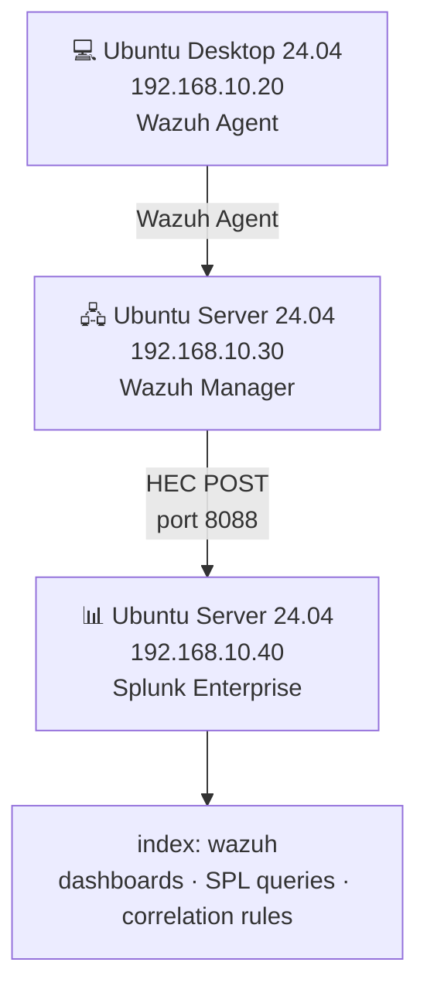
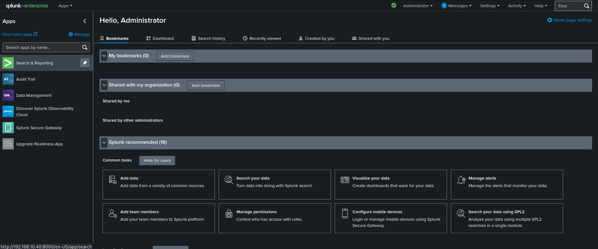
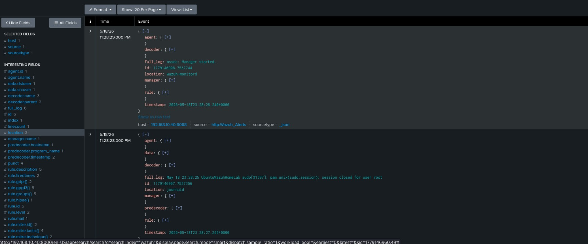

# Phase 3 — Splunk Deployment + Wazuh Integration via HEC

## Overview

Splunk Enterprise was deployed as the SIEM solution for the lab, providing centralized log ingestion, SPL-based querying, dashboards, and correlation rules. Wazuh alerts are forwarded to Splunk in real time via the HTTP Event Collector (HEC), completing the detection pipeline from endpoint to SIEM.

---

## Environment

| Component | Version | Host |
|-----------|---------|------|
| Splunk Enterprise | 10.2.3 | Ubuntu Server 24.04 — 192.168.10.40 |
| Wazuh Manager | 4.14.5 | Ubuntu Server 24.04 — 192.168.10.30 |

---
 
## Architecture
 

 
---

## Deployment

### Splunk Enterprise

Splunk Enterprise 10.2.3 was installed on Ubuntu Server 24.04 using the official `.deb` package downloaded from the Splunk portal:

```bash
sudo dpkg -i splunk-10.2.3-4d61cf8a5c0c-linux-amd64.deb
sudo /opt/splunk/bin/splunk start --accept-license
sudo /opt/splunk/bin/splunk enable boot-start
```

The dashboard is accessible at `http://192.168.10.40:8000`.

### HTTP Event Collector (HEC)

The HEC was configured in Splunk to receive Wazuh alerts over HTTP:

- **Settings → Data Inputs → HTTP Event Collector → Global Settings** — HEC enabled, SSL disabled, port `8088`
- A dedicated token was created with the following settings:
  - Name: `Wazuh_Alerts`
  - Source type: `wazuh`
  - Default index: `wazuh`

A dedicated index was created to isolate Wazuh data:

- **Settings → Indexes → New Index**
- Index name: `wazuh`

### Wazuh Integration

The Wazuh Manager was configured to forward all alerts to the Splunk HEC by adding the following block to `/var/ossec/etc/ossec.conf`:

```xml
<integration>
  <name>custom-splunk-hec</name>
  <hook_url>http://192.168.10.40:8088/services/collector/event</hook_url>
  <api_key>4a0b64e1-5e39-449f-a88e-63d0d3159e89</api_key>
  <alert_format>json</alert_format>
  <level>0</level>
</integration>
```

The Wazuh Manager was restarted to apply the changes:

```bash
sudo systemctl restart wazuh-manager
```

---

## Validation

With the integration active, alerts generated by Wazuh are forwarded to Splunk in real time and searchable via SPL.

**SPL query to verify ingestion:**

```
index="wazuh"
```

Wazuh alert fields are available as structured JSON fields in Splunk, including `rule.description`, `rule.level`, `agent.name`, and `data.srcip`, enabling correlation queries and dashboard visualizations.

Example event received in Splunk from an SSH brute force attack originating from Kali Linux (192.168.10.10):


---

## Result

- Splunk Enterprise 10.2.3 running on 192.168.10.40
- HEC token configured and receiving Wazuh alerts on port 8088
- Dedicated `wazuh` index created in Splunk
- Wazuh alerts visible in Splunk Search & Reporting in real time
- Full pipeline operational: Ubuntu Desktop → Wazuh Agent → Wazuh Manager → Splunk HEC → Splunk SIEM

---

## Screenshots

| Screenshot | Description |
|------------|-------------|
|  | Splunk Enterprise dashboard overview |
|  | HEC token created for Wazuh |
|  | Wazuh alerts visible in Splunk Search |

---
 
*Previous: [Phase 2 — Wazuh Deployment](phase2-wazuh.md)*
*Next: [Phase 4 — Suricata IDS](phase4-suricata.md)*

*Previous: [Phase 2 — Wazuh Deployment](phase2-wazuh.md)*  
*Next: [Phase 4 — Snort IDS](phase4-snort.md)*
