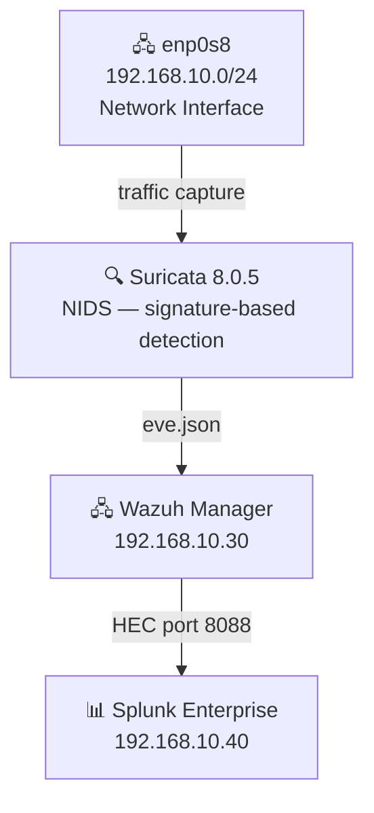
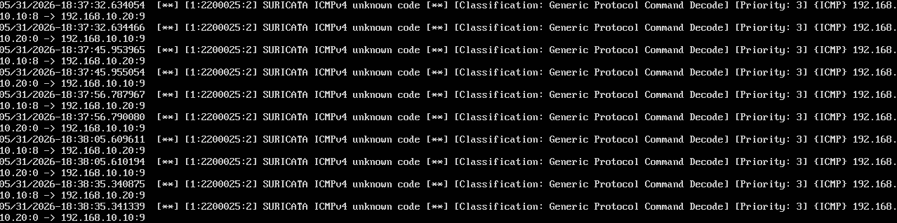
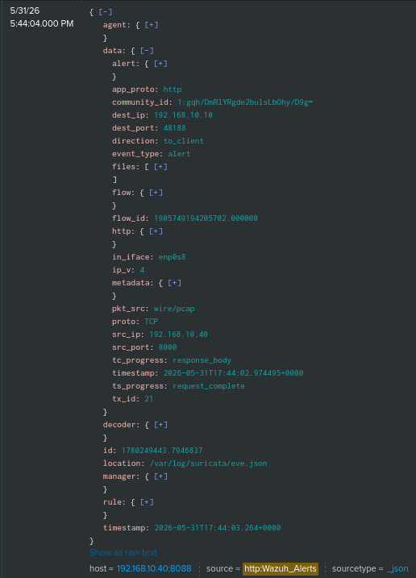

# Phase 4 — Suricata IDS

## Overview

Suricata was deployed as the Network Intrusion Detection System (NIDS) for the lab, providing network-level traffic analysis and signature-based threat detection across the `SOC-Homelab` network. Suricata runs on the Wazuh Manager VM, monitoring all traffic on the internal network interface and forwarding alerts to Wazuh, which in turn forwards them to Splunk via HEC.

---

## Environment

| Component | Version | Host |
|-----------|---------|------|
| Suricata | 8.0.5 | Ubuntu Server 24.04 — 192.168.10.30 |
| Wazuh Manager | 4.14.5 | Ubuntu Server 24.04 — 192.168.10.30 |
| Splunk Enterprise | 10.2.3 | Ubuntu Server 24.04 — 192.168.10.40 |

---

## Architecture



---

## Deployment

### Installation

Suricata was installed on the Wazuh Manager VM using the official OISF stable repository:

```bash
sudo add-apt-repository ppa:oisf/suricata-stable -y
sudo apt-get update
sudo apt-get install suricata -y
```

### Configuration

Suricata was configured to monitor the internal network interface `enp0s8` by editing `/etc/suricata/suricata.yaml`:

```yaml
af-packet:
  - interface: enp0s8
```

Community ID was enabled to correlate events across tools:

```yaml
community-id: true
```

Promiscuous mode was enabled on the VirtualBox Adapter 2 of the Wazuh VM (**Allow All**) to allow Suricata to capture traffic between all VMs on the `SOC-Homelab` network, not just traffic destined to the Wazuh VM itself.

### Rules Update

Detection rules were updated using the official Suricata update tool:

```bash
sudo suricata-update
```

### Wazuh Integration

Wazuh was configured to read Suricata's JSON alert log by adding the following block to `/var/ossec/etc/ossec.conf`:

```xml
<localfile>
  <log_format>json</log_format>
  <location>/var/log/suricata/eve.json</location>
</localfile>
```

Read permissions were granted to the Wazuh user:

```bash
sudo usermod -aG suricata wazuh
sudo chmod g+r /var/log/suricata/eve.json
sudo chmod g+x /var/log/suricata/
```

Wazuh Manager was restarted to apply the changes:

```bash
sudo systemctl restart wazuh-manager
```

---

## Validation — Nmap Network Scan Detection

To validate the full pipeline, a network scan was launched from Kali Linux against the Ubuntu Desktop target.

**Attack from Kali Linux:**

```bash
sudo nmap -sS -A 192.168.10.20
```

**Alerts generated and visible in Splunk:**

| Rule ID | Level | Description |
|---------|-------|-------------|
| 86601 | 3 | Suricata: Alert — SURICATA HTTP Response excessive header repetition |

Alerts were confirmed in Splunk using the following SPL query:

```
index="wazuh" rule.groups="suricata"
```

> **Note:** Suricata alerts are visible in Splunk (full pipeline) and in the Wazuh `alerts.json` log. The Wazuh Dashboard displays endpoint agent events — network-level Suricata alerts are best queried through Splunk.

---

## Troubleshooting & Lessons Learned

### 1. HTTP Event Collector (HEC) Loop Mitigation
During initial deployment, a severe log loop was encountered. The Wazuh integration script uses Python to forward alerts over HTTP to Splunk (`192.168.10.40:8088`). Since Suricata was monitoring all interface traffic, it flagged these outgoing forwarding events as unrecognized HTTP requests, generating a new alert, which Wazuh attempted to forward again, causing an infinite loop.

**Solution:**
Suppressed all Suricata signatures destined for the Splunk SIEM IP by modifying `/etc/suricata/threshold.config`:
```text
suppress gen_id 0, sig_id 0, track by_dst, ip 192.168.10.40
suppress gen_id 1, sig_id 2221036, track by_src, ip 192.168.10.40
```
---

## Result

- Suricata 8.0.5 running on 192.168.10.30, monitoring interface `enp0s8`
- Promiscuous mode enabled — full `SOC-Homelab` network traffic visible
- Detection rules updated via `suricata-update`
- Wazuh integration via `eve.json` — alerts forwarded to Splunk in real time
- Network scan from Kali Linux detected and alerted in Splunk

---

## Screenshots

| Screenshot | Description |
|------------|-------------|
|  | Suricata fast.log showing detected network scan |
|  | Suricata alerts visible in Splunk Search |


---

*Previous: [Phase 3 — Splunk Deployment](phase3-splunk.md)*
*Next: [Phase 5 — Sysmon Deployment](phase5-sysmon.md)*


